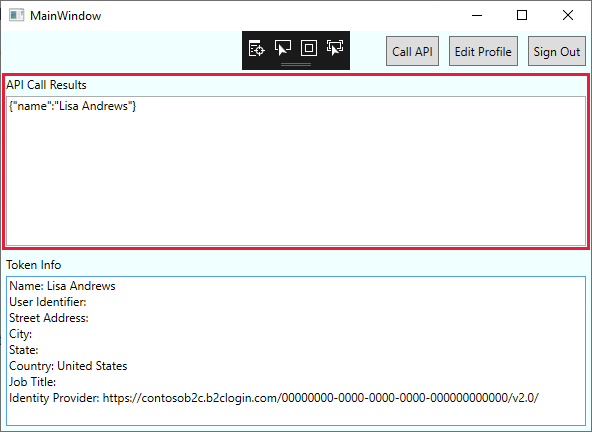

# Tutorial: Grant access to a Node.js web API from a desktop app using Azure Active Directory B2C

This tutorial shows you how to call a Node.js web API protected by Azure Active Directory B2C (Azure AD B2C) from a Windows Presentation Foundation (WPF) desktop app, also protected by Azure AD B2C.

In this tutorial, you learn how to:

> [!div class="checklist"]
> * Add a web API application
> * Configure scopes for a web API
> * Grant permissions to the web API
> * Update the sample to use the application

## Prerequisites

Complete the steps and prerequisites in [Tutorial: Authenticate users in a native desktop client](tutorial-desktop-app.md).

## Add a web API application

[!INCLUDE [active-directory-b2c-appreg-webapi](../../includes/active-directory-b2c-appreg-webapi.md)]

## Configure scopes

Scopes provide a way to govern access to protected resources. Scopes are used by the web API to implement scope-based access control. For example, some users could have both read and write access, whereas other users might have read-only permissions. In this tutorial, you define read and write permissions for the web API.

[!INCLUDE [active-directory-b2c-scopes](../../includes/active-directory-b2c-scopes.md)]

Record the value under **SCOPES** for the `demo.read` scope to use in a later step when you configure the desktop application. The full scope value is similar to `https://contosob2c.onmicrosoft.com/api/demo.read`.

## Grant permissions

To call a protected web API from a native client application, you need to grant the registered native client application permissions to the web API you registered in Azure AD B2C.

In the prerequisite tutorial, you registered a native client application named *nativeapp1*. The following steps configure that native application registration with the API scopes you exposed for *webapi1* in the previous section. This allows the desktop application to obtain an access token from Azure AD B2C that the web API can use to verify and provide scoped access to its resources. You configure and run both the desktop application and web API code samples later in the tutorial.

To register an application in your Azure AD B2C tenant, you can use our new unified **App registrations** experience or our legacy  **Applications (Legacy)** experience. [Learn more about the new experience](https://aka.ms/b2cappregtraining).

#### [App registrations](#tab/app-reg-ga/)

1. Select **App registrations**, and then select the native client application that should have access to the API. For example, *nativeapp1*.
1. Under **Manage**, select **API permissions**.
1. Under **Configured permissions**, select **Add a permission**.
1. Select the **My APIs** tab.
1. Select the API to which the native client application should be granted access. For example, *webapi1*.
1. Under **Permission**, expand **demo**, and then select the scopes that you defined earlier. For example, *demo.read* and *demo.write*.
1. Select **Add permissions**. As directed, wait a few minutes before proceeding to the next step.
1. Select **Grant admin consent for (your tenant name)**.
1. Select your currently signed-in administrator account, or sign in with an account in your Azure AD B2C tenant that's been assigned at least the *Cloud application administrator* role.
1. Select **Accept**.
1. Select **Refresh**, and then verify that "Granted for ..." appears under **Status** for both scopes. It might take a few minutes for the permissions to propagate.

#### [Applications (Legacy)](#tab/applications-legacy/)

1. Select **Applications (Legacy)**, and then select *nativeapp1*.
1. Select **API access**, and then select **Add**.
1. In the **Select API** dropdown, select *webapi1*.
1. In the **Select Scopes** dropdown, select the scopes that you defined earlier. For example, *demo.read* and *demo.write*.
1. Select **OK**.

* * *

A user authenticates with Azure AD B2C to use the WPF desktop application. The desktop application obtains an authorization grant from Azure AD B2C to access the protected web API.

## Configure the samples

Now that the web API is registered and you have scopes and permissions configured, you configure the desktop application and web API samples to use your Azure AD B2C tenant.

### Update the desktop application

In a prerequisite for this article, you modified a [WPF desktop application](https://github.com/Azure-Samples/active-directory-b2c-dotnet-desktop) to enable sign-in with a user flow in your Azure AD B2C tenant. In this section, you update that same application to reference the web API you registered earlier, *webapi1*.

1. Open the **active-directory-b2c-wpf** solution (`active-directory-b2c-wpf.sln`) in Visual Studio.
1. In the **active-directory-b2c-wpf** project, open the *App.xaml.cs* file and find the following variable definitions.
    1. Replace the value of the `ApiScopes` variable with the value you recorded earlier when you defined the **demo.read** scope.
    1. Replace the value of the `ApiEndpoint` variable with the **Redirect URI** you recorded earlier when you registered the web API (for example, *webapi1*) in your tenant.

    Here's an example:

    ```csharp
    public static string[] ApiScopes = { "https://contosob2c.onmicrosoft.com/api/demo.read" };
    public static string ApiEndpoint = "http://localhost:5000";
    ```

### Get and update the Node.js API sample

Next, get the Node.js web API code sample from GitHub and configure it to use the web API you registered in your Azure AD B2C tenant.

[Download a zip file](https://github.com/Azure-Samples/active-directory-b2c-javascript-nodejs-webapi/archive/master.zip) or clone the sample web app from GitHub.

```console
git clone https://github.com/Azure-Samples/active-directory-b2c-javascript-nodejs-webapi.git
```

The Node.js web API sample uses the Passport.js library to enable Azure AD B2C to protect calls to the API.

1. Open the `index.js` file.
1. Update these variable definitions with the following values. Change `<web-API-application-ID>` to the **Application (client) ID** of the web API you registered earlier (*webapi1*). Change `<your-b2c-tenant>` to the name of your Azure AD B2C tenant.

    ```nodejs
    var clientID = "<web-API-application-ID>";
    var b2cDomainHost = "<your-b2c-tenant>.b2clogin.com";
    var tenantIdGuid = "<your-b2c-tenant>.onmicrosoft.com";
    var policyName = "B2C_1_signupsignin1";
    ```
1. Since you're running the API locally, update the path in the route for the GET method to `/` instead of the demo app's location of `/hello`:

    ```nodejs
    app.get("/",
    ```

## Run the samples

### Run the Node.js web API

1. Launch a Node.js command prompt.
2. Change to the directory containing the Node.js sample. For example `cd c:\active-directory-b2c-javascript-nodejs-webapi`
3. Run the following commands:
    ```console
    npm install && npm update
    ```
    ```console
    node index.js
    ```

### Run the desktop application

1. Open the **active-directory-b2c-wpf** solution in Visual Studio.
2. Press **F5** to run the desktop app.
3. Sign in using the email address and password used in [Authenticate users with Azure Active Directory B2C in a desktop app tutorial](tutorial-desktop-app.md).
4. Select the **Call API** button.

The desktop application makes a request to the locally running web API, and upon verification of a valid access token, shows the signed-in user's display name.



Your desktop application, protected by Azure AD B2C, is calling the locally running web API that is also protected by Azure AD B2C.

## Next steps

In this tutorial, you learned how to:

> [!div class="checklist"]
> * Add a web API application
> * Configure scopes for a web API
> * Grant permissions to the web API
> * Update the sample to use the application

> [!div class="nextstepaction"]
> [Tutorial: Add identity providers to your applications in Azure Active Directory B2C](tutorial-add-identity-providers.md)
