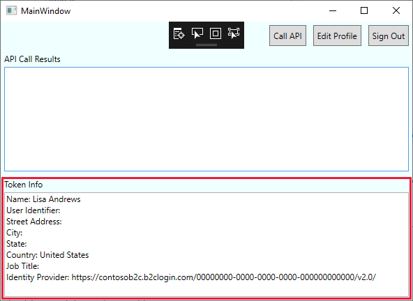

# Tutorial: Authenticate users in a native desktop client using Azure Active Directory B2C

This tutorial shows you how to use Azure Active Directory B2C (Azure AD B2C) to sign in and sign up users in an Windows Presentation Foundation (WPF) desktop application. Azure AD B2C enables your applications to authenticate to social accounts, enterprise accounts, and Azure Active Directory accounts using open standard protocols.

In this tutorial, you learn how to:

> [!div class="checklist"]
> * Add the native client application
> * Configure the sample to use the application
> * Sign up using the user flow

[!INCLUDE [quickstarts-free-trial-note](../../includes/quickstarts-free-trial-note.md)]

## Prerequisites

- [Create user flows](tutorial-create-user-flows.md) to enable user experiences in your application.
- Install [Visual Studio 2019](https://www.visualstudio.com/downloads/) with **.NET desktop development** and **ASP.NET and web development** workloads.

## Add the native client application

[!INCLUDE [active-directory-b2c-appreg-native](../../includes/active-directory-b2c-appreg-native.md)]

Record the **Application (client) ID** for use in a later step.

## Configure the sample

In this tutorial, you configure a sample that you can download from GitHub. The sample WPF desktop application demonstrates sign-up, sign-in, and can call a protected web API in Azure AD B2C. [Download a zip file](https://github.com/Azure-Samples/active-directory-b2c-dotnet-desktop/archive/msalv3.zip), [browse the repo](https://github.com/Azure-Samples/active-directory-b2c-dotnet-desktop), or clone the sample from GitHub.

```
git clone https://github.com/Azure-Samples/active-directory-b2c-dotnet-desktop.git
```

To update the application to work with your Azure AD B2C tenant and invoke its user flows instead of those in the default demo tenant:

1. Open the **active-directory-b2c-wpf** solution (`active-directory-b2c-wpf.sln`) in Visual Studio.
2. In the **active-directory-b2c-wpf** project, open the *App.xaml.cs* file and find the following variable definitions. Replace `{your-tenant-name}` with your Azure AD B2C tenant name and `{application-ID}` with the application ID that you recorded earlier.

    ```csharp
    private static readonly string Tenant = "{your-tenant-name}.onmicrosoft.com";
    private static readonly string AzureAdB2CHostname = "{your-tenant-name}.b2clogin.com";
    private static readonly string ClientId = "{application-ID}";
    ```

3. Update the policy name variables with the names of the user flows that you created as part of the prerequisites. For example:

    ```csharp
    public static string PolicySignUpSignIn = "B2C_1_signupsignin1";
    public static string PolicyEditProfile = "B2C_1_profileediting1";
    public static string PolicyResetPassword = "B2C_1_passwordreset1";
    ```

## Run the sample

Press **F5** to build and run the sample.

### Sign up using an email address

1. Select **Sign In** to sign up as a user. This uses the **B2C_1_signupsignin1** user flow.
2. Azure AD B2C presents a sign in page with a **Sign up now** link. Since you don't yet have an account, select the **Sign up now** link.
3. The sign-up workflow presents a page to collect and verify the user's identity using an email address. The sign-up workflow also collects the user's password and the requested attributes defined in the user flow.

    Use a valid email address and validate using the verification code. Set a password. Enter values for the requested attributes.

    

4. Select **Create** to create a local account in the Azure AD B2C tenant.

The user can now use their email address to sign in and use the desktop application. After a successful sign-up or sign-in, the token details are displayed in the lower pane of the WPF app.



If you select the **Call API** button, an **error message** is displayed. You encounter the error because, in its current state, the application is attempting to access an API protected by the demo tenant, `fabrikamb2c.onmicrosoft.com`. Since your access token is valid only for your Azure AD B2C tenant, the API call is therefore unauthorized.

Continue to the next tutorial to register a protected web API in your own tenant and enable the **Call API** functionality.

## Next steps

In this tutorial, you learned how to:

> [!div class="checklist"]
> * Add the native client application
> * Configure the sample to use the application
> * Sign up using the user flow

Next, to enable the **Call API** button functionality, grant the WPF desktop application access to a web API registered in your own Azure AD B2C tenant:

> [!div class="nextstepaction"]
> [Tutorial: Grant access to a Node.js web API from a desktop app >](tutorial-desktop-app-webapi.md)
