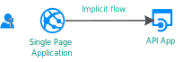

# Register a single-page application in Azure Active Directory B2C

Before your [applications](application-types.md) can interact with Azure Active Directory B2C (Azure AD B2C), they must be registered in a tenant that you manage. This guide shows you how to register a single-page application ("SPA") using the Azure portal.

## Overview of authentication options

Many modern web applications are built as client-side single-page applications ("SPAs"). Developers write them by using JavaScript or an SPA framework such as Angular, Vue, and React. These applications run on a web browser and have different authentication characteristics than traditional server-side web applications.

Azure AD B2C provides **two** options to enable single-page applications to sign in users and get tokens to access back-end services or web APIs:

### Authorization code flow (with PKCE)

[OAuth 2.0 Authorization code flow (with PKCE)](./authorization-code-flow.md) allows the application to exchange an authorization code for **ID** tokens to represent the authenticated user and **Access** tokens needed to call protected APIs. In addition, it returns **Refresh** tokens that provide long-term access to resources on behalf of users without requiring interaction with those users. 

This is the **recommended** approach. Having limited-lifetime refresh tokens helps your application adapt to [modern browser cookie privacy limitations](../active-directory/develop/reference-third-party-cookies-spas.md), like Safari ITP.

To take advantage of this flow, your application can use an authentication library that supports it, like [MSAL.js](https://github.com/AzureAD/microsoft-authentication-library-for-js/tree/dev/lib/msal-browser). 

### Implicit grant flow

Some libraries, like [MSAL.js 1.x](https://github.com/AzureAD/microsoft-authentication-library-for-js/tree/dev/lib), only support the implicit grant flow or your applications is implemented to use implicit flow. In these cases, Azure AD B2C supports the [OAuth 2.0 implicit flow](implicit-flow-single-page-application.md). The implicit grant flow allows the application to get **ID** and **Access** tokens. Unlike the authorization code flow, implicit grant flow doesn't return a **Refresh token**. 

This authentication flow doesn't include application scenarios that use cross-platform JavaScript frameworks such as Electron and React-Native. Those scenarios require further capabilities for interaction with the native platforms.

## Prerequisites

- If you don't have an Azure subscription, create a [free account](https://azure.microsoft.com/free/?WT.mc_id=A261C142F) before you begin.

- If you don't have an [Azure AD B2C Tenant](tutorial-create-tenant.md), create one now. You can use an existing Azure AD B2C tenant.

## Register the SPA application

1. Sign in to the [Azure portal](https://portal.azure.com).
1. If you have access to multiple tenants, select the **Settings** icon in the top menu to switch to your Azure AD B2C tenant from the **Directories + subscriptions** menu.
1. In the Azure portal, search for and select **Azure AD B2C**.
1. Select **App registrations**, and then select **New registration**.
1. Enter a **Name** for the application. For example, *spaapp1*.
1. Under **Supported account types**, select **Accounts in any identity provider or organizational directory (for authenticating users with user flows)**
1. Under **Redirect URI**, select **Single-page application (SPA)**, and then enter `https://jwt.ms` in the URL text box.

    The redirect URI is the endpoint to where authorization server (Azure AD B2C, in this case) sends the user after it completes its interaction with the user. Also, the redirect URI endpoint receives the access token or authorization code upon successful authorization. In a production application, it's typically a publicly accessible endpoint where your app is running, like `https://contoso.com/auth-response`. For testing purposes like this guide, you can set it to `https://jwt.ms`, a Microsoft-owned web application that displays the decoded contents of a token (the contents of the token never leave your browser). During app development, you might add the endpoint where your application listens locally, like `http://localhost:5000`. You can add and modify redirect URIs in your registered applications at any time.

    The following restrictions apply to redirect URIs:

    * The reply URL must begin with the scheme `https`, unless using `localhost`.
    * The reply URL is case-sensitive. Its case must match the case of the URL path of your running application. For example, if your application includes as part of its path `.../abc/response-oidc`,  don't specify `.../ABC/response-oidc` in the reply URL. Because the web browser treats paths as case-sensitive, cookies associated with `.../abc/response-oidc` may be excluded if redirected to the case-mismatched `.../ABC/response-oidc` URL.

1. Under **Permissions**, select the *Grant admin consent to openid and offline_access permissions* check box.
1. Select **Register**.

## Enable the implicit flow

If you’re using MSAL.js 1.3 or an earlier version with the implicit grant flow in your SPA app, or if you  configure the [https://jwt.ms/](https://jwt.ms/) app for testing a user flow or custom policy, you need to enable the implicit grant flow in the app registration:

1. In the left menu, under **Manage**, select **Authentication**.

1. Under **Implicit grant and hybrid flows**, select both the **Access tokens (used for implicit flows)** and **ID tokens (used for implicit and hybrid flows)** check boxes.

1. Select **Save**.

If your app uses MSAL.js 2.0 or later, don't enable implicit flow grant as MSAL.js 2.0+ supports the authorization code flow with PKCE. 

## Migrate from the implicit flow

If you've an existing application that uses the implicit flow, we recommend that you migrate to use the authorization code flow by using a framework that supports it, like [MSAL.js 2.0+](https://github.com/AzureAD/microsoft-authentication-library-for-js/tree/dev/lib/msal-browser).

When all your production SPA represented by an app registration starts using the authorization code flow, disable the implicit grant flow settings as follows: 

1. In the left menu, under **Manage**, select **Authentication**.
1. Under **Implicit grant**, deselect both the **Access tokens** and **ID tokens** check boxes.
1. Select **Save**.

Applications using the implicit flow can continue to function if you leave the implicit flow enabled (checked).

## Next steps

Learn how to [Create user flows in Azure Active Directory B2C](tutorial-create-user-flows.md).