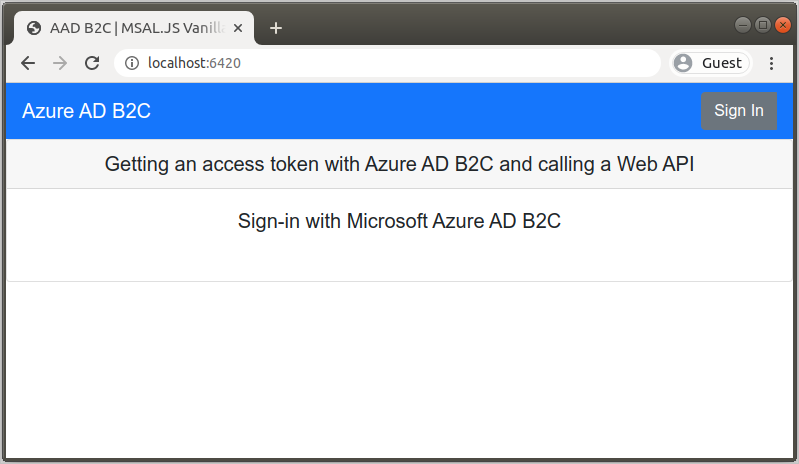
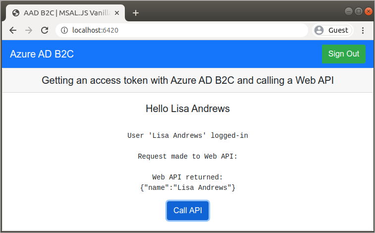

# Tutorial: Protect and grant access to a Node.js web API from a single-page application with Azure AD B2C

This tutorial shows you how to call an Azure Active Directory B2C (Azure AD B2C)-protected Node.js web API from a single-page application.

In this tutorial, the second in a two-part series:

> [!div class="checklist"]
> * Create a web API application registration in your Azure AD B2C tenant
> * Configure scopes for the web API
> * Grant permissions to the web API
> * Modify a web API code sample to work with your tenant

In the [first tutorial](tutorial-single-page-app.md) in this series, you downloaded the code sample and modified it to sign in users with a user flow in your Azure AD B2C tenant.

[!INCLUDE [quickstarts-free-trial-note](../../includes/quickstarts-free-trial-note.md)]

## Prerequisites

* Complete the steps and prerequisites in [Tutorial: Enable authentication in a single-page application with Azure AD B2C](tutorial-single-page-app.md)
* [Visual Studio Code](https://code.visualstudio.com/) or another code editor
* [Node.js](https://nodejs.org/en/download/)

## Add a web API application

[!INCLUDE [active-directory-b2c-appreg-webapi](../../includes/active-directory-b2c-appreg-webapi.md)]

## Configure scopes

Scopes provide a way to govern access to protected resources. Scopes are used by the web API to implement scope-based access control. For example, some users could have both read and write access, whereas other users might have read-only permissions. In this tutorial, you define both read and write permissions for the web API.

[!INCLUDE [active-directory-b2c-scopes](../../includes/active-directory-b2c-scopes.md)]

Record the value under **Scopes** for the `demo.read` scope to use in a later step when you configure the single-page application. The full scope value is similar to `https://contosob2c.onmicrosoft.com/api/demo.read`.

## Grant permissions

To call a protected web API from another application, you need to grant that application permissions to the web API.

In the prerequisite tutorial, you created a web application named *webapp1*. In this tutorial, you configure that application to call the web API you created in a previous section, *webapi1*.

[!INCLUDE [active-directory-b2c-permissions-api](../../includes/active-directory-b2c-permissions-api.md)]

Your single-page web application has now been granted permissions to the protected web API for the scopes specified. A user authenticates with Azure AD B2C to use the single-page application. The single-page app uses the authorization grant flow to access the protected web API with an access token returned by Azure AD B2C.

## Configure the sample

Now that the web API is registered and you've defined scopes, configure the web API code to work with your Azure AD B2C tenant. In this tutorial, you configure a sample Node.js web API you download from GitHub.

[Download a \*.zip archive](https://github.com/Azure-Samples/active-directory-b2c-javascript-nodejs-webapi/archive/master.zip) or clone the sample web API project from GitHub. You can also browse directly to the [Azure-Samples/active-directory-b2c-javascript-nodejs-webapi](https://github.com/Azure-Samples/active-directory-b2c-javascript-nodejs-webapi) project on GitHub.

```console
git clone https://github.com/Azure-Samples/active-directory-b2c-javascript-nodejs-webapi.git
```

### Configure the web API

1. Open the *config.js* file in your code editor.
1. Modify the variable values to reflect those of the application registration you created earlier. Also update the `policyName` with the user flow you created as part of the prerequisites. For example, *B2C_1_signupsignin1*.

    ```javascript
    const clientID = "<your-webapi-application-ID>"; // Application (client) ID
    const b2cDomainHost = "<your-tenant-name>.b2clogin.com";
    const tenantId = "<your-tenant-ID>.onmicrosoft.com"; // Alternatively, you can use your Directory (tenant) ID (a GUID)
    const policyName = "B2C_1_signupsignin1";
    ```

#### Enable CORS

To allow your single-page application to call the Node.js web API, you need to enable [CORS](https://expressjs.com/en/resources/middleware/cors.html) in the web API. In a production application you should be careful about which domain is making the request, but for this tutorial, allow requests from any domain.

To enable CORS, use the following middleware. In the Node.js web API code sample in this tutorial, it's already been added to the *index.js* file.

```javascript
app.use((req, res, next) => {
    res.header("Access-Control-Allow-Origin", "*");
    res.header("Access-Control-Allow-Headers", "Authorization, Origin, X-Requested-With, Content-Type, Accept");
    next();
});
```

### Configure the single-page application

The single-page application (SPA) from the [previous tutorial](tutorial-single-page-app.md) in the series uses Azure AD B2C for user sign-up and sign-in, and by default, calls the Node.js web API protected by the *fabrikamb2c* demo tenant.

In this section, you update the single-page web application to call the Node.js web API protected by *your* Azure AD B2C tenant (and which you run on your local machine).

To change the settings in the SPA:

1. In the [active-directory-b2c-javascript-msal-singlepageapp][github-js-spa] project you downloaded or cloned in the previous tutorial, open the *apiConfig.js* file inside the *JavaScriptSPA* folder.
1. Configure the sample with the URI for the *demo.read* scope you created earlier and the URL of the web API.
    1. In the `apiConfig` definition, replace the `b2cScopes` value with the full URI for the *demo.read* scope (the **Scope** value you recorded earlier).
    1. Change the domain in the `webApi` value to the redirect URI you added when you registered the web API application in an earlier step.

    Because the API is accessible at the `/hello` endpoint, leave */hello* in the URI.

    The `apiConfig` definition should look similar to the following code block, but with your B2C tenant's name in the place of `<your-tenant-name>`:

    ```javascript
    // The current application coordinates were pre-registered in a B2C tenant.
    const apiConfig = {
      b2cScopes: ["https://<your-tenant-name>.onmicrosoft.com/api/demo.read"],
      webApi: "http://localhost:5000/hello" // '/hello' should remain in the URI
    };
    ```

## Run the SPA and web API

You're now ready to test the single-page application's scoped access to the API. Run both the Node.js web API and the sample JavaScript single-page application on your local machine. Then, sign in to the single-page application and select the **Call API** button to initiate a request to the protected API.

Although both applications are running locally when you follow this tutorial, you've configured them to use Azure AD B2C for secure sign-up/sign-in and to grant access to the protected web API.

### Run the Node.js web API

1. Open a console window and change to the directory containing the Node.js web API sample. For example:

    ```console
    cd active-directory-b2c-javascript-nodejs-webapi
    ```

1. Run the following commands:

    ```console
    npm install && npm update
    node index.js
    ```

    The console window displays the port number where the application is hosted.

    ```console
    Listening on port 5000...
    ```

### Run the single-page app

1. Open another console window and change to the directory containing the JavaScript SPA sample. For example:

    ```console
    cd active-directory-b2c-javascript-msal-singlepageapp
    ```

1. Run the following commands:

    ```console
    npm install && npm update
    npm start
    ```

    The console window displays the port number of where the application is hosted.

    ```console
    Listening on port 6420...
    ```

1. Navigate to `http://localhost:6420` in your browser to view the application.

    

1. Sign in using the email address and password you used in the [previous tutorial](tutorial-single-page-app.md). Upon successful login, you should see the `User 'Your Username' logged-in` message.
1. Select the **Call API** button. The SPA obtains an authorization grant from Azure AD B2C, then accesses the protected web API to display the name of the logged-in user:

    

## Next steps

In this tutorial, you:

> [!div class="checklist"]
> * Created a web API application registration in your Azure AD B2C tenant
> * Configured scopes for the web API
> * Granted permissions to the web API
> * Modified a web API code sample to work with your tenant

Now that you've seen an SPA request a resource from a protected web API, gain a deeper understanding of how these application types interact with each other and with Azure AD B2C.

> [!div class="nextstepaction"]
> [Application types that can be used in Active Directory B2C >](application-types.md)

<!-- Links - EXTERNAL -->
[github-js-spa]: https://github.com/Azure-Samples/active-directory-b2c-javascript-msal-singlepageapp
