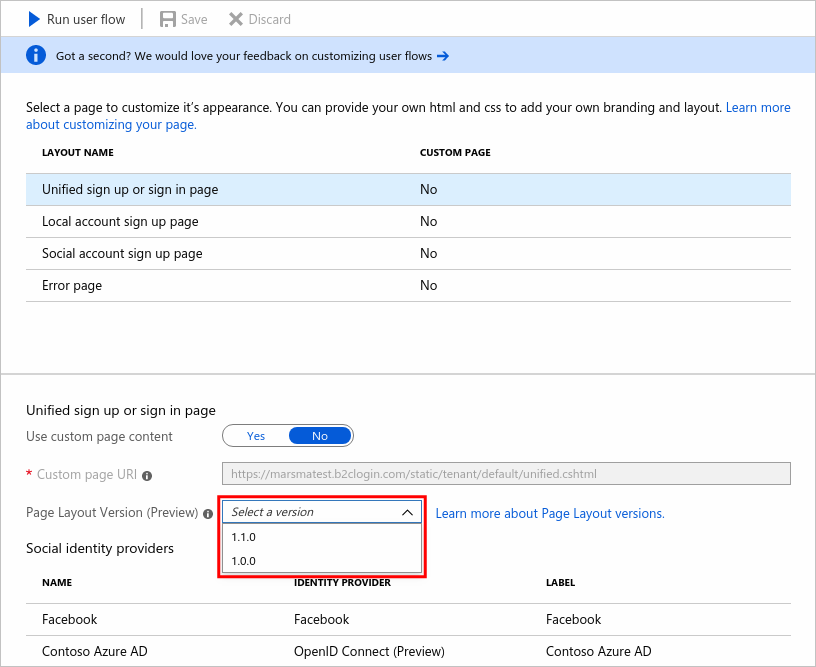

# JavaScript and page layout versions in Azure Active Directory B2C

[!INCLUDE [active-directory-b2c-public-preview](../../includes/active-directory-b2c-public-preview.md)]

Azure AD B2C provides a set of packaged content containing HTML, CSS, and JavaScript for the user interface elements in your user flows and custom policies.

To enable JavaScript for your applications:

* Enable it on the user flow by using the Azure portal
* Select a [page layout](page-layout.md)
* Use [b2clogin.com](b2clogin.md) in your requests

If you intend to enable [JavaScript](javascript-samples.md) client-side code, the elements you base your JavaScript on must be immutable. If they're not immutable, any changes could cause unexpected behavior on your user pages. To prevent these issues, enforce the use of a page layout and specify a page layout version to ensure the content definitions you’ve based your JavaScript on are immutable. Even if you don’t intend to enable JavaScript, you can specify a page layout version for your pages.

## Enable JavaScript

In the user flow **Properties**, you can enable JavaScript. Enabling JavaScript also enforces the use of a page layout. You can then set the page layout version for the user flow as described in the next section.

## Select a page layout version

Whether or not you enable JavaScript in your user flow's properties, you can specify a page layout version for your user flow pages. Open the user flow and select **Page layouts**. Under **LAYOUT NAME**, select a user flow page and choose the **Page Layout Version**.

For information about the different page layout versions, see the [Page layout version change log](page-layout.md).

[!INCLUDE [active-directory-b2c-javascript-guidelines](../../includes/active-directory-b2c-javascript-guidelines.md)]

## Next steps

You can find examples of JavaScript usage in [JavaScript samples for use in Azure Active Directory B2C](javascript-samples.md).
