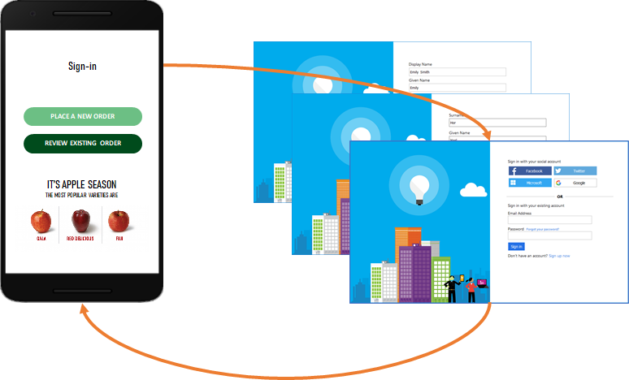

# User flows and custom policies overview

In Azure AD B2C, you can define the business logic that users follow to gain access to your application. For example, you can determine the sequence of steps users follow when they sign in, sign up, edit a profile, or reset a password. After completing the sequence, the user acquires a token and gains access to your application. 

In Azure AD B2C, there are two ways to provide identity user experiences:

* **User flows** are predefined, built-in, configurable policies that we provide so you can create sign-up, sign-in, and policy editing experiences in minutes.

* **Custom policies** enable you to create your own user journeys for complex identity experience scenarios that are not supported by user flows. Azure AD B2C uses custom policies to provide extensibility.

The following screenshot shows the user flow settings UI, versus custom policy configuration files.

:::image type="content" source="media/user-flow-overview/user-flow-vs-custom-policy.png" alt-text="Screenshot of the user flow settings UI, versus custom policy configuration files." lightbox="media/user-flow-overview/user-flow-vs-custom-policy.png":::

This article gives a brief overview of user flows and custom policies, and helps you decide which method will work best for your business needs.

## User flows

To set up the most common identity tasks, the Azure portal includes several predefined and configurable policies called *user flows*.

You can configure user flow settings like these to control identity experience behaviors in your applications:

* Account types used for sign-in, such as social accounts like a Facebook, or local accounts that use an email address and password for sign-in
* Attributes to be collected from the consumer, such as first name, postal code, or country/region of residency
* Microsoft Entra multifactor authentication
* Customization of the user interface
* Set of claims in a token that your application receives after the user completes the user flow
* Session management
* ...and more

Most of the common identity scenarios for apps can be defined and implemented effectively with user flows. We recommend that you use the built-in user flows, unless you have complex user journey scenarios that require the full flexibility of custom policies.

## Custom policies

Custom policies are configuration files that define the behavior of your Azure AD B2C tenant user experience. While user flows are predefined in the Azure AD B2C portal for the most common identity tasks, custom policies can be fully edited by an identity developer to complete many different tasks.

A custom policy is fully configurable and policy-driven. It orchestrates trust between entities in standard protocols. For example, OpenID Connect, OAuth, SAML, and a few non-standard ones, for example REST API-based system-to-system claims exchanges. The framework creates user-friendly, white-labeled experiences.

The custom policy gives you the ability to construct user journeys with any combination of steps. For example:

* Federate with other identity providers
* First- and third-party multifactor authentication challenges
* Collect any user input
* Integrate with external systems using REST API communication

Each user journey is defined by a policy. You can build as many or as few policies as you need to enable the best user experience for your organization.

A custom policy is defined by multiple XML files that refer to each other in a hierarchical chain. The XML elements define the claims schema, claims transformations, content definitions, claims providers, technical profiles, user journey orchestration steps, and other aspects of the identity experience.

The powerful flexibility of custom policies is most appropriate for when you need to build complex identity scenarios. Developers configuring custom policies must define the trusted relationships in careful detail to include metadata endpoints, exact claims exchange definitions, and configure secrets, keys, and certificates as needed by each identity provider.

Learn more about custom policies in [Custom policies in Azure Active Directory B2C](custom-policy-overview.md).

## Comparing user flows and custom policies

The following table gives a detailed comparison of the scenarios you can enable with Azure AD B2C user flows and custom policies.

| Context | User flows | Custom policies |
|-|-------------------|-----------------|
| Target users | All application developers with or without identity expertise. | Identity pros, systems integrators, consultants, and in-house identity teams. They are comfortable with OpenID Connect flows and understand identity providers and claims-based authentication. |
| Configuration method | Azure portal with a user-friendly user-interface (UI). | Directly editing XML files and then uploading to the Azure portal. |
| UI customization | [Full UI customization](customize-ui-with-html.md) including HTML, CSS and, [JavaScript](javascript-and-page-layout.md).  [Multilanguage support](language-customization.md) with Custom strings. | Same as User flows |
| Attribute customization | Standard and custom attributes. | Same as User flows |
| Token and session management | [Customize tokens](configure-tokens.md) and [sessions behavior](session-behavior.md). | Same as User flows |
| Identity Providers | [Predefined local](identity-provider-local.md) or [social provider](add-identity-provider.md), such as federation with Microsoft Entra tenants. | Standards-based OIDC, OAUTH, and SAML.  Authentication is also possible by using integration with REST APIs. |
| Identity Tasks | [Sign-up or sign-in](add-sign-up-and-sign-in-policy.md) with local or many social accounts.  [Self-service password reset](add-password-reset-policy.md).  [Profile edit](add-profile-editing-policy.md).  Multifactor authentication.  Access token flows. | Complete the same tasks as user flows using custom identity providers or use custom scopes.  Provision a user account in another system at the time of registration.  Send a welcome email using your own email service provider.  Use a user store outside Azure AD B2C.  Validate user provided information with a trusted system by using an API. |

## Application integration

You can create many user flows, or custom policies of different types in your tenant and use them in your applications as needed. Both user flows and custom policies can be reused across applications. This flexibility enables you to define and modify identity experiences with minimal or no changes to your code. 

When a user wants to sign in to your application, the application initiates an authorization request to a user flow- or custom policy-provided endpoint. The user flow or custom policy defines and controls the user's experience. When they complete a user flow, Azure AD B2C generates a token, then redirects the user back to your application.

Multiple applications can use the same user flow or custom policy. A single application can use multiple user flows or custom policies.

For example, to sign in to an application, the application uses the *sign up or sign in* user flow. After the user has signed in, they may want to edit their profile. To edit the profile, the application initiates another authorization request, this time using the *profile edit* user flow.

Your application triggers a user flow by using a standard HTTP authentication request that includes the user flow or custom policy name. A customized [token](tokens-overview.md) is received as a response.

## Next steps

- To create the recommended user flows, follow the instructions in [Tutorial: Create a user flow](tutorial-create-user-flows.md).
- Learn about the [user flow versions in Azure AD B2C](user-flow-versions.md).
- Learn more about [Azure AD B2C custom policies](custom-policy-overview.md).
