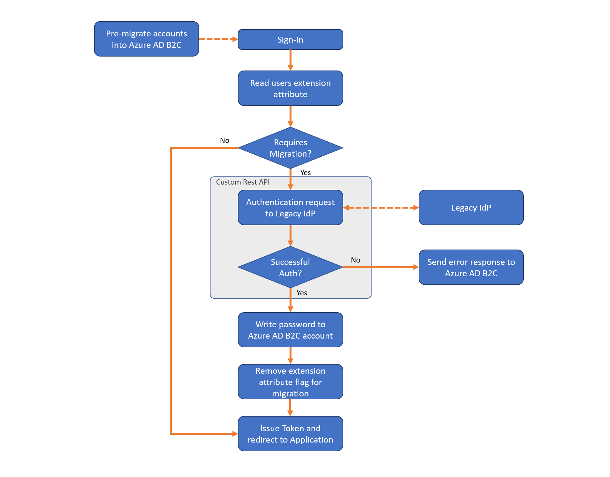

# Migrate users to Azure AD B2C

Migrating from another identity provider to Azure Active Directory B2C (Azure AD B2C) might also require migrating existing user accounts. Two migration methods are discussed here, *bulk import* and *seamless migration*. With either approach, you're required to write an application or script that uses the [Microsoft Graph API](manage-user-accounts-graph-api.md) to create user accounts in Azure AD B2C.

## Bulk import

In the bulk import flow, your migration application performs these steps for each user account:

1. Read the user account from the old identity provider, including its current credentials (username and password).
1. Create a corresponding account in your Azure AD B2C directory with the current credentials.

Use the bulk import flow in either of these two situations:

- You have access to a user's plaintext credentials (their username and password).
- The credentials are encrypted, but you can decrypt them.

For information about programmatically creating user accounts, see [Manage Azure AD B2C user accounts with Microsoft Graph](manage-user-accounts-graph-api.md).

## Seamless migration

Use the seamless migration flow if plaintext passwords in the old identity provider are not accessible. For example, when:

- The password is stored in a one-way encrypted format, such as with a hash function.
- The password is stored by the legacy identity provider in a way that you can't access. For example, when the identity provider validates credentials by calling a web service.

The seamless migration flow still requires bulk migration of user accounts, but then uses a [custom policy](custom-policy-get-started.md) to query a [REST API](custom-policy-rest-api-intro.md) (which you create) to set each users' password at first sign-in.

The seamless migration flow thus has two phases: *bulk import* and *set credentials*.

### Phase 1: Bulk import

1. Your migration application reads the user accounts from the old identity provider.
1. The migration application creates corresponding user accounts in your Azure AD B2C directory, but *does not set passwords*.

### Phase 2: Set credentials

After bulk migration of the accounts is complete, your custom policy and REST API then perform the following when a user signs in:

1. Read the Azure AD B2C user account corresponding to the email address entered.
1. Check whether the account is flagged for migration by evaluating a boolean extension attribute.
    - If the extension attribute returns `True`, call your REST API to validate the password against the legacy identity provider.
      - If the REST API determines the password is incorrect, return a friendly error to the user.
      - If the REST API determines the password is correct, write the password to the Azure AD B2C account and change the boolean extension attribute to `False`.
    - If the boolean extension attribute returns `False`, continue the sign-in process as normal.

To see an example custom policy and REST API, see the [seamless user migration sample](https://aka.ms/b2c-account-seamless-migration) on GitHub.

 *Diagram: Seamless migration flow*

## Best practices

### Security

The seamless migration approach uses your own custom REST API to validate a user's credentials against the legacy identity provider.

**You must protect your REST API against brute-force attacks.** An attacker can submit several passwords in the hope of eventually guessing a user's credentials. To help defeat such attacks, stop serving requests to your REST API when the number of sign-in attempts passes a certain threshold. Also, secure the communication between Azure AD B2C and your REST API. To learn how to secure your RESTful APIs for production, see [Secure RESTful API](secure-rest-api.md).

### User attributes

Not all information in the legacy identity provider should be migrated to your Azure AD B2C directory. Identify the appropriate set of user attributes to store in Azure AD B2C before migrating.

- **DO** store in Azure AD B2C
  - Username, password, email addresses, phone numbers, membership numbers/identifiers.
  - Consent markers for privacy policy and end-user license agreements.
- **DO NOT** store in Azure AD B2C
  - Sensitive data like credit card numbers, social security numbers (SSN), medical records, or other data regulated by government or industry compliance bodies.
  - Marketing or communication preferences, user behaviors, and insights.

### Directory clean-up

Before you start the migration process, take the opportunity to clean up your directory.

- Identify the set of user attributes to be stored in Azure AD B2C, and migrate only what you need. If necessary, you can create [custom attributes](custom-policy-custom-attributes.md) to store more data about a user.
- If you're migrating from an environment with multiple authentication sources (for example, each application has its own user directory), migrate to a unified account in Azure AD B2C.
- If multiple applications have different usernames, you can store all of them in an Azure AD B2C user account by using the identities collection. With regard to the password, let the user choose one and set it in the directory. For example, with the seamless migration, only the chosen password should be stored in the Azure AD B2C account.
- Remove unused user accounts before migration, or do not migrate stale accounts.

### Password policy

If the accounts you're migrating have weaker password strength than the [strong password strength](../active-directory/authentication/concept-sspr-policy.md) enforced by Azure AD B2C, you can disable the strong password requirement. For more information, see [Password policy property](manage-user-accounts-graph-api.md#password-policy-property).

## Next steps

The [azure-ad-b2c/user-migration](https://github.com/azure-ad-b2c/user-migration) repository on GitHub contains a seamless migration custom policy example and REST API code sample:

[Seamless user migration custom policy & REST API code sample](https://aka.ms/b2c-account-seamless-migration)
