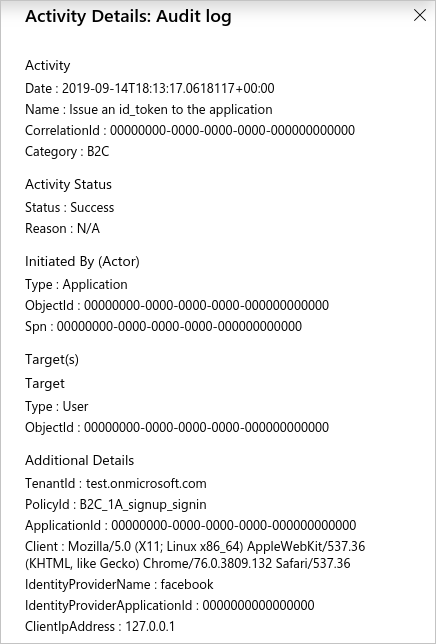
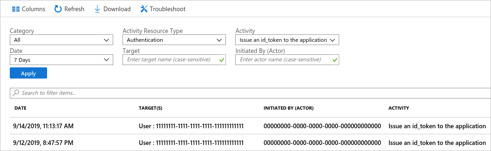

# Accessing Azure AD B2C audit logs

Azure Active Directory B2C (Azure AD B2C) emits audit logs containing activity information about B2C resources, tokens issued, and administrator access. This article provides a brief overview of the information available in audit logs and instructions on how to access this data for your Azure AD B2C tenant.

Audit log events are only retained for **seven days**. Plan to download and store your logs using one of the methods shown below if you require a longer retention period.

> [!NOTE]
> You can't see user sign-ins for individual Azure AD B2C applications under the **Users** section of the **Microsoft Entra ID** or **Azure AD B2C** pages in the Azure portal. The sign-in events there show user activity, but can't be correlated back to the B2C application that the user signed in to. You must use the audit logs for that, as explained further in this article.

## Overview of activities available in the B2C category of audit logs

The **B2C** category in audit logs contains the following types of activities:

|Activity type |Description  |
|---------|---------|
|Authorization |Activities concerning the authorization of a user to access B2C resources (for example, an administrator accessing a list of B2C policies).         |
|Directory |Activities related to directory attributes retrieved when an administrator signs in using the Azure portal. |
|Application | Create, read, update, and delete (CRUD) operations on B2C applications. |
|Key |CRUD operations on keys stored in a B2C key container. |
|Resource |CRUD operations on B2C resources. For example, policies and identity providers.
|Authentication |Validation of user credentials and token issuance.|

For user object CRUD activities, refer to the **Core Directory** category.

## Example activity

This example image from the Azure portal shows the data captured when a user signs in with an external identity provider, in this case, Facebook:



The activity details panel contains the following relevant information:

|Section|Field|Description|
|-------|-----|-----------|
| Activity | Name | Which activity took place. For example, *Issue an id_token to the application*, which concludes the actual user sign-in. |
| Initiated By (Actor) | ObjectId | The **Object ID** of the B2C application that the user is signing in to. This identifier is not visible in the Azure portal, but is accessible via the Microsoft Graph API. |
| Initiated By (Actor) | Spn | The **Application ID** of the B2C application that the user is signing in to. |
| Target(s) | ObjectId | The **Object ID** of the user that is signing in. |
| Additional Details | TenantId | The **Tenant ID** of the Azure AD B2C tenant. |
| Additional Details | PolicyId | The **Policy ID** of the user flow (policy) being used to sign the user in. |
| Additional Details | ApplicationId | The **Application ID** of the B2C application that the user is signing in to. |

## View audit logs in the Azure portal

The Azure portal provides access to the audit log events in your Azure AD B2C tenant.

1. Sign in to the [Azure portal](https://portal.azure.com).
1. Switch to the directory that contains your Azure AD B2C tenant, and then browse to **Azure AD B2C**.
1. Under **Activities** in the left menu, select **Audit logs**.

A list of activity events logged over the last seven days is displayed.



Several filtering options are available, including:

* **Activity Resource Type** - Filter by the activity types shown in the table in the [Overview of activities available](#overview-of-activities-available-in-the-b2c-category-of-audit-logs) section.
* **Date** - Filter the date range of the activities shown.

If you select a row in the list, the activity details for the event are displayed.

To download the list of activity events in a comma-separated values (CSV) file, select **Download**.

<a name='get-audit-logs-with-the-azure-ad-reporting-api'></a>

## Get audit logs with the Microsoft Entra reporting API

Audit logs are published to the same pipeline as other activities for Microsoft Entra ID, so they can be accessed through the [Microsoft Entra reporting API](/graph/api/directoryaudit-list). For more information, see [Get started with the Microsoft Entra reporting API](../active-directory/reports-monitoring/howto-configure-prerequisites-for-reporting-api.md).

### Enable reporting API access

To allow script- or application-based access to the Microsoft Entra reporting API, you need an application registered in your Azure AD B2C tenant with the following API permissions. You can enable these permissions on an existing application registration within your B2C tenant, or create a new one specifically for use with audit log automation.

* Microsoft Graph > Application permissions > AuditLog > AuditLog.Read.All

Follow the steps in the following article to register an application with the required permissions:

[Manage Azure AD B2C with Microsoft Graph](microsoft-graph-get-started.md)

After you've registered an application with the appropriate permissions, see the PowerShell script section later in this article for an example of how you can get activity events with a script.

### Access the API

To download Azure AD B2C audit log events via the API, filter the logs on the `B2C` category. To filter by category, use the `filter` query string parameter when you call the Microsoft Entra reporting API endpoint.

```http
https://graph.microsoft.com/v1.0/auditLogs/directoryAudits?$filter=loggedByService eq 'B2C' and activityDateTime gt 2019-09-10T02:28:17Z
```

### PowerShell script

The following PowerShell script shows an example of how to query the Microsoft Entra reporting API. After querying the API, it prints the logged events to standard output, then writes the JSON output to a file.

You can try this script in the [Azure Cloud Shell](overview.md). Be sure to update it with your application ID, client secret, and the name of your Azure AD B2C tenant.

```powershell
# This script requires an application registration that's granted Microsoft Graph API permission
# https://learn.microsoft.com/azure/active-directory-b2c/microsoft-graph-get-started

# Constants
$ClientID       = "your-client-application-id-here"       # Insert your application's client ID, a GUID
$ClientSecret   = "your-client-application-secret-here"   # Insert your application's client secret value
$tenantdomain   = "your-b2c-tenant.onmicrosoft.com"       # Insert your Azure AD B2C tenant domain name

$loginURL       = "https://login.microsoftonline.com"
$resource       = "https://graph.microsoft.com"           # Microsoft Graph API resource URI
$7daysago       = "{0:s}" -f (get-date).AddDays(-7) + "Z" # Use 'AddMinutes(-5)' to decrement minutes, for example
Write-Output "Searching for events starting $7daysago"

# Create HTTP header, get an OAuth2 access token based on client id, secret and tenant domain
$body       = @{grant_type="client_credentials";resource=$resource;client_id=$ClientID;client_secret=$ClientSecret}
$oauth      = Invoke-RestMethod -Method Post -Uri $loginURL/$tenantdomain/oauth2/token?api-version=1.0 -Body $body

# Parse audit report items, save output to file(s): auditX.json, where X = 0 through n for number of nextLink pages
if ($oauth.access_token -ne $null) {
    $i=0
    $headerParams = @{'Authorization'="$($oauth.token_type) $($oauth.access_token)"}
    $url = "https://graph.microsoft.com/v1.0/auditLogs/directoryAudits?`$filter=loggedByService eq 'B2C' and activityDateTime gt  " + $7daysago

    # loop through each query page (1 through n)
    Do {
        # display each event on the console window
        Write-Output "Fetching data using Uri: $url"
        $myReport = (Invoke-WebRequest -UseBasicParsing -Headers $headerParams -Uri $url)
        foreach ($event in ($myReport.Content | ConvertFrom-Json).value) {
            Write-Output ($event | ConvertTo-Json)
        }

        # save the query page to an output file
        Write-Output "Save the output to a file audit$i.json"
        $myReport.Content | Out-File -FilePath audit$i.json -Force
        $url = ($myReport.Content | ConvertFrom-Json).'@odata.nextLink'
        $i = $i+1
    } while($url -ne $null)
} else {
    Write-Host "ERROR: No Access Token"
}
```

Here's the JSON representation of the example activity event shown earlier in the article:

```json
{
    "id": "B2C_DQO3J_4984536",
    "category": "Authentication",
    "correlationId": "00000000-0000-0000-0000-000000000000",
    "result": "success",
    "resultReason": "N/A",
    "activityDisplayName": "Issue an id_token to the application",
    "activityDateTime": "2019-09-14T18:13:17.0618117Z",
    "loggedByService": "B2C",
    "operationType": "",
    "initiatedBy": {
        "user": null,
        "app": {
            "appId": "00000000-0000-0000-0000-000000000000",
            "displayName": null,
            "servicePrincipalId": null,
            "servicePrincipalName": "00000000-0000-0000-0000-000000000000"
        }
    },
    "targetResources": [
        {
            "id": "00000000-0000-0000-0000-000000000000",
            "displayName": null,
            "type": "User",
            "userPrincipalName": null,
            "groupType": null,
            "modifiedProperties": []
        }
    ],
    "additionalDetails": [
        {
            "key": "TenantId",
            "value": "test.onmicrosoft.com"
        },
        {
            "key": "PolicyId",
            "value": "B2C_1A_signup_signin"
        },
        {
            "key": "ApplicationId",
            "value": "00000000-0000-0000-0000-000000000000"
        },
        {
            "key": "Client",
            "value": "Mozilla/5.0 (X11; Linux x86_64) AppleWebKit/537.36 (KHTML, like Gecko) Chrome/76.0.3809.132 Safari/537.36"
        },
        {
            "key": "IdentityProviderName",
            "value": "facebook"
        },
        {
            "key": "IdentityProviderApplicationId",
            "value": "0000000000000000"
        },
        {
            "key": "ClientIpAddress",
            "value": "127.0.0.1"
        }
    ]
}
```

## Next steps

You can automate other administration tasks, for example, [manage Azure AD B2C user accounts with Microsoft Graph](microsoft-graph-operations.md).
