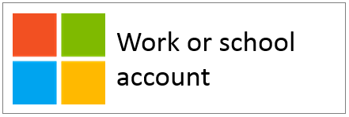
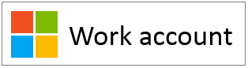
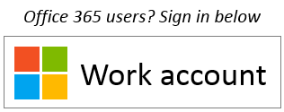

<properties
   pageTitle="Branding Guidelines for Applications"
   description="A comprehensive guide to developer-oriented resources for Azure Active Directory"
   services="active-directory"
   documentationCenter="dev-center-name"
   authors="msmbaldwin"
   manager="mbaldwin"
   editor=""/>

<tags
   ms.service="active-directory"
   ms.devlang="na"
   ms.topic="article"
   ms.tgt_pltfrm="na"
   ms.workload="identity"
   ms.date="04/29/2015"
   ms.author="mbaldwin"/>

# Branding Guidelines for Applications

This topic discusses the branding guidelines you should use when developing applications with Azure Active Directory. These guidelines will help direct your customers when they want to use their work or school account, managed in Azure AD, for sign-up and sign-in to your application.

## Personal accounts vs. work or school accounts from Microsoft

Microsoft manages two kinds of user accounts:

- **Personal accounts** (formerly known as Windows Live ID). These accounts represent the relationship between *individual* users and Microsoft, and are used to access consumer devices and services from Microsoft. These accounts are intended for personal use.

- **Work or school accounts.** These accounts are managed by Microsoft on behalf of organizations that use Azure Active Directory. These accounts are used to sign in to Office 365 and other business services from Microsoft.

Microsoft work or school accounts are typically assigned to end users (employees, students, federal employees) by their organizations (company, school, government agency). These accounts are either mastered directly in the cloud, in the Azure AD platform, or synced to Azure AD from an on-premises directory, such as Windows Server Active Directory. Microsoft is the *custodian* of the work or school accounts, but the accounts are owned and controlled by the organization.

## Referring to Azure AD accounts in your application

Microsoft doesn’t expose end-users to the Azure or the Active Directory brand names, and neither should you. 

- Once users are signed in, you should use the organization’s name and logo as much as possible. This is better than using generic terms like “your organization”.

- When users are not signed in, you should refer to their accounts as “Work or school accounts” and use the Microsoft logo to convey that these accounts are managed by Microsoft. Don’t use terms like “enterprise account”, “business account” or “corporate account” which create user confusion.

## User account pictogram
In an earlier version of these guidelines, we recommended using a “blue badge” pictogram. Based on user and developer feedback, we now recommend the use of the Microsoft logo instead. This will help users understand that they can reuse the account they use with Office 365 or other Microsoft business services to sign in to your app. 

## Signing up and signing in with Azure AD

Your app may present separate paths for sign-up and sign-in and the following sections provide visual guidance for both scenarios.

**If your app supports end user sign up (e.g. free to trial or freemium model)**: You can show a **sign-in** button that allows users to access your app with their work or school account from Microsoft. Azure AD will show a consent prompt the first time they access your app.

**If your app requires permissions that only admins can consent to, or if your app requires organizational licensing**: You should separate admin acquisition from user sign in. The **“get this app” button** will redirect admins to sign in then ask them to grant consent on behalf of users in their organization. This has the added benefit of suppressing end users consent prompts to your app.

## Visual guidance for app acquisition

Your “get the app” link must redirect the user to the Azure AD grant access (authorize) page, to allow an organization’s administrator to authorize your app to have access to their organization’s data that is hosted by Microsoft. Details on how to request access are discussed in the [Adding, Updating, and Removing an Application](https://msdn.microsoft.com/library/azure/dn132599.aspx) topic.

After admins consent to your app, they can choose to add it to their users’ Office 365 app launcher experience (accessible from the waffle and from [https://portal.office.com/myapps](https://portal.office.com/myapps)). If you want to advertise this capability, you can use terms like “Add this app to your organization” and show a button like this:

  
However, we recommend that you write explanatory text instead of relying on buttons. For example:
> *If you already use Office 365 or other business service from Microsoft, you can simply grant <your_app_name> access to your organization’s data. This will allow your users to access <your_app_name> with their existing work accounts.*

## Visual guidance for sign-in
Your app should display a sign in button that redirects users to the sign-in endpoint that corresponds to the protocol you use to integrate with Azure AD. The following section provides details on what that button should look like.

### Pictogram and “work or school account” 
It’s the association of the Microsoft logo and the generic “work or school” terms that uniquely represents Azure AD amongst other identity providers your app may support. If you don’t have enough space for “work or school account,” it’s ok to shorten it to “work account.”
 

You can also provide additional explanation to help end-users recognize whether they can use this button:

 
## Branding Do’s and Don’ts
**DO** use “work or school account” in combination with the Microsoft logo to represent sign-ins with Azure AD. If space is at a premium, it’s ok to say “work account”, but **DON’T** use other terms such as “enterprise account”, “business account” or “corporate account.”

**DON’T** use “Office 365 ID” or “Azure ID”. Office 365 is also the name of a consumer offering from Microsoft which doesn’t use Azure AD for authentication.

**DON’T** alter the Microsoft logo.

**DON’T** expose end-users to the Azure or Active Directory brands. It’s ok however to use these terms with developers, IT pros and admins.

## Navigation Do’s and Don’ts

**DO** provide a way for users to sign out and switch to another user account. While most people have a single personal account from Microsoft/Facebook/Google/Twitter, people are often associated with more than one organization. Support for multiple signed-in users is coming soon.

## Supporting both Azure AD and Microsoft Accounts in Your App

If your app supports both Azure AD and Microsoft accounts, you need to include two separate sign-in buttons in your app. We are actively working on an update that will allow you to integrate once and support both personal and work accounts from Microsoft. When this is available, you’ll be able to show a single “sign-in with Microsoft” button in your app.

