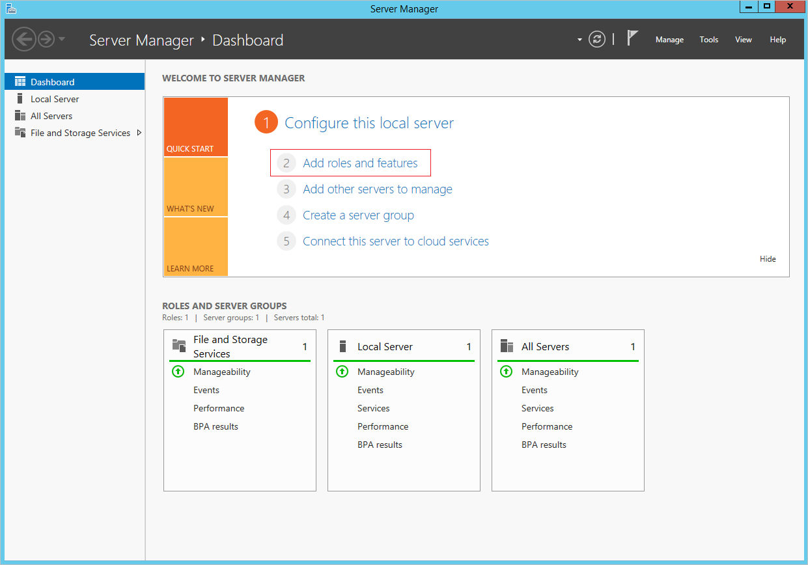
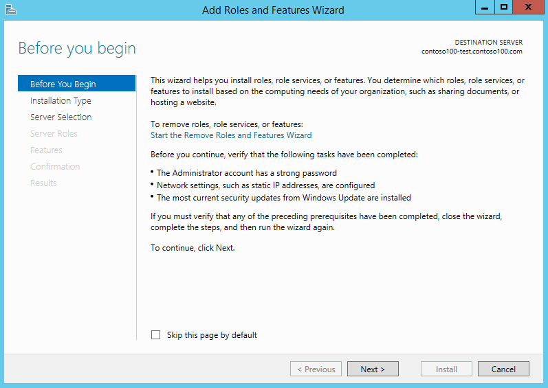
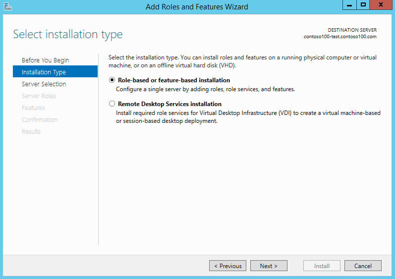
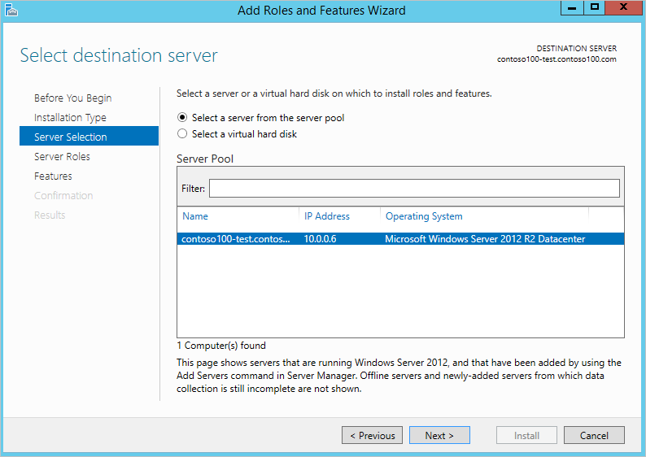
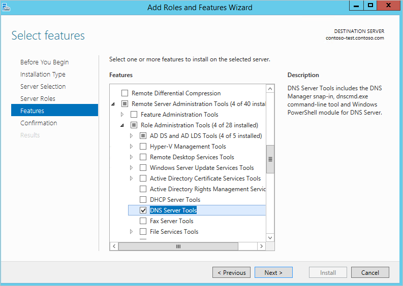
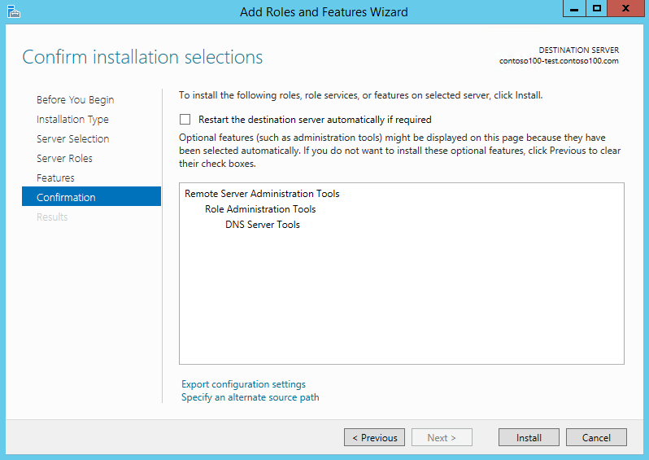
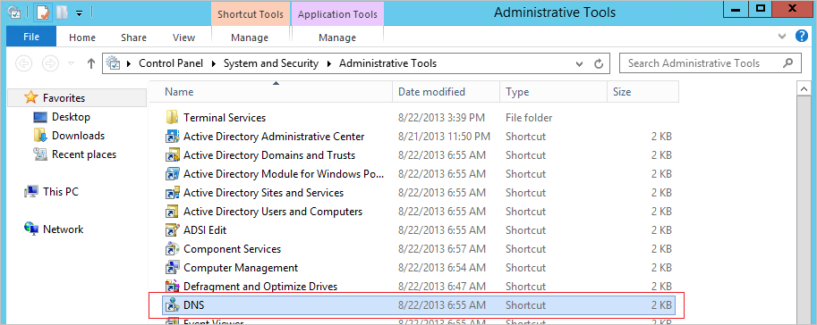
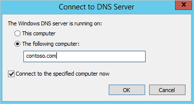
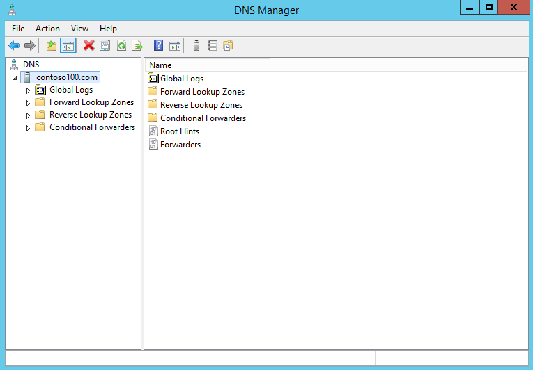

<properties
	pageTitle="Azure Active Directory Domain Services preview: Administer DNS on managed domains | Microsoft Azure"
	description="Administer DNS on managed domains using Azure Active Directory Domain Services"
	services="active-directory-ds"
	documentationCenter=""
	authors="mahesh-unnikrishnan"
	manager="stevenpo"
	editor="curtand"/>

<tags
	ms.service="active-directory-ds"
	ms.workload="identity"
	ms.tgt_pltfrm="na"
	ms.devlang="na"
	ms.topic="article"
	ms.date="07/06/2016"
	ms.author="maheshu"/>

# Administer DNS on an Azure AD Domain Services managed domain
Azure Active Directory Domain Services includes a DNS (Domain Name Resolution) server that provides DNS resolution for the managed domain. Occasionally, it may be necessary to configure DNS on the managed domain in order to create DNS records for machines that are not joined to the domain, virtual IP addresses for load-balancers or external DNS forwarders. For this reason, users who belong to the 'AAD DC Administrators' group are granted DNS administration privileges on the managed domain.

## Before you begin
To perform the tasks listed in this article, you will need:

1. A valid **Azure subscription**.

2. An **Azure AD directory** - either synchronized with an on-premises directory or a cloud-only directory.

3. **Azure AD Domain Services** must be enabled for the Azure AD directory. If you haven't done so, follow all the tasks outlined in the [Getting Started guide](./active-directory-ds-getting-started.md).

4. A **domain-joined virtual machine** from which you will administer the Azure AD Domain Services managed domain. If you don't have such a virtual machine, follow all the tasks outlined in the article titled [Join a Windows virtual machine to a managed domain](./active-directory-ds-admin-guide-join-windows-vm.md).

5. You will need the credentials of a **user account belonging to the 'AAD DC Administrators' group** in your directory, in order to administer DNS for your managed domain.

 

## Task 1 - Provision a domain-joined virtual machine to remotely administer DNS for the managed domain
Azure AD Domain Services managed domains can be managed remotely using familiar Active Directory administrative tools such as the Active Directory Administrative Center (ADAC) or AD PowerShell. Similarly, DNS for the managed domain can be administered remotely using the DNS Server administration tools.

Administrators in your Azure AD directory do not have privileges to connect to domain controllers on the managed domain via Remote Desktop. Therefore, members of the 'AAD DC Administrators' group can administer DNS for managed domains remotely using DNS Server tools from a Windows Server/client computer that is joined to the managed domain. DNS Server tools can be installed as part of the Remote Server Administration Tools (RSAT) optional feature on Windows Server and client machines joined to the managed domain.

The first task is to provision a Windows Server virtual machine that is joined to the managed domain. For instructions to do this, refer to the article titled [join a Windows Server virtual machine to an Azure AD Domain Services managed domain](active-directory-ds-admin-guide-join-windows-vm.md).

## Task 2 - Install DNS Server tools on the virtual machine
Perform the following steps in order to install the DNS Administration tools on the domain joined virtual machine. For more details on [installing and using Remote Server Administration Tools](https://technet.microsoft.com/library/hh831501.aspx), refer to TechNet.

1. Navigate to **Virtual Machines** node in the Azure classic portal. Select the virtual machine you just created and click **Connect** on the command bar at the bottom of the window.

    

2. The classic portal will prompt you to open or save a .rdp file, which is used to connect to the virtual machine. Click on the .rdp file when it has finished downloading.

3. At the login prompt, use the credentials of a user belonging to the 'AAD DC Administrators' group. For example 'bob@domainservicespreview.onmicrosoft.com' in our case.

4. From the Start screen, open **Server Manager**. Click on **Add Roles and Features** in the central pane of the Server Manager window.

    

5. On the **Before You Begin** page of the **Add Roles and Features Wizard**, click **Next**.

    

6. On the **Installation Type** page, leave the **Role-based or feature-based installation** option checked and click **Next**.

	

7. On the **Server Selection** page, select the current virtual machine from the server pool, and click **Next**.

	

8. On the **Server Roles** page, click **Next**. We will skip this page since we are not installing any roles on the server.

9. On the **Features** page, click to expand the **Remote Server Administration Tools** node and then click to expand the **Role Administration Tools** node. Select **DNS Server Tools** feature from the list of role administration tools as shown below.

	

10. On the **Confirmation** page, click **Install** in order to install the DNS Server tools feature on the virtual machine. When feature installation completes successfully, click **Close** to exit the **Add Roles and Features** wizard.

	

## Task 3 - Launch the DNS management console to administer DNS
Now that the DNS Server Tools feature is installed on the domain joined virtual machine, we can use the DNS tools to administer DNS on the managed domain.

> [AZURE.NOTE] You will need to be a member of the 'AAD DC Administrators' group, in order to administer DNS on the managed domain.

1. From the Start screen, click on **Administrative Tools**. You should see the **DNS** console installed on the virtual machine.

	

2. Click on **DNS** to launch the DNS Management console.

3. In the **Connect to DNS Server** dialog, click on the option titled **The following computer** and enter the DNS domain name of the managed domain (eg. 'contoso100.com').

    

4. The DNS Console connects to the managed domain. You should see a view similar to the following.

    

5. You can now use the DNS console to add DNS entries for computers within the virtual network in which you've enabled AAD Domain Services.

> [AZURE.WARNING] Be extremely careful when administering DNS for the managed domain using DNS administration tools. Ensure that you **do not delete or modify the built-in DNS records that are used by Domain Services in the domain**. This includes domain DNS records, name server records and other records used for DC location. If you modify these records, domain services will be disrupted on the virtual network.

For more information about managing DNS see the [DNS tools article on Technet](https://technet.microsoft.com/library/cc753579.aspx).

## Related Content

- [Azure AD Domain Services - Getting Started guide](./active-directory-ds-getting-started.md)

- [Administer an Azure AD Domain Services managed domain](active-directory-ds-admin-guide-administer-domain.md)

- [Join a Windows Server virtual machine to an Azure AD Domain Services managed domain](active-directory-ds-admin-guide-join-windows-vm.md)

- [DNS administration tools](https://technet.microsoft.com/library/cc753579.aspx)
