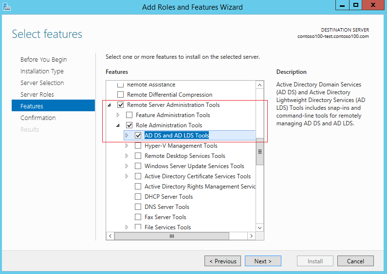
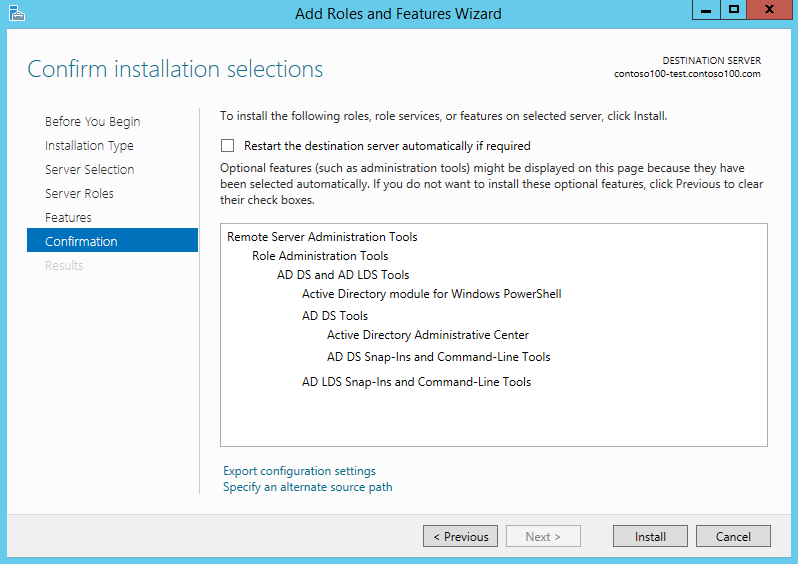
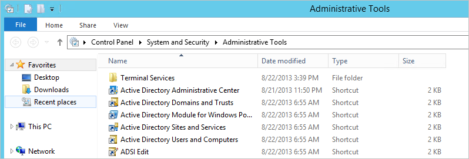
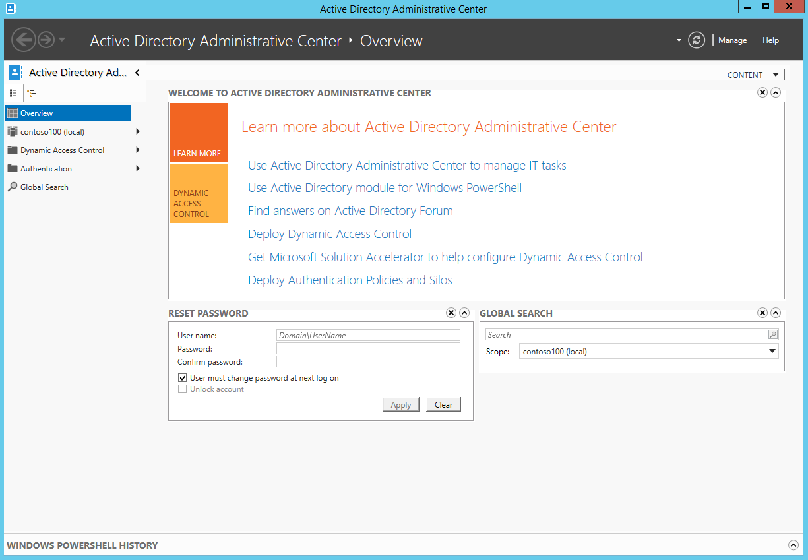
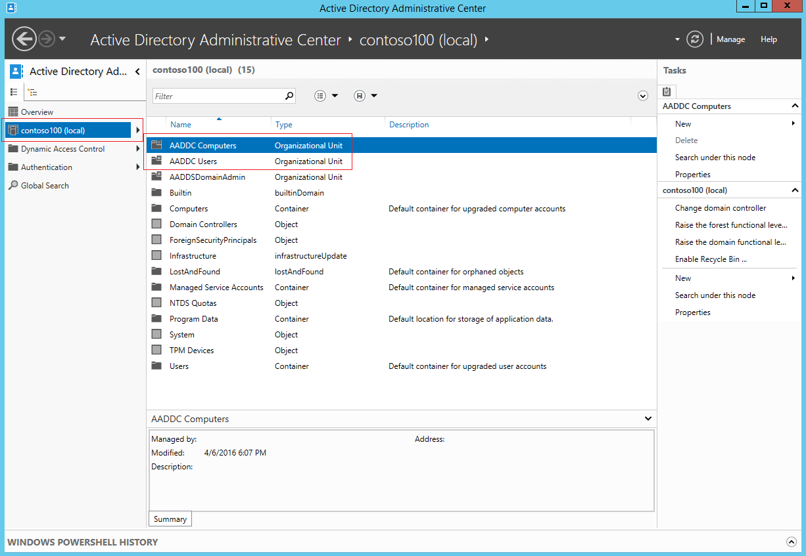
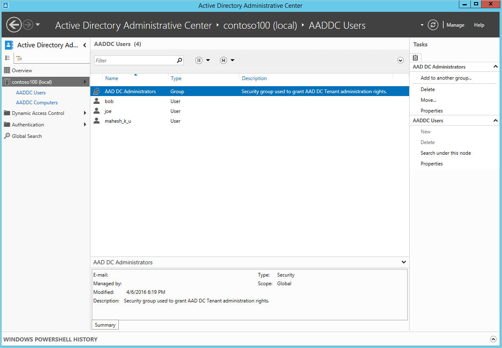
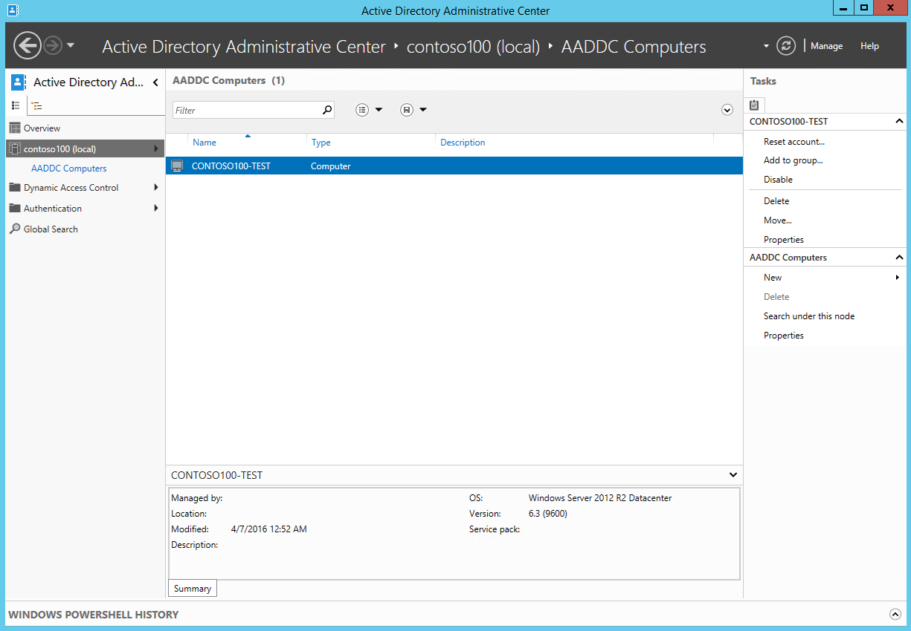

# Administer an Azure Active Directory Domain Services managed domain
This article shows you how to administer an Azure Active Directory (AD) Domain Services managed domain.

[!INCLUDE [active-directory-ds-prerequisites.md](../../includes/active-directory-ds-prerequisites.md)]

## Before you begin
To complete the tasks listed in this article, you need:

1. A valid **Azure subscription**.
2. An **Azure AD directory** - either synchronized with an on-premises directory or a cloud-only directory.
3. **Azure AD Domain Services** must be enabled for the Azure AD directory. If you haven't done so, follow all the tasks outlined in the [Getting Started guide](active-directory-ds-getting-started.md).
4. A **domain-joined virtual machine** from which you administer the Azure AD Domain Services managed domain. If you don't have such a virtual machine, follow all the tasks outlined in the article titled [Join a Windows virtual machine to a managed domain](active-directory-ds-admin-guide-join-windows-vm.md).
5. You need the credentials of a **user account belonging to the 'AAD DC Administrators' group** in your directory, to administer your managed domain.

 

## Administrative tasks you can perform on a managed domain
Members of the 'AAD DC Administrators' group are granted privileges on the managed domain that enable them to do tasks such as:

* Join machines to the managed domain.
* Configure the built-in GPO for the 'AADDC Computers' and 'AADDC Users' containers in the managed domain.
* Administer DNS on the managed domain.
* Create and administer custom Organizational Units (OUs) on the managed domain.
* Gain administrative access to computers joined to the managed domain.

## Administrative privileges you do not have on a managed domain
The domain is managed by Microsoft, including activities such as patching, monitoring and, taking backups. The domain is locked down and you do not have privileges to do certain administrative tasks on the domain. Some examples of tasks you cannot do are below.

* You don't have Domain Administrator or Enterprise Administrator privileges for the managed domain.
* You can't extend the schema of the managed domain.
* You can't connect to domain controllers for the managed domain using Remote Desktop.
* You can't add domain controllers to the managed domain.

## Task 1 - Create a domain-joined Windows Server virtual machine to remotely administer the managed domain
Azure AD Domain Services managed domains can be managed using familiar Active Directory administrative tools such as the Active Directory Administrative Center (ADAC) or AD PowerShell. Tenant administrators do not have privileges to connect to domain controllers on the managed domain via Remote Desktop. Members of the 'AAD DC Administrators' group can administer managed domains remotely using AD administrative tools from a Windows Server/client computer that is joined to the managed domain. AD administrative tools can be installed as part of the Remote Server Administration Tools (RSAT) optional feature on Windows Server and client machines joined to the managed domain.

The first step is to set up a Windows Server virtual machine that is joined to the managed domain. For instructions, refer to the article titled [join a Windows Server virtual machine to an Azure AD Domain Services managed domain](active-directory-ds-admin-guide-join-windows-vm.md).

### Remotely administer the managed domain from a client computer (for example, Windows 10)
The instructions in this article use a Windows Server virtual machine to administer the AAD-DS managed domain. However, you can also choose to use a Windows client (for example, Windows 10) virtual machine to do so.

You can [install Remote Server Administration Tools (RSAT)](http://social.technet.microsoft.com/wiki/contents/articles/2202.remote-server-administration-tools-rsat-for-windows-client-and-windows-server-dsforum2wiki.aspx) on a Windows client virtual machine by following the instructions on TechNet.

## Task 2 - Install Active Directory administration tools on the virtual machine
Complete the following steps to install the Active Directory Administration tools on the domain joined virtual machine. See Technet for more [information on installing and using Remote Server Administration Tools](https://technet.microsoft.com/library/hh831501.aspx).

1. Navigate to the Azure portal. Click **All resources** on the left-hand panel. Locate and click the virtual machine you created in Task 1.
2. Click the **Connect** button on the Overview tab. A Remote Desktop Protocol (.rdp) file is created and downloaded.

    
3. To connect to your VM, open the downloaded RDP file. If prompted, click **Connect**. Use the credentials of a user belonging to the 'AAD DC Administrators' group. For example, 'bob@domainservicespreview.onmicrosoft.com'. You may receive a certificate warning during the sign-in process. Click Yes or Continue to proceed with the connection.
4. From the Start screen, open **Server Manager**. Click **Add Roles and Features** in the central pane of the Server Manager window.

    
5. On the **Before You Begin** page of the **Add Roles and Features Wizard**, click **Next**.

    
6. On the **Installation Type** page, leave the **Role-based or feature-based installation** option checked and click **Next**.

    
7. On the **Server Selection** page, select the current virtual machine from the server pool, and click **Next**.

    
8. On the **Server Roles** page, click **Next**.
9. On the **Features** page, click to expand the **Remote Server Administration Tools** node and then click to expand the **Role Administration Tools** node. Select **AD DS and AD LDS Tools** feature from the list of role administration tools.

    
10. On the **Confirmation** page, click **Install** to install the AD and AD LDS tools feature on the virtual machine. When feature installation completes successfully, click **Close** to exit the **Add Roles and Features** wizard.

    

## Task 3 - Connect to and explore the managed domain
Now, you can use Windows Server AD administrative tools to explore and administer the managed domain.

> [!NOTE]
> You need to be a member of the 'AAD DC Administrators' group, to administer the managed domain.
>
>

1. From the Start screen, click **Administrative Tools**. You should see the AD administrative tools installed on the virtual machine.

    
2. Click **Active Directory Administrative Center**.

    
3. To explore the domain, click the domain name in the left pane (for example, 'contoso100.com'). Notice two containers called 'AADDC Computers' and 'AADDC Users' respectively.

    
4. Click the container called **AADDC Users** to see all users and groups belonging to the managed domain. You should see user accounts and groups from your Azure AD tenant show up in this container. Notice in this example, a user account for the user called 'bob' and a group called 'AAD DC Administrators' are available in this container.

    
5. Click the container called **AADDC Computers** to see the computers joined to this managed domain. You should see an entry for the current virtual machine, which is joined to the domain. Computer accounts for all computers that are joined to the Azure AD Domain Services managed domain are stored in this 'AADDC Computers' container.

    

 

## Related Content
* [Azure AD Domain Services - Getting Started guide](active-directory-ds-getting-started.md)
* [Join a Windows Server virtual machine to an Azure AD Domain Services managed domain](active-directory-ds-admin-guide-join-windows-vm.md)
* [Deploy Remote Server Administration Tools](https://technet.microsoft.com/library/hh831501.aspx)
