# Administer Group Policy on an Azure AD Domain Services managed domain
Azure Active Directory Domain Services includes built-in Group Policy Objects (GPOs) for the 'AADDC Users' and 'AADDC Computers' containers. You can customize these built-in GPOs to configure Group Policy on the managed domain. Additionally, members of the 'AAD DC Administrators' group can create their own custom OUs in the managed domain. They can also create custom GPOs and link them to these custom OUs. Users who belong to the 'AAD DC Administrators' group are granted Group Policy administration privileges on the managed domain.

[!INCLUDE [active-directory-ds-prerequisites.md](../../includes/active-directory-ds-prerequisites.md)]

## Before you begin
To perform the tasks listed in this article, you need:

1. A valid **Azure subscription**.
2. An **Azure AD directory** - either synchronized with an on-premises directory or a cloud-only directory.
3. **Azure AD Domain Services** must be enabled for the Azure AD directory. If you haven't done so, follow all the tasks outlined in the [Getting Started guide](active-directory-ds-getting-started.md).
4. A **domain-joined virtual machine** from which you administer the Azure AD Domain Services managed domain. If you don't have such a virtual machine, follow all the tasks outlined in the article titled [Join a Windows virtual machine to a managed domain](active-directory-ds-admin-guide-join-windows-vm.md).
5. You need the credentials of a **user account belonging to the 'AAD DC Administrators' group** in your directory, to administer Group Policy for your managed domain.

 

## Task 1 - Provision a domain-joined virtual machine to remotely administer Group Policy for the managed domain
Azure AD Domain Services managed domains can be managed remotely using familiar Active Directory administrative tools such as the Active Directory Administrative Center (ADAC) or AD PowerShell. Similarly, Group Policy for the managed domain can be administered remotely using the Group Policy administration tools.

Administrators in your Azure AD directory do not have privileges to connect to domain controllers on the managed domain via Remote Desktop. Members of the 'AAD DC Administrators' group can administer Group Policy for managed domains remotely. They can use Group Policy tools on a Windows Server/client computer joined to the managed domain. Group Policy tools can be installed as part of the Group Policy Management optional feature on Windows Server and client machines joined to the managed domain.

The first task is to provision a Windows Server virtual machine that is joined to the managed domain. For instructions, refer to the article titled [join a Windows Server virtual machine to an Azure AD Domain Services managed domain](active-directory-ds-admin-guide-join-windows-vm.md).

## Task 2 - Install Group Policy tools on the virtual machine
Perform the following steps to install the Group Policy Administration tools on the domain joined virtual machine.

1. Navigate to the Azure portal. Click **All resources** on the left-hand panel. Locate and click the virtual machine you created in Task 1.
2. Click the **Connect** button on the Overview tab. A Remote Desktop Protocol (.rdp) file is created and downloaded.

    
3. To connect to your VM, open the downloaded RDP file. If prompted, click **Connect**. At the login prompt, use the credentials of a user belonging to the 'AAD DC Administrators' group. For example, we use 'bob@domainservicespreview.onmicrosoft.com' in our case. You may receive a certificate warning during the sign-in process. Click Yes or Continue to proceed with the connection.
4. From the Start screen, open **Server Manager**. Click **Add Roles and Features** in the central pane of the Server Manager window.

    
5. On the **Before You Begin** page of the **Add Roles and Features Wizard**, click **Next**.

    
6. On the **Installation Type** page, leave the **Role-based or feature-based installation** option checked and click **Next**.

    
7. On the **Server Selection** page, select the current virtual machine from the server pool, and click **Next**.

    
8. On the **Server Roles** page, click **Next**. We skip this page since we are not installing any roles on the server.
9. On the **Features** page, select the **Group Policy Management** feature.

    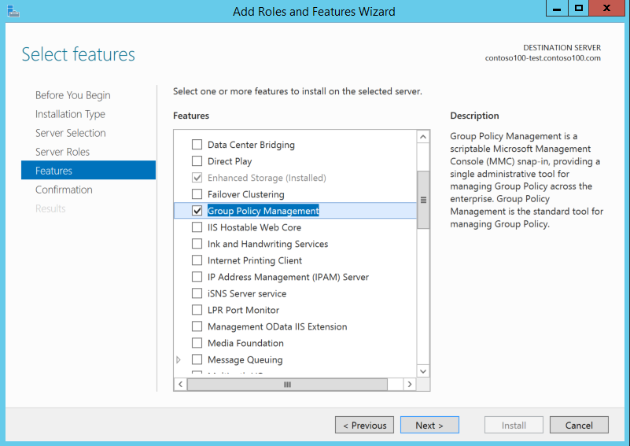
10. On the **Confirmation** page, click **Install** to install the Group Policy Management feature on the virtual machine. When feature installation completes successfully, click **Close** to exit the **Add Roles and Features** wizard.

    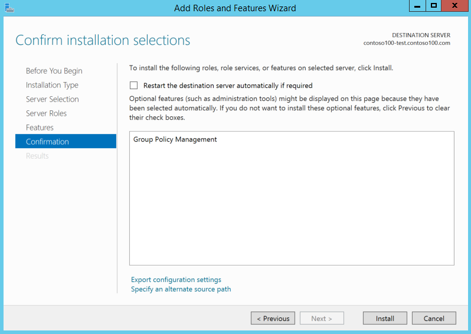

## Task 3 - Launch the Group Policy management console to administer Group Policy
You can use the Group Policy management console on the domain-joined virtual machine to administer Group Policy on the managed domain.

> [!NOTE]
> You need to be a member of the 'AAD DC Administrators' group, to administer Group Policy on the managed domain.
>
>

1. From the Start screen, click **Administrative Tools**. You should see the **Group Policy Management** console installed on the virtual machine.

    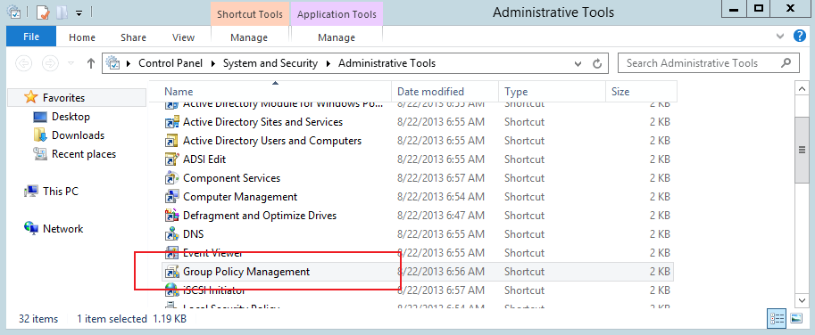
2. Click **Group Policy Management** to launch the Group Policy Management console.

    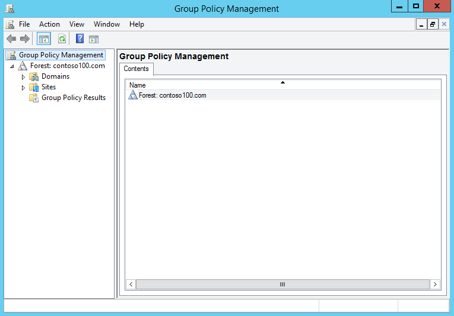

## Task 4 - Customize built-in Group Policy Objects
There are two built-in Group Policy Objects (GPOs) - one each for the 'AADDC Computers' and 'AADDC Users' containers in your managed domain. You can customize these GPOs to configure group policy on the managed domain.

1. In the **Group Policy Management** console, click to expand the **Forest: contoso100.com** and **Domains** nodes to see the group policies for your managed domain.

    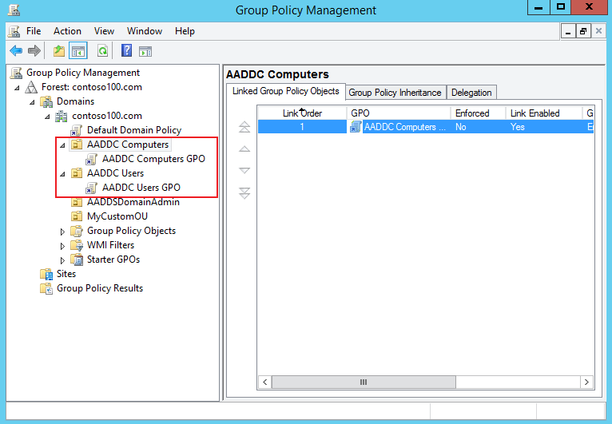
2. You can customize these built-in GPOs to configure group policies on your managed domain. Right-click the GPO and click **Edit...** to customize the built-in GPO. The Group Policy Configuration Editor tool enables you to customize the GPO.

    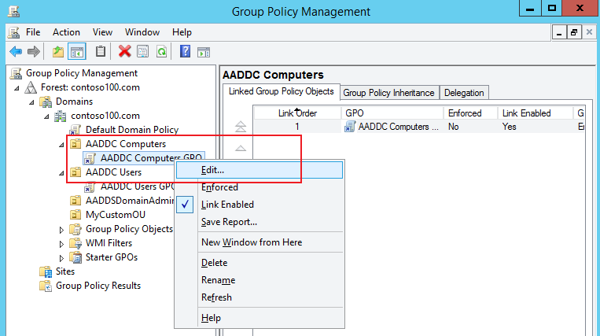
3. You can now use the **Group Policy Management Editor** console to edit the built-in GPO. For instance, the following screenshot shows how to customize the built-in 'AADDC Computers' GPO.

    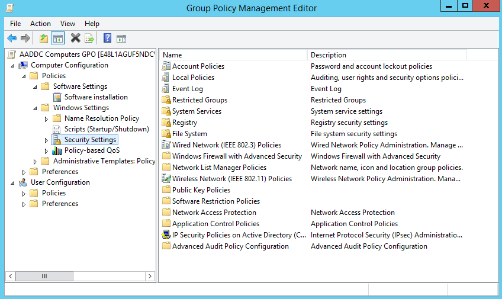

## Task 5 - Create a custom Group Policy Object (GPO)
You can create or import your own custom group policy objects. You can also link custom GPOs to a custom OU you have created in your managed domain. For more information on creating custom organizational units, see [create a custom OU on a managed domain](active-directory-ds-admin-guide-create-ou.md).

> [!NOTE]
> You need to be a member of the 'AAD DC Administrators' group, to administer Group Policy on the managed domain.
>
>

1. In the **Group Policy Management** console, click to select your custom organizational unit (OU). Right-click the OU and click **Create a GPO in this domain, and Link it here...**.

    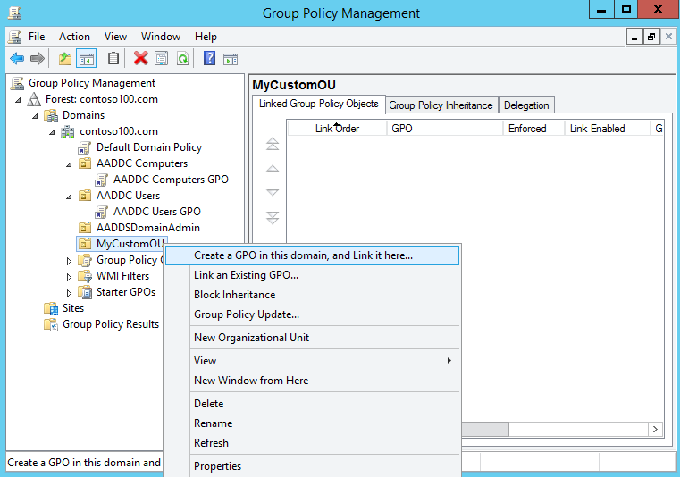
2. Specify a name for the new GPO and click **OK**.

    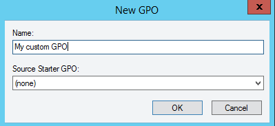
3. A new GPO is created and linked to your custom OU. Right-click the GPO and click **Edit...** from the menu.

    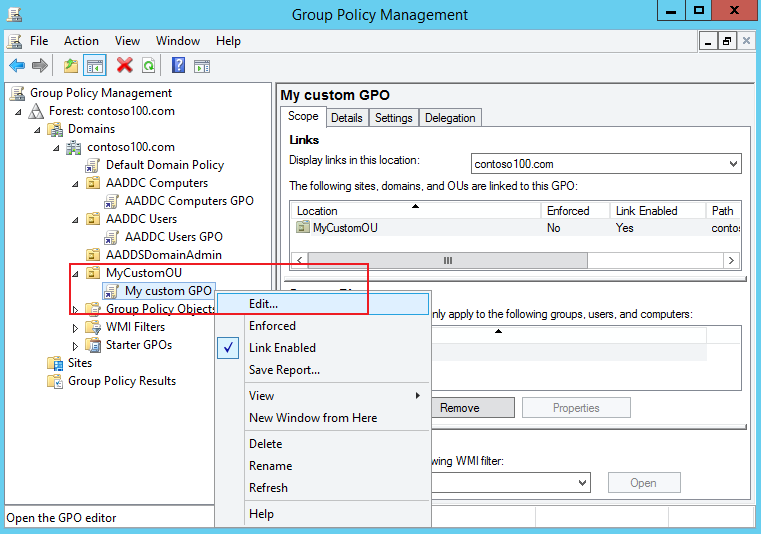
4. You can customize the newly created GPO using the **Group Policy Management Editor**.

    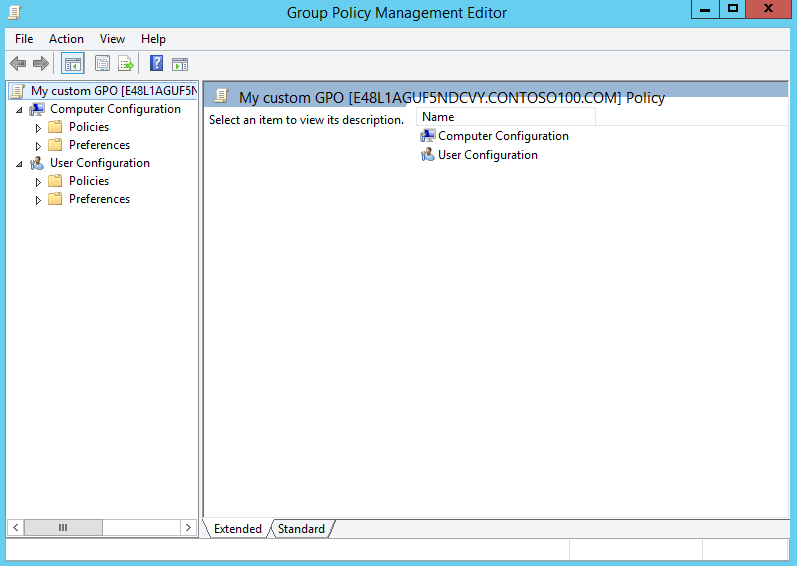

More information about using [Group Policy Management Console](https://technet.microsoft.com/library/cc753298.aspx) is available on Technet.

## Related Content
* [Azure AD Domain Services - Getting Started guide](active-directory-ds-getting-started.md)
* [Join a Windows Server virtual machine to an Azure AD Domain Services managed domain](active-directory-ds-admin-guide-join-windows-vm.md)
* [Administer an Azure AD Domain Services managed domain](active-directory-ds-admin-guide-administer-domain.md)
* [Group Policy Management Console](https://technet.microsoft.com/library/cc753298.aspx)
