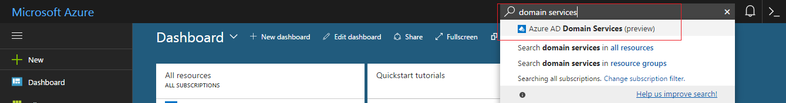
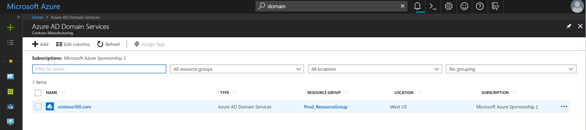
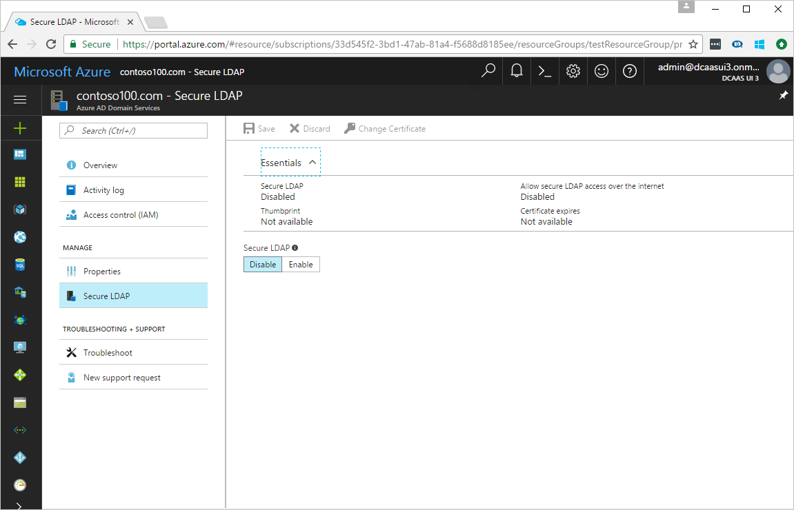
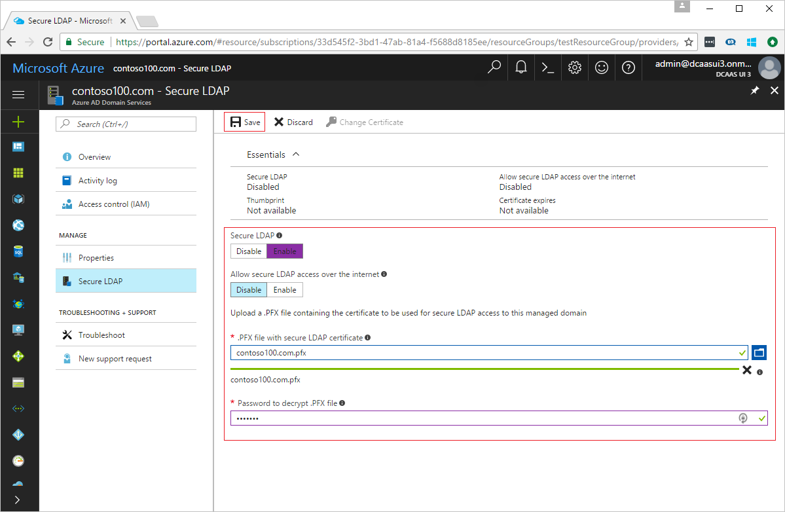
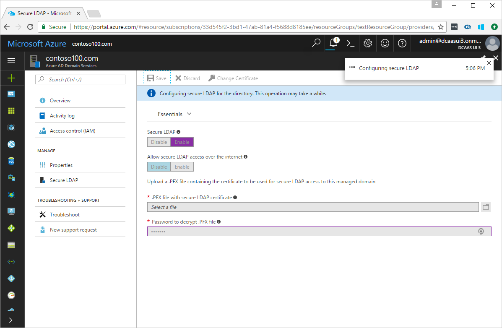

# Enable secure LDAP (LDAPS) for an Azure AD Domain Services managed domain

## Before you begin
Complete [Task 2 - export the secure LDAP certificate to a .PFX file](active-directory-ds-admin-guide-configure-secure-ldap-export-pfx.md).

## Task 3: Enable secure LDAP for the managed domain using the Azure portal
To enable secure LDAP, perform the following configuration steps:

1. Navigate to the **[Azure portal](https://portal.azure.com)**.

2. Search for 'domain services' in the **Search resources** search box. Select **Azure AD Domain Services** from the search result. The **Azure AD Domain Services** page lists your managed domain.

    

2. Click the name of the managed domain (for example, 'contoso100.com') to see more details about the domain.

    

3. Click **Secure LDAP** on the navigation pane.

    

4. By default, secure LDAP access to your managed domain is disabled. Toggle **Secure LDAP** to **Enable**.

    
5. By default, secure LDAP access to your managed domain over the internet is disabled. Toggle **Allow secure LDAP access over the internet** to **Enable**, if you need to.

    > [!WARNING]
    > When you enable secure LDAP access over the internet, your domain is susceptible to password brute force attacks over the internet. Therefore, we recommend setting up an NSG to lock down access to required source IP address ranges. See the instructions to [lock down LDAPS access to your managed domain over the internet](#task-5---lock-down-secure-ldap-access-to-your-managed-domain-over-the-internet).
    >

6. Click the folder icon following **.PFX file with secure LDAP certificate**. Specify the path to the PFX file with the certificate for secure LDAP access to the managed domain.

7. Specify the **Password to decrypt .PFX file**. Provide the same password you used when exporting the certificate to the PFX file.

8. When you're done, click the **Save** button.

9. You see a notification that informs you secure LDAP is being configured for the managed domain. Until this operation is complete, you can't modify other settings for the domain.

    

> [!NOTE]
> It takes about 10 to 15 minutes to enable secure LDAP for your managed domain. If the provided secure LDAP certificate does not match the required criteria, secure LDAP is not enabled for your directory and you see a failure. For example, the domain name is incorrect, the certificate has already expired or expires soon. In this case, retry with a valid certificate.
>
>

## Next step
[Task 4: configure DNS to access the managed domain from the internet](active-directory-ds-ldaps-configure-dns.md)
