# Create a .PFX file with the secure LDAP (LDAPS) certificate for a managed domain

## Before you begin
Complete [Task 1: obtain a certificate for secure LDAP](active-directory-ds-admin-guide-configure-secure-ldap.md).

## Task 2: Export the secure LDAP certificate to a .PFX file
Before you start this task, get the secure LDAP certificate from a public certification authority or create a self-signed certificate.

To export the LDAPS certificate to a .PFX file:

1. Press the **Start** button and type **R**. In the **Run** dialog, type **mmc** and click **OK**.

    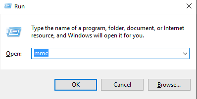
2. On the **User Account Control** prompt, click **YES** to launch MMC (Microsoft Management Console) as administrator.
3. From the **File** menu, click **Add/Remove Snap-in...**.

    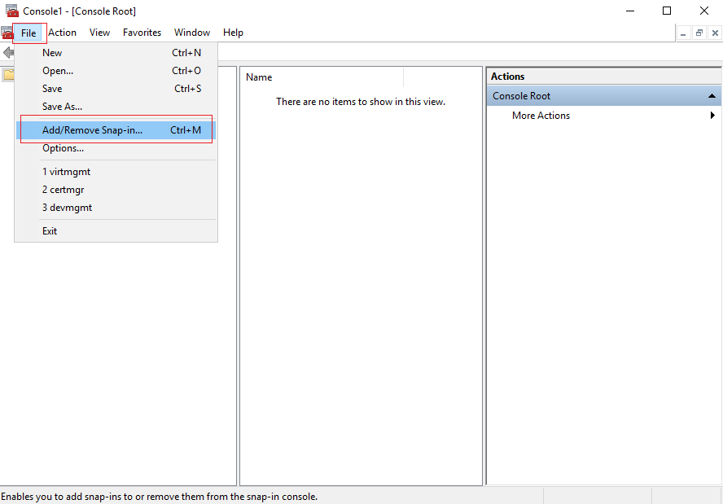
4. In the **Add or Remove Snap-ins** dialog, select the **Certificates** snap-in, and click the **Add >** button.

    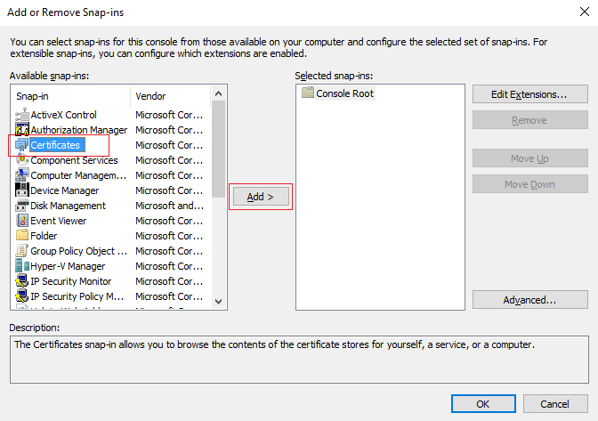
5. In the **Certificates snap-in** wizard, select **Computer account** and click **Next**.

    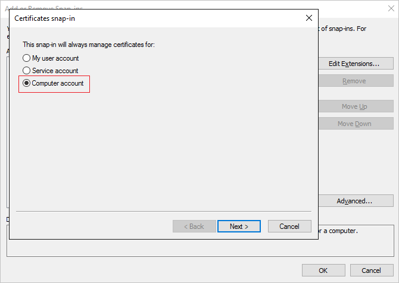
6. On the **Select Computer** page, select **Local computer: (the computer this console is running on)** and click **Finish**.

    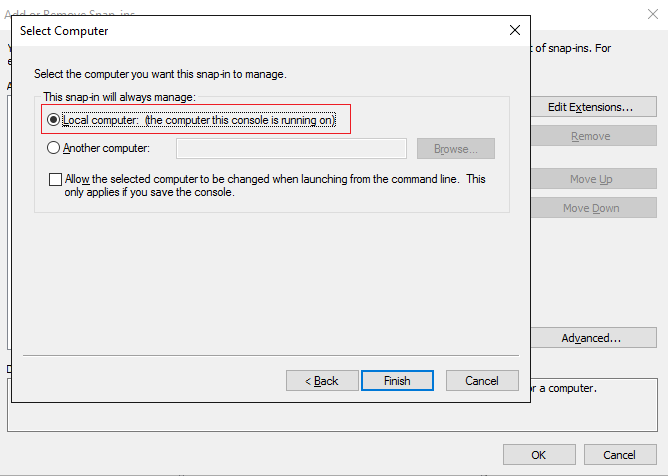
7. In the **Add or Remove Snap-ins** dialog, click **OK** to add the certificates snap-in to MMC.

    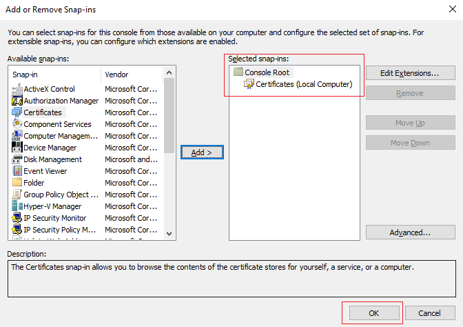
8. In the MMC window, click to expand **Console Root**. You should see the Certificates snap-in loaded. Click **Certificates (Local Computer)** to expand. Click to expand the **Personal** node, followed by the **Certificates** node.

    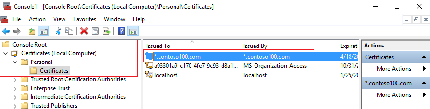
9. You should see the self-signed certificate we created. You can examine the properties of the certificate to verify the thumbprint matches that reported on the PowerShell windows when you created the certificate.
10. Select the self-signed certificate and **right click**. From the right-click menu, select **All Tasks** and select **Export...**.

    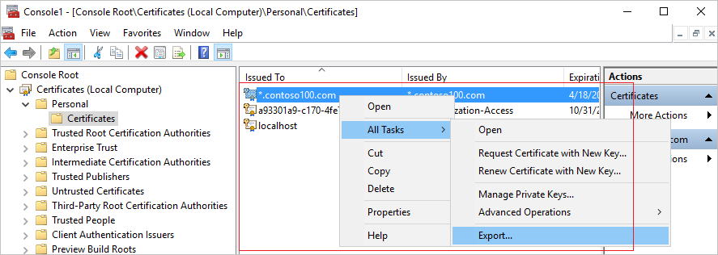
11. In the **Certificate Export Wizard**, click **Next**.

    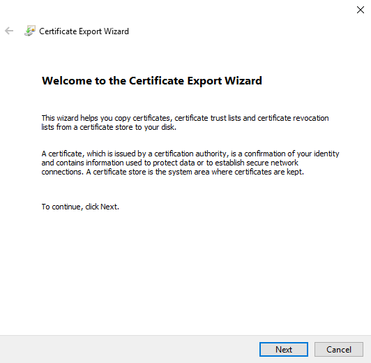
12. On the **Export Private Key** page, select **Yes, export the private key**, and click **Next**.

    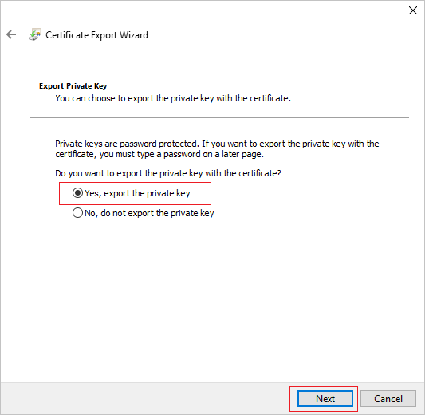

    > [!WARNING]
    > You MUST export the private key along with the certificate. If you provide a PFX that does not contain the private key for the certificate, enabling secure LDAP for your managed domain fails.
    >
    >

13. On the **Export File Format** page, select **Personal Information Exchange - PKCS #12 (.PFX)** as the file format for the exported certificate.

    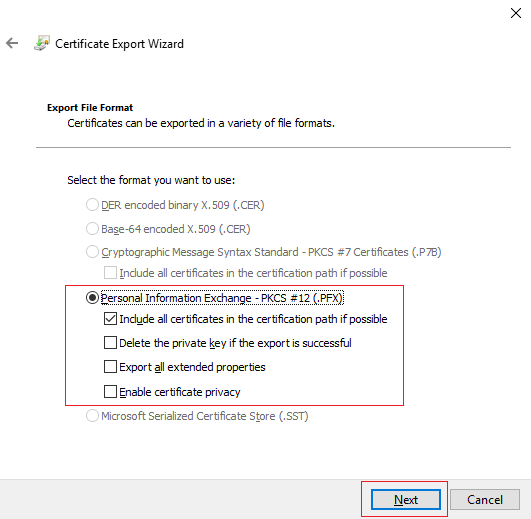

    > [!NOTE]
    > Only the .PFX file format is supported. Do not export the certificate to the .CER file format.
    >
    >

14. On the **Security** page, select the **Password** option and type in a password to protect the .PFX file. Remember this password since it will be needed in the next task. Click **Next**.

    

    > [!NOTE]
    > Make a note of this password. You need it while enabling secure LDAP for this managed domain in [Task 3 - enable secure LDAP for the managed domain](active-directory-ds-admin-guide-configure-secure-ldap-enable-ldaps.md)
    >
    >

15. On the **File to Export** page, specify the file name and location where you'd like to export the certificate.

    
16. On the following page, click **Finish** to export the certificate to a PFX file. You should see confirmation dialog when the certificate has been exported.

    

## Next step
[Task 3: enable secure LDAP for the managed domain](active-directory-ds-admin-guide-configure-secure-ldap-enable-ldaps.md)
