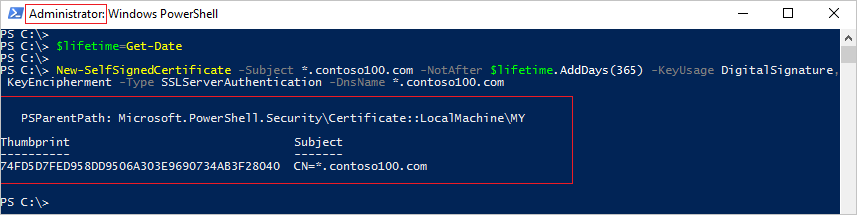
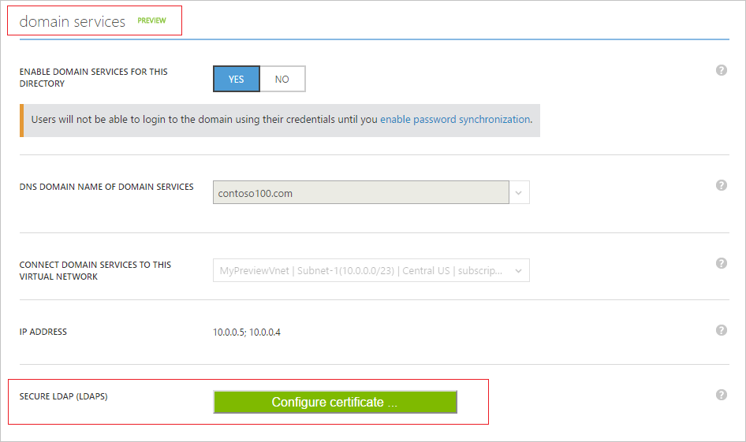
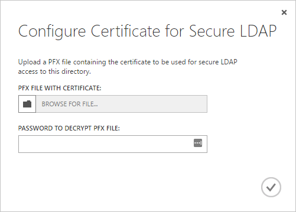
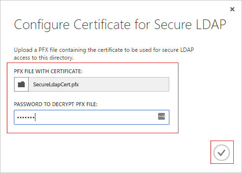
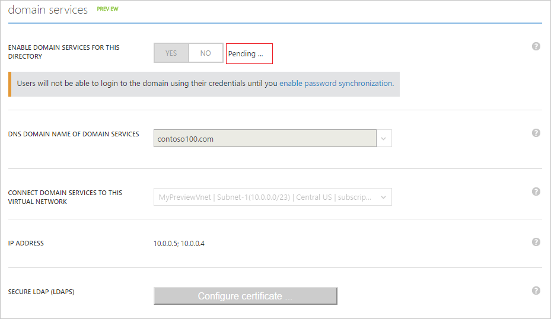
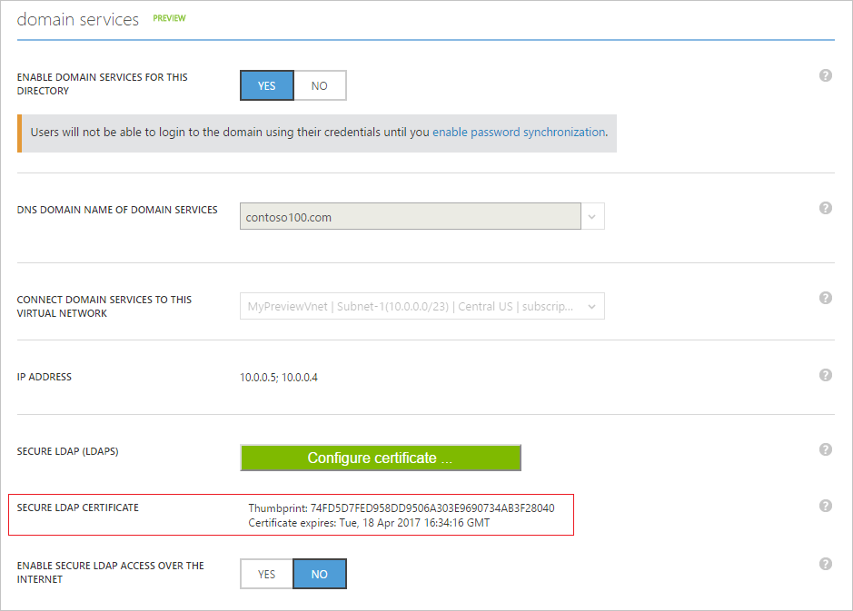
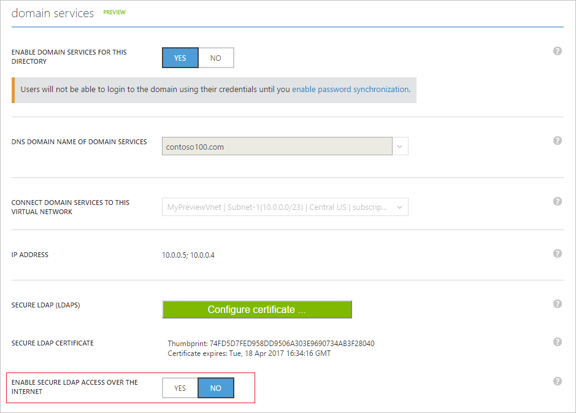
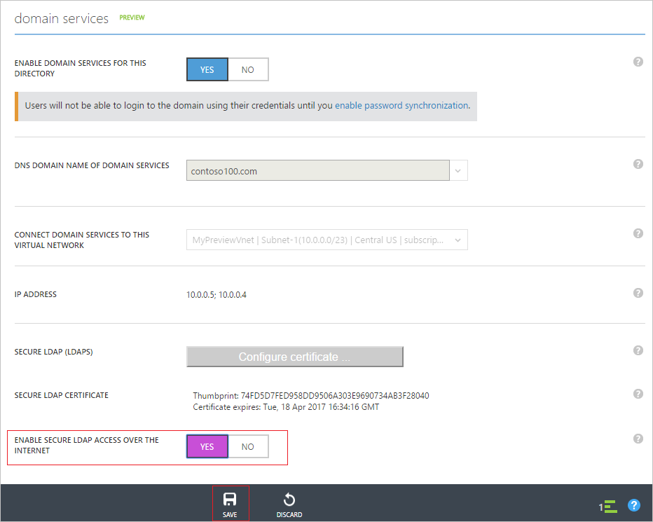
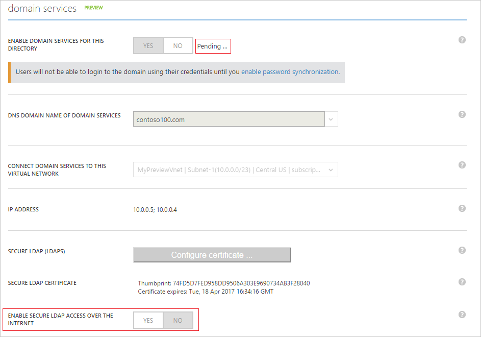
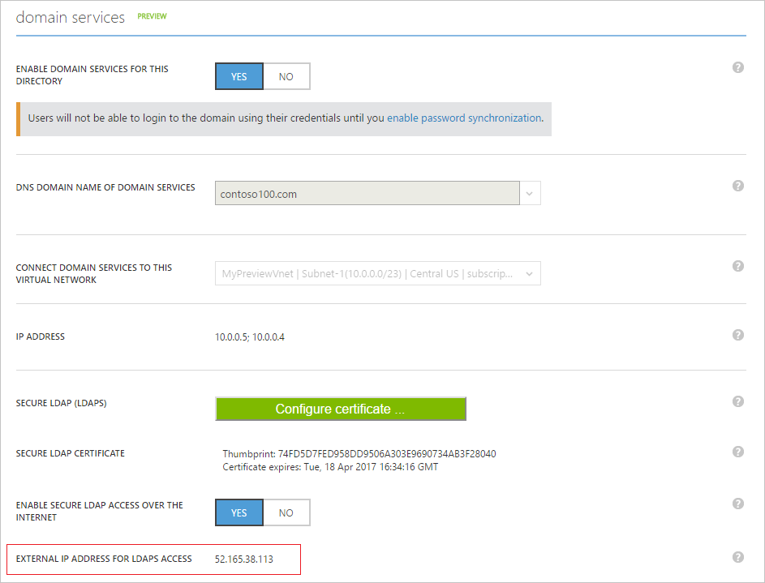

<properties
	pageTitle="Configure Secure LDAP (LDAPS) in Azure AD Domain Services | Microsoft Azure"
	description="Configure Secure LDAP (LDAPS) for an Azure AD Domain Services managed domain"
	services="active-directory-ds"
	documentationCenter=""
	authors="mahesh-unnikrishnan"
	manager="stevenpo"
	editor="curtand"/>

<tags
	ms.service="active-directory-ds"
	ms.workload="identity"
	ms.tgt_pltfrm="na"
	ms.devlang="na"
	ms.topic="article"
	ms.date="07/06/2016"
	ms.author="maheshu"/>

# Configure Secure LDAP (LDAPS) for an Azure AD Domain Services managed domain
This article shows how you can enable Secure Lightweight Directory Access Protocol (LDAPS) for your Azure AD Domain Services managed domain. Secure LDAP is also known as 'Lightweight Directory Access Protocol (LDAP) over Secure Sockets Layer (SSL) / Transport Layer Security (TLS)'.

## Before you begin
To perform the tasks listed in this article, you will need:

1. A valid **Azure subscription**.

2. An **Azure AD directory** - either synchronized with an on-premises directory or a cloud-only directory.

3. **Azure AD Domain Services** must be enabled for the Azure AD directory. If you haven't done so, follow all the tasks outlined in the [Getting Started guide](./active-directory-ds-getting-started.md).

4. A **certificate to be used to enable secure LDAP**.
    - **Recommended** - Obtain a certificate from your enterprise CA or public certification authority. This is a much more secure configuration option.
	- Alternately, you may also choose to [create a self-signed certificate](#task-1---obtain-a-certificate-for-secure-ldap) as shown later in this article.

 

### Requirements for the secure LDAP certificate
Acquire a valid certificate per the guidelines below, before you enable secure LDAP. You will encounter failures if you try to enable secure LDAP for your managed domain with an invalid/incorrect certificate.

1. **Trusted issuer** - The certificate must be issued by an authority trusted by computers that need to connect to the domain using secure LDAP. This may be your organization's enterprise certification authority or a public certification authority trusted by these computers.

2. **Lifetime** - The certificate must be valid for at least the next 3-6 months. This ensures that secure LDAP access to your managed domain is not broken when the certificate expires.

3. **Subject name** - The subject name on the certificate must be a wildcard for your managed domain. For instance, if your domain is named 'contoso100.com', the certificate's subject name must be '*.contoso100.com'. The DNS name (subject alternate name) must also be set to this wildcard name.

3. **Key usage** - The certificate must be configured for the following uses - Digital signatures and key encipherment.

4. **Certificate purpose** - The certificate must be valid for SSL server authentication.

 

## Task 1 - Obtain a certificate for secure LDAP
The first task involves obtaining a certificate you will use for secure LDAP access to the managed domain. You have two options:

- Obtain a certificate from a certification authority such as your organization's enterprise CA or from a public certification authority.

- Create a self-signed certificate.

### Option A (Recommended) - Obtain a secure LDAP certificate from a certification authority
If your organization deploys an enterprise public key infrastructure (PKI), you will need to obtain a certificate from the enterprise certification authority (CA) for your organization. If your organization obtains its certificates from a public certification authority, you will need to obtain the secure LDAP certificate from that public certification authority.

When requesting a certificate ensure that you follow the requirements outlined in [Requirement for the secure LDAP certificate](#requirements-for-the-secure-ldap-certificate).

Note that client computers that need to connect to the managed domain using secure LDAP must trust the issuer of the LDAPS certificate.

### Option B - Create a self-signed certificate for secure LDAP
You may choose to create a self-signed certificate for secure LDAP, if:

- certificates in your organization are not issued by an enterprise certification authority or
- you do not expect to use a certificate from a public certification authority.

**Create a self-signed certificate using PowerShell**

On your Windows computer, open a new PowerShell window as **Administrator** and type the following commands, in order to create a new self-signed certificate.

    $lifetime=Get-Date

    New-SelfSignedCertificate -Subject *.contoso100.com -NotAfter $lifetime.AddDays(365) -KeyUsage DigitalSignature, KeyEncipherment -Type SSLServerAuthentication -DnsName *.contoso100.com

In the sample above, replace 'contoso100.com' with the DNS domain name of your Azure AD Domain Services managed domain.

The newly created self-signed certificate will be placed in the local machine's certificate store.

## Task 2 - Export the secure LDAP certificate to a .PFX file
Before you start this task, ensure that you have obtained the secure LDAP certificate from your enterprise certification authority or a public certification authority or have created a self-signed certificate.

Perform the following steps, in order to export the LDAPS certificate to a .PFX file.

1. Press the **Start** button and type **R** to bring up the **Run** dialog. Type **mmc** and click **OK**.

    

2. On the **User Account Control** prompt, click **YES** to launch MMC (Microsoft Management Console) as administrator.

3. From the **File** menu, click on **Add/Remove Snap-in...**.

    

4. In the **Add or Remove Snap-ins** dialog, select the **Certificates** snap-in and click on the **Add >** button.

    

5. In the **Certificates snap-in** wizard, select **Computer account** and click **Next**.

    

6. On the **Select Computer** page, select **Local computer: (the computer this console is running on)** and click **Finish**.

    

7. In the **Add or Remove Snap-ins** dialog, click **OK** to add the certificates snap-in to MMC.

    

8. In the MMC window, click to expand **Console Root**. You should see the Certificates snap-in loaded. Click on **Certificates (Local Computer)** to expand. Click to expand the **Personal** node, followed by the **Certificates** node.

    

9. As illustrated above, you should see the self-signed certificate we just created. You can examine the properties of the certificate to ensure the thumbprint matches that reported on the PowerShell windows when you created the certificate.

10. Select the self-signed certificate and **right click**. From the right-click menu, select **All Tasks** and select **Export...**.

    

11. In the **Certificate Export Wizard**, click **Next**.

    

12. On the **Export Private Key** page, select **Yes, export the private key** and click **Next**.

    

    > [AZURE.WARNING] You MUST export the private key along with the certificate. Enabling secure LDAP for your managed domain will fail if you provide a PFX that does not contain the private key for the certificate.

13. On the **Export File Format** page, select **Personal Information Exchange - PKCS #12 (.PFX)** as the file format for the exported certificate.

    

	> [AZURE.NOTE] Only the .PFX file format is supported. Do not export the certificate to the .CER file format.

14. On the **Security** page, select the **Password** option and type in a password to protect the .PFX file. Remember this password since it will be needed in the next task. Click **Next** to proceed.

    

	> [AZURE.NOTE] Make a note of this password. You will need it while enabling secure LDAP for this managed domain in [Task 3 - Enable secure LDAP for the managed domain](#task-3---enable-secure-ldap-for-the-managed-domain)

15. On the **File to Export** page, specify the file name and location where you'd like to export the certificate.

    

16. On the following page, click **Finish** to export the certificate to a PFX file. You should see confirmation dialog when the certificate has been exported.

    

## Task 3 - Enable secure LDAP for the managed domain
Perform the following configuration steps in order to enable secure LDAP.

1. Navigate to the **[Azure classic portal](https://manage.windowsazure.com)**.

2. Select the **Active Directory** node on the left pane.

3. Select the Azure AD directory (also referred to as 'tenant'), for which you have enabled Azure AD Domain Services.

    

4. Click on the **Configure** tab.

    

5. Scroll down to the section titled **domain services**. You should see an option titled **Secure LDAP (LDAPS)** as shown in the screenshot below.

    

6. Click the **Configure certificate ...** button to bring up the **Configure Certificate for Secure LDAP** dialog.

    

7. Click the folder icon below **PFX FILE WITH CERTIFICATE** to specify the PFX file which contains the certificate you wish to use for secure LDAP access to the managed domain. Also enter the password you specified when exporting the certificate to the PFX file. When you are done, click the done button on the bottom.

    

8. The **domain services** section of the **Configure** tab should get grayed out and will be in the **Pending...** state for a few minutes. During this period, the LDAPS certificate is verified for accuracy and secure LDAP is configured for your managed domain.

    

    > [AZURE.NOTE] It will take about 10 to 15 minutes to enable secure LDAP for your managed domain. If the provided secure LDAP certificate does not match the required criteria (eg. the domain name is incorrect, the certificate is expired or expires very soon etc.), secure LDAP will not be enabled for your directory and you will see a failure.

9. When secure LDAP is successfully enabled for your managed domain, the **Pending...** message should disappear. You should see the thumbprint of the certificate displayed.

    

 

## Task 4 - Enable secure LDAP access over the internet
**Optional task** - skip this task if you do not plan to access the managed domain using LDAPS over the internet.

Before you begin this task, ensure you have completed the steps outlined in [Task 3](#task-3---enable-secure-ldap-for-the-managed-domain).

1. You should see an option to **ENABLE SECURE LDAP ACCESS OVER THE INTERNET** in the **domain services** section of the **Configure** page. This will be set to **NO** by default since internet access to the managed domain over secure LDAP is disabled by default.

    

2. Toggle **ENABLE SECURE LDAP ACCESS OVER THE INTERNET** to **YES**. Click the **SAVE** button on the bottom panel.
    

3. The **domain services** section of the **Configure** tab should get grayed out and will be in the **Pending...** state for a few minutes. During this period, internet access to your managed domain over secure LDAP will be enabled.

    

    > [AZURE.NOTE] It will take about 10 minutes to enable internet access over secure LDAP for your managed domain.

4. When secure LDAP access to your managed domain over the internet is successfully enabled, the **Pending...** message should disappear. You should see the external IP address that can be used to access your directory over LDAPS in the field **EXTERNAL IP ADDRESS FOR LDAPS ACCESS**.

    

 

## Task 5 - Configure DNS to access the managed domain from the internet
**Optional task** - skip this task if you do not plan to access the managed domain using LDAPS over the internet.

Before you begin this task, ensure you have completed the steps outlined in [Task 4](#task-4---enable-secure-ldap-access-over-the-internet).

Once you have enabled secure LDAP access over the internet for your managed domain, you need to update DNS so that client computers can find this managed domain. At the end of task 4, an external IP address is displayed on the **Configure** tab in **EXTERNAL IP ADDRESS FOR LDAPS ACCESS**.

Configure your external DNS provider so that the DNS name of the managed domain (eg. 'contoso100.com') points to this external IP address. In our example, we will need to create the following DNS entry:

    contoso100.com  -> 52.165.38.113

That's it - you are now ready to connect to the managed domain using secure LDAP over the internet.

> [AZURE.WARNING] Remember that client computers must trust the issuer of the LDAPS certificate in order to be able to connect successfully to the managed domain using LDAPS. If you are using an enterprise certification authority or a publicly trusted certification authority, this is not a problem since client computers will trust these certificate issuers. If you are using a self-signed certificate, you will need to install the public part of the self-signed certificate (i.e. exported without the private key) into the trusted certificate store on the client computer.

 

## Related Content

- [Administer an Azure AD Domain Services managed domain](active-directory-ds-admin-guide-administer-domain.md)
