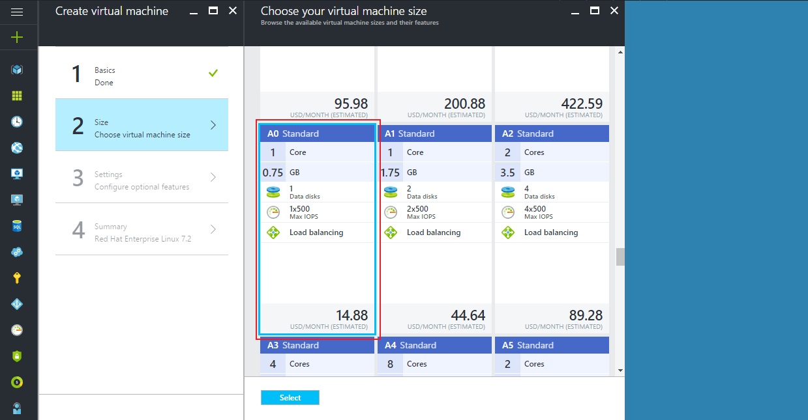

# Join a Red Hat Enterprise Linux 7 virtual machine to a managed domain
This article shows you how to join a Red Hat Enterprise Linux (RHEL) 7 virtual machine to an Azure AD Domain Services managed domain.

## Provision a Red Hat Enterprise Linux virtual machine
Perform the following steps to provision a RHEL 7 virtual machine using the Azure portal.

1. Sign in to the [Azure portal](https://portal.azure.com).

    
2. Click **New** on the left pane and type **Red Hat** into the search bar as shown in the following screenshot. Entries for Red Hat Enterprise Linux appear in the search results. Click **Red Hat Enterprise Linux 7.2**.

    
3. The search results in the **Everything** pane should list the Red Hat Enterprise Linux 7.2 image. Click **Red Hat Enterprise Linux 7.2** to view more information about the virtual machine image.

    
4. In the **Red Hat Enterprise Linux 7.2** pane, you should see more information about the virtual machine image. In the **Select a deployment model** dropdown, select **Classic**. Then click the **Create** button.

    
5. In the **Basics** page of the **Create virtual machine** wizard, enter the **Host Name** for the new virtual machine. Also specify a local administrator user name in the **User name** field and a **Password**. You may also choose to use an SSH key to authenticate the local administrator user. Also select a **Pricing Tier** for the virtual machine.

    
6. In the **Size** page of the **Create virtual machine** wizard, select the size for the virtual machine.

    

7. In the **Settings** page of the **Create virtual machine** wizard, select the storage account for the virtual machine. Click **Virtual Network** to select the virtual network to which the Linux VM should be deployed. In the **Virtual Network** blade, select the virtual network in which Azure AD Domain Services is available. In this example, we pick the 'MyPreviewVNet' virtual network.

    
8. On the **Summary** page of the **Create virtual machine** wizard, review and click the **OK** button.

    
9. Deployment of the new virtual machine based on the RHEL 7.2 image should start.

    
10. After a few minutes, the virtual machine should be deployed successfully and ready for use.

    

## Connect remotely to the newly provisioned Linux virtual machine
The RHEL 7.2 virtual machine has been provisioned in Azure. The next task is to connect remotely to the virtual machine.

**Connect to the RHEL 7.2 virtual machine**
Follow the instructions in the article [How to log on to a virtual machine running Linux](../virtual-machines/linux/mac-create-ssh-keys.md?toc=%2fazure%2fvirtual-machines%2flinux%2ftoc.json).

The rest of the steps assume you use the PuTTY SSH client to connect to the RHEL virtual machine. For more information, see the [PuTTY Download page](http://www.chiark.greenend.org.uk/~sgtatham/putty/download.html).

1. Open the PuTTY program.
2. Enter the **Host Name** for the newly created RHEL virtual machine. In this example, our virtual machine has the host name 'contoso-rhel.cloudapp.net'. If you are not sure of the host name of your VM, refer to the VM dashboard on the Azure portal.

    
3. Log on to the virtual machine using the local administrator credentials you specified when the virtual machine was created. In this example, we used the local administrator account "mahesh".

    

## Install required packages on the Linux virtual machine
After connecting to the virtual machine, the next task is to install packages required for domain join on the virtual machine. Perform the following steps:

1. **Install realmd:** The realmd package is used for domain join. In your PuTTY terminal, type the following command:

    sudo yum install realmd

    

    After a few minutes, the realmd package should get installed on the virtual machine.

    
2. **Install sssd:** The realmd package depends on sssd to perform domain join operations. In your PuTTY terminal, type the following command:

    sudo yum install sssd

    

    After a few minutes, the sssd package should get installed on the virtual machine.

    
3. **Install kerberos:** In your PuTTY terminal, type the following command:

    sudo yum install krb5-workstation krb5-libs

    

    After a few minutes, the realmd package should get installed on the virtual machine.

    

## Join the Linux virtual machine to the managed domain
Now that the required packages are installed on the Linux virtual machine, the next task is to join the virtual machine to the managed domain.

1. Discover the AAD Domain Services managed domain. In your PuTTY terminal, type the following command:

    sudo realm discover CONTOSO100.COM

    

    If **realm discover** is unable to find your managed domain, ensure that the domain is reachable from the virtual machine (try ping). Also ensure that the virtual machine has indeed been deployed to the same virtual network in which the managed domain is available.
2. Initialize kerberos. In your PuTTY terminal, type the following command. Ensure that you specify a user who belongs to the 'AAD DC Administrators' group. Only these users can join computers to the managed domain.

    kinit bob@CONTOSO100.COM

    

    Ensure that you specify the domain name in capital letters, else kinit fails.
3. Join the machine to the domain. In your PuTTY terminal, type the following command. Specify the same user you specified in the preceding step ('kinit').

    sudo realm join --verbose CONTOSO100.COM -U 'bob@CONTOSO100.COM'

    

You should get a message ("Successfully enrolled machine in realm") when the machine is successfully joined to the managed domain.

## Verify domain join
You can quickly verify whether the machine has been successfully joined to the managed domain. Connect to the newly domain joined RHEL VM using SSH and a domain user account and then check to see if the user account is resolved correctly.

1. In your PuTTY terminal, type the following command to connect to the newly domain joined RHEL virtual machine using SSH. Use a domain account that belongs to the managed domain (for example, 'bob@CONTOSO100.COM' in this case.)

    ssh -l bob@CONTOSO100.COM contoso-rhel.cloudapp.net
2. In your PuTTY terminal, type the following command to see if the home directory was initialized correctly.

    pwd
3. In your PuTTY terminal, type the following command to see if the group memberships are being resolved correctly.

    id

A sample output of these commands follows:

## Troubleshooting domain join
Refer to the [Troubleshooting domain join](active-directory-ds-admin-guide-join-windows-vm.md#troubleshooting-domain-join) article.

## Related Content
* [Azure AD Domain Services - Getting Started guide](active-directory-ds-getting-started.md)
* [Join a Windows Server virtual machine to an Azure AD Domain Services managed domain](active-directory-ds-admin-guide-join-windows-vm.md)
* [How to log on to a virtual machine running Linux](../virtual-machines/linux/mac-create-ssh-keys.md?toc=%2fazure%2fvirtual-machines%2flinux%2ftoc.json).
* [Installing Kerberos](https://access.redhat.com/documentation/en-US/Red_Hat_Enterprise_Linux/6/html/Managing_Smart_Cards/installing-kerberos.html)
* [Red Hat Enterprise Linux 7 - Windows Integration Guide](https://access.redhat.com/documentation/en-US/Red_Hat_Enterprise_Linux/7/html/Windows_Integration_Guide/index.html)
