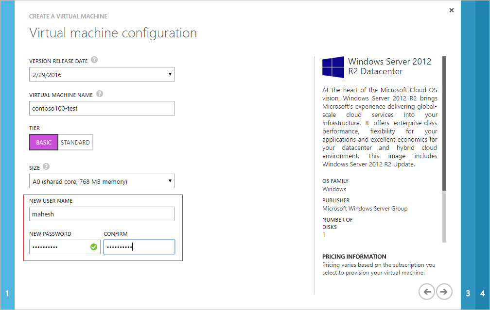
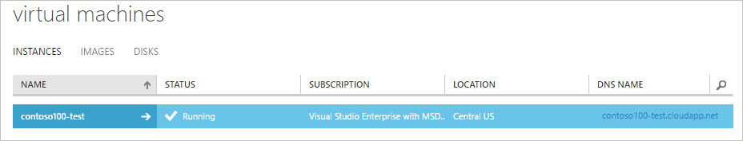

# Join a Windows Server virtual machine to a managed domain
> [!div class="op_single_selector"]
> * [Azure classic portal - Windows](active-directory-ds-admin-guide-join-windows-vm.md)
> * [PowerShell - Windows](active-directory-ds-admin-guide-join-windows-vm-classic-powershell.md)
>
>

 

This article shows you how to join a virtual machine running Windows Server 2012 R2 to an Azure AD Domain Services managed domain, using the Azure classic portal.

## Step 1: Create the Windows Server virtual machine
Follow the instructions outlined in the [Create a virtual machine running Windows in the Azure classic portal](../virtual-machines/windows/classic/tutorial.md?toc=%2fazure%2fvirtual-machines%2fwindows%2fclassic%2ftoc.json) tutorial. It is important to ensure that this newly created virtual machine is joined to the same virtual network in which you enabled Azure AD Domain Services. The 'Quick Create' option does not enable you to join the virtual machine to a virtual network. Therefore, you need to use the 'From Gallery' option to create the virtual machine.

Perform the following steps to create a Windows virtual machine joined to the virtual network in which you've enabled Azure AD Domain Services.

1. In the Azure classic portal, on the command bar at the bottom of the window, click **New**.
2. Under **Compute**, click **Virtual Machine**, then click **From Gallery**.
3. The first screen lets you **Choose an Image** for your virtual machine from the list of available images. Pick the appropriate image.

    
4. The second screen lets you pick a computer name, size, and administrative user name and password. Use the tier and size required to run your app or workload. The user name you pick here is a local administrator user on the machine. Do not enter a domain user account's credentials here.

    
5. The third screen lets you configure resources for networking, storage, and availability. Ensure you select the virtual network in which you enabled Azure AD Domain Services from the **Region/Affinity Group/Virtual Network** dropdown. Specify a **Cloud Service DNS Name** as appropriate for the virtual machine.

    

   > [!WARNING]
   > Ensure that you join the virtual machine to the same virtual network in which you've enabled Azure AD Domain Services. As a result, the virtual machine can 'see' the domain and perform tasks such as joining the domain. If you choose to create the virtual machine in a different virtual network, connect that virtual network to the virtual network in which you've enabled Azure AD Domain Services.
   >
   >
6. The fourth screen lets you install the VM Agent and configure some of the available extensions.

    
7. After the virtual machine is created, the classic portal lists the new virtual machine under the **Virtual Machines** node. Both the virtual machine and cloud service are started automatically and their status is listed as **Running**.

    

## Step 2: Connect to the Windows Server virtual machine using the local administrator account
Now, we connect to the newly created Windows Server virtual machine, to join it to the domain. Use the local administrator credentials you specified when creating the virtual machine, to connect to it.

Perform the following steps to connect to the virtual machine.

1. Navigate to **Virtual Machines** node in the classic portal. Select the virtual machine you created in Step 1 and click **Connect** on the command bar at the bottom of the window.

    
2. The classic portal prompts you to open or save a file with a '.rdp' extension, which is used to connect to the virtual machine. Click to open the file when it has finished downloading.
3. At the login prompt, enter your **local administrator credentials**, which you specified while creating the virtual machine. For example, we've used 'localhost\mahesh' in this example.

At this point, you should be logged in to the newly created Windows virtual machine using local Administrator credentials. The next step is to join the virtual machine to the domain.

## Step 3: Join the Windows Server virtual machine to the AAD-DS managed domain
Perform the following steps to join the Windows Server virtual machine to the AAD-DS managed domain.

1. Connect to the Windows Server as shown in Step 2. From the Start screen, open **Server Manager**.
2. Click **Local Server** in the left pane of the Server Manager window.

    
3. Click **WORKGROUP** under the **PROPERTIES** section. In the **System Properties** property page, click **Change** to join the domain.

    
4. Specify the domain name of your Azure AD Domain Services managed domain in the **Domain** textbox and click **OK**.

    
5. You are prompted to enter your credentials to join the domain. Ensure that you **specify the credentials for a user belonging to the AAD DC Administrators** group. Only members of this group have privileges to join machines to the managed domain.

    
6. You can specify credentials in either of the following ways:

   * UPN format: Specify the UPN suffix for the user account, as configured in Azure AD. In this example, the UPN suffix of the user 'bob' is 'bob@domainservicespreview.onmicrosoft.com'.
   * SAMAccountName format: You can specify the account name in the SAMAccountName format. In this example, the user 'bob' would need to enter 'CONTOSO100\bob'.

     > [!NOTE]
     > **We recommend using the UPN format to specify credentials.** The SAMAccountName may be auto-generated if a user's UPN prefix is overly long (for example, 'joereallylongnameuser'). If multiple users have the same UPN prefix (for example, 'bob') in your Azure AD tenant, their SAMAccountName format may be auto-generated by the service. In these cases, the UPN format can be used reliably to log in to the domain.
     >
     >
7. After domain join is successful, you see the following message welcoming you to the domain. Restart the virtual machine for the domain join operation to complete.

    

## Troubleshooting domain join
### Connectivity issues
If the virtual machine is unable to find the domain, refer to the following troubleshooting steps:

* Ensure that the virtual machine is connected to the same virtual network as that you've enabled Domain Services in. If not, the virtual machine is unable to connect to the domain and therefore is unable to join the domain.
* If the virtual machine is connected to another virtual network, ensure that this virtual network is connected to the virtual network in which you've enabled Domain Services.
* Try to ping the domain using the domain name of the managed domain (for example, 'ping contoso100.com'). If you're unable to do so, try to ping the IP addresses for the domain displayed on the page where you enabled Azure AD Domain Services (for example, 'ping 10.0.0.4'). If you're able to ping the IP address but not the domain, DNS may be incorrectly configured. You may not have configured the IP addresses of the domain as DNS servers for the virtual network.
* Try flushing the DNS resolver cache on the virtual machine ('ipconfig /flushdns').

If you get to the dialog box that asks for credentials to join the domain, you do not have connectivity issues.

### Credentials-related issues
Refer to the following steps if you're having trouble with credentials and are unable to join the domain.

* Try using the UPN format to specify credentials. The SAMAccountName for your account may be auto-generated if there are multiple users with the same UPN prefix in your tenant or if your UPN prefix is overly long. Therefore, the SAMAccountName format for your account may be different from what you expect or use in your on-premises domain.
* Try to use the credentials of a user account that belongs to the 'AAD DC Administrators' group to join machines to the managed domain.
* Ensure that you have [enabled password synchronization](active-directory-ds-getting-started-password-sync.md) in accordance with the steps outlined in the Getting Started guide.
* Ensure that you use the UPN of the user as configured in Azure AD (for example, 'bob@domainservicespreview.onmicrosoft.com') to sign in.
* Ensure that you have waited long enough for password synchronization to complete as specified in the Getting Started guide.

## Related Content
* [Azure AD Domain Services - Getting Started guide](active-directory-ds-getting-started.md)
* [Administer an Azure AD Domain Services managed domain](active-directory-ds-admin-guide-administer-domain.md)
