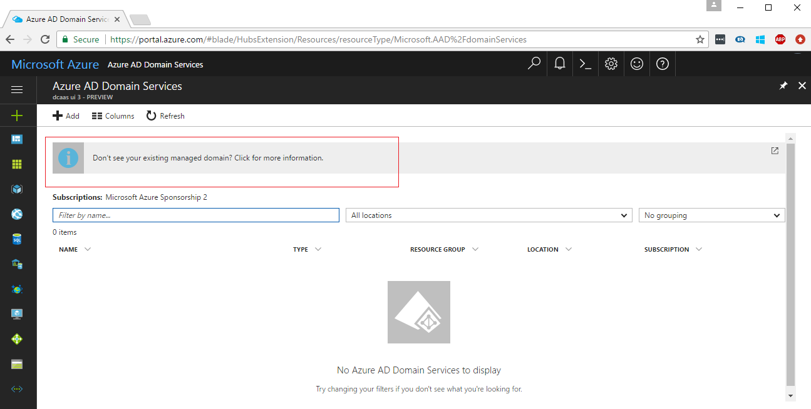

# Enable the preview experience to administer your managed domain from the Azure portal

## Your existing managed domain is not shown in the Azure portal (preview) experience
You have an existing [Azure AD Domain Services](active-directory-ds-overview.md) managed domain that was created using the Azure classic portal. When you navigate to the Azure portal, the Azure AD Domain Services blade (preview) does not list this existing managed domain.

This is because your existing managed domain has not been migrated over to the new Azure portal. You can contact us to enable the new Azure portal (preview) experience for your existing managed domain.

## Join the preview for the Azure portal experience for Azure AD Domain Services
Follow the instructions on the [contact us](active-directory-ds-contact-us.md) page and email us. We are delighted to enable the Azure portal preview for your existing managed domain.

> [!NOTE]
> When the new Azure portal experience for Azure AD Domain Services is generally available (GA), all existing managed domains will automatically be migrated. At that point, you will be able to manage your existing managed domain from the Azure portal.
>
>

## Related content
* [Contact us](active-directory-ds-contact-us.md)
