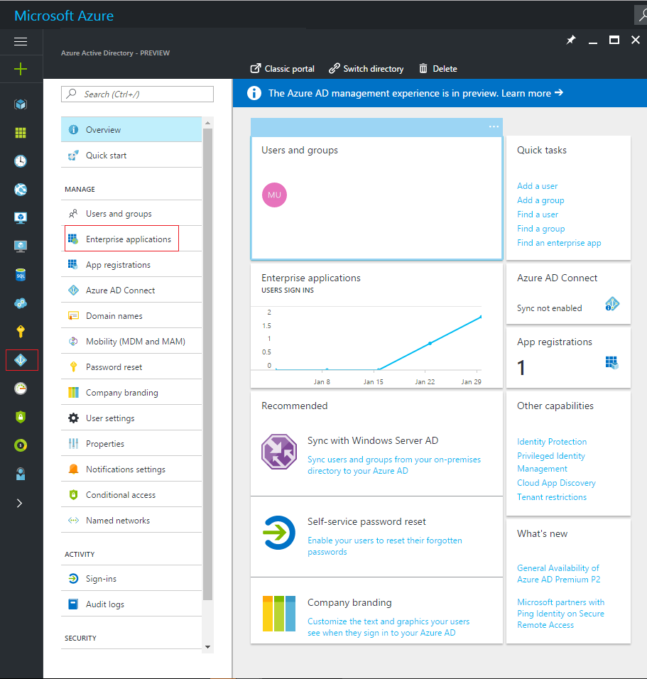
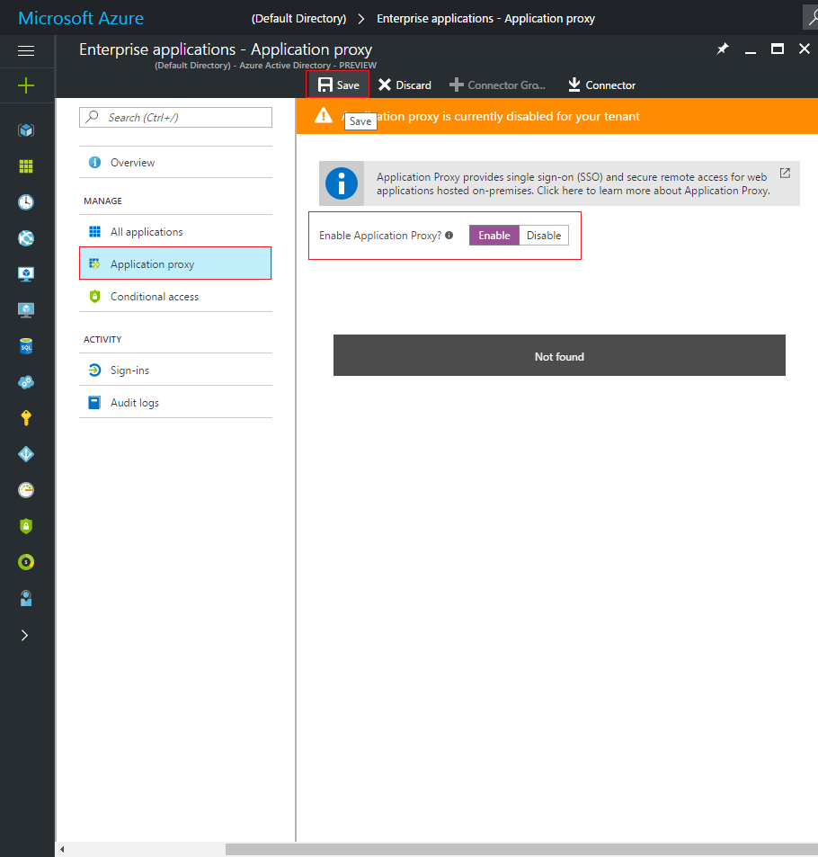
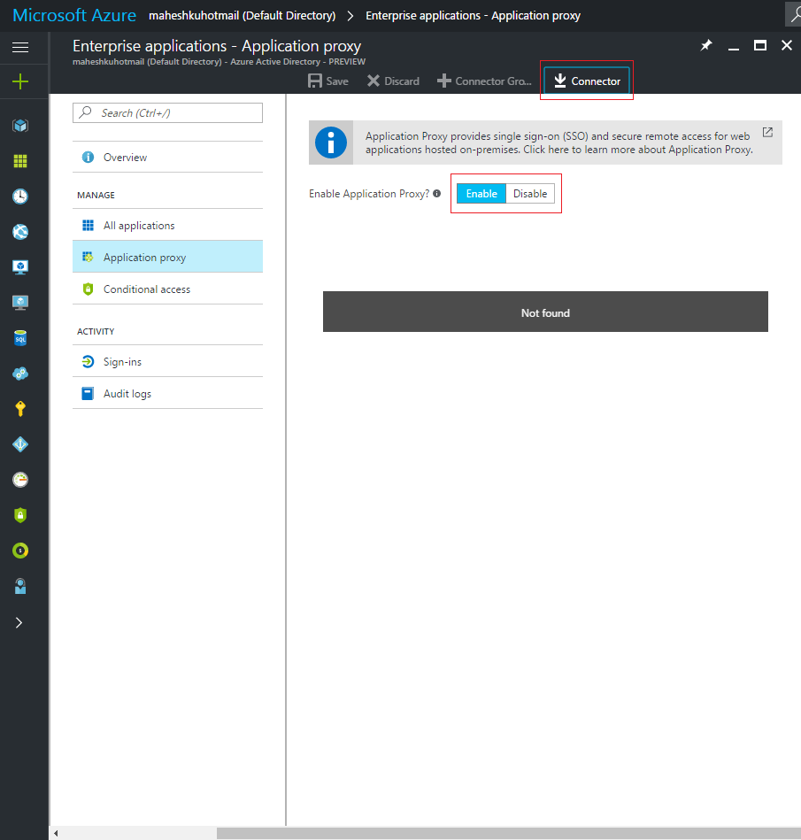
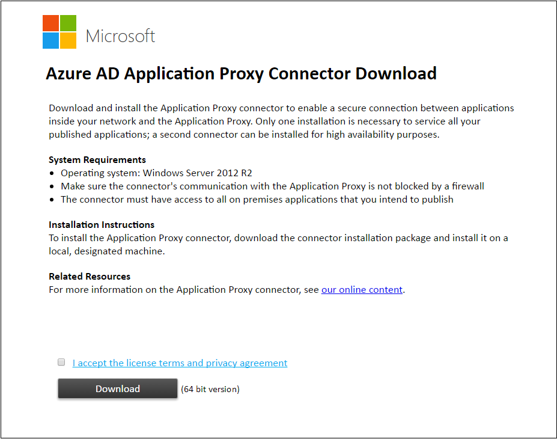
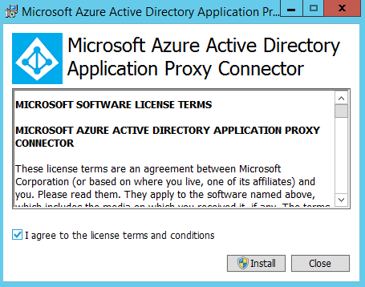
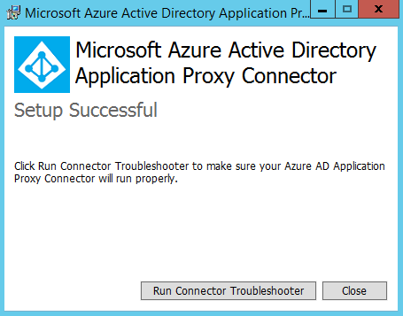
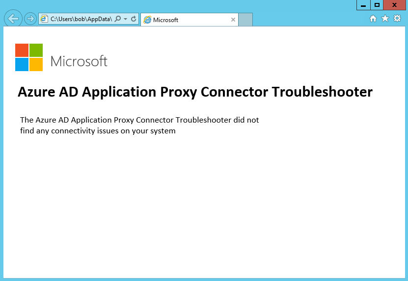
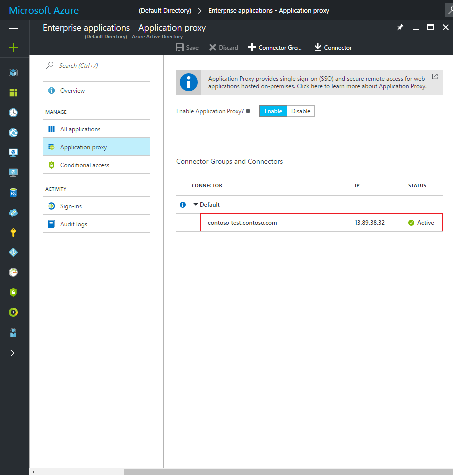

# Deploy Azure AD Application Proxy on an Azure AD Domain Services managed domain
Azure Active Directory (AD) Application Proxy helps you support remote workers by publishing on-premises applications to be accessed over the internet. With Azure AD Domain Services, you can now lift-and-shift legacy applications running on-premises to Azure Infrastructure Services. You can then publish these applications using the Azure AD Application Proxy, to provide secure remote access to users in your organization.

If you're new to the Azure AD Application Proxy, learn more about this feature with the following article:
[How to provide secure remote access to on-premises applications](../active-directory/manage-apps/application-proxy.md).

[!INCLUDE [active-directory-ds-prerequisites.md](../../includes/active-directory-ds-prerequisites.md)]

## Before you begin
To perform the tasks listed in this article, you need:

1. A valid **Azure subscription**.
2. An **Azure AD directory** - either synchronized with an on-premises directory or a cloud-only directory.
3. An **Azure AD Basic or Premium license** is required to use the Azure AD Application Proxy.
4. **Azure AD Domain Services** must be enabled for the Azure AD directory. If you haven't done so, follow all the tasks outlined in the [Getting Started guide](active-directory-ds-getting-started.md).

<br>

## Task 1 - Enable Azure AD Application Proxy for your Azure AD directory
Perform the following steps to enable the Azure AD Application Proxy for your Azure AD directory.

1. Sign in as an administrator in the [Azure portal](http://portal.azure.com).

2. Click **Azure Active Directory** to bring up the directory overview. Click **Enterprise applications**.

    
3. Click **Application proxy**. If you do not have an Azure AD Basic or Azure AD Premium subscription, you see an option to enable a trial. Toggle **Enable Application Proxy?** to **Enable** and click **Save**.

    
4. To download the connector, click the **Connector** button.

    
5. On the download page, accept the license terms and privacy agreement and click the **Download** button.

    


## Task 2 - Provision domain-joined Windows servers to deploy the Azure AD Application Proxy connector
You need domain-joined Windows Server virtual machines on which you can install the Azure AD Application Proxy connector. For some applications, you may choose to provision multiple servers on which the connector is installed. This deployment option gives you greater availability and helps handle heavier authentication loads.

Provision the connector servers on the same virtual network (or a connected/peered virtual network), in which you have enabled your Azure AD Domain Services managed domain. Similarly, the servers hosting the applications you publish via the Application Proxy need to be installed on the same Azure virtual network.

To provision connector servers, follow the tasks outlined in the article titled [Join a Windows virtual machine to a managed domain](active-directory-ds-admin-guide-join-windows-vm.md).


## Task 3 - Install and register the Azure AD Application Proxy Connector
Previously, you provisioned a Windows Server virtual machine and joined it to the managed domain. In this task, you install the Azure AD Application Proxy connector on this virtual machine.

1. Copy the connector installation package to the VM on which you install the Azure AD Web Application Proxy connector.

2. Run **AADApplicationProxyConnectorInstaller.exe** on the virtual machine. Accept the software license terms.

    
3. During installation, you are prompted to register the connector with the Application Proxy of your Azure AD directory.
    * Provide your **Azure AD global administrator credentials**. Your global administrator tenant may be different from your Microsoft Azure credentials.
    * The administrator account used to register the connector must belong to the same directory where you enabled the Application Proxy service. For example, if the tenant domain is contoso.com, the admin should be admin@contoso.com or any other valid alias on that domain.
    * If IE Enhanced Security Configuration is turned on for the server where you are installing the connector, the registration screen might be blocked. To allow access, follow the instructions in the error message. Make sure that Internet Explorer Enhanced Security is off.
    * If connector registration does not succeed, see [Troubleshoot Application Proxy](../active-directory/manage-apps/application-proxy-troubleshoot.md).

    
4. To ensure the connector works properly, run the Azure AD Application Proxy Connector Troubleshooter. You should see a successful report after running the troubleshooter.

    
5. You should see the newly installed connector listed on the Application proxy page in your Azure AD directory.

    

> [!NOTE]
> You may choose to install connectors on multiple servers to guarantee high availability for authenticating applications published through the Azure AD Application Proxy. Perform the same steps listed above to install the connector on other servers joined to your managed domain.
>
>

## Next Steps
You have set up the Azure AD Application Proxy and integrated it with your Azure AD Domain Services managed domain.

* **Migrate your applications to Azure virtual machines:** You can lift-and-shift your applications from on-premises servers to Azure virtual machines joined to your managed domain. Doing so helps you get rid of the infrastructure costs of running servers on-premises.

* **Publish applications using Azure AD Application Proxy:** Publish applications running on your Azure virtual machines using the Azure AD Application Proxy. For more information, see [publish applications using Azure AD Application Proxy](../active-directory/manage-apps/application-proxy-publish-azure-portal.md)


## Deployment note - Publish IWA (Integrated Windows Authentication) applications using Azure AD Application Proxy
Enable single sign-on to your applications using Integrated Windows Authentication (IWA) by granting Application Proxy Connectors permission to impersonate users, and send and receive tokens on their behalf. Configure Kerberos constrained delegation (KCD) for the connector to grant the required permissions to access resources on the managed domain. Use the resource-based KCD mechanism on managed domains for increased security.


### Enable resource-based Kerberos constrained delegation for the Azure AD Application Proxy connector
The Azure Application Proxy connector should be configured for Kerberos constrained delegation (KCD), so it can impersonate users on the managed domain. On an Azure AD Domain Services managed domain, you do not have domain administrator privileges. Therefore, **traditional account-level KCD cannot be configured on a managed domain**.

Use resource-based KCD as described in this [article](active-directory-ds-enable-kcd.md).

> [!NOTE]
> You need to be a member of the 'AAD DC Administrators' group, to administer the managed domain using AD PowerShell cmdlets.
>
>

Use the Get-ADComputer PowerShell cmdlet to retrieve the settings for the computer on which the Azure AD Application Proxy connector is installed.
```powershell
$ConnectorComputerAccount = Get-ADComputer -Identity contoso100-proxy.contoso100.com
```

Thereafter, use the Set-ADComputer cmdlet to set up resource-based KCD for the resource server.
```powershell
Set-ADComputer contoso100-resource.contoso100.com -PrincipalsAllowedToDelegateToAccount $ConnectorComputerAccount
```

If you have deployed multiple Application Proxy connectors on your managed domain, you need to configure resource-based KCD for each such connector instance.


## Related Content
* [Azure AD Domain Services - Getting Started guide](active-directory-ds-getting-started.md)
* [Configure Kerberos Constrained Delegation on a managed domain](active-directory-ds-enable-kcd.md)
* [Kerberos Constrained Delegation Overview](https://technet.microsoft.com/library/jj553400.aspx)
