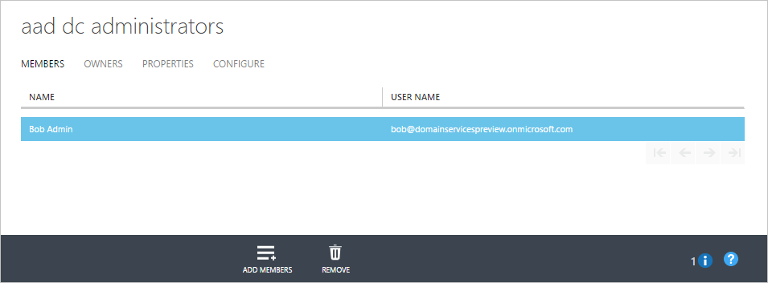

# Enable Azure Active Directory Domain Services using the Azure classic portal
This article describes and walks through the configuration tasks that are required for you to enable Azure Active Directory Domain Services (Azure AD DS) for your Azure Active Directory (Azure AD) tenant.

## Task 1: create the Azure AD DC administrators group
The first task is to create an administrative group in your Azure AD tenant. This special administrative group is called *AAD DC Administrators*. Members of this group are granted administrative permissions on machines that are domain-joined to the Azure Active Directory Domain Services-managed domain. On domain-joined machines, this group is added to the administrators group. Additionally, members of this group can use Remote Desktop to connect remotely to domain-joined machines.  

> [!NOTE]
> You do not have Domain Administrator or Enterprise Administrator permissions on the managed domain that you created by using Azure Active Directory Domain Services. On managed domains, these permissions are reserved by the service and are not made available to users within the tenant. However, you can use the special administrative group created in this configuration task to perform some privileged operations. These operations include joining computers to the domain, belonging to the administration group on domain-joined machines, and configuring Group Policy.
>

In this configuration task, you create the administrative group and add one or more users in your directory to the group. To create the administrative group for Azure Active Directory Domain Services, do the following:

1. Go to the [Azure classic portal](https://manage.windowsazure.com).
2. In the left pane, select the **Active Directory** button.
3. Select the Azure AD tenant (directory) for which you want to enable Azure Active Directory Domain Services. You can create only one domain for each Azure AD directory.

    
4. On the **preview directory** page, click the **Groups** tab.
5. To add a group to your Azure AD tenant, on the task pane at the bottom of the window, click **Add Group**.

    
6. In the **Add Group** dialog box, create a group named **AAD DC Administrators**, and then set **Group Type** to **Security**.

   > [!WARNING]
   > To enable access within your Azure Active Directory Domain Services-managed domain, create a group with this exact name.
   >
   >

    
7. In the **Description** box, enter a description that enables others to understand that this group grants administrative permissions within Azure Active Directory Domain Services.
8. After you've created the group, click the group name to view its properties.
9. To add users as members of the group, at the bottom of the window, click the **Add Members** button.

    
10. In the **Add members** dialog box, select the users who should be members of this group, and then click the checkmark icon at the lower right.

    

## Next step
[Task 2: create or select an Azure virtual network](active-directory-ds-getting-started-vnet.md)
