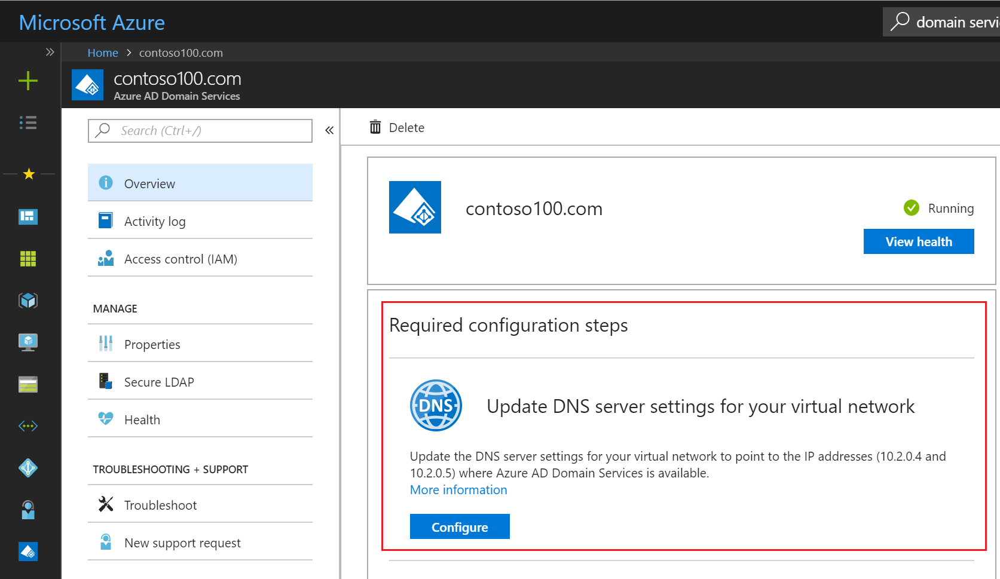
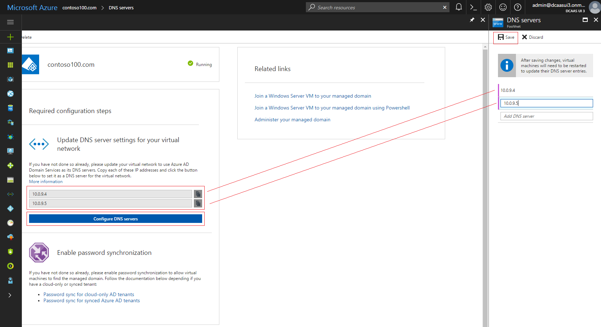

# Enable Azure Active Directory Domain Services (Preview)

## Task 4: Update DNS settings for the Azure virtual network
In the preceding configuration tasks, you have successfully enabled Azure Active Directory Domain Services for your directory. The next task is to ensure that computers within the virtual network can connect and consume these services. In this article, you update the DNS server settings for your virtual network to point to the two IP addresses where Azure Active Directory Domain Services is available on the virtual network.

To update the DNS server setting for the virtual network in which you have enabled Azure Active Directory Domain Services, complete the following steps:

1. The **Overview** tab lists a set of **Required configuration steps** to be performed after your managed domain is fully provisioned. The first configuration step is **Update DNS server settings for your virtual network**.

    

2. When your domain is fully provisioned, two IP addresses are displayed in this tile. Each of these IP addresses represents a domain controller for your managed domain.

3. To copy the first IP address to clipboard, click the copy button next to it. Then click the **Configure DNS servers** button.

4. Paste the first IP address into the **Add DNS server** textbox in the **DNS servers** blade. Scroll horizontally to the left to copy the second IP address and paste it into the **Add DNS server** textbox.

    

5. Click **Save** when you are done to update the DNS servers for the virtual network.

> [!NOTE]
> Virtual machines in the network only get the new DNS settings after a restart. If you need them to get the updated DNS settings right away, trigger a restart either by the portal, PowerShell, or the CLI.
>
>

## Next steps
[Task 5: Enable password synchronization to Azure Active Directory Domain Services](active-directory-ds-getting-started-password-sync.md)
