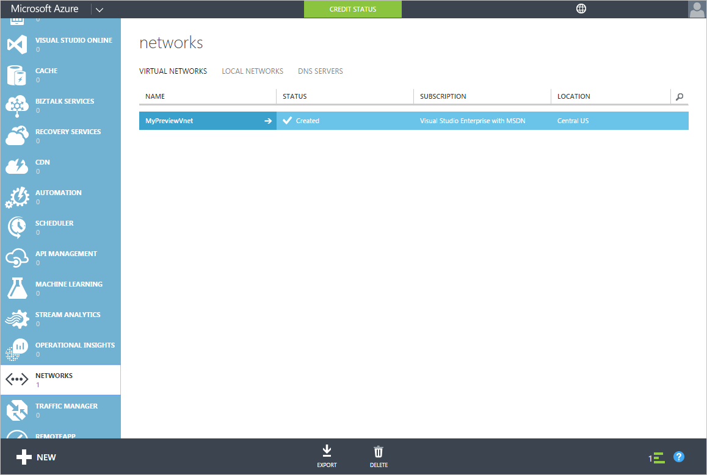
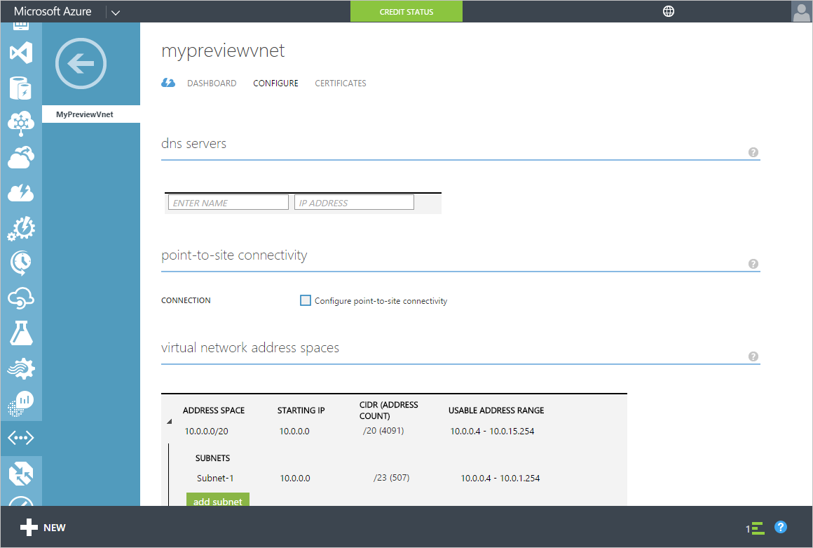
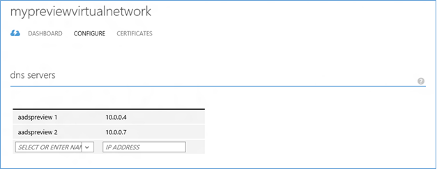

<properties
	pageTitle="Azure AD Domain Services: Update DNS settings for the Azure virtual network | Microsoft Azure"
	description="Getting started with Azure Active Directory Domain Services (Preview)"
	services="active-directory-ds"
	documentationCenter=""
	authors="mahesh-unnikrishnan"
	manager="stevenpo"
	editor="curtand"/>

<tags
	ms.service="active-directory-ds"
	ms.workload="identity"
	ms.tgt_pltfrm="na"
	ms.devlang="na"
	ms.topic="get-started-article"
	ms.date="07/06/2016"
	ms.author="maheshu"/>

# Azure AD Domain Services *(Preview)* - Update DNS settings for the Azure virtual network

## Task 4: Update DNS settings for the Azure virtual network
Now that you have successfully enabled Azure AD Domain Services for your directory, the next task is to ensure that computers within the virtual network can connect and consume these services. In order to do this, you will need to update the DNS server settings for your virtual network to point to the IP addresses at which Azure AD Domain Services are available on the virtual network.

> [AZURE.NOTE] Note down the IP addresses for Azure AD Domain Services displayed on the **Configure** tab of your directory, after you have enabled Azure AD Domain Services for the directory.

Perform the following configuration steps in order to update the DNS server setting for the virtual network in which you have enabled Azure AD Domain Services.

1. Navigate to the **Azure classic portal** ([https://manage.windowsazure.com](https://manage.windowsazure.com)).

2. Select the **Networks** node on the left pane.

    

3. In the **Virtual Networks** tab, select the virtual network in which you enabled Azure AD Domain Services to view its properties.

4. Click on the **Configure** tab.

    

5. In the **DNS servers** section, enter the IP addresses of Azure AD Domain Services.

6. Ensure that you enter both the IP addresses that were displayed in the **Domain Services** section on the **Configure** tab of your directory.

7. Click **Save** on the task pane at the bottom of the page in order to save the DNS server settings for this virtual network.

   

> [AZURE.NOTE] After updating the DNS server settings for the virtual network, it may take a while for virtual machines on the network to get the updated DNS configuration. If a virtual machine is unable to connect to the domain, you can flush the DNS cache (eg. 'ipconfig /flushdns') on the virtual machine, in order to force a refresh of the DNS settings on the virtual machine.

## Task 5 - Enable password synchronization to Azure AD Domain Services
The next configuration task is to [enable password synchronization to Azure AD Domain Services](active-directory-ds-getting-started-password-sync.md).
