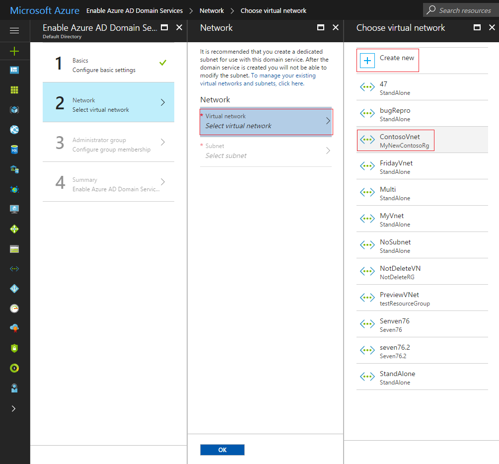
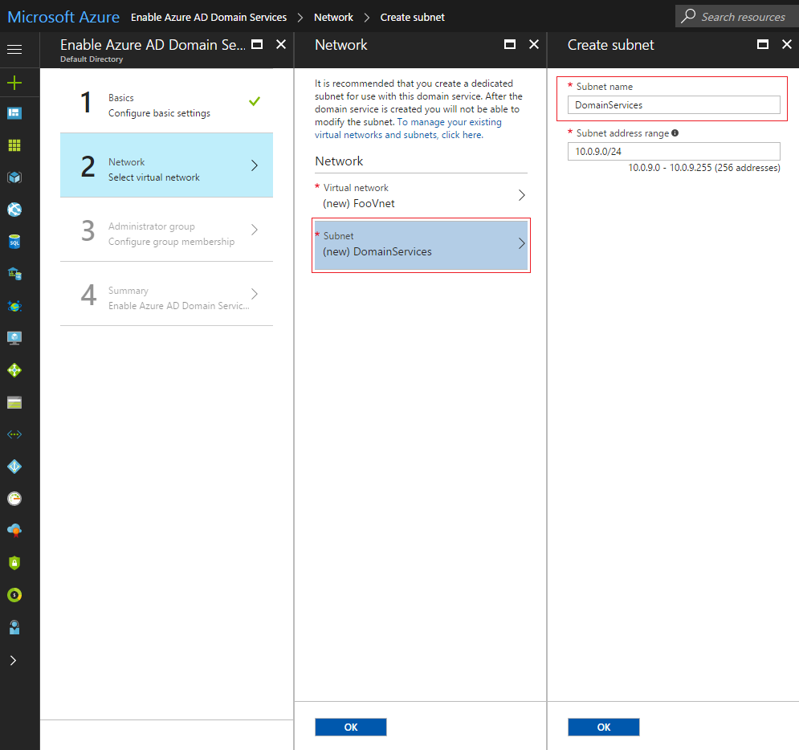

# Enable Azure Active Directory Domain Services using the Azure portal

## Before you begin
Refer to [Networking considerations for Azure Active Directory Domain Services](active-directory-ds-networking.md).

## Task 2: configure network settings
The next configuration task is to create an Azure virtual network and a dedicated subnet within it. You enable Azure Active Directory Domain Services in this subnet within your virtual network. You may also pick an existing virtual network and create the dedicated subnet within it.

1. Click **Virtual network** to select a virtual network.
    > [!NOTE]
    > **Classic virtual networks are not supported for new deployments.** Classic virtual networks are not supported for new deployments. Existing managed domains deployed in classic virtual networks continue to be supported. Microsoft will enable you to migrate an existing managed domain from a classic virtual network to a Resource Manager virtual network in the near future.
    >

2. On the **Choose virtual network** page, you see all existing virtual networks. You see only the virtual networks that belong to the resource group and Azure location you have selected on the **Basics** wizard page.
3. Choose the virtual network in which Azure AD Domain Services should be enabled. You can either pick an existing virtual network or create a new one.

  > [!TIP]
  > **You cannot move your managed domain to a different virtual network after you enable Azure AD Domain Services.** Pick the right virtual network to enable your managed domain. After you create a managed domain, you cannot move it to a different virtual network, without deleting the managed domain. We recommend reviewing the [networking considerations for Azure Active Directory Domain Services](active-directory-ds-networking.md) before you proceed.  
  >

4. **Create virtual network:** Click **Create new** to create a new virtual network. Use a dedicated subnet for Azure AD Domain Services. For example, create a subnet with the name 'DomainServices', making it easy for other administrators to understand what is deployed within the subnet. Click **OK** when you're done.

    

  > [!WARNING]
  > Make sure to pick an address space that is within the private IP address space. IP Addresses that you do not own that are in the public address space cause errors within Azure AD Domain Services.

5. **Existing virtual network:** If you plan to pick an existing virtual network, [create a dedicated subnet using the virtual networks extension](../virtual-network/virtual-network-manage-subnet.md#add-a-subnet), and then pick that subnet. Click **Virtual Network** to select the existing virtual network. Click **Subnet** to pick the dedicated subnet in your existing virtual network, within which to enable your new managed domain. Click **OK** when you're done.

    

  > [!NOTE]
  > **Guidelines for selecting a subnet**
  > 1. Use a dedicated subnet for Azure AD Domain Services. Do not deploy any other virtual machines to this subnet. This configuration enables you to configure network security groups (NSGs) for your workloads/virtual machines without disrupting your managed domain. For details, see [networking considerations for Azure Active Directory Domain Services](active-directory-ds-networking.md).
  2. Do not select the Gateway subnet for deploying Azure AD Domain Services, because it is not a supported configuration.
  3. The subnet you've selected must have at least 3-5 available IP addresses in its address space.
  >

6. When you are done, click **OK** to proceed to the **Administrator group** page of the wizard.

## Next step
[Task 3: configure administrative group and enable Azure AD Domain Services](active-directory-ds-getting-started-admingroup.md)
