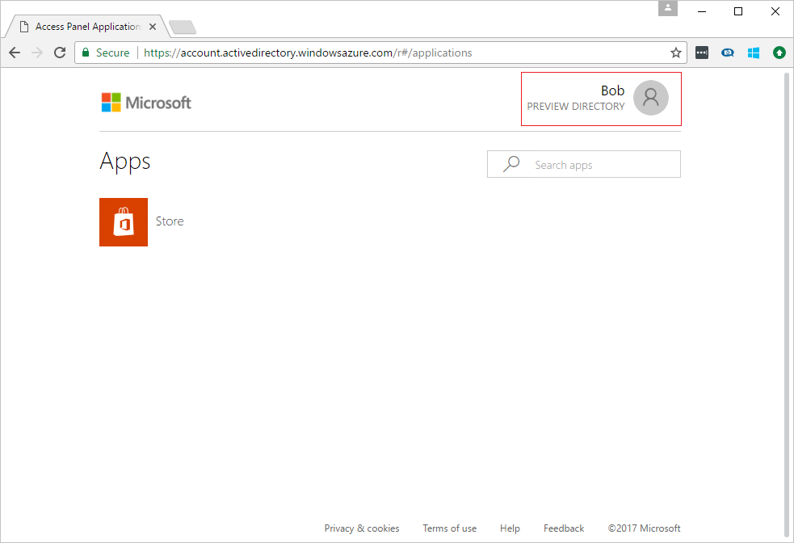
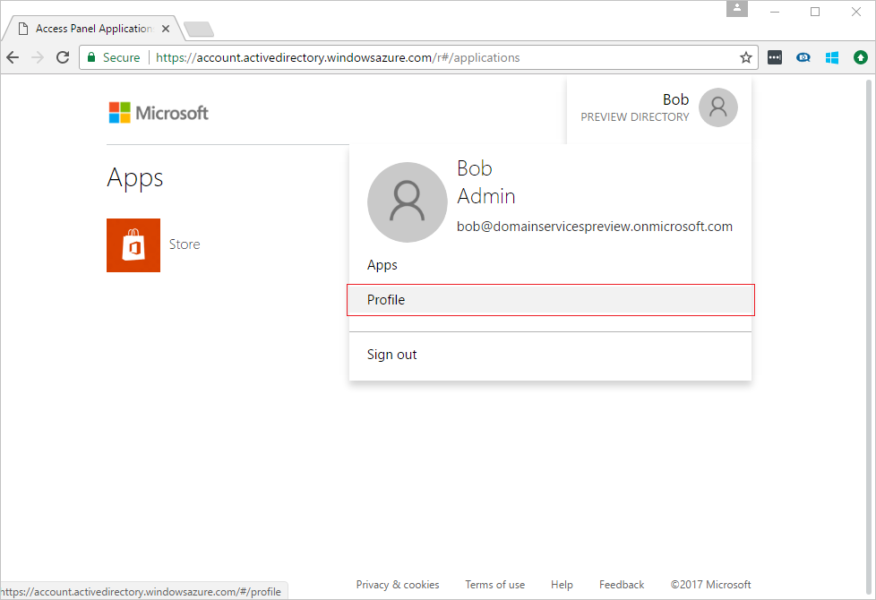
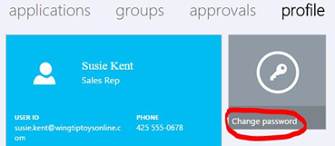
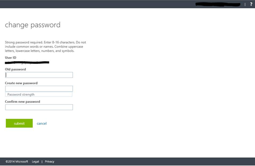

# Enable password hash synchronization to Azure Active Directory Domain Services
In preceding tasks, you enabled Azure Active Directory Domain Services for your Azure Active Directory (Azure AD) tenant. The next task is to enable synchronization of password hashes required for NT LAN Manager (NTLM) and Kerberos authentication to Azure AD Domain Services. After you've set up password hash synchronization, users can sign in to the managed domain with their corporate credentials.

The steps involved are different for cloud-only user accounts vs user accounts that are synchronized from your on-premises directory using Azure AD Connect. 

 
| **Type of user account** | **Steps to perform** |
| --- |---|
| **Cloud user accounts created in Azure AD** |**&#x2713;** [Follow the instructions in this article](active-directory-ds-getting-started-password-sync.md#task-5-enable-password-hash-synchronization-to-your-managed-domain-for-cloud-only-user-accounts) |
| **User accounts synchronized from an on-premises directory** |**&#x2713;** [Synchronize password hashes for user accounts synced from your on-premises AD to your managed domain](active-directory-ds-getting-started-password-sync-synced-tenant.md) | 

 

> [!TIP]
> **You may need to complete both sets of steps.**
> If your Azure AD tenant has a combination of cloud only users and users from your on-premises AD, you need to complete both sets of steps.
>

## Task 5: enable password hash synchronization to your managed domain for cloud-only user accounts
To authenticate users on the managed domain, Azure Active Directory Domain Services needs password hashes in a format that's suitable for NTLM and Kerberos authentication. Azure AD does not generate or store password hashes in the format that's required for NTLM or Kerberos authentication, until you enable Azure Active Directory Domain Services for your tenant. For obvious security reasons, Azure AD also does not store any password credentials in clear-text form. Therefore, Azure AD does not have a way to automatically generate these NTLM or Kerberos password hashes based on users' existing credentials.

> [!NOTE]
> **If your organization has cloud-only user accounts, all users who need to use Azure Active Directory Domain Services must change their passwords.** A cloud-only user account is an account that was created in your Azure AD directory using either the Azure portal or Azure AD PowerShell cmdlets. Such user accounts aren't synchronized from an on-premises directory.
>
>

This password change process causes the password hashes that are required by Azure Active Directory Domain Services for Kerberos and NTLM authentication to be generated in Azure AD. You can either expire the passwords for all users in the tenant who need to use Azure Active Directory Domain Services or instruct them to change their passwords.

### Enable NTLM and Kerberos password hash generation for a cloud-only user account
Here are the instructions you need to provide users, so they can change their passwords:

1. Go to the [Azure AD Access Panel](http://myapps.microsoft.com) page for your organization.

    

2. In the top right corner, click on your name and select **Profile** from the menu.

    

3. On the **Profile** page, click on **Change password**.

    

   > [!TIP]
   > If the **Change password** option is not displayed in the Access Panel window, ensure that your organization has configured [password management in Azure AD](../active-directory/authentication/quickstart-sspr.md).
   >
   >
4. On the **change password** page, type your existing (old) password, type a new password, and then confirm it.

    

5. Click **submit**.

A few minutes after you have changed your password, the new password is usable in Azure Active Directory Domain Services. After about 20 minutes, you can sign in to computers joined to the managed domain using the newly changed password.

## Related Content
* [How to update your own password](../active-directory/user-help/active-directory-passwords-update-your-own-password.md)
* [Getting started with Password Management in Azure AD](../active-directory/authentication/quickstart-sspr.md)
* [Enable password hash synchronization to Azure Active Directory Domain Services for a synced Azure AD tenant](active-directory-ds-getting-started-password-sync-synced-tenant.md)
* [Administer an Azure Active Directory Domain Services-managed domain](active-directory-ds-admin-guide-administer-domain.md)
* [Join a Windows virtual machine to an Azure Active Directory Domain Services-managed domain](active-directory-ds-admin-guide-join-windows-vm.md)
* [Join a Red Hat Enterprise Linux virtual machine to an Azure Active Directory Domain Services-managed domain](active-directory-ds-admin-guide-join-rhel-linux-vm.md)
