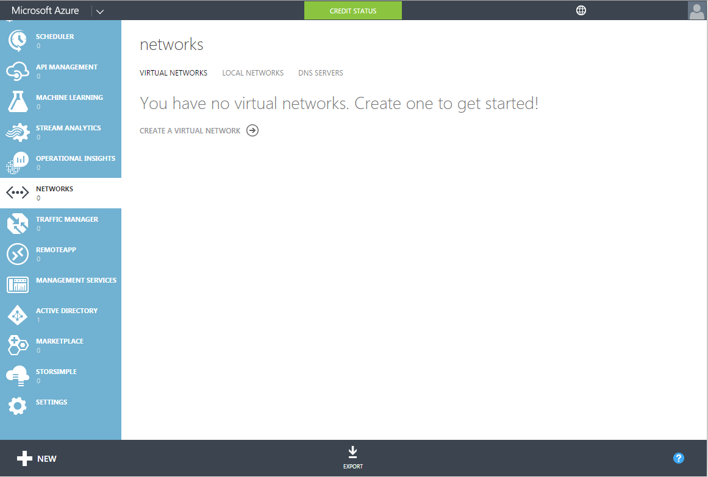
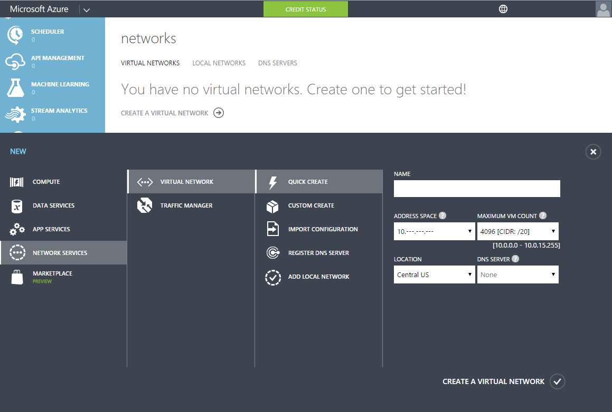
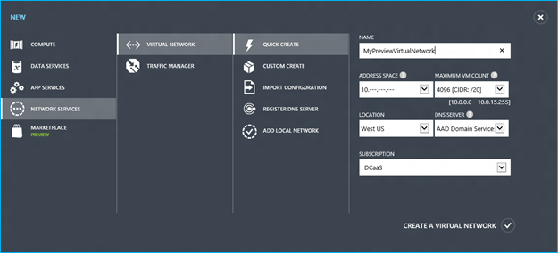

<properties
	pageTitle="Azure AD Domain Services: Create or select a virtual network | Microsoft Azure"
	description="Getting started with Azure Active Directory Domain Services (Preview)"
	services="active-directory-ds"
	documentationCenter=""
	authors="mahesh-unnikrishnan"
	manager="stevenpo"
	editor="curtand"/>

<tags
	ms.service="active-directory-ds"
	ms.workload="identity"
	ms.tgt_pltfrm="na"
	ms.devlang="na"
	ms.topic="get-started-article"
	ms.date="07/06/2016"
	ms.author="maheshu"/>

# Azure AD Domain Services *(Preview)* - Create or select a virtual network

## Guidelines to select an Azure virtual network
When selecting a virtual network to use with Azure AD Domain Services, keep the following guidelines in mind:

- Ensure you select a virtual network in a region that is supported by Azure AD Domain Services. See the [Azure services by region](https://azure.microsoft.com/regions/#services/) page to know the Azure regions in which Azure AD Domain Services are available.

- If you plan to use an existing virtual network, ensure that it is a regional virtual network. Virtual networks that use the legacy affinity groups mechanism cannot be used with Azure AD Domain Services. You will need to [migrate legacy virtual networks to regional virtual networks](../virtual-network/virtual-networks-migrate-to-regional-vnet.md).

- If you plan to use an existing virtual network, ensure that there are no custom DNS servers configured for the virtual network. Azure AD Domain Services does not support custom/bring-your-own DNS servers.

- If you plan to use an existing virtual network, ensure that you do not have an existing domain with the same domain name available on that virtual network. For instance, assume you have a domain called 'contoso.com' already available on the selected virtual network. Subsequently, you try to enable an Azure AD Domain Services managed domain with the same domain name (i.e. 'contoso.com') on that virtual network. You will encounter a failure when trying to enable Azure AD Domain Services. This is due to name conflicts for the domain name on that virtual network. In this situation, you must use a different name to set up your Azure AD Domain Services managed domain. Alternately, you can de-provision the existing domain and then proceed to enable Azure AD Domain Services.

- Select the virtual network that currently hosts/will host virtual machines that need access to Azure AD Domain Services. You will not be able to move Domain Services to a different virtual network after you have enabled the service.

- Azure AD Domain Services are not supported with virtual networks created using the Azure Resource Manager. You can [connect a classic virtual network to an ARM-based virtual network](../vpn-gateway/virtual-networks-configure-vnet-to-vnet-connection.md), in order to use Azure AD Domain Services in a virtual network created using Azure Resource Manager.

## Task 2: Create an Azure virtual network
The next configuration task is to create an Azure virtual network in which you would like to enable Azure AD Domain Services. If you already have an existing virtual network you’d prefer to use, you can skip this step.

> [AZURE.NOTE] Ensure that the Azure virtual network you create or choose to use with Azure AD Domain Services belongs to an Azure region that is supported by Azure AD Domain Services. See the [Azure services by region](https://azure.microsoft.com/regions/#services/) page to know the Azure regions in which Azure AD Domain Services are available.

You will need to note down the name of the virtual network so you select the right virtual network when enabling Azure AD Domain Services in a subsequent configuration step.

Perform the following configuration steps in order to create an Azure virtual network in which you’d like to enable Azure AD Domain Services.

1. Navigate to the **Azure classic portal** ([https://manage.windowsazure.com](https://manage.windowsazure.com)).

2. Select the **Networks** node on the left pane.

3. Click **NEW** on the task pane at the bottom of the page.

    

4. In the **Network Services** node, select **Virtual Network**.

5. Click on **Quick Create** in order to create a virtual network.

    

6. Specify a **Name** for your virtual network. You may also choose to configure the **Address space** or **Maximum VM count** for this network. You can leave the DNS server setting set to 'None' for now. This setting will be updated after your enable Azure AD Domain Services.

7. Ensure that you select a supported Azure region in the **Location** dropdown. See the [Azure services by region](https://azure.microsoft.com/regions/#services/) page to know the Azure regions in which Azure AD Domain Services are available. This is an important step. If you select a virtual network in an Azure region that is not supported by Azure AD Domain Services, you will not be able to enable the service in that virtual network.

8. Click the **Create a Virtual Network** button to create your virtual network.

    

 

## Task 3 - Enable Azure AD Domain Services
The next configuration task is to [enable Azure AD Domain Services](active-directory-ds-getting-started-enableaadds.md).
