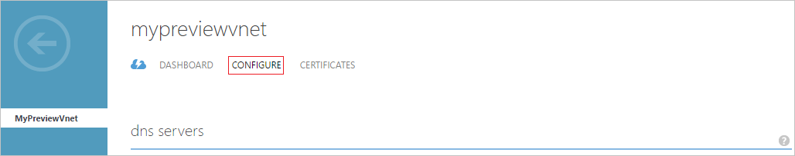
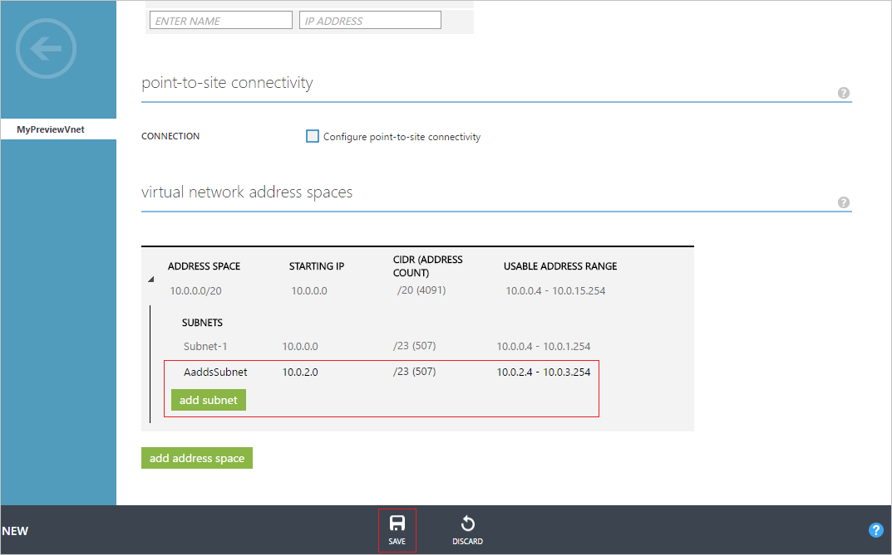

# Create or select a virtual network for Azure Active Directory Domain Services
## Before you begin
Refer to [Networking considerations for Azure Active Directory Domain Services](active-directory-ds-networking.md).

## Task 2: Create an Azure virtual network
The next configuration task is to create an Azure virtual network and a subnet within it. You enable Azure Active Directory Domain Services in this subnet within your virtual network. If you have an existing virtual network that you’d prefer to use, you can skip this step.

> [!NOTE]
> Make sure that the Azure virtual network you create or choose to use with Azure Active Directory Domain Services belongs to an Azure region that's supported by Azure Active Directory Domain Services. To ascertain the Azure regions in which Azure Active Directory Domain Services is available, see [Azure services by region](https://azure.microsoft.com/regions/#services/).
>
>Note the name of the virtual network to ensure that you select the right virtual network when you enable Azure Active Directory Domain Services in a subsequent configuration step.

To create an Azure virtual network in which you want to enable Azure Active Directory Domain Services, follow these configuration instructions:

1. Go to the [Azure classic portal](https://manage.windowsazure.com).
2. In the left pane, select **Networks**.

      
    The **Virtual Networks** window opens.
3. In the task pane at the bottom of the window, click **New**.

    
4. Click **Network Services**, and then select **Virtual Network**.

    
5. To create a virtual network, click **Quick Create**.

6. Specify a **Name** for your virtual network, and consider doing the following:
    * You can choose to configure **Address space** or **Maximum VM count** for this network.
    * You can leave the **DNS server** setting as **None** for now. You can update the setting after you enable Azure Active Directory Domain Services.
7. In the **Location** drop-down list, select a supported Azure region.  
    To ascertain the Azure regions in which Azure Active Directory Domain Services is available, see [Azure services by region](https://azure.microsoft.com/regions/#services/).
8. To create your virtual network, click **Create a Virtual Network**.

    
9. After you've created a virtual network, select the name of the virtual network, and then click the **Configure** tab.

    
10. Under **virtual network address spaces**, click **add subnet**, and then specify a subnet with the name **AaddsSubnet**.

    

11. To create the subnet, click **Save**.

## Next step
[Task 3: enable Azure Active Directory Domain Services](active-directory-ds-getting-started-enableaadds.md)
