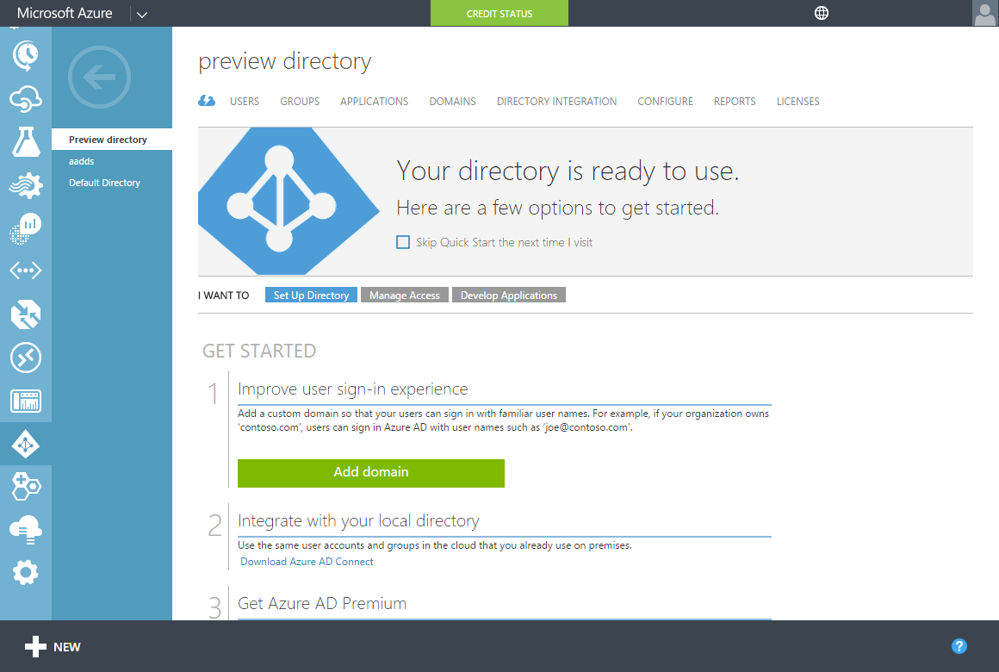
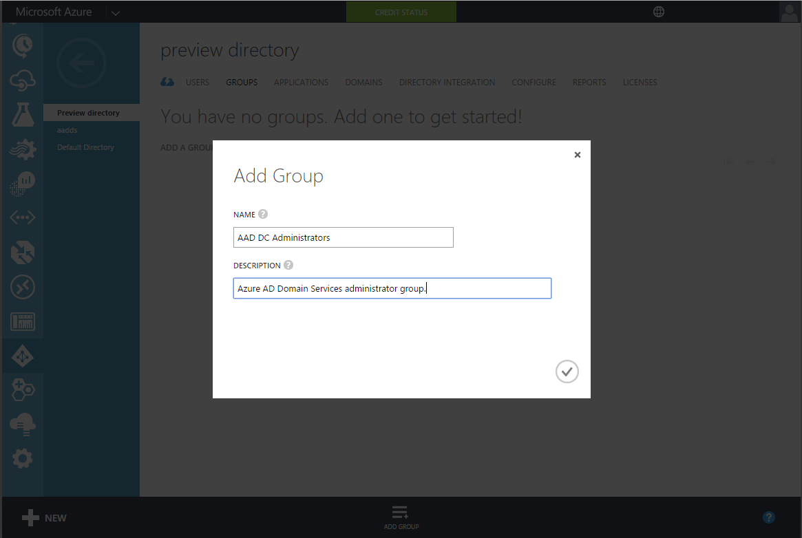
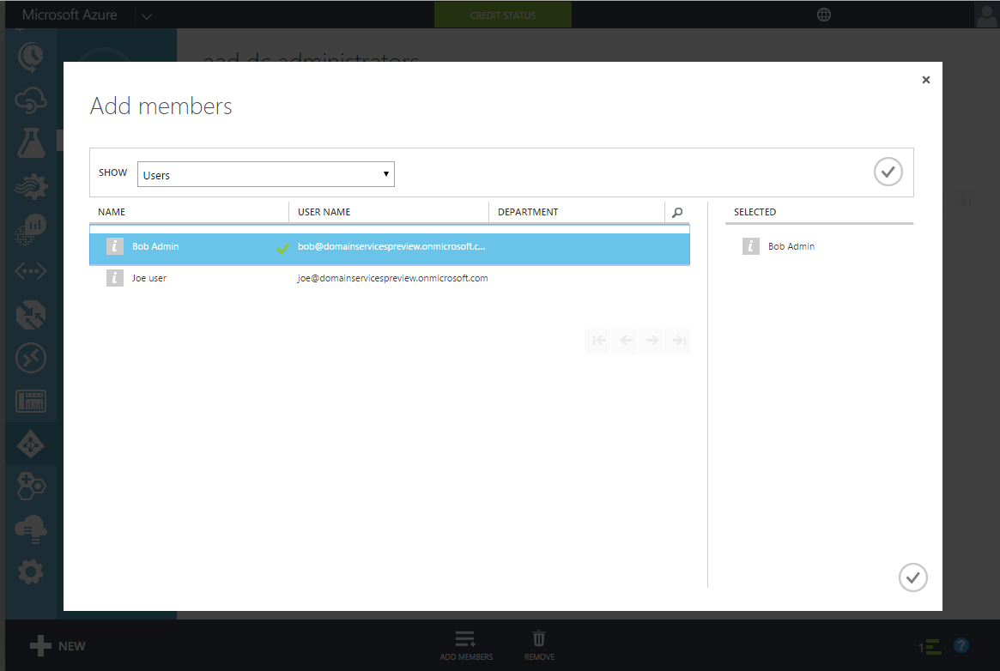

<properties
	pageTitle="Azure AD Domain Services: Create the AAD DC Administrators group | Microsoft Azure"
	description="Getting started with Azure Active Directory Domain Services (Preview)"
	services="active-directory-ds"
	documentationCenter=""
	authors="mahesh-unnikrishnan"
	manager="stevenpo"
	editor="curtand"/>

<tags
	ms.service="active-directory-ds"
	ms.workload="identity"
	ms.tgt_pltfrm="na"
	ms.devlang="na"
	ms.topic="article"
	ms.date="07/06/2016"
	ms.author="maheshu"/>

# Azure AD Domain Services *(Preview)* - Create the 'AAD DC Administrators' group

This article walks through the configuration tasks required to enable Azure AD Domain Services for your Azure AD tenant.

## Task 1: Create the 'AAD DC Administrators' group
The first task is to create an administrative group in your Azure Active Directory tenant. This special administrative group is called **AAD DC Administrators**. Members of this group will be granted administrative privileges on machines that are domain joined to the Azure AD Domain Services domain you will set up. After domain join, this group will be added to the ‘Administrators’ group on these domain joined machines. Additionally, members of this group will also be able to use Remote Desktop to connect remotely to domain joined machines.  

> [AZURE.NOTE] You do not have Domain Administrator or Enterprise Administrator privileges on the managed domain created using Azure AD Domain Services. Since this is a managed domain, these privileges are reserved by the service and are not made available to users within the directory. However, you will be able to use the special administrator group created in this configuration task, in order to perform some privileged operations. These operations include joining computers to the domain, belonging to the Administrators group on domain-joined machines, configuring Group Policy etc.

In this configuration task you will create the administrative group and add one or more users in your directory to the group. Perform the following steps in order to create the administrative group for Azure AD Domain Services:

1. Navigate to the **Azure classic portal** (i.e. [https://manage.windowsazure.com](https://manage.windowsazure.com))

2. Select the **Active Directory** node on the left pane.

3. Select the Azure AD tenant (directory) for which you would like to enable Azure AD Domain Services. Note that you can only create one domain for each Azure AD directory.

    

4. Click on the **Groups** tab.

5. Click on **Add Group** from the task pane at the bottom of the page, in order to add a group to your directory.

6. Create a group named **AAD DC Administrators**.

    > [AZURE.WARNING] You must create a group with this exact name in order to enable access within Azure AD Domain Services.

	

7. You can add a description for this group that enables other users within your Azure AD tenant to understand that this group will be used to grant administrative privileges within Azure AD Domain Services.

8. After the group has been created, click on the name of the group to see the properties of this group. Click on the **Add members** button on the bottom panel, in order to add users as members of this group.

9. In the **Add members** dialog, select the users who should be members of this group and select the checkbox when you are done.

    

 

## Task 2: Create or select an Azure virtual network
The next configuration task is to [create or select an Azure virtual network](active-directory-ds-getting-started-vnet.md).
