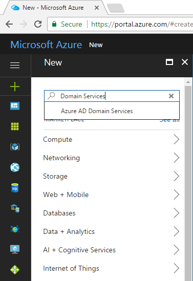
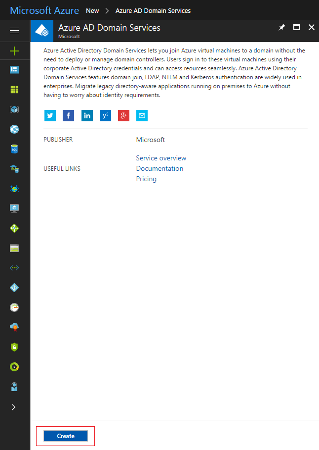
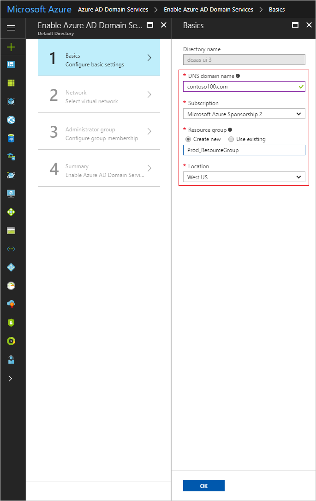

# Enable Azure Active Directory Domain Services using the Azure portal
This article shows how to enable Azure Active Directory Domain Services (Azure AD DS) using the Azure portal.

## Before you begin
To complete the tasks listed in this article, you need:

* A valid **Azure subscription**.
* An **Azure AD directory** - either synchronized with an on-premises directory or a cloud-only directory.
* The **Azure subscription must be associated with the Azure AD directory**.
* You need **global administrator** privileges in your Azure AD directory to enable Azure AD Domain Services.

## Enable Azure AD Domain Services

To launch the **Enable Azure AD Domain Services** wizard, complete the following steps:

1. Go to the [Azure portal](https://portal.azure.com).
2. In the left pane, click **Create a resource**.
3. In the **New** page, type **Domain Services** into the search bar.

    

4. Click to select **Azure AD Domain Services** from the list of search suggestions. On the **Azure AD Domain Services** page, click the **Create** button.

    

5. The **Enable Azure AD Domain Services** wizard is launched.

## Task 1: configure basic settings
In the **Basics** page of the wizard, specify the DNS domain name for the managed domain. You can also choose the resource group and Azure location to which the managed domain should be deployed.

1. Choose the **DNS domain name** for your managed domain.

   > [!NOTE]
   > **Guidelines for selecting a DNS domain name**
   > * **Built-in domain name:** By default, the wizard specifies the default/built-in domain name of the directory (with a **.onmicrosoft.com** suffix) for you. If you choose to enable secure LDAP access to the managed domain over the internet, expect issues creating a public DNS record or obtaining a secure LDAP certificate from a public CA for this domain name. Microsoft owns the *.onmicrosoft.com* domain and CAs will not issue certificates vouching for this domain.
   * **Custom domain names:** You can also type in a custom domain name. In this example, the custom domain name is *contoso100.com*.
   * **Non-routable domain suffixes:** We generally recommend avoiding a non-routable domain name suffix. For instance, it is better to avoid creating a domain with the DNS domain name 'contoso.local'. The '.local' DNS suffix is not routable and can cause issues with DNS resolution.
   * **Domain prefix restrictions:** The prefix of your specified domain name (for example, *contoso100* in the *contoso100.com* domain name) must contain 15 or fewer characters. You cannot create a managed domain with a prefix longer than 15 characters.
   * **Network name conflicts:** Ensure that the DNS domain name you have chosen for the managed domain does not already exist in the virtual network. Specifically, check whether:
       * You already have an Active Directory domain with the same DNS domain name on the virtual network.
       * The virtual network where you plan to enable the managed domain has a VPN connection with your on-premises network. In this scenario, ensure you don't have a domain with the same DNS domain name on your on-premises network.
       * You have an existing cloud service with that name on the virtual network.
    >

2. Select the Azure **Subscription** in which you would like to create the managed domain.

3. Select the **Resource group** to which the managed domain should belong. Choose either the **Create new** or **Use existing** options to select the resource group.

4. Choose the Azure **Location** in which the managed domain should be created. On the **Network** page of the wizard, you see only virtual networks that belong to the location you have selected.

5. Click **OK** to move on to the **Network** page of the wizard.

## Next step
[Task 2: configure network settings](active-directory-ds-getting-started-network.md)
