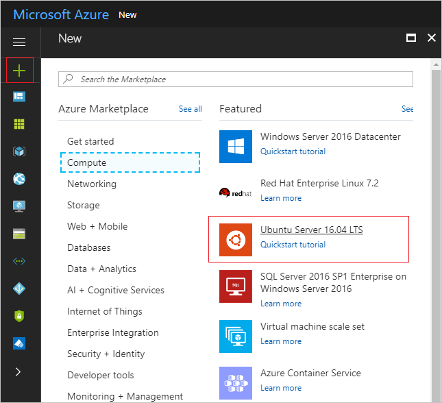
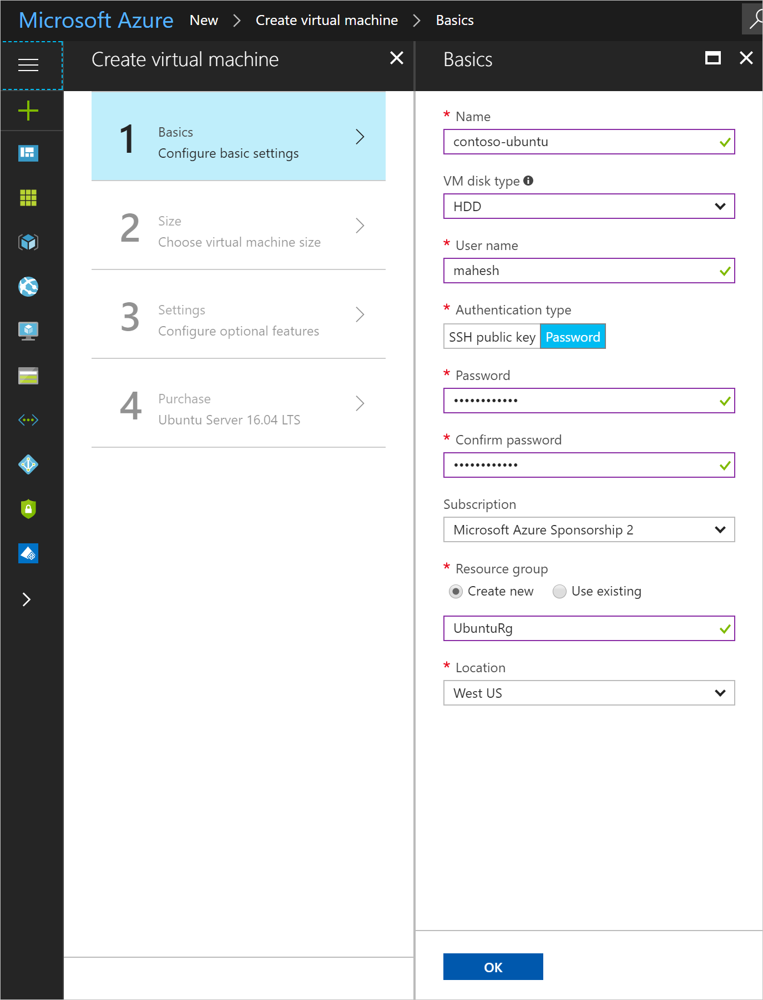
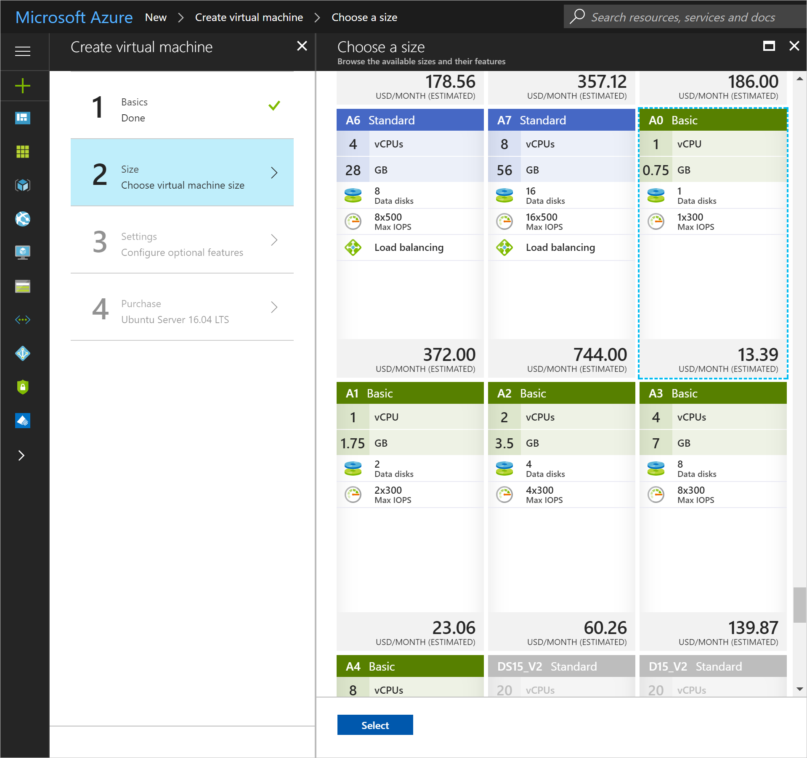
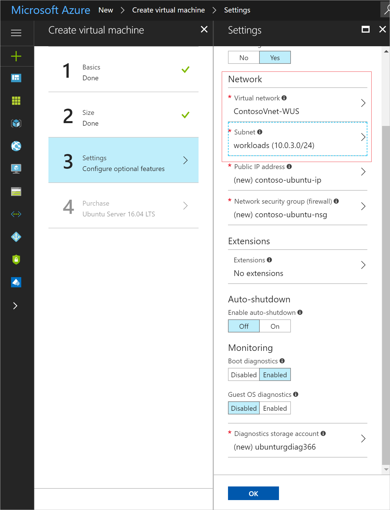
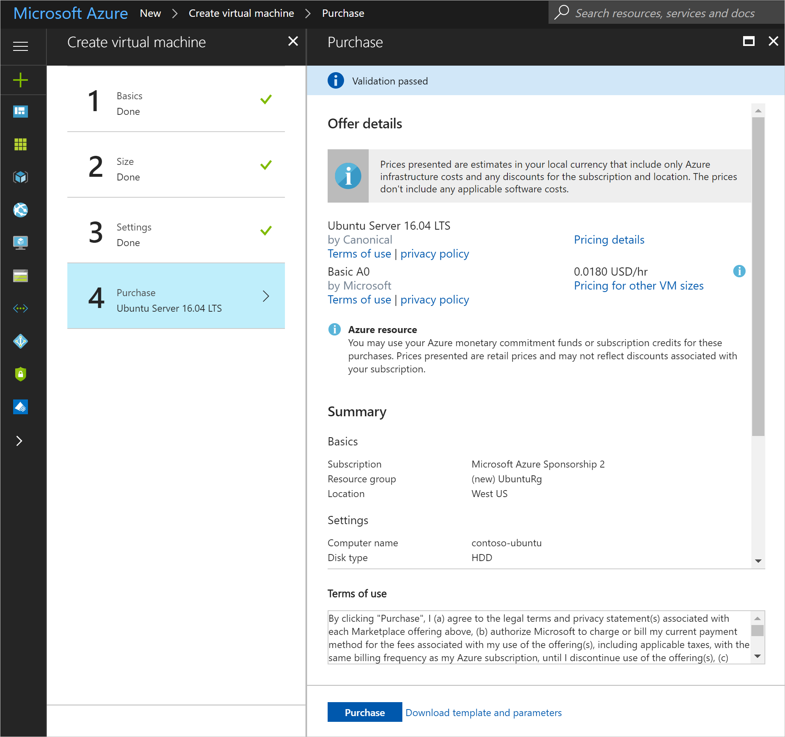
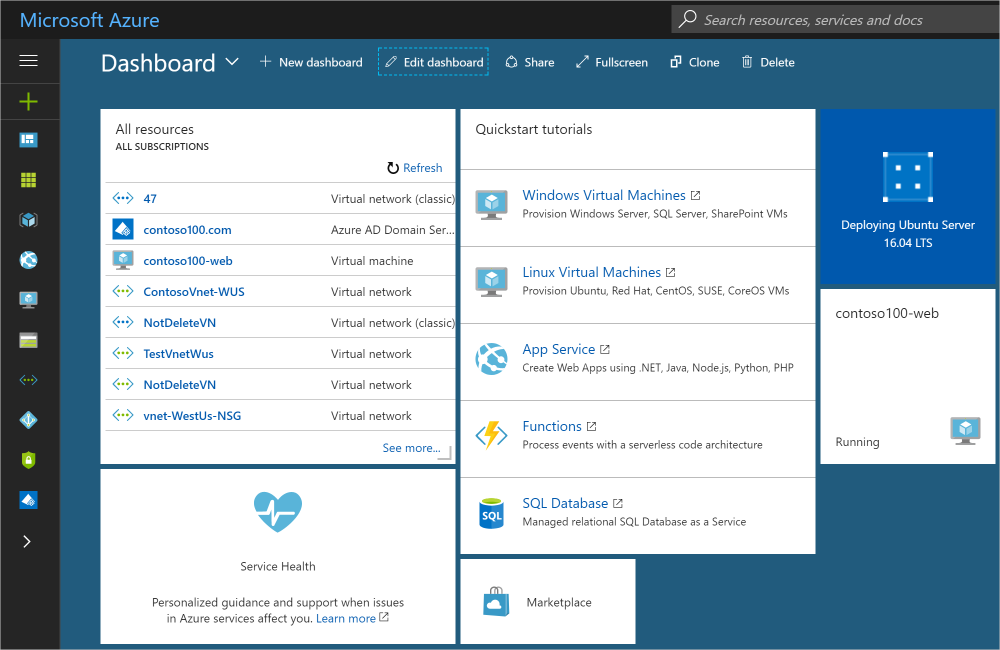
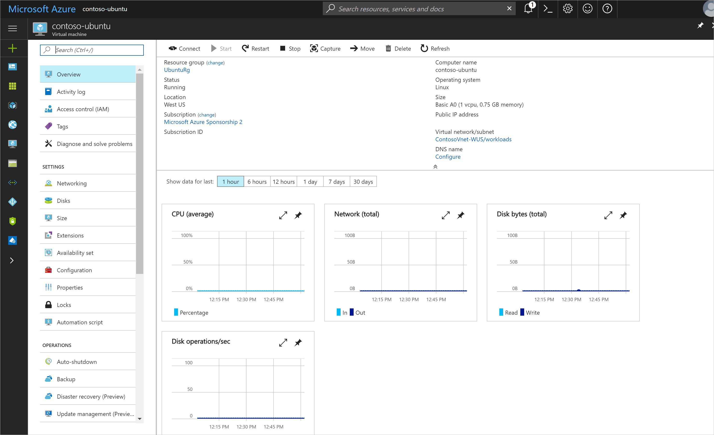

# Join an Ubuntu virtual machine in Azure to a managed domain
This article shows you how to join an Ubuntu Linux virtual machine to an Azure AD Domain Services managed domain.


## Before you begin
To perform the tasks listed in this article, you need:  
1. A valid **Azure subscription**.
2. An **Azure AD directory** - either synchronized with an on-premises directory or a cloud-only directory.
3. **Azure AD Domain Services** must be enabled for the Azure AD directory. If you haven't done so, follow all the tasks outlined in the [Getting Started guide](active-directory-ds-getting-started.md).
4. Ensure that you have configured the IP addresses of the managed domain as the DNS servers for the virtual network. For more information, see [how to update DNS settings for the Azure virtual network](active-directory-ds-getting-started-dns.md)
5. Complete the steps required to [synchronize passwords to your Azure AD Domain Services managed domain](active-directory-ds-getting-started-password-sync.md).


## Provision an Ubuntu Linux virtual machine
Perform the following steps to provision an Ubuntu Server virtual machine using the Azure portal.

1. Sign in to the [Azure portal](https://portal.azure.com).
2. Click **New** on the left pane and click **Compute**. Click **Ubuntu Server 16.04 LTS**. You can also type **Ubuntu** into the **Search the Marketplace** textbox to see all supported Ubuntu images in the Azure marketplace.

    
3. In the **Basics** page of the **Create virtual machine** wizard:
    * Enter the **Name** for the new virtual machine.
    * Specify a local administrator user name in the **User name** field.
    * Select password as the **Authentication type** and type a secure **Password**. You may also choose to use an SSH key to authenticate the local administrator user.
    * Choose the Azure **Subscription** in which you have enabled Azure AD Domain Services.
    * Create an existing **Resource group** or create a new one.
    * Choose the Azure region in which you have enabled Azure AD Domain Services in the **Location** dropdown.

    
4. In the **Size** page of the **Create virtual machine** wizard, select the size for the virtual machine.

    

5. In the **Settings** page of the **Create virtual machine** wizard:
    * Select the **Availability set** for the virtual machine and choose whether to **use managed disks**.
    * In the **Network** section, select the **Virtual network** in which you have enabled Azure AD Domain Services.
    * Pick a different **Subnet** than the one in which you have enabled Azure AD Domain Services.
    * Configure the other settings on this page as desired.
    * Click **OK** when you are done.

    
6. On the **Purchase** page of the **Create virtual machine** wizard, review, and click the **Purchase** button.

    
7. Deployment of the new virtual machine based on the Ubuntu image should start.

    
8. After a few minutes, the virtual machine should be deployed successfully and ready for use. You can see the details of the newly provisioned VM on the **Overview** page.

    


## Connect remotely to the Ubuntu Linux virtual machine
The Ubuntu virtual machine has been provisioned in Azure. The next task is to connect remotely to the virtual machine.

Follow the instructions in the article [How to log on to a virtual machine running Linux](../virtual-machines/linux/mac-create-ssh-keys.md?toc=%2fazure%2fvirtual-machines%2flinux%2ftoc.json).

The rest of the steps assume you use the PuTTY SSH client to connect to the Ubuntu virtual machine. For more information, see the [PuTTY Download page](http://www.chiark.greenend.org.uk/~sgtatham/putty/download.html).

1. Open the PuTTY program.
2. Enter the **Host Name** for the newly created Ubuntu virtual machine. In this example, our virtual machine has the host name 'contoso-ubuntu'. If you are not sure of the host name of your VM, refer to the VM dashboard on the Azure portal.

    
3. Log on to the virtual machine using the local administrator credentials you specified when the virtual machine was created. In this example, we used the local administrator account "mahesh".


## Configure the hosts file on the Linux virtual machine
Edit the /etc/hosts file and update your machine’s IP address and hostname.

```
sudo vi /etc/hosts
```

In the hosts file, enter the following value:

```
127.0.0.1 contoso-ubuntu.contoso100.com contoso-ubuntu
```
Here, 'contoso100.com' is the DNS domain name of your managed domain. 'contoso-ubuntu' is the hostname of the Ubuntu virtual machine you are joining to the managed domain.


## Install required packages on the Linux virtual machine
After connecting to the virtual machine, the next task is to install packages required for domain join on the virtual machine. Perform the following steps:

1.  In your PuTTY terminal, type the following command to download the package lists from the repositories. This command updates the package lists to get information on the newest versions of packages and their dependencies.

    ```
    sudo apt-get update
    ```

2. Type the following command to install the required packages.
    ```
      sudo apt-get install krb5-user samba sssd sssd-tools libnss-sss libpam-sss ntp ntpdate realmd adcli
    ```

3. During the Kerberos installation, you see a pink screen. The installation of the 'krb5-user' package prompts for the realm name (in ALL UPPERCASE). The installation writes the [realm] and [domain_realm] sections in /etc/krb5.conf.

    > [!TIP]
    > If the name of your managed domain is contoso100.com, enter CONTOSO100.COM as the realm. Remember, the realm name must be specified in UPPERCASE.
    >
    >


## Configure the NTP (Network Time Protocol) settings on the Linux virtual machine
The date and time of your Ubuntu VM must synchronize with the managed domain. Add your managed domain's NTP hostname in the /etc/ntp.conf file.

```
sudo vi /etc/ntp.conf
```

In the ntp.conf file, enter the following value and save the file:

```
server contoso100.com
```
Here, 'contoso100.com' is the DNS domain name of your managed domain.

Now sync the Ubuntu VM's date and time with NTP server and then start the NTP service:

```
sudo systemctl stop ntp
sudo ntpdate contoso100.com
sudo systemctl start ntp
```


## Join the Linux virtual machine to the managed domain
Now that the required packages are installed on the Linux virtual machine, the next task is to join the virtual machine to the managed domain.

1. Discover the AAD Domain Services managed domain. In your PuTTY terminal, type the following command:

    ```
    sudo realm discover CONTOSO100.COM
    ```

      >
      > [!NOTE] 
      > **Troubleshooting:**
      > If *realm discover* is unable to find your managed domain:
        * Ensure that the domain is reachable from the virtual machine (try ping).
        * Check that the virtual machine has indeed been deployed to the same virtual network in which the managed domain is available.
        * Check to see if you have updated the DNS server settings for the virtual network to point to the domain controllers of the managed domain.
      >

2. Initialize Kerberos. In your PuTTY terminal, type the following command: 

    >
    > [!TIP] 
    > * Ensure that you specify a user who belongs to the 'AAD DC Administrators' group. 
    > * Specify the domain name in capital letters, else kinit fails.
    >

    ```
    kinit bob@CONTOSO100.COM
    ```

3. Join the machine to the domain. In your PuTTY terminal, type the following command: 

    >
    > [!TIP] 
    > Use the same user account you specified in the preceding step ('kinit').
    >

    ```
    sudo realm join --verbose CONTOSO100.COM -U 'bob@CONTOSO100.COM' --install=/
    ```

You should get a message ("Successfully enrolled machine in realm") when the machine is successfully joined to the managed domain.


## Update the SSSD configuration and restart the service
1. In your PuTTY terminal, type the following command. Open the sssd.conf file and make the following change
    ```
    sudo vi /etc/sssd/sssd.conf
    ```

2. Comment out the line **use_fully_qualified_names = True** and save the file.
    ```
    # use_fully_qualified_names = True
    ```

3. Restart the SSSD service.
    ```
    sudo service sssd restart
    ```


## Configure automatic home directory creation
To enable automatic creation of the home directory after logging in users, type the following commands in your PuTTY terminal:
    ```
    sudo vi /etc/pam.d/common-session
    ```
Add the following line in this file below the line 'session optional pam_sss.so' and save it:
    ```
    session required pam_mkhomedir.so skel=/etc/skel/ umask=0077
    ```


## Verify domain join
Verify whether the machine has been successfully joined to the managed domain. Connect to the domain joined Ubuntu VM using a different SSH connection. Use a domain user account and then check to see if the user account is resolved correctly.

1. In your PuTTY terminal, type the following command to connect to the domain joined Ubuntu virtual machine using SSH. Use a domain account that belongs to the managed domain (for example, 'bob@CONTOSO100.COM' in this case.)
    ```
    ssh -l bob@CONTOSO100.COM contoso-ubuntu.contoso100.com
    ```

2. In your PuTTY terminal, type the following command to see if the home directory was initialized correctly.
    ```
    pwd
    ```

3. In your PuTTY terminal, type the following command to see if the group memberships are being resolved correctly.
    ```
    id
    ```


## Grant the 'AAD DC Administrators' group sudo privileges
You can grant members of the 'AAD DC Administrators' group administrative privileges on the Ubuntu VM. The sudo file is located at /etc/sudoers. The members of AD groups added in sudoers can perform sudo.

1. In your PuTTY terminal, ensure you are logged in with superuser privileges. You can use the local administrator account you specified while creating the VM. Execute the following command:
    ```
    sudo vi /etc/sudoers
    ```

2. Add the following entry to the /etc/sudoers file and save it:
    ```
    # Add 'AAD DC Administrators' group members as admins.
    %AAD\ DC\ Administrators ALL=(ALL) NOPASSWD:ALL
    ```

3. You can now log in as a member of the 'AAD DC Administrators' group and should have administrative privileges on the VM.


## Troubleshooting domain join
Refer to the [Troubleshooting domain join](active-directory-ds-admin-guide-join-windows-vm-portal.md#troubleshooting-domain-join) article.


## Related Content
* [Azure AD Domain Services - Getting Started guide](active-directory-ds-getting-started.md)
* [Join a Windows Server virtual machine to an Azure AD Domain Services managed domain](active-directory-ds-admin-guide-join-windows-vm.md)
* [How to log on to a virtual machine running Linux](../virtual-machines/linux/mac-create-ssh-keys.md?toc=%2fazure%2fvirtual-machines%2flinux%2ftoc.json).
