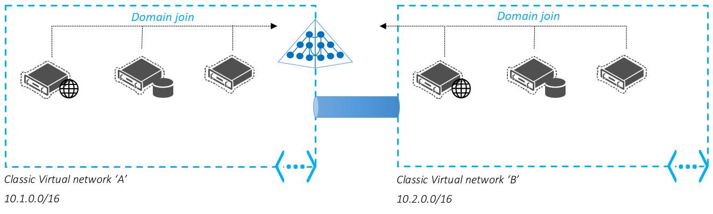

# Networking considerations for Azure AD Domain Services
## How to select an Azure virtual network
The following guidelines help you select a virtual network to use with Azure AD Domain Services.

### Type of Azure virtual network
* **Resource Manager virtual networks**: Azure AD Domain Services can be enabled in virtual networks created using Azure Resource Manager.
* You cannot enable Azure AD Domain Services in a classic Azure virtual network.
* You can connect other virtual networks to the virtual network in which Azure AD Domain Services is enabled. For more information, see the [Network connectivity](active-directory-ds-networking.md#network-connectivity) section.

### Azure region for the virtual network
* Your Azure AD Domain Services managed domain is deployed in the same Azure region as the virtual network you choose to enable the service in.
* Select a virtual network in an Azure region supported by Azure AD Domain Services.
* See the [Azure services by region](https://azure.microsoft.com/regions/#services/) page to know the Azure regions in which Azure AD Domain Services is available.

### Requirements for the virtual network
* **Proximity to your Azure workloads**: Select the virtual network that currently hosts/will host virtual machines that need access to Azure AD Domain Services. If your workloads are deployed in a different virtual network than the managed domain, you may also choose to connect the virtual networks.
* **Custom/bring-your-own DNS servers**: Ensure that there are no custom DNS servers configured for the virtual network. An example of a custom DNS server is an instance of Windows Server DNS running on a Windows Server VM that you have deployed in the virtual network. Azure AD Domain Services does not integrate with any custom DNS servers deployed within the virtual network.
* **Existing domains with the same domain name**: Ensure that you do not have an existing domain with the same domain name available on that virtual network. For instance, assume you have a domain called 'contoso.com' already available on the selected virtual network. Later, you try to enable an Azure AD Domain Services managed domain with the same domain name (that is 'contoso.com') on that virtual network. You encounter a failure when trying to enable Azure AD Domain Services. This failure is due to name conflicts for the domain name on that virtual network. In this situation, you must use a different name to set up your Azure AD Domain Services managed domain. Alternately, you can de-provision the existing domain and then proceed to enable Azure AD Domain Services.

> [!WARNING]
> You cannot move Domain Services to a different virtual network after you have enabled the service.
>
>

## Guidelines for choosing a subnet

* Deploy Azure AD Domain Services to a **separate dedicated subnet** within your Azure virtual network.
* Do not apply NSGs to the dedicated subnet for your managed domain. If you must apply NSGs to the dedicated subnet, ensure you **do not block the ports required to service and manage your domain**.
* Do not overly restrict the number of IP addresses available within the dedicated subnet for your managed domain. This restriction prevents the service from making two domain controllers available for your managed domain.
* **Do not enable Azure AD Domain Services in the gateway subnet** of your virtual network.

> [!WARNING]
> When you associate an NSG with a subnet in which Azure AD Domain Services is enabled, you may disrupt Microsoft's ability to service and manage the domain. Additionally, synchronization between your Azure AD tenant and your managed domain is disrupted. **The SLA does not apply to deployments where an NSG has been applied that blocks Azure AD Domain Services from updating and managing your domain.**
>
>

## Ports required for Azure AD Domain Services
The following ports are required for Azure AD Domain Services to service and maintain your managed domain. Ensure that these ports are not blocked for the subnet in which you have enabled your managed domain.

| Port number | Required? | Purpose |
| --- | --- | --- |
| 443 | Mandatory |Synchronization with your Azure AD tenant |
| 5986 | Mandatory | Management of your domain |
| 3389 | Mandatory | Management of your domain |
| 636 | Optional | Secure LDAP (LDAPS) access to your managed domain |

**Port 443 (Synchronization with Azure AD)**
* It is used to synchronize your Azure AD directory with your managed domain.
* It is mandatory to allow access to this port in your NSG. Without access to this port, your managed domain is not in sync with your Azure AD directory. Users may not be able to sign in as changes to their passwords are not synchronized to your managed domain.
* You can restrict inbound access to this port to IP addresses belonging to the Azure IP address range. Note that the Azure IP address range is a different range than the PowerShell range shown in the rule below.

**Port 5986 (PowerShell remoting)**
* It is used to perform management tasks using PowerShell remoting on your managed domain.
* It is mandatory to allow access through this port in your NSG. Without access to this port, your managed domain cannot be updated, configured, backed-up, or monitored.
* For any new domains or domains with an Azure Resource Manager virtual network, you can restrict inbound access to this port to the following source IP addresses: 52.180.179.108, 52.180.177.87, 13.75.105.168, 52.175.18.134, 52.138.68.41, 52.138.65.157, 104.41.159.212, 104.45.138.161, 52.169.125.119, 52.169.218.0, 52.187.19.1, 52.187.120.237, 13.78.172.246, 52.161.110.169, 52.174.189.149, 40.68.160.142, 40.83.144.56, 13.64.151.161, 52.180.183.67, 52.180.181.39, 52.175.28.111, 52.175.16.141, 52.138.70.93, 52.138.64.115, 40.80.146.22, 40.121.211.60, 52.138.143.173, 52.169.87.10, 13.76.171.84, 52.187.169.156, 13.78.174.255, 13.78.191.178, 40.68.163.143, 23.100.14.28, 13.64.188.43, 23.99.93.197
* For domains with a classic virtual network, you can restrict inbound access to this port to the following source IP addresses: 52.180.183.8, 23.101.0.70, 52.225.184.198, 52.179.126.223, 13.74.249.156, 52.187.117.83, 52.161.13.95, 104.40.156.18, 104.40.87.209
* The domain controllers for your managed domain do not usually listen on this port. The service opens this port on managed domain controllers only when a management or maintenance operation needs to be performed for the managed domain. As soon as the operation completes, the service shuts down this port on the managed domain controllers.

**Port 3389 (Remote desktop)**
* It is used for remote desktop connections to domain controllers for your managed domain.
* You can restrict inbound access to the following source IP addresses: 207.68.190.32/27, 13.106.78.32/27, 13.106.174.32/27, 13.106.4.96/27
* This port also remains largely turned off on your managed domain. This mechanism is not used on an ongoing basis since management and monitoring tasks are performed using PowerShell remoting. This port is used only in the rare event that Microsoft needs to connect remotely to your managed domain for advanced troubleshooting. The port is closed as soon as the troubleshooting operation is complete.

**Port 636 (Secure LDAP)**
* It is used to enable secure LDAP access to your managed domain over the internet.
* Opening this port through your NSG is optional. Open the port only if you have secure LDAP access over the internet enabled.
* You can restrict inbound access to this port to the source IP addresses from which you expect to connect over secure LDAP.

## Network Security Groups
A [Network Security Group (NSG)](../virtual-network/virtual-networks-nsg.md) contains a list of Access Control List (ACL) rules that allow or deny network traffic to your VM instances in a Virtual Network. NSGs can be associated with either subnets or individual VM instances within that subnet. When an NSG is associated with a subnet, the ACL rules apply to all the VM instances in that subnet. In addition, traffic to an individual VM can be restricted further by associating an NSG directly to that VM.

### Sample NSG for virtual networks with Azure AD Domain Services
The following table illustrates a sample NSG you can configure for a virtual network with an Azure AD Domain Services managed domain. This rule allows inbound traffic over the required ports to ensure your managed domain stays patched, updated and can be monitored by Microsoft. The default 'DenyAll' rule applies to all other inbound traffic from the internet.

Additionally, the NSG also illustrates how to lock down secure LDAP access over the internet. Skip this rule if you have not enabled secure LDAP access to your managed domain over the internet. The NSG contains a set of rules that allow inbound LDAPS access over TCP port 636 only from a specified set of IP addresses. The NSG rule to allow LDAPS access over the internet from specified IP addresses has a higher priority than the DenyAll NSG rule.

**More information** - [Create a Network Security Group](../virtual-network/manage-network-security-group.md).

## Network connectivity
An Azure AD Domain Services managed domain can be enabled only within a single virtual network in Azure.

### Scenarios for connecting Azure networks
Connect Azure virtual networks to use the managed domain in any of the following deployment scenarios:

#### Use the managed domain in more than one Azure virtual network
You can connect other Azure virtual networks to the Azure virtual network in which you have enabled Azure AD Domain Services. This VPN/VNet peering connection enables you to use the managed domain with your workloads deployed in other virtual networks.

#### Use the managed domain in a Resource Manager-based virtual network
You can connect a Resource Manager-based virtual network to the Azure classic virtual network in which you have enabled Azure AD Domain Services. This connection enables you to use the managed domain with your workloads deployed in the Resource Manager-based virtual network.

### Network connection options
* **VNet-to-VNet connections using virtual network peering**: Virtual network peering is a mechanism that connects two virtual networks in the same region through the Azure backbone network. Once peered, the two virtual networks appear as one for all connectivity purposes. They are still managed as separate resources, but virtual machines in these virtual networks can communicate with each other directly by using private IP addresses.

    

    [More information - virtual network peering](../virtual-network/virtual-network-peering-overview.md)

* **VNet-to-VNet connections using site-to-site VPN connections**: Connecting a virtual network to another virtual network (VNet-to-VNet) is similar to connecting a virtual network to an on-premises site location. Both connectivity types use a VPN gateway to provide a secure tunnel using IPsec/IKE.

    

    [More information - connect virtual networks using VPN gateway](../vpn-gateway/virtual-networks-configure-vnet-to-vnet-connection.md)

 

## Related Content
* [Azure virtual network peering](../virtual-network/virtual-network-peering-overview.md)
* [Configure a VNet-to-VNet connection for the classic deployment model](../vpn-gateway/virtual-networks-configure-vnet-to-vnet-connection.md)
* [Azure Network Security Groups](../virtual-network/security-overview.md)
* [Create a Network Security Group](../virtual-network/manage-network-security-group.md)
