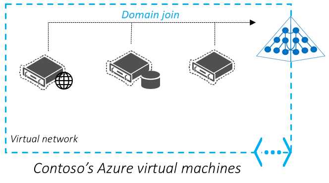
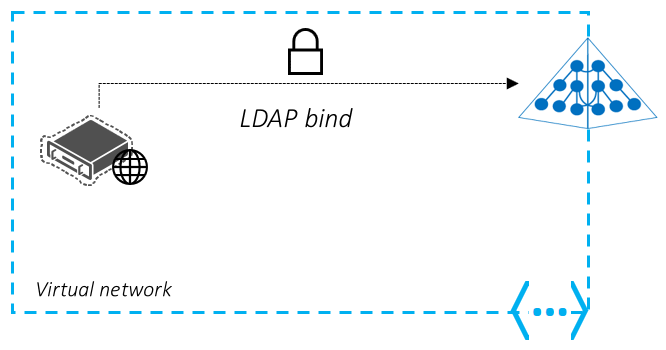
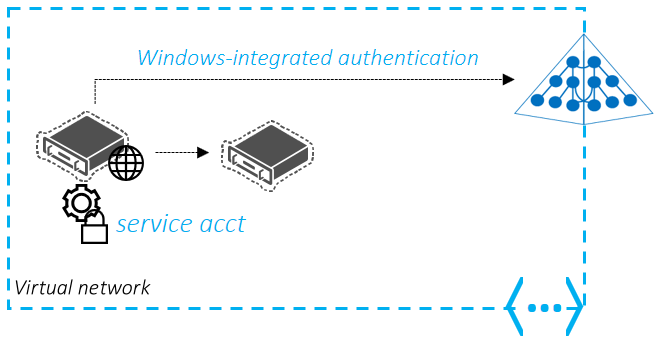

# Deployment scenarios and use-cases
In this section, we look at a few scenarios and use-cases that benefit from Azure Active Directory (AD) Domain Services.

## Secure, easy administration of Azure virtual machines
You can use Azure Active Directory Domain Services to manage your Azure virtual machines in a streamlined manner. Azure virtual machines can be joined to the managed domain, thus enabling you to use your corporate AD credentials to log in. This approach helps avoid credential management hassles such as maintaining local administrator accounts on each of your Azure virtual machines.

Server virtual machines that are joined to the managed domain can also be managed and secured using Group Policy. You can apply required security baselines to your Azure virtual machines and lock them down in accordance with corporate security guidelines. For example, you can use group policy management capabilities to restrict the types of applications that can be launched on these virtual machines.

As servers and other infrastructure reaches end-of-life, Contoso is moving many applications currently hosted on premises to the cloud. Their current IT standard mandates that servers hosting corporate applications must be domain-joined and managed using Group Policy. Contoso's IT administrator prefers to domain join virtual machines deployed in Azure, to make administration easier. As a result, administrators and users can log in using their corporate credentials. At the same time, machines can be configured to comply with required security baselines using Group Policy. Contoso would prefer not to have to deploy, monitor, and manage domain controllers in Azure to secure Azure virtual machines. Therefore, Azure AD Domain Services is a great fit for this use-case.

**Deployment notes**

Consider the following important points for this deployment scenario:

* Managed domains provided by Azure AD Domain Services provide a single flat OU (Organizational Unit) structure by default. All domain-joined machines reside in a single flat
  OU. You may however choose to create custom OUs.
* Azure AD Domain Services supports simple Group Policy in the form of a built-in GPO each for the users and computers containers. You can create custom GPOs and target them to custom OUs.
* Azure AD Domain Services supports the base AD computer object schema. You cannot extend the computer object's schema.

## Lift-and-shift an on-premises application that uses LDAP bind authentication to Azure Infrastructure Services

Contoso has an on-premises application that was purchased from an ISV many years ago. The application is currently in maintenance mode by the ISV and requesting changes to the application is prohibitively expensive for Contoso. This application has a web-based frontend that collects user credentials using a web form and then authenticates users by performing an LDAP bind to the corporate Active Directory. Contoso would like to migrate this application to Azure Infrastructure Services. It is desirable that the application works as is, without requiring any changes. Additionally, users should be able to authenticate using their existing corporate credentials and without having to retrain users to do things differently. In other words, end users should be oblivious of where the application is running and the migration should be transparent to them.

**Deployment notes**

Consider the following important points for this deployment scenario:

* Ensure that the application does not need to modify/write to the directory. LDAP write access to managed domains provided by Azure AD Domain Services is not supported.
* You cannot change passwords directly against the managed domain. End users can change their password either using Azure AD's self-service password change mechanism or against the on-premises directory. These changes are automatically synchronized and available in the managed domain.

## Lift-and-shift an on-premises application that uses LDAP read to access the directory to Azure Infrastructure Services
Contoso has an on-premises line-of-business (LOB) application that was developed almost a decade ago. This application is directory aware and was designed to work with Windows Server AD. The application uses LDAP (Lightweight Directory Access Protocol) to read information/attributes about users from Active Directory. The application does not modify attributes or otherwise write to the directory. Contoso would like to migrate this application to Azure Infrastructure Services and retire the aging on-premises hardware currently hosting this application. The application cannot be rewritten to use modern directory APIs such as the REST-based Azure AD Graph API. Therefore, a lift-and-shift option is desired whereby the application can be migrated to run in the cloud, without modifying code or rewriting the application.

**Deployment notes**

Consider the following important points for this deployment scenario:

* Ensure that the application does not need to modify/write to the directory. LDAP write access to managed domains provided by Azure AD Domain Services is not supported.
* Ensure that the application does not need a custom/extended Active Directory schema. Schema extensions are not supported in Azure AD Domain Services.

## Migrate an on-premises service or daemon application to Azure Infrastructure Services
Some applications consist of multiple tiers, where one of the tiers needs to perform authenticated calls to a backend tier such as a database tier. Active Directory service accounts are commonly used for these use-cases. You can lift-and-shift such applications to Azure Infrastructure Services and use Azure AD Domain Services for the identity needs of these applications. You can choose to use the same service account that is synchronized from your on-premises directory to Azure AD. Alternately, you can first create a custom OU and then create a separate service account in that OU, to deploy such applications.

Contoso has a custom-built software vault application that includes a web front end, a SQL server, and a backend FTP server. Windows-integrated authentication of service accounts is used to authenticate the web front end to the FTP server. The web front end is set up to run as a service account. The backend server is configured to authorize access from the service account for the web front end. Contoso prefers not to have to deploy a domain controller virtual machine in the cloud to move this application to Azure Infrastructure Services. Contoso's IT administrator can deploy the servers hosting the web front end, SQL server, and the FTP server to Azure virtual machines. These machines are then joined to an Azure AD Domain Services managed domain. Then, they can use the same service account in their on-premises directory for the app’s authentication purposes. This service account is synchronized to the Azure AD Domain Services managed domain and is available for use.

**Deployment notes**

Consider the following important points for this deployment scenario:

* Ensure that the application uses username/password for authentication. Certificate/Smartcard based authentication is not supported by Azure AD Domain Services.
* You cannot change passwords directly against the managed domain. End users can change their password either using Azure AD's self-service password change mechanism or against the on-premises directory. These changes are automatically synchronized and available in the managed domain.

## Windows Server Remote desktop services deployments in Azure
You can use Azure AD Domain Services to provide managed AD domain services to your remote desktop servers deployed in Azure.

For more information about this deployment scenario, see how to [integrate Azure AD Domain Services with your RDS deployment](https://docs.microsoft.com/windows-server/remote/remote-desktop-services/rds-azure-adds).

## Domain-joined HDInsight clusters (Preview)
You can set up an Azure HDInsight cluster that is joined to an Azure AD Domain Services managed domain with Apache Ranger enabled. Create and apply Hive policies through Apache Ranger, and allow users (for example, data scientists) to connect to Hive using ODBC-based tools, for example Excel, Tableau etc. Microsoft is working on adding other workloads, such as HBase, Spark, and Storm, to Domain-joined HDInsight soon.

For more information about this deployment scenario, see how to [configure domain-joined HDInsight clusters](../hdinsight/domain-joined/apache-domain-joined-configure.md)
