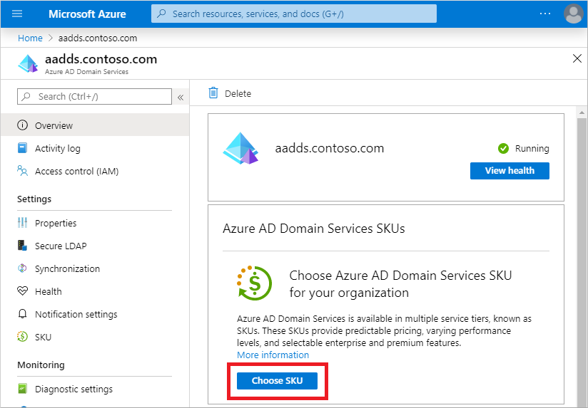
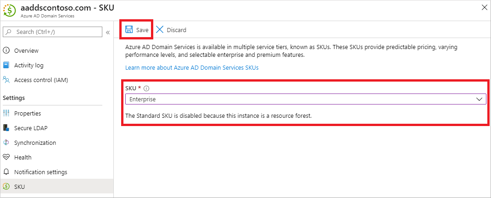

# Change the SKU for an existing Microsoft Entra Domain Services managed domain

In Microsoft Entra Domain Services, the available performance and features are based on the SKU type. These feature differences include the backup frequency or maximum number of one-way outbound forest trusts.

You select a SKU when you create the managed domain, and you can switch SKUs up or down as your business needs change after the managed domain has been deployed. Changes in business requirements could include the need for more frequent backups or to create additional forest trusts. For more information on the limits and pricing of the different SKUs, see [Domain Services SKU concepts][concepts-sku] and [Domain Services pricing][pricing] pages.

This article shows you how to change the SKU for an existing Domain Services managed domain using the [Microsoft Entra admin center](https://entra.microsoft.com).

## Before you begin

To complete this article, you need the following resources and privileges:

* An active Azure subscription.
    * If you don't have an Azure subscription, [create an account](https://azure.microsoft.com/free/?WT.mc_id=A261C142F).
* A Microsoft Entra tenant associated with your subscription, either synchronized with an on-premises directory or a cloud-only directory.
    * If needed, [create a Microsoft Entra tenant][create-azure-ad-tenant] or [associate an Azure subscription with your account][associate-azure-ad-tenant].
* A Microsoft Entra Domain Services managed domain enabled and configured in your Microsoft Entra tenant.
    * If needed, complete the tutorial to [create and configure a managed domain][create-azure-ad-ds-instance].

## SKU change limitations

You can change SKUs up or down after the managed domain has been deployed. However, the *Premium* and *Enterprise* SKUs define a limit on the number of trusts you can create. You can't change to a SKU with a lower maximum limit than you currently have configured.

For example, if you have created seven trusts on the *Premium* SKU, you can't change down to the *Enterprise* SKU. The *Enterprise* SKU supports a maximum of five trusts.

For more information on these limits, see [Domain Services SKU features and limits][concepts-sku].

## Select a new SKU

To change the SKU for a managed domain using the [Microsoft Entra admin center](https://entra.microsoft.com), complete the following steps:

1. In the [Microsoft Entra admin center](https://entra.microsoft.com), search for and select **Microsoft Entra Domain Services**. Choose your managed domain from the list, such as *aaddscontoso.com*.
1. In the menu on the left-hand side of the Domain Services page, select **Settings > SKU**.

    

1. From the drop-down menu, select the SKU you wish for your managed domain. If you have a resource forest, you can't select *Standard* SKU as forest trusts are only available on the *Enterprise* SKU or higher.

    Choose the SKU you want from the drop-down menu, then select **Save**.

    

It can take a minute or two to change the SKU type.

## Next steps

If you have a resource forest and want to create additional trusts after the SKU change, see [Create an outbound forest trust to an on-premises domain in Domain Services][create-trust].

<!-- INTERNAL LINKS -->
[create-azure-ad-tenant]: /azure/active-directory/fundamentals/sign-up-organization
[associate-azure-ad-tenant]: /azure/active-directory/fundamentals/how-subscriptions-associated-directory
[create-azure-ad-ds-instance]: tutorial-create-instance.md
[concepts-sku]: administration-concepts.md#azure-ad-ds-skus
[create-trust]: tutorial-create-forest-trust.md

<!-- EXTERNAL LINKS -->
[pricing]: https://azure.microsoft.com/pricing/details/active-directory-ds/
