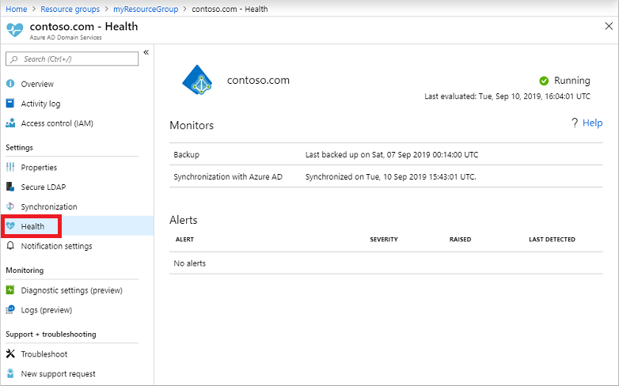

# Check the health of an Azure Active Directory Domain Services managed domain

Azure Active Directory Domain Services (Azure AD DS) runs some background tasks to keep the managed domain healthy and up-to-date. These tasks include taking backups, applying security updates, and synchronizing data from Azure AD. If there are issues with the Azure AD DS managed domain, these tasks may not successfully complete. To review and resolve any issues, you can check the health status of an Azure AD DS managed domain using the Azure portal.

This article shows you how to view the Azure AD DS health status and understand the information or alerts shown.

## View the health status

The health status for an Azure AD DS managed domain is viewed using the Azure portal. Information on the last backup time and synchronization with Azure AD can be seen, along with any alerts that indicate a problem with the managed domain's health. To view the health status for an Azure AD DS managed domain, complete the following steps:

1. In the Azure portal, search for and select **Azure AD Domain Services**.
1. Select your Azure AD DS managed domain, such as *aadds.contoso.com*.
1. On the left-hand side of the Azure AD DS resource window, select **Health**. The following example screenshot shows a healthy Azure AD DS managed domain and the status of the last backup and Azure AD synchronization:

    

The *Last evaluated* timestamp of the health page shows when the Azure AD DS managed domain was last checked. The health of an Azure AD DS managed domain is evaluated every hour. If you make any changes to an Azure AD DS managed domain, wait until the next evaluation cycle to view the updated health status.

The status in the top right indicates the overall health of the Azure AD DS managed domain. The status factors all of the existing alerts on your domain. The following table details the available status indicators:

| Status | Icon | Explanation |
| --- | :----: | --- |
| Running |  | The Azure AD DS managed domain is running correctly and doesn't have any critical or warning alerts. The domain may have informational alerts. |
| Needs attention (warning) |  | There are no critical alerts on the Azure AD DS managed domain, but there are one or more warning alerts that should be addressed. |
| Needs attention (critical) |  | There are one or more critical alerts on the Azure AD DS managed domain that must be addressed. You may also have warning and / or informational alerts. |
| Deploying |  | The Azure AD DS domain is being deployed. |

## Understand monitors and alerts

The health status for an Azure AD DS managed domain show two types of information - *monitors*, and *alerts*. Monitors show the time that core background tasks were completed. Alerts provide information or suggestions to improve the stability of the managed domain.

### Monitors

Monitors are areas of an Azure AD DS managed domain that are checked on a regular basis. If there are any active alerts for the Azure AD DS managed domain, it may cause one of the monitors to report an issue. Azure AD Domain Services currently has monitors for the following areas:

* Backup
* Synchronization with Azure AD

#### Backup monitor

The backup monitor checks that automated regular backups of the Azure AD DS managed domain successfully run. The following table details the available backup monitor status:

| Detail value | Explanation |
| --- | --- |
| Never backed up | This state is normal for new Azure AD DS managed domains. The first backup should be created 24 hours after the Azure AD DS managed domain is deployed. If this status persists, [open an Azure support request][azure-support]. |
| Last backup was taken 1 to 14 days ago | This time range is the expected status for the backup monitor. Automated regular backups should occur in this period. |
| Last backup was taken more than 14 days ago. | A timespan longer than two weeks indicates there's an issue with the automated regular backups. Active critical alerts may prevent the Azure AD DS managed domain from being backed up. Resolve any active alerts for the Azure AD DS managed domain. If the backup monitor doesn't then update the status to report a recent backup, [open an Azure support request][azure-support]. |

#### Synchronization with Azure AD monitor

An Azure AD DS managed domain regularly synchronizes with Azure Active Directory. The number of users and group objects, and the number of changes made in the Azure AD directory since the last sync, affects how long it takes to synchronize. If the Azure AD DS managed domain was last synchronized over three days ago, check for and resolve any active alerts. If the synchronization monitor doesn't update the status to show a recent sync after you address any active alerts, [open an Azure support request][azure-support].

### Alerts

Alerts are generated for issues in an Azure AD DS managed domain that need to be addressed for the service to run correctly. Each alert explains the problem and gives a URL that outlines specific steps to resolve the issue. For more information on the possible alerts and their resolutions, see [Troubleshooting alerts](troubleshoot-alerts.md).

Health status alerts are categorized into the following levels of severity:

 * **Critical alerts** are issues that severely impact the Azure AD DS managed domain. These alerts should be addressed immediately. The Azure platform can't monitor, manage, patch, and synchronize the managed domain until the issues are resolved.
 * **Warning alerts** notify you of issues that may impact the Azure AD DS managed domain operations if the problem persists. These alerts also offer recommendations to secure the managed domain.
 * **Informational alerts** are notifications that don't negatively impact the Azure AD DS managed domain. Informational alerts provide some insight as to what's happening in the managed domain.

## Next steps

For more information on alerts that are shown in the health status page, see [Resolve alerts on your managed domain][troubleshoot-alerts]

<!-- INTERNAL LINKS -->
[azure-support]: ../active-directory/fundamentals/active-directory-troubleshooting-support-howto.md
[troubleshoot-alerts]: troubleshoot-alerts.md
