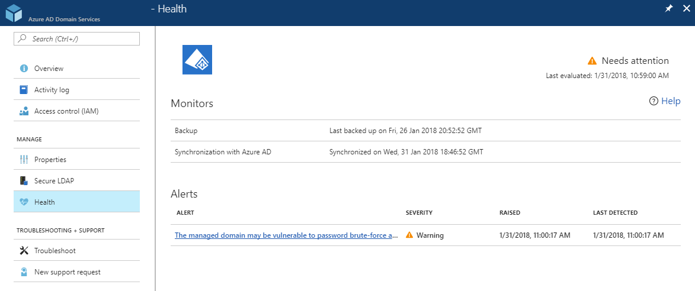

# Check the health of an Azure AD Domain Services managed domain

## Overview of the health page
Using the health page on your Azure portal, you are able to keep up-to-date on what is happening on your managed domain. This article walks through the elements of the health page.

### How to view the health of your managed domain
1. Navigate to the [Azure AD Domain Services page](https://portal.azure.com/#blade/HubsExtension/Resources/resourceType/Microsoft.AAD%2FdomainServices) in the Azure portal.
2. Click on the domain you want to view the health of.
3. In the left-hand navigation pane, click **Health**.

The following picture illustrates a sample health page:

>[!NOTE]
> Your managed domain's health is evaluated every hour. After making changes to your managed domain, wait until the next evaluation cycle to view your managed domain's updated health. The "Last evaluated" timestamp in the top right corner shows when the health of your managed domain was last evaluated.
>

### Status of your managed domain
The status in the top right of your health page indicates the overall health of your managed domain. The status factors in all of the existing alerts on your domain. You can also view the status of your domain on the overview page of Azure AD Domain Services.

| Status | Icon | Explanation |
| --- | :----: | --- |
| Running |  | Your managed domain is running smoothly and does not have any critical or warning alerts. This domain may have informational alerts. |
| Needs attention (Warning) |  | There are no critical alerts on your managed domain, but there are one or more warning alerts that need to be addressed. |
| Needs attention (Critical) |  | There are one or more critical alerts on your managed domain. You may also have warning and/or informational alerts. |
| Deploying |  | Your domain is in the process of being deployed. |

## Monitors
Monitors are aspects of your managed domain that Azure AD Domain Services monitors on a regular basis. The best way to keep your monitors in a healthy state is to resolve any active alerts for your managed domain.

Azure AD Domain Services currently monitors the following:
 - Backup
 - Synchronization with Azure AD

### The 'backup' monitor
This monitors whether regular backups of your managed domain are being performed. The following table explains what to expect in the details column of the backup monitor:

| Detail value | Explanation |
| --- | --- |
|"Never backed up" | This state is normal for a newly created managed domain. Generally, the first backup is created 24 hours after your managed domain is provisioned. If your managed domain is not newly created or you see this state for an abnormal amount of time, [contact support](contact-us.md). |
| Last backup was taken 1 to 14 days ago | In general, this value is expected for the backup monitor. |
| Last backup was taken more than 14 days ago. | Any time longer than two weeks is an unusually long time since your last backup. Active critical alerts may prevent your managed domain from being backed up on a regular basis. First, resolve any active alerts for your managed domain, and then if the issue still persists, [contact support](contact-us.md). |

### The 'synchronization with Azure AD' monitor
Microsoft monitors how often your managed domain is synchronized with Azure Active Directory. The number of objects (users & groups) and the number of changes made in your Azure AD directory since the last sync can both affect how long a synchronization period can take. If your managed domain was last synchronized over three days ago, [contact support](contact-us.md).

## Alerts
Alerts are generated for issues on your managed domain that need to be addressed in order for Azure AD Domain Services to run. Each alert explains the issue and provides a resolution URL that outlines specific steps to resolve the issue. To view all alerts and their resolutions, visit the [Troubleshoot alerts](troubleshoot-alerts.md) article.

### Alert severity
Alerts are categorized into three different levels of severity: critical, warning, and informational.

 * **Critical alerts** are issues that severely impact your managed domain. These alerts should be addressed immediately, as Microsoft cannot monitor, manage, patch, and synchronize your managed domain. 
 * **Warning alerts** notify you of issues that may impact your managed domain in the future. These alerts offer recommendations to secure your managed domain.
 * **Informational alerts** are notifications that are not negatively impacting your domain. Informational alerts are designed to keep you knowledgeable about what is happening in your domain and Azure AD Domain Services.

## Next steps
- [Resolve alerts on your managed domain](troubleshoot-alerts.md)
- [Read more about Azure AD Domain Services](overview.md)
- [Contact the product team](contact-us.md)
