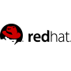

# Third-party software compatible with Azure AD Domain Services

## One Identity Authentication Services

One Identity Authentication Services enables Unix, Linux, and Mac OS X systems to use the access, authentication, and authorization of an organization’s existing Active Directory (AD) infrastructure. Authentication Services now supports Azure Active Directory Domain Services enabling non-Windows resources to utilize the same next-generation platform that your existing SaaS solutions already use.

[One Identity Authentication Services](https://www.quest.com/products/authentication-services/)

[KB Article - Use One Identity Authentication Services with Azure AD Domain Services](https://support.quest.com/authentication-services/kb/208427)

## Red Hat Enterprise Linux

Red Hat Enterprise Linux is the world's leading enterprise Linux platform built to meet the needs of today's modern enterprise. Red Hat Enterprise Linux is the preferred choice for enterprise Linux virtual machine (VM) workloads on Microsoft Azure. Red Hat Enterprise Linux is an open, reliable, and secure platform designed for customers who want deployment flexibility for their business-critical workloads - from the data center to the Azure cloud - backed by tightly integrated, enterprise-grade support from Red Hat and Microsoft.

[Join Red Hat Enterprise Linux 7.2 VM to Azure AD Domain Services](active-directory-ds-admin-guide-join-rhel-linux-vm.md)
