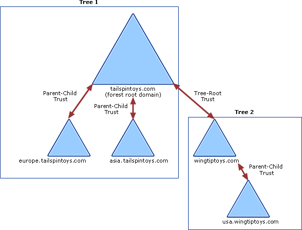
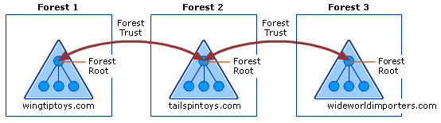
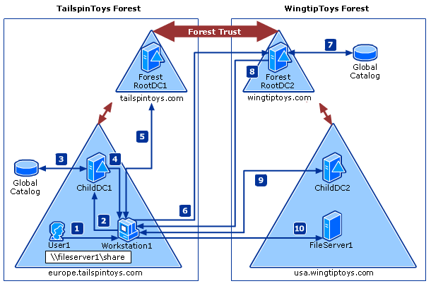

# How trust relationships work for forests in Active Directory 

Active Directory Domain Services (AD DS) provides security across multiple domains or forests through domain and forest trust relationships. Before authentication can occur across trusts, Windows must first check if the domain being requested by a user, computer, or service has a trust relationship with the domain of the requesting account.

To check for this trust relationship, the Windows security system computes a trust path between the domain controller (DC) for the server that receives the request and a DC in the domain of the requesting account.

The access control mechanisms provided by AD DS and the Windows distributed security model provide an environment for the operation of domain and forest trusts. For these trusts to work properly, every resource or computer must have a direct trust path to a DC in the domain in which it is located.

The trust path is implemented by the Net Logon service using an authenticated remote procedure call (RPC) connection to the trusted domain authority. A secured channel also extends to other AD DS domains through interdomain trust relationships. This secured channel is used to obtain and verify security information, including security identifiers (SIDs) for users and groups.

>[!NOTE]
>Domain Services only supports one-way transitive trusts where the managed domain will trust other domains, but no other directions or trust types are supported.

For an overview of how trusts apply to Domain Services, see [Forest concepts and features][create-forest-trust].

To get started using trusts in Domain Services, [create a managed domain that uses forest trusts][tutorial-create-advanced].

## Trust relationship flows

The flow of secured communications over trusts determines the elasticity of a trust. How you create or configure a trust determines how far the communication extends within or across forests.

The flow of communication over trusts is determined by the direction of the trust. Trusts can be one-way or two-way, and can be transitive or non-transitive.

The following diagram shows that all domains in *Tree 1* and *Tree 2* have transitive trust relationships by default. As a result, users in *Tree 1* can access resources in domains in *Tree 2* and users in *Tree 2* can access resources in *Tree 1*, when the proper permissions are assigned at the resource.

### One-way and two-way trusts

Trust relationships enable access to resources can be either one-way or two-way.

A one-way trust is a unidirectional authentication path created between two domains. In a one-way trust between *Domain A* and *Domain B*, users in *Domain A* can access resources in *Domain B*. However, users in *Domain B* can't access resources in *Domain A*.

Some one-way trusts can be either non-transitive or transitive depending on the type of trust being created.

In a two-way trust, *Domain A* trusts *Domain B* and *Domain B* trusts *Domain A*. This configuration means that authentication requests can be passed between the two domains in both directions. Some two-way relationships can be non-transitive or transitive depending on the type of trust being created.

All domain trusts in an AD DS forest are two-way, transitive trusts. When a new child domain is created, a two-way, transitive trust is automatically created between the new child domain and the parent domain.

### Transitive and non-transitive trusts

Transitivity determines whether a trust can be extended outside of the two domains with which it was formed.

* A transitive trust can be used to extend trust relationships with other domains.
* A non-transitive trust can be used to deny trust relationships with other domains.

Each time you create a new domain in a forest, a two-way, transitive trust relationship is automatically created between the new domain and its parent domain. If child domains are added to the new domain, the trust path flows upward through the domain hierarchy extending the initial trust path created between the new domain and its parent domain. Transitive trust relationships flow upward through a domain tree as it is formed, creating transitive trusts between all domains in the domain tree.

Authentication requests follow these trust paths, so accounts from any domain in the forest can be authenticated by any other domain in the forest. With a single sign in process, accounts with the proper permissions can access resources in any domain in the forest.

## Forest trusts

Forest trusts help you to manage a segmented AD DS infrastructures and support access to resources and other objects across multiple forests. Forest trusts are useful for service providers, companies undergoing mergers or acquisitions, collaborative business extranets, and companies seeking a solution for administrative autonomy.

Using forest trusts, you can link two different forests to form a one-way or two-way transitive trust relationship. A forest trust allows administrators to connect two AD DS forests with a single trust relationship to provide a seamless authentication and authorization experience across the forests.

A forest trust can only be created between a forest root domain in one forest and a forest root domain in another forest. Forest trusts can only be created between two forests and can't be implicitly extended to a third forest. This behavior means that if a forest trust is created between *Forest 1* and *Forest 2*, and another forest trust is created between *Forest 2* and *Forest 3*, *Forest 1* doesn't have an implicit trust with *Forest 3*.

The following diagram shows two separate forest trust relationships between three AD DS forests in a single organization.

This example configuration provides the following access:

* Users in *Forest 2* can access resources in any domain in either *Forest 1* or *Forest 3*
* Users in *Forest 3* can access resources in any domain in *Forest 2*
* Users in *Forest 1* can access resources in any domain in *Forest 2*

This configuration doesn't allow users in *Forest 1* to access resources in *Forest 3* or vice versa. To allow users in both *Forest 1* and *Forest 3* to share resources, a two-way transitive trust must be created between the two forests.

If a one-way forest trust is created between two forests, members of the trusted forest can utilize resources located in the trusting forest. However, the trust operates in only one direction.

For example, when a one-way, forest trust is created between *Forest 1* (the trusted forest) and *Forest 2* (the trusting forest):

* Members of *Forest 1* can access resources located in *Forest 2*.
* Members of *Forest 2* can't access resources located in *Forest 1* using the same trust.

> [!IMPORTANT]
> Microsoft Entra Domain Services only supports a one-way forest trust to on-premises Active Directory.

### Forest trust requirements

Before you can create a forest trust, you need to verify you have the correct Domain Name System (DNS) infrastructure in place. Forest trusts can only be created when one of the following DNS configurations is available:

* A single root DNS server is the root DNS server for both forest DNS namespaces - the root zone contains delegations for each of the DNS namespaces and the root hints of all DNS servers include the root DNS server.
* When there is no shared root DNS server and the root DNS servers in each forest DNS namespace use DNS conditional forwarders for each DNS namespace to route queries for names in the other namespace.

    > [!IMPORTANT]
    > Any Microsoft Entra Domain Services forest with a trust must use this DNS configuration. Hosting a DNS namespace other than the forest DNS namespace is not a feature of Microsoft Entra Domain Services. Conditional forwarders is the proper configuration.

* When there is no shared root DNS server and the root DNS servers in each forest DNS namespace are use DNS secondary zones are configured in each DNS namespace to route queries for names in the other namespace.

To create a forest trust, you must be a member of the Domain Admins group (in the forest root domain) or the Enterprise Admins group in Active Directory. Each trust is assigned a password that the administrators in both forests must know. Members of Enterprise Admins in both forests can create the trusts in both forests at once and, in this scenario, a password that is cryptographically random is automatically generated and written for both forests.

A managed domain forest supports up to five one-way outbound forest trusts to on-premises forests. The outbound forest trust for Microsoft Entra Domain Services is created in the Microsoft Entra admin center. You don't manually create the trust with the managed domain itself. The incoming forest trust must be configured by a user with the privileges previously noted in the on-premises Active Directory. 

## Trust processes and interactions

Many inter-domain and inter-forest transactions depend on domain or forest trusts in order to complete various tasks. This section describes the processes and interactions that occur as resources are accessed across trusts and authentication referrals are evaluated.

### Overview of authentication referral processing

When a request for authentication is referred to a domain, the domain controller in that domain must determine whether a trust relationship exists with the domain from which the request comes. The direction of the trust and whether the trust is transitive or nontransitive must also be determined before it authenticates the user to access resources in the domain. The authentication process that occurs between trusted domains varies according to the authentication protocol in use. The Kerberos V5 and NTLM protocols process referrals for authentication to a domain differently

### Kerberos V5 referral processing

The Kerberos V5 authentication protocol is dependent on the Net Logon service on domain controllers for client authentication and authorization information. The Kerberos protocol connects to an online Key Distribution Center (KDC) and the Active Directory account store for session tickets.

The Kerberos protocol also uses trusts for cross-realm ticket-granting services (TGS) and to validate Privilege Attribute Certificates (PACs) across a secured channel. The Kerberos protocol performs cross-realm authentication only with non-Windows-brand operating system Kerberos realms such as an MIT Kerberos realm and does not need to interact with the Net Logon service.

If the client uses Kerberos V5 for authentication, it requests a ticket to the server in the target domain from a domain controller in its account domain. The Kerberos KDC acts as a trusted intermediary between the client and server and provides a session key that enables the two parties to authenticate each other. If the target domain is different from the current domain, the KDC follows a logical process to determine whether an authentication request can be referred:

1. Is the current domain trusted directly by the domain of the server that is being requested?
    * If yes, send the client a referral to the requested domain.
    * If no, go to the next step.

2. Does a transitive trust relationship exist between the current domain and the next domain on the trust path?
    * If yes, send the client a referral to the next domain on the trust path.
    * If no, send the client a sign-in denied message.

### NTLM referral processing

The NTLM authentication protocol is dependent on the Net Logon service on domain controllers for client authentication and authorization information. This protocol authenticates clients that do not use Kerberos authentication. NTLM uses trusts to pass authentication requests between domains.

If the client uses NTLM for authentication, the initial request for authentication goes directly from the client to the resource server in the target domain. This server creates a challenge to which the client responds. The server then sends the user's response to a domain controller in its computer account domain. This domain controller checks the user account against its security accounts database.

If the account does not exist in the database, the domain controller determines whether to perform pass-through authentication, forward the request, or deny the request by using the following logic:

1. Does the current domain have a direct trust relationship with the user's domain?
    * If yes, the domain controller sends the credentials of the client to a domain controller in the user's domain for pass-through authentication.
    * If no, go to the next step.

2. Does the current domain have a transitive trust relationship with the user's domain?
    * If yes, pass the authentication request on to the next domain in the trust path. This domain controller repeats the process by checking the user's credentials against its own security accounts database.
    * If no, send the client a logon-denied message.

### Kerberos-based processing of authentication requests over forest trusts

When two forests are connected by a forest trust, authentication requests made using the Kerberos V5 or NTLM protocols can be routed between forests to provide access to resources in both forests.

When a forest trust is first established, each forest collects all of the trusted namespaces in its partner forest and stores the information in a [trusted domain object](#trusted-domain-object). Trusted namespaces include domain tree names, user principal name (UPN) suffixes, service principal name (SPN) suffixes, and security ID (SID) namespaces used in the other forest. TDO objects are replicated to the global catalog.

>[!NOTE]
>Alternate UPN suffixes on trusts are not supported. If an on-premises domain uses the same UPN suffix as Domain Services, sign in must use **sAMAccountName**.  

Before authentication protocols can follow the forest trust path, the service principal name (SPN) of the resource computer must be resolved to a location in the other forest. An SPN can be one of the following names:

* The DNS name of a host.
* The DNS name of a domain.
* The distinguished name of a service connection point object.

When a workstation in one forest attempts to access data on a resource computer in another forest, the Kerberos authentication process contacts the domain controller for a service ticket to the SPN of the resource computer. Once the domain controller queries the global catalog and determines that the SPN is not in the same forest as the domain controller, the domain controller sends a referral for its parent domain back to the workstation. At that point, the workstation queries the parent domain for the service ticket and continues to follow the referral chain until it reaches the domain where the resource is located.

The following diagram and steps provide a detailed description of the Kerberos authentication process that's used when computers running Windows attempt to access resources from a computer located in another forest.

1. *User1* signs in to *Workstation1* using credentials from the *europe.tailspintoys.com* domain. The user then attempts to access a shared resource on *FileServer1* located in the *usa.wingtiptoys.com* forest.

2. *Workstation1* contacts the Kerberos KDC on a domain controller in its domain, *ChildDC1*, and requests a service ticket for the *FileServer1* SPN.

3. *ChildDC1* does not find the SPN in its domain database and queries the global catalog to see if any domains in the *tailspintoys.com* forest contain this SPN. Because a global catalog is limited to its own forest, the SPN is not found.

    The global catalog then checks its database for information about any forest trusts that are established with its forest. If found, it compares the name suffixes listed in the forest trust trusted domain object (TDO) to the suffix of the target SPN to find a match. Once a match is found, the global catalog provides a routing hint back to *ChildDC1*.

    Routing hints help direct authentication requests toward the destination forest. Hints are only used when all traditional authentication channels, such as local domain controller and then global catalog, fail to locate an SPN.

4. *ChildDC1* sends a referral for its parent domain back to *Workstation1*.

5. *Workstation1* contacts a domain controller in *ForestRootDC1* (its parent domain) for a referral to a domain controller (*ForestRootDC2*) in the forest root domain of the *wingtiptoys.com* forest.

6. *Workstation1* contacts *ForestRootDC2* in the *wingtiptoys.com* forest for a service ticket to the requested service.

7. *ForestRootDC2* contacts its global catalog to find the SPN, and the global catalog finds a match for the SPN and sends it back to *ForestRootDC2*.

8. *ForestRootDC2* then sends the referral to *usa.wingtiptoys.com* back to *Workstation1*.

9. *Workstation1* contacts the KDC on *ChildDC2* and negotiates the ticket for *User1* to gain access to *FileServer1*.

10. Once *Workstation1* has a service ticket, it sends the service ticket to *FileServer1*, which reads *User1*'s security credentials and constructs an access token accordingly.

## Trusted domain object

Each domain or forest trust within an organization is represented by a Trusted Domain Object (TDO) stored in the *System* container within its domain.

### TDO contents

The information contained in a TDO varies depending on whether a TDO was created by a domain trust or by a forest trust.

When a domain trust is created, attributes such as the DNS domain name, domain SID, trust type, trust transitivity, and the reciprocal domain name are represented in the TDO. Forest trust TDOs store additional attributes to identify all of the trusted namespaces from the partner forest. These attributes include domain tree names, user principal name (UPN) suffixes, service principal name (SPN) suffixes, and security ID (SID) namespaces.

Because trusts are stored in Active Directory as TDOs, all domains in a forest have knowledge of the trust relationships that are in place throughout the forest. Similarly, when two or more forests are joined together through forest trusts, the forest root domains in each forest have knowledge of the trust relationships that are in place throughout all of the domains in trusted forests.

### TDO password changes

Both domains in a trust relationship share a password, which is stored in the TDO object in Active Directory. As part of the account maintenance process, every 30 days the trusting domain controller changes the password stored in the TDO. Because all two-way trusts are actually two one-way trusts going in opposite directions, the process occurs twice for two-way trusts.

A trust has a trusting and a trusted side. On the trusted side, any writable domain controller can be used for the process. On the trusting side, the PDC emulator performs the password change.

To change a password, the domain controllers complete the following process:

1. The primary domain controller (PDC) emulator in the trusting domain creates a new password. A domain controller in the trusted domain never initiates the password change. It's always initiated by the trusting domain PDC emulator.

2. The PDC emulator in the trusting domain sets the *OldPassword* field of the TDO object to the current *NewPassword* field.

3. The PDC emulator in the trusting domain sets the *NewPassword* field of the TDO object to the new password. Keeping a copy of the previous password makes it possible to revert to the old password if the domain controller in the trusted domain fails to receive the change, or if the change is not replicated before a request is made that uses the new trust password.

4. The PDC emulator in the trusting domain makes a remote call to a domain controller in the trusted domain asking it to set the password on the trust account to the new password.

5. The domain controller in the trusted domain changes the trust password to the new password.

6. On each side of the trust, the updates are replicated to the other domain controllers in the domain. In the trusting domain, the change triggers an urgent replication of the trusted domain object.

The password is now changed on both domain controllers. Normal replication distributes the TDO objects to the other domain controllers in the domain. However, it's possible for the domain controller in the trusting domain to change the password without successfully updating a domain controller in the trusted domain. This scenario might occur because a secured channel, which is required to process the password change, couldn't be established. It's also possible that the domain controller in the trusted domain might be unavailable at some point during the process and might not receive the updated password.

To deal with situations in which the password change isn't successfully communicated, the domain controller in the trusting domain never changes the new password unless it has successfully authenticated (set up a secured channel) using the new password. This behavior is why both the old and new passwords are kept in the TDO object of the trusting domain.

A password change isn't finalized until authentication using the password succeeds. The old, stored password can be used over the secured channel until the domain controller in the trusted domain receives the new password, thus enabling uninterrupted service.

If authentication using the new password fails because the password is invalid, the trusting domain controller tries to authenticate using the old password. If it authenticates successfully with the old password, it resumes the password change process within 15 minutes.

Trust password updates need to replicate to the domain controllers of both sides of the trust within 30 days. If the trust password is changed after 30 days and a domain controller only has the N-2 password, it cannot use the trust from the trusting side and cannot create a secure channel on the trusted side.

## Network ports used by trusts

Because trusts must be deployed across various network boundaries, they might have to span one or more firewalls. When this is the case, you can either tunnel trust traffic across a firewall or open specific ports in the firewall to allow the traffic to pass through.

> [!IMPORTANT]
> Active Directory Domain Services does not support restricting Active Directory RPC traffic to specific ports.

Read the **Windows Server 2008 and later versions** section of the Microsoft Support Article [How to configure a firewall for Active Directory domains and trusts](https://support.microsoft.com/help/179442/how-to-configure-a-firewall-for-domains-and-trusts) to learn about the ports needed for a forest trust.

## Supporting services and tools

To support trusts and authentication, some additional features and management tools are used.

### Net Logon

The Net Logon service maintains a secured channel from a Windows-based computer to a DC. It's also used in the following trust-related processes:

* Trust setup and management - Net Logon helps maintain trust passwords, gathers trust information, and verifies trusts by interacting with the LSA process and the TDO.

    For Forest trusts, the trust information includes the Forest Trust Information (*FTInfo*) record, which includes the set of namespaces that a trusted forest claims to manage, annotated with a field that indicates whether each claim is trusted by the trusting forest.

* Authentication – Supplies user credentials over a secured channel to a domain controller and returns the domain SIDs and user rights for the user.

* Domain controller location – Helps with finding or locating domain controllers in a domain or across domains.

* Pass-through validation – Credentials of users in other domains are processed by Net Logon. When a trusting domain needs to verify the identity of a user, it passes the user's credentials through Net Logon to the trusted domain for verification.

* Privilege Attribute Certificate (PAC) verification – When a server using the Kerberos protocol for authentication needs to verify the PAC in a service ticket, it sends the PAC across the secure channel to its domain controller for verification.

### Local Security Authority

The Local Security Authority (LSA) is a protected subsystem that maintains information about all aspects of local security on a system. Collectively known as local security policy, the LSA provides various services for translation between names and identifiers.

The LSA security subsystem provides services in both kernel mode and user mode for validating access to objects, checking user privileges, and generating audit messages. LSA is responsible for checking the validity of all session tickets presented by services in trusted or untrusted domains.

### Management tools

Administrators can use *Active Directory Domains and Trusts*, *Netdom* and *Nltest* to expose, create, remove, or modify trusts.

* *Active Directory Domains and Trusts* is the Microsoft Management Console (MMC) that is used to administer domain trusts, domain and forest functional levels, and user principal name suffixes.
* The *Netdom* and *Nltest* command-line tools can be used to find, display, create, and manage trusts. These tools communicate directly with the LSA authority on a domain controller.

## Next steps

To get started with creating a managed domain with a forest trust, see [Create and configure a Domain Services managed domain][tutorial-create-advanced]. You can then [Create an outbound forest trust to an on-premises domain][create-forest-trust].

<!-- LINKS - INTERNAL -->
[tutorial-create-advanced]: tutorial-create-instance-advanced.md
[create-forest-trust]: tutorial-create-forest-trust.md
