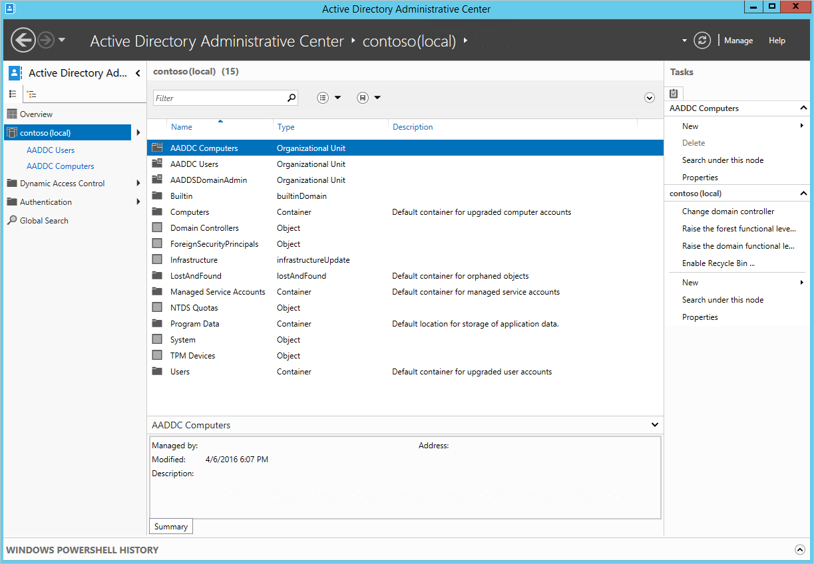
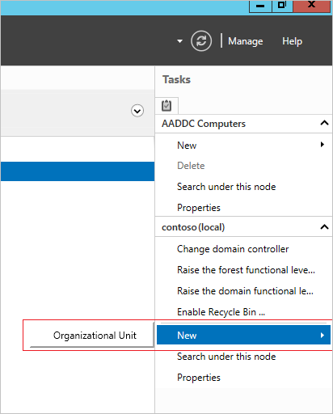
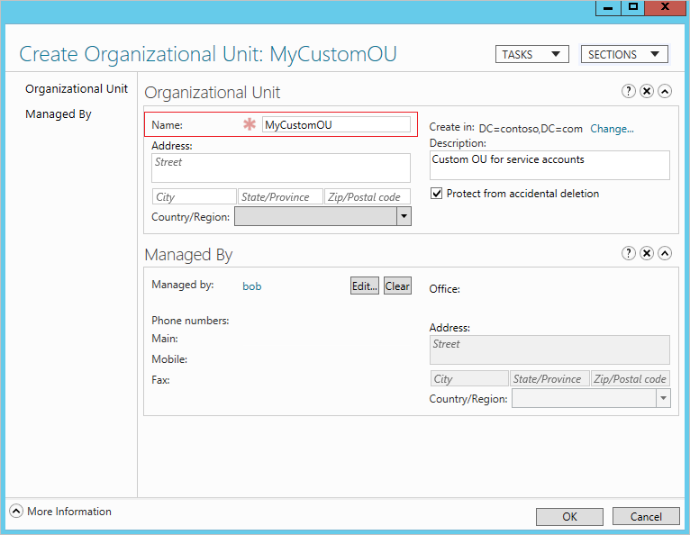
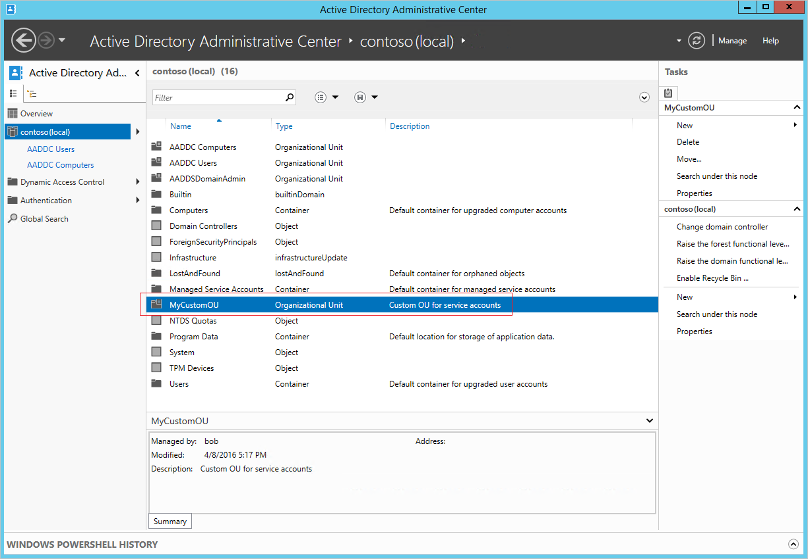
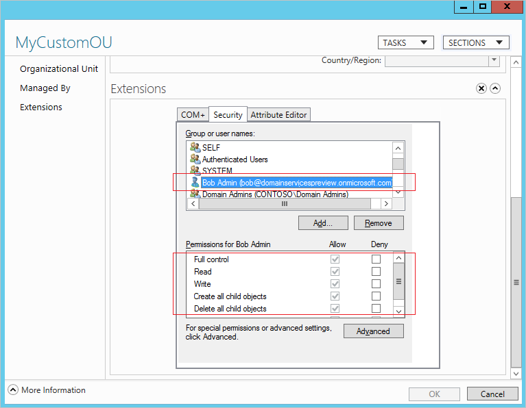

# Create an Organizational Unit (OU) on an Azure AD Domain Services managed domain
Azure AD Domain Services managed domains include two built-in containers called 'AADDC Computers' and 'AADDC Users' respectively. The 'AADDC Computers' container has computer objects for all computers that are joined to the managed domain. The 'AADDC Users' container includes users and groups in the Azure AD tenant. Occasionally, it may be necessary to create service accounts on the managed domain to deploy workloads. For this purpose, you can create a custom Organizational Unit (OU) on the managed domain and create service accounts within that OU. This article shows you how to create an OU in your managed domain.

[!INCLUDE [active-directory-ds-prerequisites.md](../../includes/active-directory-ds-prerequisites.md)]

## Before you begin
To perform the tasks listed in this article, you need:

1. A valid **Azure subscription**.
2. An **Azure AD directory** - either synchronized with an on-premises directory or a cloud-only directory.
3. **Azure AD Domain Services** must be enabled for the Azure AD directory. If you haven't done so, follow all the tasks outlined in the [Getting Started guide](create-instance.md).
4. A domain-joined virtual machine from which you administer the Azure AD Domain Services managed domain. If you don't have such a virtual machine, follow all the tasks outlined in the article titled [Join a Windows virtual machine to a managed domain](active-directory-ds-admin-guide-join-windows-vm.md).
5. You need the credentials of a **user account belonging to the 'AAD DC Administrators' group** in your directory, to create a custom OU on your managed domain.

## Install AD administration tools on a domain-joined virtual machine for remote administration
Azure AD Domain Services managed domains can be managed remotely using familiar Active Directory administrative tools such as the Active Directory Administrative Center (ADAC) or AD PowerShell. Tenant administrators do not have privileges to connect to domain controllers on the managed domain via Remote Desktop. To administer the managed domain, install the AD administration tools feature on a virtual machine joined to the managed domain. Refer to the article titled [Manage an Azure AD Domain Services domain](manage-domain.md) for instructions.

## Create an Organizational Unit on the managed domain
Now that the AD Administrative Tools are installed on the domain joined virtual machine, we can use these tools to create an organization unit on the managed domain. Perform the following steps:

> [!NOTE]
> Only members of the 'AAD DC Administrators' group have the required privileges to create a custom OU. Ensure that you perform the following steps as a user who belongs to this group.
>
>

1. From the Start screen, click **Administrative Tools**. You should see the AD administrative tools installed on the virtual machine.

    
2. Click **Active Directory Administrative Center**.

    
3. To view the domain, click the domain name in the left pane (for example, 'contoso100.com').

    
4. On the right side **Tasks** pane, click **New** under the domain name node. In this example, we click **New** under the 'contoso100(local)' node on the right side **Tasks** pane.

    
5. You should see the option to create an Organizational Unit. Click **Organizational Unit** to launch the **Create Organizational Unit** dialog.
6. In the **Create Organizational Unit** dialog, specify a **Name** for the new OU. Provide a short description for the OU. You may also set the **Managed By** field for the OU. To create the custom OU, click **OK**.

    
7. The newly created OU should now appear in the AD Administrative Center (ADAC).

    

## Permissions/Security for newly created OUs
By default, the user (member of the 'AAD DC Administrators' group) who created the custom OU is granted administrative privileges (full control) over the OU. The user can then go ahead and grant privileges to other users or to the 'AAD DC Administrators' group as desired. As seen in the following screenshot, the user 'bob@domainservicespreview.onmicrosoft.com' who created the new 'MyCustomOU' organizational unit is granted full control over it.

 

## Notes on administering custom OUs
Now that you have created a custom OU, you can go ahead and create users, groups, computers, and service accounts in this OU. You cannot move users or groups from the 'AADDC Users' OU to custom OUs.

> [!WARNING]
> User accounts, groups, service accounts, and computer objects that you create under custom OUs are not available in your Azure AD tenant. In other words, these objects do not show up using the Azure AD Graph API or in the Azure AD UI. These objects are only available in your Azure AD Domain Services managed domain.
>
>

## Related Content
* [Manage an Azure AD Domain Services domain](manage-domain.md)
* [Manage Group Policy for Azure AD Domain Services](manage-group-policy.md)
* [Active Directory Administrative Center: Getting Started](https://technet.microsoft.com/library/dd560651.aspx)
* [Service Accounts Step-by-Step Guide](https://technet.microsoft.com/library/dd548356.aspx)
