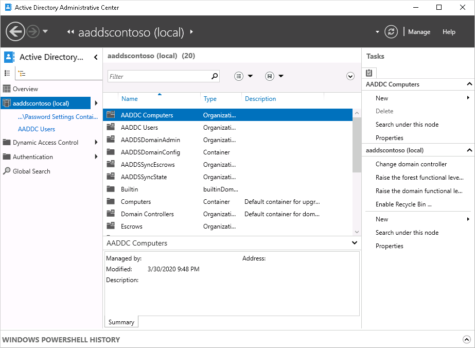
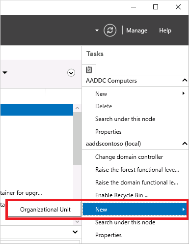
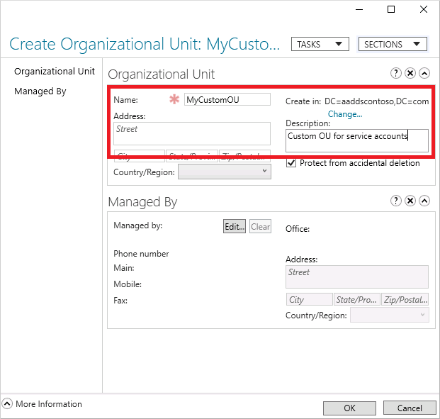
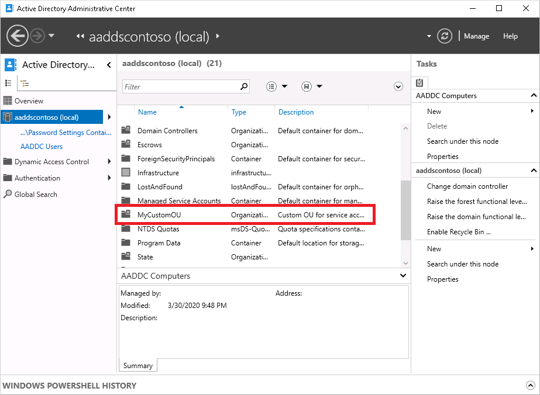

# Create an Organizational Unit (OU) in an Azure Active Directory Domain Services managed domain

Organizational units (OUs) in Active Directory Domain Services (AD DS) let you logically group objects such as user accounts, service accounts, or computer accounts. You can then assign administrators to specific OUs, and apply group policy to enforce targeted configuration settings.

Azure AD DS managed domains include the following two built-in OUs:

* *AADDC Computers* - contains computer objects for all computers that are joined to the managed domain.
* *AADDC Users* - includes users and groups synchronized in from the Azure AD tenant.

As you create and run workloads that use Azure AD DS, you may need to create service accounts for applications to authenticate themselves. To organize these service accounts, you often create a custom OU in the managed domain and then create service accounts within that OU.

In a hybrid environment, OUs created in an on-premises AD DS environment aren't synchronized to Azure AD DS. Managed domains use a flat OU structure. All user accounts and groups are stored in the *AADDC Users* container, despite being synchronized from different on-premises domains or forests, even if you've configured a hierarchical OU structure there.

This article shows you how to create an OU in your managed domain.

## Before you begin

To complete this article, you need the following resources and privileges:

* An active Azure subscription.
    * If you don't have an Azure subscription, [create an account](https://azure.microsoft.com/free/?WT.mc_id=A261C142F).
* An Azure Active Directory tenant associated with your subscription, either synchronized with an on-premises directory or a cloud-only directory.
    * If needed, [create an Azure Active Directory tenant][create-azure-ad-tenant] or [associate an Azure subscription with your account][associate-azure-ad-tenant].
* An Azure Active Directory Domain Services managed domain enabled and configured in your Azure AD tenant.
    * If needed, complete the tutorial to [create and configure an Azure Active Directory Domain Services managed domain][create-azure-ad-ds-instance].
* A Windows Server management VM that is joined to the Azure AD DS managed domain.
    * If needed, complete the tutorial to [create a management VM][tutorial-create-management-vm].
* A user account that's a member of the *Azure AD DC administrators* group in your Azure AD tenant.

## Custom OU considerations and limitations

When you create custom OUs in a managed domain, you gain additional management flexibility for user management and applying group policy. Compared to an on-premises AD DS environment, there are some limitations and considerations when creating and managing a custom OU structure in Azure AD DS:

* To create custom OUs, users must be a member of the *AAD DC Administrators* group.
* A user that creates a custom OU is granted administrative privileges (full control) over that OU and is the resource owner.
    * By default, the *AAD DC Administrators* group also has full control of the custom OU.
* A default OU for *AADDC Users* is created that contains all the synchronized user accounts from your Azure AD tenant.
    * You can't move users or groups from the *AADDC Users* OU to custom OUs that you create. Only user accounts or resources created in the managed domain can be moved into custom OUs.
* User accounts, groups, service accounts, and computer objects that you create under custom OUs aren't available in your Azure AD tenant.
    * These objects don't show up using the Microsoft Graph API or in the Azure AD UI; they're only available in your managed domain.

## Create a custom OU

To create a custom OU, you use the Active Directory Administrative Tools from a domain-joined VM. The Active Directory Administrative Center lets you view, edit, and create resources in a managed domain, including OUs.

> [!NOTE]
> To create a custom OU in a managed domain, you must be signed in to a user account that's a member of the *AAD DC Administrators* group.

1. Sign in to your management VM. For steps on how to connect using the Azure portal, see [Connect to a Windows Server VM][connect-windows-server-vm].
1. From the Start screen, select **Administrative Tools**. A list of available management tools is shown that were installed in the tutorial to [create a management VM][tutorial-create-management-vm].
1. To create and manage OUs, select **Active Directory Administrative Center** from the list of administrative tools.
1. In the left pane, choose your managed domain, such as *aaddscontoso.com*. A list of existing OUs and resources is shown:

    

1. The **Tasks** pane is shown on the right side of the Active Directory Administrative Center. Under the domain, such as *aaddscontoso.com*, select **New > Organizational Unit**.

    

1. In the **Create Organizational Unit** dialog, specify a **Name** for the new OU, such as *MyCustomOu*. Provide a short description for the OU, such as *Custom OU for service accounts*. If desired, you can also set the **Managed By** field for the OU. To create the custom OU, select **OK**.

    

1. Back in the Active Directory Administrative Center, the custom OU is now listed and is available for use:

    

## Next steps

For more information on using the administrative tools or creating and using service accounts, see the following articles:

* [Active Directory Administrative Center: Getting Started](https://technet.microsoft.com/library/dd560651.aspx)
* [Service Accounts Step-by-Step Guide](https://technet.microsoft.com/library/dd548356.aspx)

<!-- INTERNAL LINKS -->
[create-azure-ad-tenant]: ../active-directory/fundamentals/sign-up-organization.md
[associate-azure-ad-tenant]: ../active-directory/fundamentals/active-directory-how-subscriptions-associated-directory.md
[create-azure-ad-ds-instance]: tutorial-create-instance.md
[tutorial-create-management-vm]: tutorial-create-management-vm.md
[connect-windows-server-vm]: join-windows-vm.md#connect-to-the-windows-server-vm
