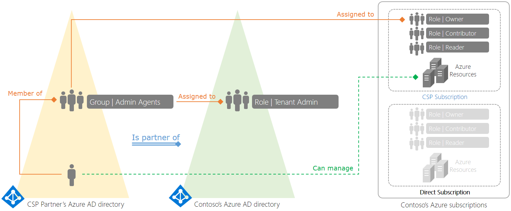
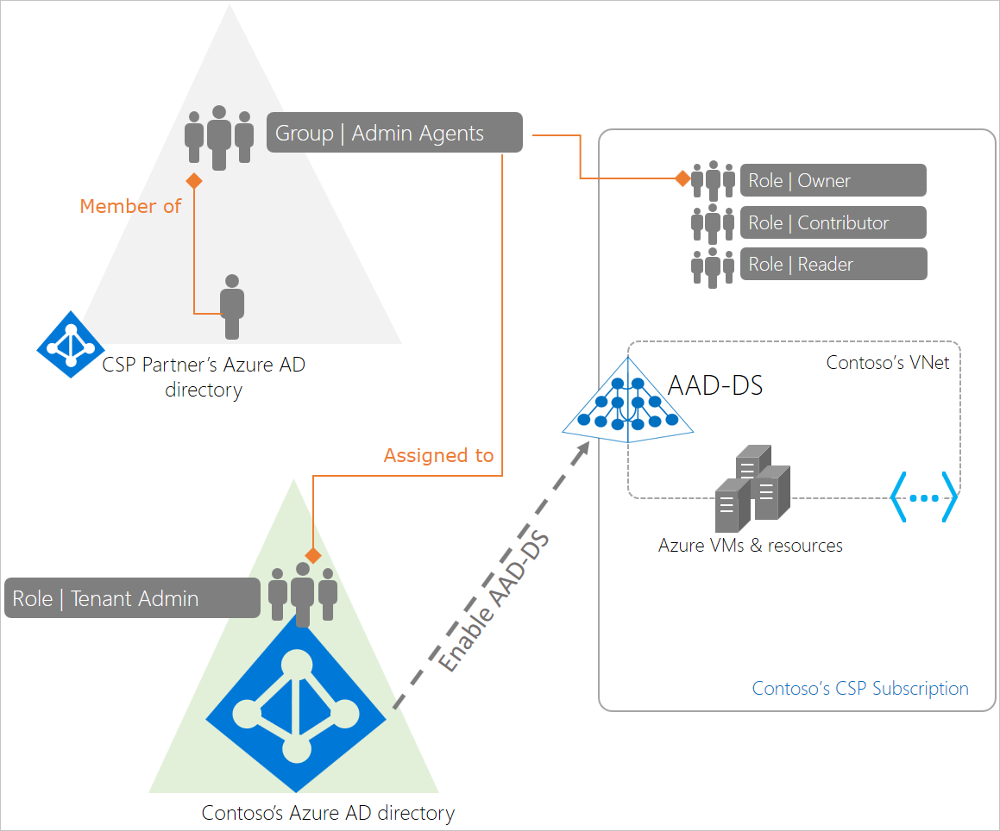
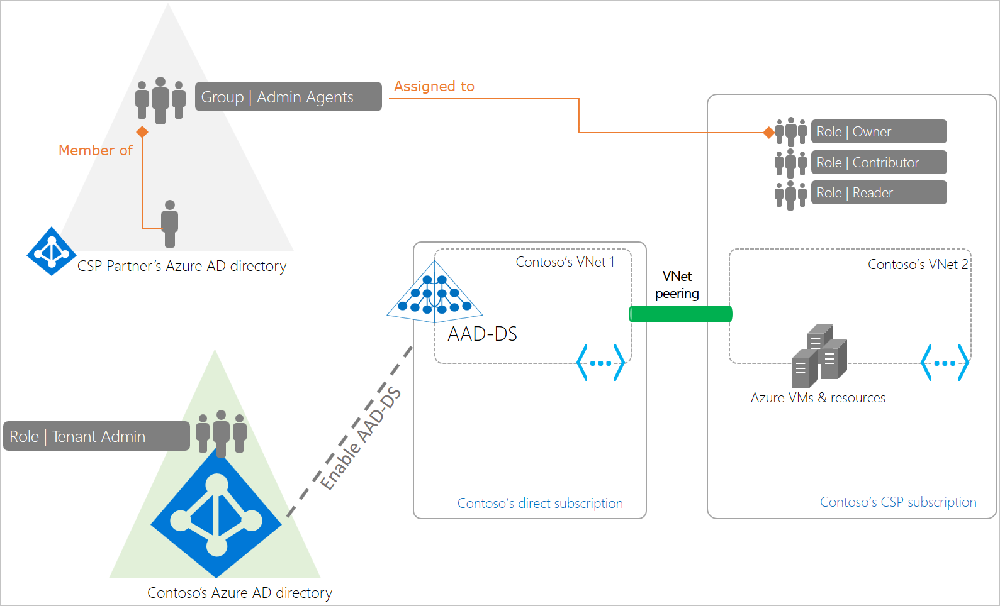

# Azure Active Directory Domain Services deployment and management for Azure Cloud Solution Providers

Azure Cloud Solution Providers (CSP) is a program for Microsoft Partners and provides a license channel for various Microsoft cloud services. Azure CSP enables partners to manage sales, own the billing relationship, provide technical and billing support, and be the customer's single point of contact. In addition, Azure CSP provides a full set of tools, including a self-service portal and accompanying APIs. These tools enable CSP partners to easily provision and manage Azure resources, and provide billing for customers and their subscriptions.

The [Partner Center portal](/partner-center/azure-plan-lp) is the entry point for all Azure CSP partners, and provides rich customer management capabilities, automated processing, and more. Azure CSP partners can use Partner Center capabilities by using a web-based UI or by using PowerShell and various API calls.

The following diagram illustrates how the CSP model works at a high level. Here, Contoso has an Azure Active Directory (Azure AD) tenant. They have a partnership with a CSP, who deploys and manages resources in their Azure CSP subscription. Contoso may also have regular (direct) Azure subscriptions, which are billed directly to Contoso.

The CSP partner's tenant has three special agent groups - *Admin* agents, *Helpdesk* agents, and *Sales* agents.

The *Admin* agents group is assigned to the tenant administrator role in Contoso's Azure AD tenant. As a result, a user belonging to the CSP partner's admin agents group has tenant admin privileges in Contoso's Azure AD tenant.

When the CSP partner provisions an Azure CSP subscription for Contoso, their admin agents group is assigned to the owner role for that subscription. As a result, the CSP partner's admin agents have the required privileges to provision Azure resources such as virtual machines, virtual networks, and Azure AD Domain Services on behalf of Contoso.

For more information, see the [Azure CSP overview](/partner-center/azure-plan-lp)

## Benefits of using Azure AD DS in an Azure CSP subscription

Azure Active Directory Domain Services (Azure AD DS) provides managed domain services such as domain join, group policy, LDAP, Kerberos/NTLM authentication that is fully compatible with Windows Server Active Directory Domain Services. Over the decades, many applications have been built to work against AD using these capabilities. Many independent software vendors (ISVs) have built and deployed applications at their customers' premises. These applications are hard to support since you often require access to the different environments where the applications are deployed. With Azure CSP subscriptions, you have a simpler alternative with the scale and flexibility of Azure.

Azure AD DS supports Azure CSP subscriptions. You can deploy your application in an Azure CSP subscription tied to your customer's Azure AD tenant. As a result, your employees (support staff) can manage, administer, and service the VMs on which your application is deployed using your organization's corporate credentials.

You can also deploy an Azure AD DS managed domain in your customer's Azure AD tenant. Your application is then connected to your customer's managed domain. Capabilities within your application that rely on Kerberos / NTLM, LDAP, or the [System.DirectoryServices API](/dotnet/api/system.directoryservices) work seamlessly against your customer's domain. End customers benefit from consuming your application as a service, without needing to worry about maintaining the infrastructure the application is deployed on.

All billing for Azure resources you consume in that subscription, including Azure AD DS, is charged back to you. You maintain full control over the relationship with the customer when it comes to sales, billing, technical support etc. With the flexibility of the Azure CSP platform, a small team of support agents can service many such customers who have instances of your application deployed.

## CSP deployment models for Azure AD DS

There are two ways in which you can use Azure AD DS with an Azure CSP subscription. Pick the right one based on the security and simplicity considerations your customers have.

### Direct deployment model

In this deployment model, Azure AD DS is enabled within a virtual network that belongs to the Azure CSP subscription. The CSP partner's admin agents have the following privileges:

* *Global administrator* privileges in the customer's Azure AD tenant.
* *Subscription owner* privileges on the Azure CSP subscription.

In this deployment model, the CSP provider's admin agents can administer identities for the customer. These admin agents can perform tasks like provision new users or groups, or add applications within the customer's Azure AD tenant.

This deployment model may be suited for smaller organizations that don't have a dedicated identity administrator or prefer for the CSP partner to administer identities on their behalf.

### Peered deployment model

In this deployment model, Azure AD DS is enabled within a virtual network belonging to the customer - a direct Azure subscription paid for by the customer. The CSP partner can deploy applications within a virtual network belonging to the customer's CSP subscription. The virtual networks can then be connected using Azure virtual network peering.

With this deployment, the workloads or applications deployed by the CSP partner in the Azure CSP subscription can connect to the customer's managed domain provisioned in the customer's direct Azure subscription.

This deployment model provides a separation of privileges and enables the CSP partner's helpdesk agents to administer the Azure subscription and deploy and manage resources within it. However, the CSP partner's helpdesk agents don't need to have global administrator privileges on the customer's Azure AD directory. The customer's identity administrators can continue to manage identities for their organization.

This deployment model may be suited to scenarios where an ISV provides a hosted version of their on-premises application, which also needs to connect to the customer's Azure AD.

## Administer Azure AD DS in CSP subscriptions

The following important considerations apply when administering a managed domain in an Azure CSP subscription:

* **CSP admin agents can provision a managed domain using their credentials:** Azure AD DS supports Azure CSP subscriptions. Users belonging to a CSP partner's admin agents group can provision a new managed domain.

* **CSPs can script creation of new managed domains for their customers using PowerShell:** See [how to enable Azure AD DS using PowerShell](powershell-create-instance.md) for details.

* **CSP admin agents can't perform ongoing management tasks on the managed domain using their credentials:** CSP admin users can't perform routine management tasks within the managed domain using their credentials. These users are external to the customer's Azure AD tenant and their credentials aren't available within the customer's Azure AD tenant. Azure AD DS doesn't have access to the Kerberos and NTLM password hashes for these users, so users can't be authenticated on managed domains.

  > [!WARNING]
  > You must create a user account within the customer's directory to perform ongoing administration tasks on the managed domain.
  >
  > You can't sign in to the managed domain using a CSP admin user's credentials. Use the credentials of a user account belonging to the customer's Azure AD tenant to do so. You need these credentials for tasks such as joining VMs to the managed domain, administering DNS, or administering Group Policy.

* **The user account created for ongoing administration must be added to the *AAD DC Administrators* group:** The *AAD DC Administrators* group has privileges to perform certain delegated administration tasks on the managed domain. These tasks include configuring DNS, creating organizational units, and administering group policy.
    
    For a CSP partner to perform these tasks on a managed domain, a user account must be created within the customer's Azure AD tenant. The credentials for this account must be shared with the CSP partner's admin agents. Also, this user account must be added to the *AAD DC Administrators* group to enable configuration tasks on the managed domain to be performed using this user account.

## Next steps

To get started, [enroll in the Azure CSP program](/partner-center/enrolling-in-the-csp-program). You can then enable Azure AD Domain Services using the [Azure portal](tutorial-create-instance.md) or [Azure PowerShell](powershell-create-instance.md).
