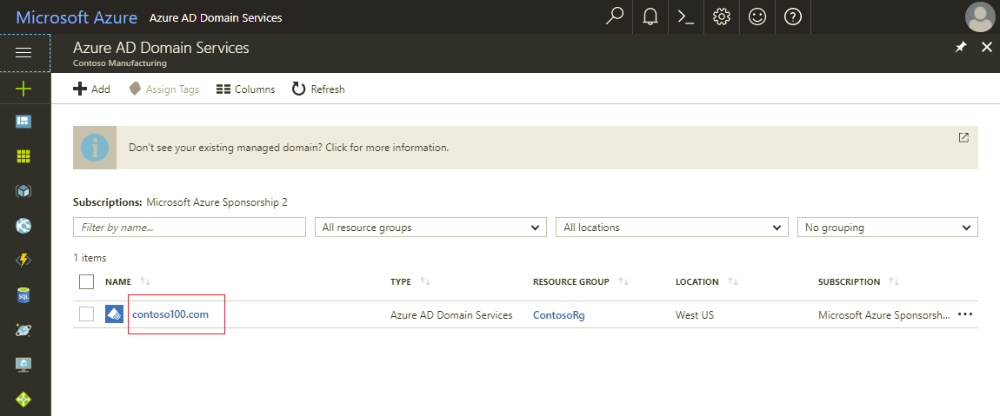
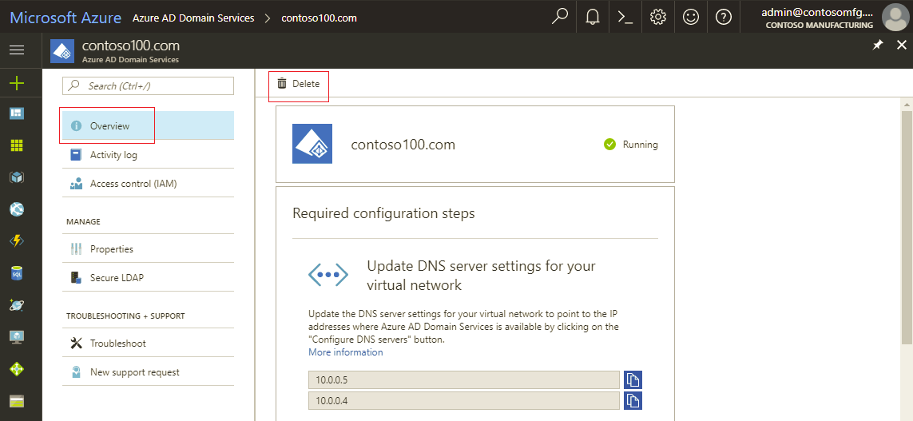
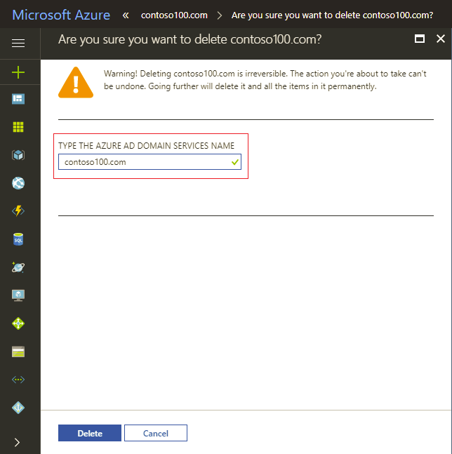

# Disable Azure Active Directory Domain Services using the Azure portal
This article shows you how to use the Azure portal to disable Azure Active Directory (AD) Domain Services for your Azure AD directory.

> [!WARNING]
> **Deletion is permanent and cannot be reversed.**
> Proceed with caution! When you delete the managed domain:
>   * Domain controllers for the managed domain are de-provisioned and removed from the virtual network.
>   * Data on the managed domain is deleted permanently. This includes custom OUs, GPOs, custom DNS records, service principals, GMSAs etc. that you have created on the managed domain.
>   * Machines joined to the managed domain lose their trust relationship with the domain and need to be unjoined from the domain.
>   * You cannot sign in to these machines using corporate AD credentials. Use the local administrator credentials for the machine, instead.
> Deleting the managed domain does not delete your Azure AD directory or otherwise adversely impact the directory.

Perform the following steps to delete your Azure AD Domain Services managed domain:
1. Navigate to the [Azure AD Domain Services extension](https://portal.azure.com/#blade/HubsExtension/Resources/resourceType/Microsoft.AAD%2FdomainServices) in the Azure portal.
2. Click the name of your managed domain.

    

3. On the **Overview** page, click the **Delete** button.

    

4. To confirm the deletion, type the DNS domain name of the managed domain. Click the **Delete** button when you are done.

    

The managed domain is deleted in about 15-20 minutes.

Consider [sharing feedback](contact-us.md) to help us understand what features would help you chose Azure AD Domain Services in the future. This feedback helps us evolve the service to better suit your deployment needs and use-cases.
