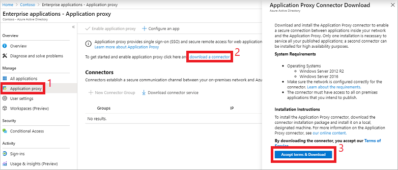

# Deploy Microsoft Entra application proxy for secure access to internal applications in a Microsoft Entra Domain Services managed domain

With Microsoft Entra Domain Services, you can lift-and-shift legacy applications running on-premises into Azure. Microsoft Entra application proxy then helps you support remote workers by securely publishing those internal applications part of a Domain Services managed domain so they can be accessed over the internet.

If you're new to the Microsoft Entra application proxy and want to learn more, see [How to provide secure remote access to internal applications](/azure/active-directory/app-proxy/application-proxy).

This article shows you how to create and configure a Microsoft Entra application proxy connector to provide secure access to applications in a managed domain.

## Before you begin

To complete this article, you need the following resources and privileges:

* An active Azure subscription.
    * If you don't have an Azure subscription, [create an account](https://azure.microsoft.com/free/?WT.mc_id=A261C142F).
* A Microsoft Entra tenant associated with your subscription, either synchronized with an on-premises directory or a cloud-only directory.
    * If needed, [create a Microsoft Entra tenant][create-azure-ad-tenant] or [associate an Azure subscription with your account][associate-azure-ad-tenant].
    * An **Microsoft Entra ID P1 or P2 license** is required to use the Microsoft Entra application proxy.
* A Microsoft Entra Domain Services managed domain enabled and configured in your Microsoft Entra tenant.
    * If needed, [create and configure a Microsoft Entra Domain Services managed domain][create-azure-ad-ds-instance].

## Create a domain-joined Windows VM

To route traffic to applications running in your environment, you install the Microsoft Entra application proxy connector component. This Microsoft Entra application proxy connector must be installed on a Windows Server virtual machine (VM) that's joined to the managed domain. For some applications, you can deploy multiple servers that each have the connector installed. This deployment option gives you greater availability and helps handle heavier authentication loads.

The VM that runs the Microsoft Entra application proxy connector must be on the same, or a peered, virtual network as your managed domain. The VMs that then host the applications you publish using the Application Proxy must also be deployed on the same Azure virtual network.

To create a VM for the Microsoft Entra application proxy connector, complete the following steps:

1. [Create a custom OU](create-ou.md). You can delegate permissions to manage this custom OU to users within the managed domain. The VMs for Microsoft Entra application proxy and that run your applications must be a part of the custom OU, not the default *Microsoft Entra DC Computers* OU.
1. [Domain-join the virtual machines][create-join-windows-vm], both the one that runs the Microsoft Entra application proxy connector, and the ones that run your applications, to the managed domain. Create these computer accounts in the custom OU from the previous step.

<a name='download-the-azure-ad-application-proxy-connector'></a>

## Download the Microsoft Entra application proxy connector

Perform the following steps to download the Microsoft Entra application proxy connector. The setup file you download is copied to your App Proxy VM in the next section.

1. Sign in to the [Microsoft Entra admin center](https://entra.microsoft.com) as a [Global Administrator](/azure/active-directory/roles/permissions-reference#global-administrator).
1. Search for and select **Enterprise applications**.
1. Select **Application proxy** from the menu on the left-hand side. To create your first connector and enable App Proxy, select the link to **download a connector**.
1. On the download page, accept the license terms and privacy agreement, then select **Accept terms & Download**.

    

<a name='install-and-register-the-azure-ad-application-proxy-connector'></a>

## Install and register the Microsoft Entra application proxy connector

With a VM ready to be used as the Microsoft Entra application proxy connector, now copy and run the setup file downloaded from the Microsoft Entra admin center.

1. Copy the Microsoft Entra application proxy connector setup file to your VM.
1. Run the setup file, such as *AADApplicationProxyConnectorInstaller.exe*. Accept the software license terms.
1. During the install, you're prompted to register the connector with the Application Proxy in your Microsoft Entra directory.
   * Provide the credentials for a global administrator in your Microsoft Entra directory. The Microsoft Entra Global Administrator credentials may be different from your  Azure credentials in the portal

        > [!NOTE]
        > The global administrator account used to register the connector must belong to the same directory where you enable the Application Proxy service.
        >
        > For example, if the Microsoft Entra domain is *contoso.com*, the global administrator should be `admin@contoso.com` or another valid alias on that domain.

   * If Internet Explorer Enhanced Security Configuration is turned on for the VM where you install the connector, the registration screen might be blocked. To allow access, follow the instructions in the error message, or turn off Internet Explorer Enhanced Security during the install process.
   * If connector registration fails, see [Troubleshoot Application Proxy](/azure/active-directory/app-proxy/application-proxy-troubleshoot).
1. At the end of the setup, a note is shown for environments with an outbound proxy. To configure the Microsoft Entra application proxy connector to work through the outbound proxy, run the provided script, such as `C:\Program Files\Microsoft AAD App Proxy connector\ConfigureOutBoundProxy.ps1`.
1. On the Application proxy page in the Microsoft Entra admin center, the new connector is listed with a status of *Active*, as shown in the following example:

    

> [!NOTE]
> To provide high availability for applications authenticating through the Microsoft Entra application proxy, you can install connectors on multiple VMs. Repeat the same steps listed in the previous section to install the connector on other servers joined to the managed domain.

## Enable resource-based Kerberos constrained delegation

If you want to use single sign-on to your applications using integrated Windows authentication (IWA), grant the Microsoft Entra application proxy connectors permission to impersonate users and send and receive tokens on their behalf. To grant these permissions, you configure Kerberos constrained delegation (KCD) for the connector to access resources on the managed domain. As you don't have domain administrator privileges in a managed domain, traditional account-level KCD cannot be configured on a managed domain. Instead, use resource-based KCD.

For more information, see [Configure Kerberos constrained delegation (KCD) in Microsoft Entra Domain Services](deploy-kcd.md).

> [!NOTE]
> You must be signed in to a user account that's a member of the *Microsoft Entra DC administrators* group in your Microsoft Entra tenant to run the following PowerShell cmdlets.
>
> The computer accounts for your App Proxy connector VM and application VMs must be in a custom OU where you have permissions to configure resource-based KCD. You can't configure resource-based KCD for a computer account in the built-in *Microsoft Entra DC Computers* container.

Use the [Get-ADComputer][Get-ADComputer] to retrieve the settings for the computer on which the Microsoft Entra application proxy connector is installed. From your domain-joined management VM and logged in as user account that's a member of the *Microsoft Entra DC administrators* group, run the following cmdlets.

The following example gets information about the computer account named *appproxy.aaddscontoso.com*. Provide your own computer name for the Microsoft Entra application proxy VM configured in the previous steps.

```powershell
$ImpersonatingAccount = Get-ADComputer -Identity appproxy.aaddscontoso.com
```

For each application server that runs the apps behind Microsoft Entra application proxy use the [Set-ADComputer][Set-ADComputer] PowerShell cmdlet to configure resource-based KCD. In the following example, the Microsoft Entra application proxy connector is granted permissions to use the *appserver.aaddscontoso.com* computer:

```powershell
Set-ADComputer appserver.aaddscontoso.com -PrincipalsAllowedToDelegateToAccount $ImpersonatingAccount
```

If you deploy multiple Microsoft Entra application proxy connectors, you must configure resource-based KCD for each connector instance.

## Next steps

With the Microsoft Entra application proxy integrated with Domain Services, publish applications for users to access. For more information, see [publish applications using Microsoft Entra application proxy](/azure/active-directory/app-proxy/application-proxy-add-on-premises-application).

<!-- INTERNAL LINKS -->
[create-azure-ad-tenant]: /azure/active-directory/fundamentals/sign-up-organization
[associate-azure-ad-tenant]: /azure/active-directory/fundamentals/how-subscriptions-associated-directory
[create-azure-ad-ds-instance]: tutorial-create-instance.md
[create-join-windows-vm]: join-windows-vm.md
[azure-bastion]: /azure/bastion/tutorial-create-host-portal
[Get-ADComputer]: /powershell/module/activedirectory/get-adcomputer
[Set-ADComputer]: /powershell/module/activedirectory/set-adcomputer
