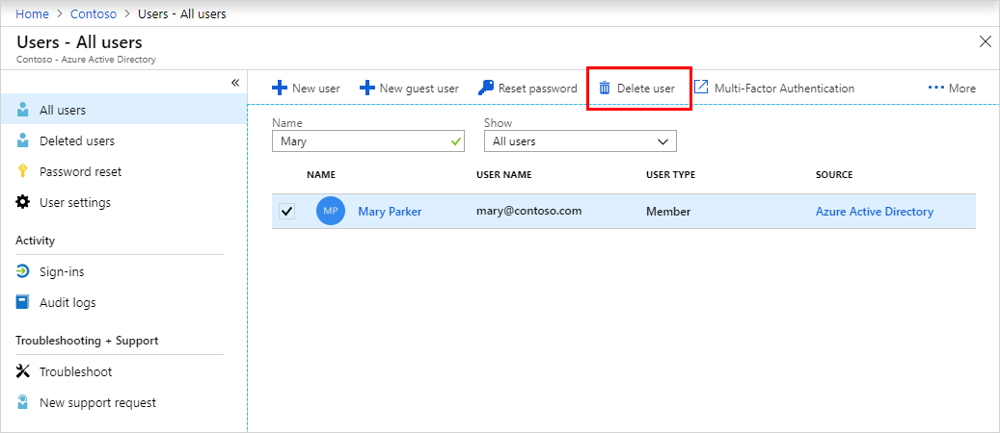
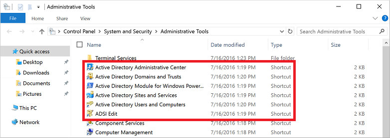
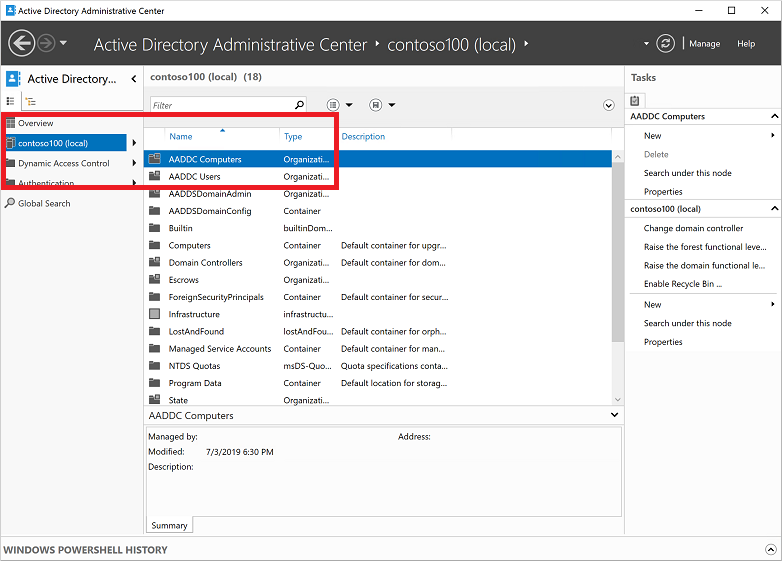
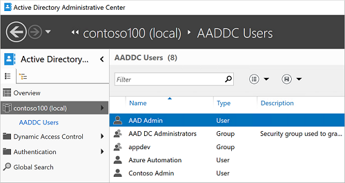

# Microsoft Entra Domain Services instructions for data retrieval

This document describes how to retrieve data from Microsoft Entra Domain Services.

[!INCLUDE [active-directory-app-provisioning.md](../../includes/gdpr-intro-sentence.md)]

## Use Microsoft Entra ID to create, read, update, and delete user objects

You can create a user in the Microsoft Entra admin center or by using Graph PowerShell or Graph API. You can also read, update, and delete users. The next sections show how to do these operations in the Microsoft Entra admin center. 

### Create, read, or update a user

You can create a new user using the Microsoft Entra admin center.
To add a new user, follow these steps:

1. Sign in to the [Microsoft Entra admin center](https://entra.microsoft.com) as at least a [User Administrator](/azure/active-directory/roles/permissions-reference#user-administrator).

1. Browse to **Identity** > **Users**, and then select **New user**.

    

1. On the **User** page, enter information for this user:

   - **Name**. Required. The first and last name of the new user. For example, *Mary Parker*.

   - **User name**. Required. The user name of the new user. For example, `mary@contoso.com`.

   - **Groups**. Optionally, you can add the user to one or more existing groups. 

   - **Directory role**: If you require Microsoft Entra administrative permissions for the user, you can add them to a Microsoft Entra role. 

   - **Job info**: You can add more information about the user here.

1. Copy the autogenerated password provided in the **Password** box. You'll need to give this password to the user to sign in for the first time.

1. Select **Create**.

The user is created and added to your Microsoft Entra organization.

To read or update a user, search for and select the user such as, _Mary Parker_. Change any property and click **Save**. 

### Delete a user

To delete a user, follow these steps:

1. Search for and select the user you want to delete from your Microsoft Entra tenant. For example, _Mary Parker_.

1. Select **Delete user**.

   

The user is deleted and no longer appears on the **Users - All users** page. The user can be seen on the **Deleted users** page for the next 30 days and can be restored during that time. 

When a user is deleted, any licenses consumed by the user are made available for other users.

## Use RSAT tools to connect to a Microsoft Entra Domain Services managed domain and view users

Sign in to an administrative workstation with a user account that's a member of the *AAD DC Administrators* group. The following steps require installation of [Remote Server Administration Tools (RSAT)](tutorial-create-management-vm.md#install-active-directory-administrative-tools).

1. From the **Start** menu, select **Windows Administrative Tools**. The Active Directory Administration Tools are listed.

    

1. Select **Active Directory Administrative Center**.
1. To explore the managed domain, choose the domain name in the left pane, such as *aaddscontoso*. Two containers named *AADDC Computers* and *AADDC Users* are at the top of the list.

    

1. To see the users and groups that belong to the managed domain, select the **AADDC Users** container. The user accounts and groups from your Microsoft Entra tenant are listed in this container.

    In the following example output, a user account named *Contoso Admin* and a group for *AAD DC Administrators* are shown in this container.

    

1. To see the computers that are joined to the managed domain, select the **AADDC Computers** container. An entry for the current virtual machine, such as *myVM*, is listed. Computer accounts for all devices that are joined to the managed domain are stored in this *AADDC Computers* container.

You can also use the *Active Directory Module for Windows PowerShell*, installed as part of the administrative tools, to manage common actions in your managed domain.

## Next steps
* [Microsoft Entra Domain Services Overview](overview.md)
