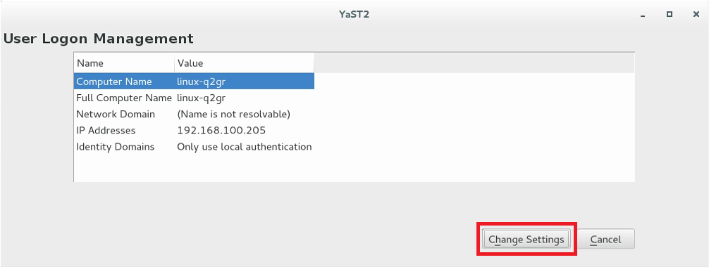
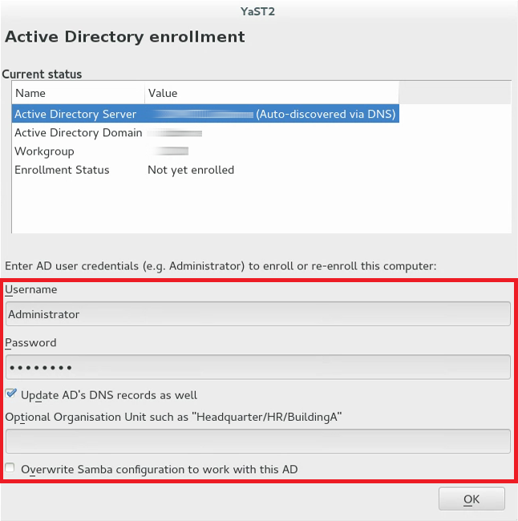
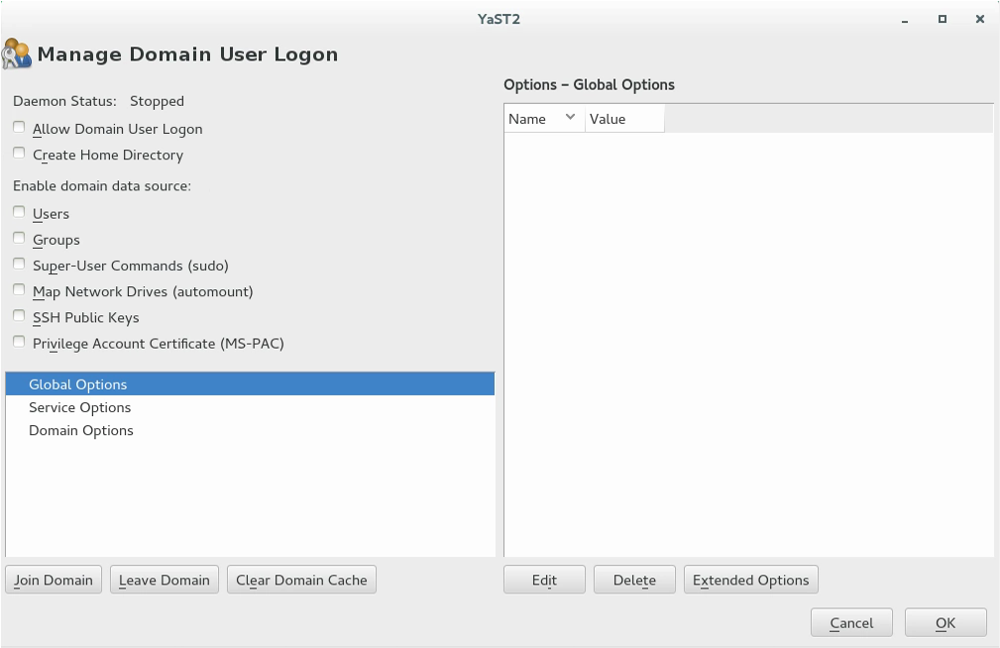
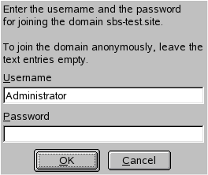

# Join a SUSE Linux Enterprise virtual machine to an Azure Active Directory Domain Services managed domain

To let users sign in to virtual machines (VMs) in Azure using a single set of credentials, you can join VMs to an Azure Active Directory Domain Services (Azure AD DS) managed domain. When you join a VM to an Azure AD DS managed domain, user accounts and credentials from the domain can be used to sign in and manage servers. Group memberships from the managed domain are also applied to let you control access to files or services on the VM.

This article shows you how to join a SUSE Linux Enterprise (SLE) VM to a managed domain.

## Prerequisites

To complete this tutorial, you need the following resources and privileges:

* An active Azure subscription.
    * If you don't have an Azure subscription, [create an account](https://azure.microsoft.com/free/?WT.mc_id=A261C142F).
* An Azure Active Directory tenant associated with your subscription, either synchronized with an on-premises directory or a cloud-only directory.
    * If needed, [create an Azure Active Directory tenant][create-azure-ad-tenant] or [associate an Azure subscription with your account][associate-azure-ad-tenant].
* An Azure Active Directory Domain Services managed domain enabled and configured in your Azure AD tenant.
    * If needed, the first tutorial [creates and configures an Azure Active Directory Domain Services managed domain][create-azure-ad-ds-instance].
* A user account that's a part of the managed domain.
* Unique Linux VM names that are a maximum of 15 characters to avoid truncated names that might cause conflicts in Active Directory.

## Create and connect to a SLE Linux VM

If you have an existing SLE Linux VM in Azure, connect to it using SSH, then continue on to the next step to [start configuring the VM](#configure-the-hosts-file).

If you need to create a SLE Linux VM, or want to create a test VM for use with this article, you can use one of the following methods:

* [Azure portal](../virtual-machines/linux/quick-create-portal.md)
* [Azure CLI](../virtual-machines/linux/quick-create-cli.md)
* [Azure PowerShell](../virtual-machines/linux/quick-create-powershell.md)

When you create the VM, pay attention to the virtual network settings to make sure that the VM can communicate with the managed domain:

* Deploy the VM into the same, or a peered, virtual network in which you have enabled Azure AD Domain Services.
* Deploy the VM into a different subnet than your Azure AD Domain Services managed domain.

Once the VM is deployed, follow the steps to connect to the VM using SSH.

## Configure the hosts file

To make sure that the VM host name is correctly configured for the managed domain, edit the */etc/hosts* file and set the hostname:

```bash
sudo vi /etc/hosts
```

In the *hosts* file, update the *localhost* address. In the following example:

* *aaddscontoso.com* is the DNS domain name of your managed domain.
* *linux-q2gr* is the hostname of your SLE VM that you're joining to the managed domain.

Update these names with your own values:

```config
127.0.0.1 linux-q2gr linux-q2gr.aaddscontoso.com
```

When done, save and exit the *hosts* file using the `:wq` command of the editor.

## Join VM to the managed domain using SSSD

To join the managed domain using **SSSD** and the *User Logon Management* module of YaST, complete the following steps:

1. Install the *User Logon Management* YaST module:

    ```bash
    sudo zypper install yast2-auth-client
    ```

1. Open YaST.

1. To successfully use DNS autodiscovery later, configure the managed domain IP addresses (the *Active Directory server*) as the name server for your client.

    In YaST, select **System > Network Settings**.

1. Select the *Hostname/DNS* tab, then enter the IP address(es) of the managed domain into the text box *Name Server 1*. These IP addresses are shown on the *Properties* window in the Azure portal for your managed domain, such as *10.0.2.4* and *10.0.2.5*.

    Add your own managed domain IP addresses, then select **OK**.

1. From the YaST main window, choose *Network Services* > *User Logon Management*.

    The module opens with an overview showing different network properties of your computer and the authentication method currently in use, as shown in the following example screenshot:

    

    To start editing, select **Change Settings**.

To join the VM to the managed domain, complete the following steps:

1. In the dialog box, select **Add Domain**.

1. Specify the correct *Domain name*, such as *aaddscontoso.com*, then specify the services to use for identity data and authentication. Select *Microsoft Active Directory* for both.

    Make sure the option for *Enable the domain* is selected.

1. When ready, select **OK**.

1. Accept the default settings in the following dialog, then select **OK**.

1. The VM installs additional software as needed, then checks to see if the managed domain is available.

    If everything is correct, the following example dialog is shown to indicate the VM has discovered the managed domain but that you're *Not yet enrolled*.

    

1. In the dialog, specify the *Username* and *Password* of a user that's a part of the managed domain. If needed, [add a user account to a group in Azure AD](../active-directory/fundamentals/active-directory-groups-members-azure-portal.md).

    To make sure that the current domain is enabled for Samba, activate *Overwrite Samba configuration to work with this AD*.

1. To enroll, select **OK**.

1. A message is shown to confirm that you are successfully enrolled. To finish, select **OK**.

After the VM is enrolled in the managed domain, configure the client using *Manage Domain User Logon*, as shown in the following example screenshot:



1. To allow sign-ins using data provided by the managed domain, check the box for *Allow Domain User Logon*.

1. Optionally, under *Enable domain data source*, check additional data sources as needed for your environment. These options include which users are allowed to use **sudo** or which network drives are available.

1. To allow users in the managed domain to have home directories on the VM, check the box for *Create Home Directories*.

1. From the side bar, select **Service Options › Name switch**, then *Extended Options*. From that window, select either *fallback_homedir* or *override_homedir*, then select **Add**.

1. Specify a value for the home directory location. To have home directories follow the format of */home/USER_NAME*, use */home/%u*. For more information about possible variables, see the sssd.conf man page (`man 5 sssd.conf`), section *override_homedir*.

1. Select **OK**.

1. To save the changes, select **OK**. Then make sure that the values displayed now are correct. To leave the dialog, select **Cancel**.

1. If you intend to run SSSD and Winbind simultaneously (such as when joining via SSSD, but then running a Samba file server), the Samba option *kerberos method* should be set to *secrets and keytab* in smb.conf. The SSSD option *ad_update_samba_machine_account_password* should also be set to *true* in sssd.conf. These options prevent the system keytab from going out of sync.

## Join VM to the managed domain using Winbind

To join the managed domain using **winbind** and the *Windows Domain Membership* module of YaST, complete the following steps:

1. In YaST, select **Network Services > Windows Domain Membership**.

1. Enter the domain to join at *Domain or Workgroup* in the *Windows Domain Membership* screen. Enter the managed domain name, such as *aaddscontoso.com*.

    

1. To use the SMB source for Linux authentication, check the option for *Use SMB Information for Linux Authentication*.

1. To automatically create a local home directory for managed domain users on the VM, check the option for *Create Home Directory on Login*.

1. Check the option for *Offline Authentication* to allow your domain users to sign in even if the managed domain is temporarily unavailable.

1. If you want to change the UID and GID ranges for the Samba users and groups, select *Expert Settings*.

1. Configure Network Time Protocol (NTP) time synchronization for your managed domain by selecting *NTP Configuration*. Enter the IP addresses of the managed domain. These IP addresses are shown on the *Properties* window in the Azure portal for your managed domain, such as *10.0.2.4* and *10.0.2.5*.

1. Select **OK** and confirm the domain join when prompted for it.

1. Provide the password for an administrator in the managed domain and select **OK**.

    

After you have joined the managed domain, you can sign in to it from your workstation using the display manager of your desktop or the console.

## Join VM to the managed domain using Winbind from the YaST command line interface

To join the managed domain using **winbind** and the *YaST command line interface*:

* Join the domain:

  ```bash
  sudo yast samba-client joindomain domain=aaddscontoso.com user=<admin> password=<admin password> machine=<(optional) machine account>
  ```

## Join VM to the managed domain using Winbind from the terminal

To join the managed domain using **winbind** and the *`samba net` command*:

1. Install kerberos client and samba-winbind:

   ```bash
   sudo zypper in krb5-client samba-winbind
   ```

2. Edit the configuration files:

   * /etc/samba/smb.conf
   
     ```config
     [global]
         workgroup = AADDSCONTOSO
         usershare allow guests = NO #disallow guests from sharing
         idmap config * : backend = tdb
         idmap config * : range = 1000000-1999999
         idmap config AADDSCONTOSO : backend = rid
         idmap config AADDSCONTOSO : range = 5000000-5999999
         kerberos method = secrets and keytab
         realm = AADDSCONTOSO.COM
         security = ADS
         template homedir = /home/%D/%U
         template shell = /bin/bash
         winbind offline logon = yes
         winbind refresh tickets = yes
     ```

   * /etc/krb5.conf
   
     ```config
     [libdefaults]
         default_realm = AADDSCONTOSO.COM
         clockskew = 300
     [realms]
         AADDSCONTOSO.COM = {
             kdc = PDC.AADDSCONTOSO.COM
             default_domain = AADDSCONTOSO.COM
             admin_server = PDC.AADDSCONTOSO.COM
         }
     [domain_realm]
         .aaddscontoso.com = AADDSCONTOSO.COM
     [appdefaults]
         pam = {
             ticket_lifetime = 1d
             renew_lifetime = 1d
             forwardable = true
             proxiable = false
             minimum_uid = 1
         }
     ```

   * /etc/security/pam_winbind.conf
   
     ```config
     [global]
         cached_login = yes
         krb5_auth = yes
         krb5_ccache_type = FILE
         warn_pwd_expire = 14
     ```

   * /etc/nsswitch.conf
   
     ```config
     passwd: compat winbind
     group: compat winbind
     ```

3. Check that the date and time in Azure AD and Linux are in sync. You can do this by adding the Azure AD server to the NTP service:
   
   1. Add the following line to `/etc/ntp.conf`:
     
      ```config
      server aaddscontoso.com
      ```

   1. Restart the NTP service:
     
      ```bash
      sudo systemctl restart ntpd
      ```

4. Join the domain:

   ```bash
   sudo net ads join -U Administrator%Mypassword
   ```

5. Enable winbind as a login source in the Linux Pluggable Authentication Modules (PAM):

   ```bash
   config pam-config --add --winbind
   ```

6. Enable automatic creation of home directories so that users can log in:

   ```bash
   sudo pam-config -a --mkhomedir
   ```

7. Start and enable the winbind service:

   ```bash
   sudo systemctl enable winbind
   sudo systemctl start winbind
   ```

## Allow password authentication for SSH

By default, users can only sign in to a VM using SSH public key-based authentication. Password-based authentication fails. When you join the VM to a managed domain, those domain accounts need to use password-based authentication. Update the SSH configuration to allow password-based authentication as follows.

1. Open the *sshd_conf* file with an editor:

    ```bash
    sudo vi /etc/ssh/sshd_config
    ```

1. Update the line for *PasswordAuthentication* to *yes*:

    ```config
    PasswordAuthentication yes
    ```

    When done, save and exit the *sshd_conf* file using the `:wq` command of the editor.

1. To apply the changes and let users sign in using a password, restart the SSH service:

    ```bash
    sudo systemctl restart sshd
    ```

## Grant the 'AAD DC Administrators' group sudo privileges

To grant members of the *AAD DC Administrators* group administrative privileges on the SLE VM, add an entry to the */etc/sudoers*. Once added, members of the *AAD DC Administrators* group can use the `sudo` command on the SLE VM.

1. Open the *sudoers* file for editing:

    ```bash
    sudo visudo
    ```

1. Add the following entry to the end of */etc/sudoers* file. The *AAD DC Administrators* group contains whitespace in the name, so include the backslash escape character in the group name. Add your own domain name, such as *aaddscontoso.com*:

    ```config
    # Add 'AAD DC Administrators' group members as admins.
    %AAD\ DC\ Administrators@aaddscontoso.com ALL=(ALL) NOPASSWD:ALL
    ```

    When done, save and exit the editor using the `:wq` command of the editor.

## Sign in to the VM using a domain account

To verify that the VM has been successfully joined to the managed domain, start a new SSH connection using a domain user account. Confirm that a home directory has been created, and that group membership from the domain is applied.

1. Create a new SSH connection from your console. Use a domain account that belongs to the managed domain using the `ssh -l` command, such as `contosoadmin@aaddscontoso.com` and then enter the address of your VM, such as *linux-q2gr.aaddscontoso.com*. If you use the Azure Cloud Shell, use the public IP address of the VM rather than the internal DNS name.

    ```bash
    sudo ssh -l contosoadmin@AADDSCONTOSO.com linux-q2gr.aaddscontoso.com
    ```

2. When you've successfully connected to the VM, verify that the home directory was initialized correctly:

    ```bash
    sudo pwd
    ```

    You should be in the */home* directory with your own directory that matches the user account.

3. Now check that the group memberships are being resolved correctly:

    ```bash
    sudo id
    ```

    You should see your group memberships from the managed domain.

4. If you signed in to the VM as a member of the *AAD DC Administrators* group, check that you can correctly use the `sudo` command:

    ```bash
    sudo zypper update
    ```

## Next steps

If you have problems connecting the VM to the managed domain or signing in with a domain account, see [Troubleshooting domain join issues](join-windows-vm.md#troubleshoot-domain-join-issues).

<!-- INTERNAL LINKS -->
[create-azure-ad-tenant]: ../active-directory/fundamentals/sign-up-organization.md
[associate-azure-ad-tenant]: ../active-directory/fundamentals/active-directory-how-subscriptions-associated-directory.md
[create-azure-ad-ds-instance]: tutorial-create-instance.md
