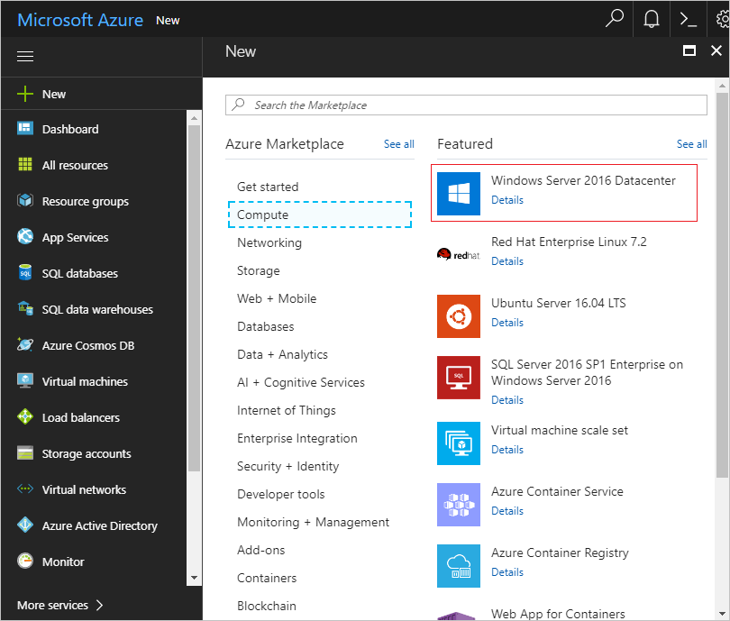
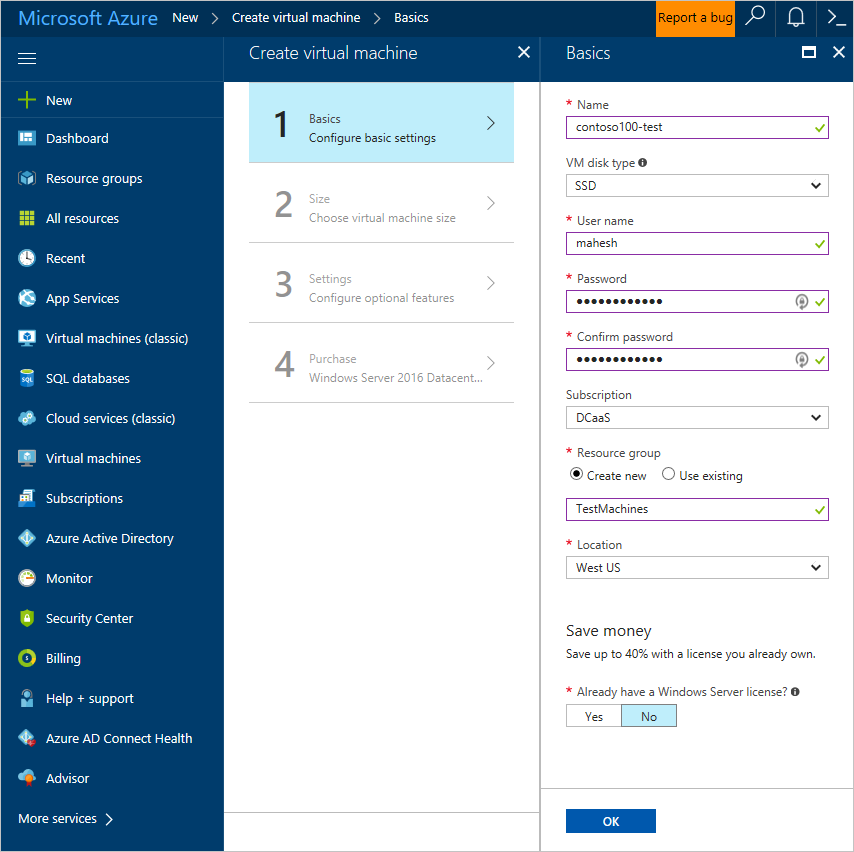
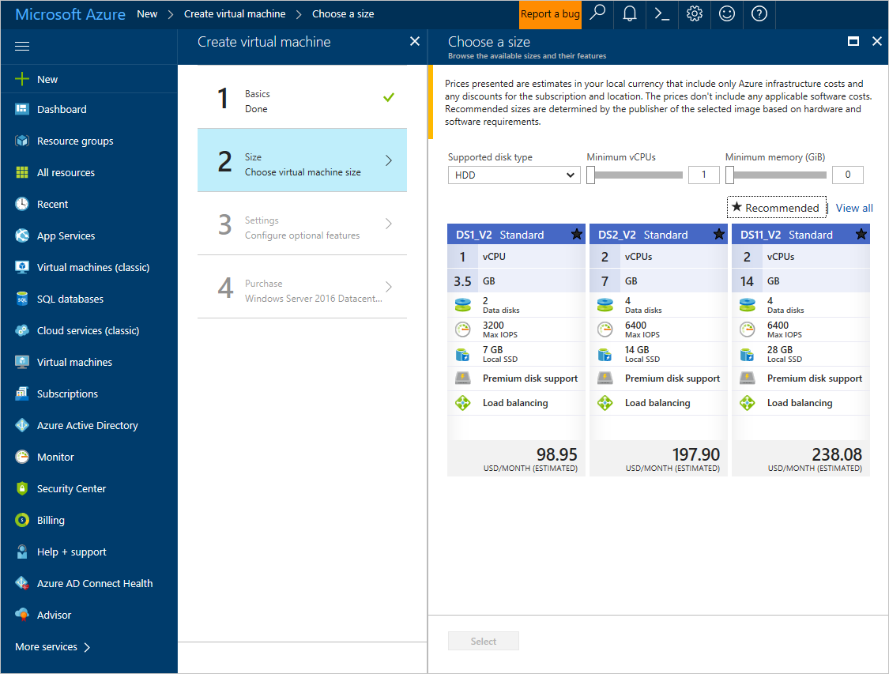
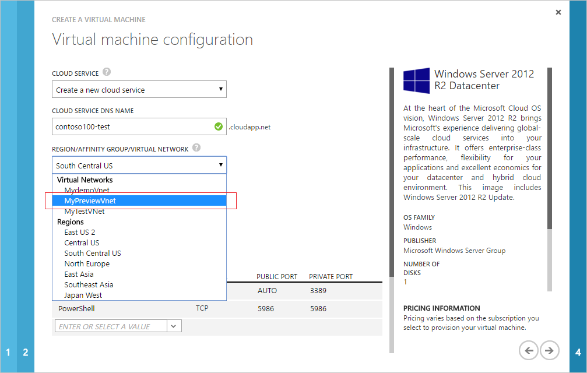
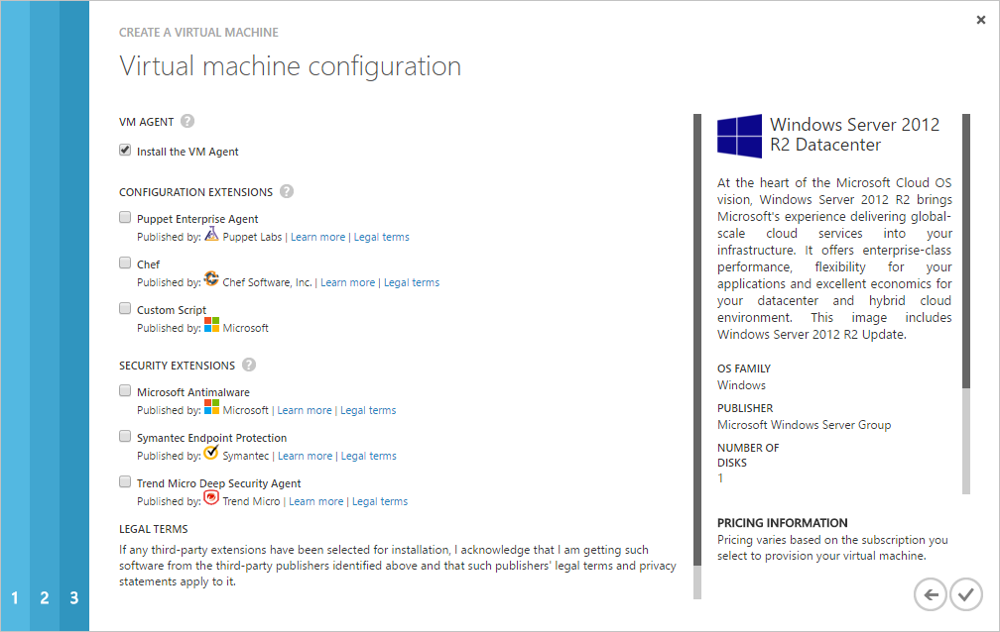
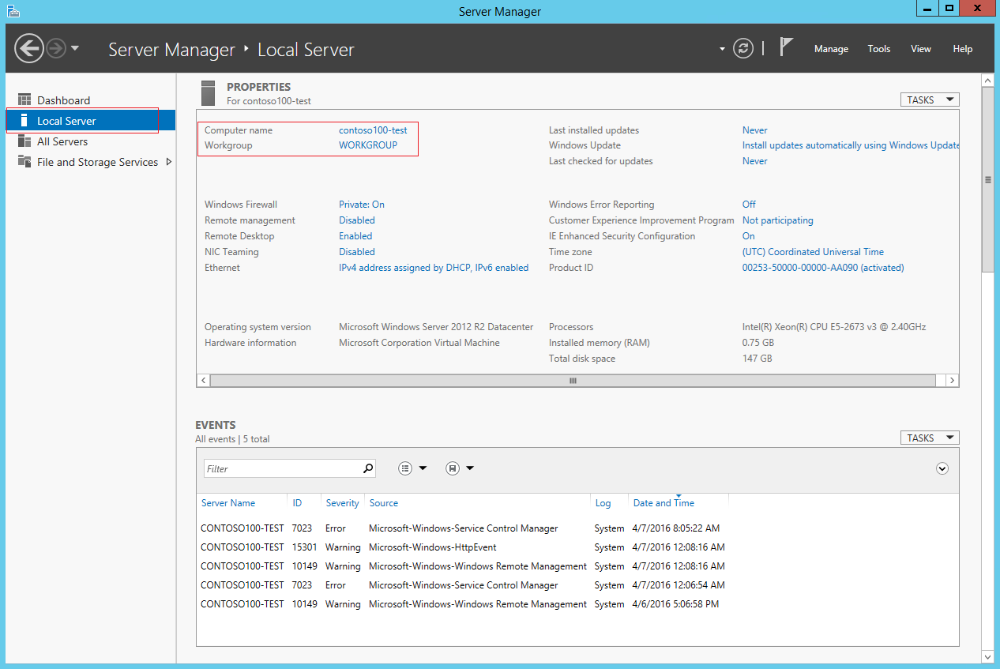
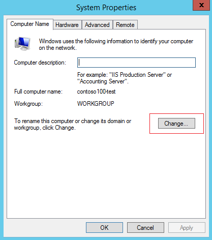
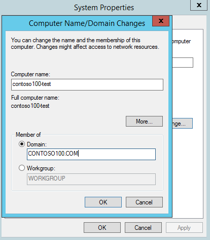
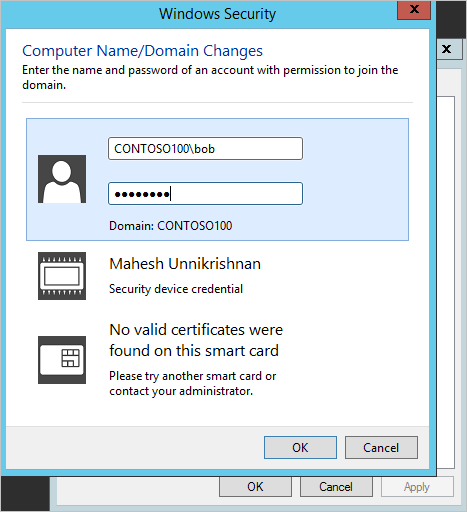
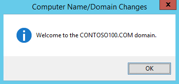

# Join a Windows Server virtual machine to a managed domain
This article shows how to deploy a Windows Server virtual machine by using the Azure portal. It then shows how to join the virtual machine to an Azure Active Directory Domain Services (Azure AD DS) managed domain.

[!INCLUDE [active-directory-ds-prerequisites.md](../../includes/active-directory-ds-prerequisites.md)]

## Step 1: Create a Windows Server virtual machine
To create a Windows virtual machine that's joined to the virtual network in which you've enabled Azure AD DS, do the following steps:

1. Sign in to the [Azure portal](https://portal.azure.com).
2. At the top of the left pane, select **New**.
3. Select **Compute**, and then select **Windows Server 2016 Datacenter**.

    

4. In the **Basics** pane of the wizard, configure the basic settings for the virtual machine.

    

    > [!TIP]
    > The username and password you enter here are for a local administrator account that's used to log on to the virtual machine. Pick a strong password to protect the virtual machine against password brute-force attacks. Do not enter a domain user account's credentials here.
    >

5. Select a **Size** for the virtual machine. To view more sizes, select **View all** or change the **Supported disk type** filter.

    

6. In the **Settings** pane, select the virtual network in which your Azure AD DS-managed domain is deployed. Pick a different subnet than the one that your managed domain is deployed into. For the other settings, keep the defaults, and then select **OK**.

    

    > [!TIP]
    > **Pick the right virtual network and subnet.**
    >
    > Select either the virtual network in which your managed domain is deployed or a virtual network that is connected to it by using virtual network peering. If you select an unconnected virtual network, you cannot join the virtual machine to the managed domain.
    >
    > We recommend deploying your managed domain into a dedicated subnet. Therefore, do not pick the subnet in which you've enabled your managed domain.

7. For the other settings, keep the defaults, and then select **OK**.
8. On the **Purchase** page, review the settings, and then select **OK** to deploy the virtual machine.
9. The VM deployment is pinned to the Azure portal dashboard.

    
10. After the deployment is completed, you can view information about the VM on the **Overview** page.

## Step 2: Connect to the Windows Server virtual machine by using the local administrator account
Next, connect to the newly created Windows Server virtual machine to join it to the domain. Use the local administrator credentials that you specified when you created the virtual machine.

To connect to the virtual machine, perform the following steps:

1. In the **Overview** pane, select **Connect**.  
    A Remote Desktop Protocol (.rdp) file is created and downloaded.

    

2. To connect to your VM, open the downloaded RDP file. If prompted, select **Connect**.
3. Enter your **local administrator credentials**, which you specified when you created the virtual machine (for example, *localhost\mahesh*).
4. If you see a certificate warning during the sign-in process, select **Yes** or **Continue** to connect.

At this point, you should be logged on to the newly created Windows virtual machine with your local administrator credentials. The next step is to join the virtual machine to the domain.

## Step 3: Join the Windows Server virtual machine to the Azure AD DS-managed domain
To join the Windows Server virtual machine to the Azure AD DS-managed domain, complete the following steps:

1. Connect to the Windows Server VM, as shown in "Step 2." On the **Start** screen, open **Server Manager**.
2. In the left pane of the **Server Manager** window, select **Local Server**.

    

3. Under **Properties**, select **Workgroup**.
4. In the **System Properties** window, select **Change** to join the domain.

    

5. In the **Domain** box, specify the name of your Azure AD DS-managed domain, and then select **OK**.

    

6. You're asked to enter your credentials to join the domain. Use the credentials for a *user that belongs to the Azure AD DC administrators group*. Only members of this group have privileges to join machines to the managed domain.

    

7. You can specify credentials in either of the following ways:

   * **UPN format**: (Recommended) Specify the user principal name (UPN) suffix for the user account, as configured in Azure AD. In this example, the UPN suffix of the user *bob* is *bob\@domainservicespreview.onmicrosoft.com*.

   * **SAMAccountName format**: You can specify the account name in the SAMAccountName format. In this example, the user *bob* would need to enter *CONTOSO100\bob*.

     > [!TIP]
     > **We recommend using the UPN format to specify credentials.**
     >
     > If a user's UPN prefix is overly long (for example, *joehasareallylongname*), the SAMAccountName might be auto-generated. If multiple users have the same UPN prefix (for example, *bob*) in your Azure AD tenant, their SAMAccountName format might be auto-generated by the service. In these cases, the UPN format can be used reliably to log on to the domain.
     >

8. After you've successfully joined a domain, the following message welcomes you to the domain.

    

9. To complete joining the domain, restart the virtual machine.

## Troubleshoot joining a domain
### Connectivity issues
If the virtual machine is unable to find the domain, try the following troubleshooting steps:

* Verify the virtual machine is connected to the same virtual network Azure AD DS is enabled in. Otherwise, the virtual machine is unable to connect to or join the domain.

* Verify the virtual machine is on a virtual network that is in turn connected to the virtual network Azure AD DS is enabled in.

* Try to ping the DNS domain name of the managed domain (for example, *ping contoso100.com*). If you're unable to do so, try to ping the IP addresses for the domain that's displayed on the page where you enabled Azure AD DS (for example, *ping 10.0.0.4*). If you can ping the IP address but not the domain, DNS may be incorrectly configured. Check to see whether the IP addresses of the domain are configured as DNS servers for the virtual network.

* Try flushing the DNS resolver cache on the virtual machine (*ipconfig /flushdns*).

If a window is displayed that asks for credentials to join the domain, you do not have connectivity issues.

### Credentials-related issues
If you're having trouble with credentials and are unable to join the domain, try the following troubleshooting steps:

* Try using the UPN format to specify credentials. If there are many users with the same UPN prefix in your tenant or if your UPN prefix is overly long, the SAMAccountName for your account may be auto-generated. In these cases, the SAMAccountName format for your account may be different from what you expect or use in your on-premises domain.

* Try to use the credentials of a user account that belongs to the *AAD DC Administrators* group.

* Check that you have [enabled password synchronization](active-directory-ds-getting-started-password-sync.md) to your managed domain.

* Check that you've used the UPN of the user as configured in Azure AD (for example, *bob\@domainservicespreview.onmicrosoft.com*) to sign in.

* Wait long enough for password synchronization to be completed, as specified in the getting started guide.

## Related content
* [Azure AD DS getting started guide](create-instance.md)
* [Manage an Azure AD Domain Services domain](manage-domain.md)
