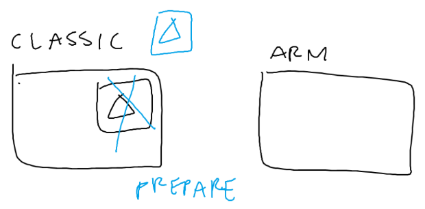
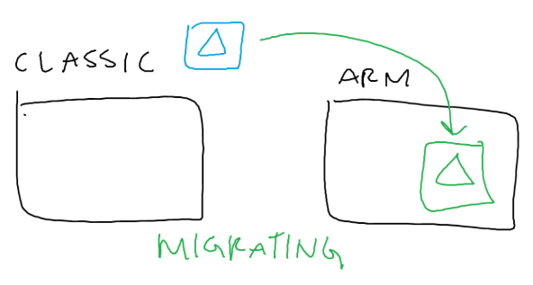
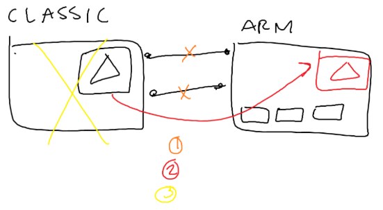
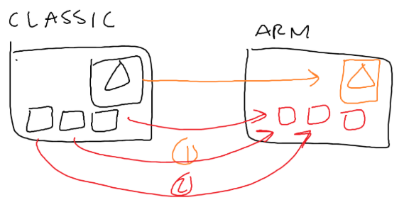
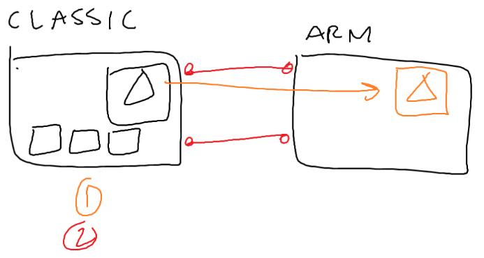
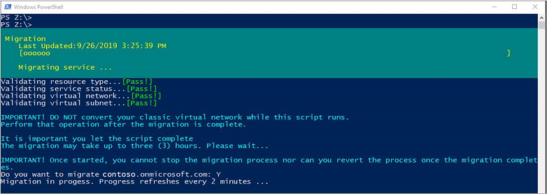

# Migrate Azure Active Directory Domain Services from the Classic virtual network model to Resource Manager

Azure Active Directory Domain Services (Azure AD DS) supports a one-time move for customers currently using the Classic virtual network model to the Resource Manager virtual network model. Azure AD DS managed domains that use the Resource Manager deployment model provide additional features such as fine-grained password policy, audit logs, and account lockout protection.

This article outlines considerations for migration, then the required steps to successfully migrate an existing managed domain. For some of the benefits, see [Benefits of migration from the Classic to Resource Manager deployment model in Azure AD DS][migration-benefits].

> [!NOTE]
> In 2017, Azure AD Domain Services became available to host in an Azure Resource Manager network. Since then, we have been able to build a more secure service using the Azure Resource Manager's modern capabilities. Because Azure Resource Manager deployments fully replace classic deployments, Azure AD DS classic virtual network deployments will be retired on March 1, 2023.
>
> For more information, see the [official deprecation notice](https://azure.microsoft.com/updates/we-are-retiring-azure-ad-domain-services-classic-vnet-support-on-march-1-2023/).

## Overview of the migration process

The migration process takes an existing managed domain that runs in a Classic virtual network and moves it to an existing Resource Manager virtual network. The migration is performed using PowerShell, and has two main stages of execution: *preparation* and *migration*.


In the *preparation* stage, Azure AD DS takes a backup of the domain to get the latest snapshot of users, groups, and passwords synchronized to the managed domain. Synchronization is then disabled, and the cloud service that hosts the managed domain is deleted. During the preparation stage, the managed domain is unable to authenticate users.



In the *migration* stage, the underlying virtual disks for the domain controllers from the Classic managed domain are copied to create the VMs using the Resource Manager deployment model. The managed domain is then recreated, which includes the LDAPS and DNS configuration. Synchronization to Azure AD is restarted, and LDAP certificates are restored. There's no need to rejoin any machines to a managed domain – they continue to be joined to the managed domain and run without changes.



## Example scenarios for migration

Some common scenarios for migrating a managed domain include the following examples.

> [!NOTE]
> Do not convert the Classic virtual network until you have confirmed a successful migration. Converting the virtual network removes the option to roll back or restore the managed domain if there are any problems during the migration and verification stages.

### Migrate Azure AD DS to an existing Resource Manager virtual network (recommended)

A common scenario is where you've already moved other existing Classic resources to a Resource Manager deployment model and virtual network. Peering is then used from the Resource Manager virtual network to the Classic virtual network that continues to run Azure AD DS. This approach lets the Resource Manager applications and services use the authentication and management functionality of the managed domain in the Classic virtual network. Once migrated, all resources run using the Resource Manager deployment model and virtual network.



High-level steps involved in this example migration scenario include the following parts:

1. Remove existing VPN gateways or virtual network peering configured on the Classic virtual network.
1. Migrate the managed domain using the steps outlined in this article.
1. Test and confirm a successful migration, then delete the Classic virtual network.

### Migrate multiple resources including Azure AD DS

In this example scenario, you migrate Azure AD DS and other associated resources from the Classic deployment model to the Resource Manager deployment model. If some resources continued to run in the Classic virtual network alongside the managed domain, they can all benefit from migrating to the Resource Manager deployment model.



High-level steps involved in this example migration scenario include the following parts:

1. Remove existing VPN gateways or virtual network peering configured on the Classic virtual network.
1. Migrate the managed domain using the steps outlined in this article.
1. Set up virtual network peering between the Classic virtual network and Resource Manager network.
1. Test and confirm a successful migration.
1. [Move additional Classic resources like VMs][migrate-iaas].

### Migrate Azure AD DS but keep other resources on the Classic virtual network

With this example scenario, you have the minimum amount of downtime in one session. You only migrate Azure AD DS to a Resource Manager virtual network, and keep existing resources on the Classic deployment model and virtual network. In a following maintenance period, you can migrate the additional resources from the Classic deployment model and virtual network as desired.



High-level steps involved in this example migration scenario include the following parts:

1. Remove existing VPN gateways or virtual network peering configured on the Classic virtual network.
1. Migrate the managed domain using the steps outlined in this article.
1. Set up virtual network peering between the Classic virtual network and the new Resource Manager virtual network.
1. Later, [migrate the additional resources][migrate-iaas] from the Classic virtual network as needed.

## Before you begin

As you prepare and then migrate a managed domain, there are some considerations around the availability of authentication and management services. The managed domain is unavailable for a period of time during migration. Applications and services that rely on Azure AD DS experience downtime during migration.

> [!IMPORTANT]
> Read all of this migration article and guidance before you start the migration process. The migration process affects the availability of the Azure AD DS domain controllers for periods of time. Users, services, and applications can't authenticate against the managed domain during the migration process.

### IP addresses

The domain controller IP addresses for a managed domain change after migration. This change includes the public IP address for the secure LDAP endpoint. The new IP addresses are inside the address range for the new subnet in the Resource Manager virtual network.

In the case of rollback, the IP addresses may change after rolling back.

Azure AD DS typically uses the first two available IP addresses in the address range, but this isn't guaranteed. You can't currently specify the IP addresses to use after migration.

### Downtime

The migration process involves the domain controllers being offline for a period of time. Domain controllers are inaccessible while Azure AD DS is migrated to the Resource Manager deployment model and virtual network. On average, the downtime is around 1 to 3 hours. This time period is from when the domain controllers are taken offline to the moment the first domain controller comes back online. This average doesn't include the time it takes for the second domain controller to replicate, or the time it may take to migrate additional resources to the Resource Manager deployment model.

### Account lockout

Managed domains that run on Classic virtual networks don't have AD account lockout policies in place. If VMs are exposed to the internet, attackers could use password-spray methods to brute-force their way into accounts. There's no account lockout policy to stop those attempts. For managed domains that use the Resource Manager deployment model and virtual networks, AD account lockout policies protect against these password-spray attacks.

By default, 5 bad password attempts in 2 minutes lock out an account for 30 minutes.

A locked out account can't be used to sign in, which may interfere with the ability to manage the managed domain or applications managed by the account. After a managed domain is migrated, accounts can experience what feels like a permanent lockout due to repeated failed attempts to sign in. Two common scenarios after migration include the following:

* A service account that's using an expired password.
    * The service account repeatedly tries to sign in with an expired password, which locks out the account. To fix this, locate the application or VM with expired credentials and update the password.
* A malicious entity is using brute-force attempts to sign in to accounts.
    * When VMs are exposed to the internet, attackers often try common username and password combinations as they attempt to sign. These repeated failed sign-in attempts can lock out the accounts. It's not recommended to use administrator accounts with generic names such as *admin* or *administrator*, for example, to minimize administrative accounts from being locked out.
    * Minimize the number of VMs that are exposed to the internet. You can use [Azure Bastion][azure-bastion] to securely connect to VMs using the Azure portal.

If you suspect that some accounts may be locked out after migration, the final migration steps outline how to enable auditing or change the fine-grained password policy settings.

### Roll back and restore

If the migration isn't successful, there's process to roll back or restore a managed domain. Rollback is a self-service option to immediately return the state of the managed domain to before the migration attempt. Azure support engineers can also restore a managed domain from backup as a last resort. For more information, see [how to roll back or restore from a failed migration](#roll-back-and-restore-from-migration).

### Restrictions on available virtual networks

There are some restrictions on the virtual networks that a managed domain can be migrated to. The destination Resource Manager virtual network must meet the following requirements:

* The Resource Manager virtual network must be in the same Azure subscription as the Classic virtual network that Azure AD DS is currently deployed in.
* The Resource Manager virtual network must be in the same region as the Classic virtual network that Azure AD DS is currently deployed in.
* The Resource Manager virtual network's subnet should have at least 3-5 available IP addresses.
* The Resource Manager virtual network's subnet should be a dedicated subnet for Azure AD DS, and shouldn't host any other workloads.

For more information on virtual network requirements, see [Virtual network design considerations and configuration options][network-considerations].

## Migration steps

The migration to the Resource Manager deployment model and virtual network is split into 5 main steps:

| Step    | Performed through  | Estimated time  | Downtime  | Roll back/Restore? |
|---------|--------------------|-----------------|-----------|-------------------|
| [Step 1 - Update and locate the new virtual network](#update-and-verify-virtual-network-settings) | Azure portal | 15 minutes | No downtime required | N/A |
| [Step 2 - Prepare the managed domain for migration](#prepare-the-managed-domain-for-migration) | PowerShell | 15 – 30 minutes on average | Downtime of Azure AD DS starts after this command is completed. | Roll back and restore available. |
| [Step 3 - Move the managed domain to an existing virtual network](#migrate-the-managed-domain) | PowerShell | 1 – 3 hours on average | One domain controller is available once this command is completed, downtime ends. | On failure, both rollback (self service) and restore are available. |
| [Step 4 - Test and wait for the replica domain controller](#test-and-verify-connectivity-after-the-migration)| PowerShell and Azure portal | 1 hour or more, depending on the number of tests | Both domain controllers are available and should function normally. | N/A. Once the first VM is successfully migrated, there's no option for rollback or restore. |
| [Step 5 - Optional configuration steps](#optional-post-migration-configuration-steps) | Azure portal and VMs | N/A | No downtime required | N/A |

> [!IMPORTANT]
> To avoid additional downtime, read all of this migration article and guidance before you start the migration process. The migration process affects the availability of the Azure AD DS domain controllers for a period of time. Users, services, and applications can't authenticate against the managed domain during the migration process.

## Update and verify virtual network settings

Before you begin the migration process, complete the following initial checks and updates. These steps can happen at any time before the migration and don't affect the operation of the managed domain.

1. Update your local Azure PowerShell environment to the latest version. To complete the migration steps, you need at least version *2.3.2*.

    For information on how to check and update your PowerShell version, see [Azure PowerShell overview][azure-powershell].

1. Create, or choose an existing, Resource Manager virtual network.

    Make sure that network settings don't block necessary ports required for Azure AD DS. Ports must be open on both the Classic virtual network and the Resource Manager virtual network. These settings include route tables (although it's not recommended to use route tables) and network security groups.

    To view the ports required, see [Network security groups and required ports][network-ports]. To minimize network communication problems, it's recommended to wait and apply a network security group or route table to the Resource Manager virtual network after the migration successfully completed.

    Make a note of this target resource group, target virtual network, and target virtual network subnet. These resource names are used during the migration process.

1. Check the managed domain health in the Azure portal. If you have any alerts for the managed domain, resolve them before you start the migration process.
1. Optionally, if you plan to move other resources to the Resource Manager deployment model and virtual network, confirm that those resources can be migrated. For more information, see [Platform-supported migration of IaaS resources from Classic to Resource Manager][migrate-iaas].

    > [!NOTE]
    > Don't convert the Classic virtual network to a Resource Manager virtual network. If you do, there's no option to roll back or restore the managed domain.

## Prepare the managed domain for migration

Azure PowerShell is used to prepare the managed domain for migration. These steps include taking a backup, pausing synchronization, and deleting the cloud service that hosts Azure AD DS. When this step completes, Azure AD DS is taken offline for a period of time. If the preparation step fails, you can [roll back to the previous state](#roll-back).

To prepare the managed domain for migration, complete the following steps:

1. Install the `Migrate-Aaads` script from the [PowerShell Gallery][powershell-script]. This PowerShell migration script is a digitally signed by the Azure AD engineering team.

    ```powershell
    Install-Script -Name Migrate-Aadds
    ```

1. Create a variable to hold the credentials for by the migration script using the [Get-Credential][get-credential] cmdlet.

    The user account you specify needs *global administrator* privileges in your Azure AD tenant to enable Azure AD DS and then *Contributor* privileges in your Azure subscription to create the required Azure AD DS resources.

    When prompted, enter an appropriate user account and password:

    ```powershell
    $creds = Get-Credential
    ```

1. Now run the `Migrate-Aadds` cmdlet using the *-Prepare* parameter. Provide the *-ManagedDomainFqdn* for your own managed domain, such as *aaddscontoso.com*:

    ```powershell
    Migrate-Aadds `
        -Prepare `
        -ManagedDomainFqdn aaddscontoso.com `
        -Credentials $creds​
    ```

## Migrate the managed domain

With the managed domain prepared and backed up, the domain can be migrated. This step recreates the Azure AD Domain Services domain controller VMs using the Resource Manager deployment model. This step can take 1 to 3 hours to complete.

Run the `Migrate-Aadds` cmdlet using the *-Commit* parameter. Provide the *-ManagedDomainFqdn* for your own managed domain prepared in the previous section, such as *aaddscontoso.com*:

Specify the target resource group that contains the virtual network you want to migrate Azure AD DS to, such as *myResourceGroup*. Provide the target virtual network, such as *myVnet*, and the subnet, such as *DomainServices*.

After this command runs, you can't then roll back:

```powershell
Migrate-Aadds `
    -Commit `
    -ManagedDomainFqdn aaddscontoso.com `
    -VirtualNetworkResourceGroupName myResourceGroup `
    -VirtualNetworkName myVnet `
    -VirtualSubnetName DomainServices `
    -Credentials $creds​
```

After the script validates the managed domain is prepared for migration, enter *Y* to start the migration process.

> [!IMPORTANT]
> Don't convert the Classic virtual network to a Resource Manager virtual network during the migration process. If you convert the virtual network, you can't then rollback or restore the managed domain as the original virtual network won't exist anymore.

Every two minutes during the migration process, a progress indicator reports the current status, as shown in the following example output:



The migration process continues to run, even if you close out the PowerShell script. In the Azure portal, the status of the managed domain reports as *Migrating*.

When the migration successfully completes, you can view your first domain controller's IP address in the Azure portal or through Azure PowerShell. A time estimate on the second domain controller being available is also shown.

At this stage, you can optionally move other existing resources from the Classic deployment model and virtual network. Or, you can keep the resources on the Classic deployment model and peer the virtual networks to each other after the Azure AD DS migration is complete.

## Test and verify connectivity after the migration

It can take some time for the second domain controller to successfully deploy and be available for use in the managed domain.

With the Resource Manager deployment model, the network resources for the managed domain are shown in the Azure portal or Azure PowerShell. To learn more about what these network resources are and do, see [Network resources used by Azure AD DS][network-resources].

When at least one domain controller is available, complete the following configuration steps for network connectivity with VMs:

* **Update DNS server settings** To let other resources on the Resource Manager virtual network resolve and use the managed domain, update the DNS settings with the IP addresses of the new domain controllers. The Azure portal can automatically configure these settings for you. To learn more about how to configure the Resource Manager virtual network, see [Update DNS settings for the Azure virtual network][update-dns].
* **Restart domain-joined VMs** - As the DNS server IP addresses for the Azure AD DS domain controllers change, restart any domain-joined VMs so they then use the new DNS server settings. If applications or VMs have manually configured DNS settings, manually update them with the new DNS server IP addresses of the domain controllers that are shown in the Azure portal.

Now test the virtual network connection and name resolution. On a VM that is connected to the Resource Manager virtual network, or peered to it, try the following network communication tests:

1. Check if you can ping the IP address of one of the domain controllers, such as `ping 10.1.0.4`
    * The IP addresses of the domain controllers are shown on the **Properties** page for the managed domain in the Azure portal.
1. Verify name resolution of the managed domain, such as `nslookup aaddscontoso.com`
    * Specify the DNS name for your own managed domain to verify that the DNS settings are correct and resolves.

The second domain controller should be available 1-2 hours after the migration cmdlet finishes. To check if the second domain controller is available, look at the **Properties** page for the managed domain in the Azure portal. If two IP addresses shown, the second domain controller is ready.

## Optional post-migration configuration steps

When the migration process is successfully complete, some optional configuration steps include enabling audit logs or e-mail notifications, or updating the fine-grained password policy.

### Subscribe to audit logs using Azure Monitor

Azure AD DS exposes audit logs to help troubleshoot and view events on the domain controllers. For more information, see [Enable and use audit logs][security-audits].

You can use templates to monitor important information exposed in the logs. For example, the audit log workbook template can monitor possible account lockouts on the managed domain.

### Configure Azure AD Domain Services email notifications

To be notified when a problem is detected on the managed domain, update the email notification settings in the Azure portal. For more information, see [Configure notification settings][notifications].

### Update fine-grained password policy

If needed, you can update the fine-grained password policy to be less restrictive than the default configuration. You can use the audit logs to determine if a less restrictive setting makes sense, then configure the policy as needed. Use the following high-level steps to review and update the policy settings for accounts that are repeatedly locked out after migration:

1. [Configure password policy][password-policy] for fewer restrictions on the managed domain and observe the events in the audit logs.
1. If any service accounts are using expired passwords as identified in the audit logs, update those accounts with the correct password.
1. If a VM is exposed to the internet, review for generic account names like *administrator*, *user*, or *guest* with high sign-in attempts. Where possible, update those VMs to use less generically named accounts.
1. Use a network trace on the VM to locate the source of the attacks and block those IP addresses from being able to attempt sign-ins.
1. When there are minimal lockout issues, update the fine-grained password policy to be as restrictive as necessary.

### Creating a network security group

Azure AD DS needs a network security group to secure the ports needed for the managed domain and block all other incoming traffic. This network security group acts as an extra layer of protection to lock down access to the managed domain, and isn't automatically created. To create the network security group and open the required ports, review the following steps:

1. In the Azure portal, select your Azure AD DS resource. On the overview page, a button is displayed to create a network security group if there's none associated with Azure AD Domain Services.
1. If you use secure LDAP, add a rule to the network security group to allow incoming traffic for *TCP* port *636*. For more information, see [Configure secure LDAP][secure-ldap].

## Roll back and restore from migration

Up to a certain point in the migration process, you can choose to roll back or restore the managed domain.

### Roll back

If there's an error when you run the PowerShell cmdlet to prepare for migration in step 2 or for the migration itself in step 3, the managed domain can roll back to the original configuration. This roll back requires the original Classic virtual network. Note that the IP addresses may still change after rollback.

Run the `Migrate-Aadds` cmdlet using the *-Abort* parameter. Provide the *-ManagedDomainFqdn* for your own managed domain prepared in a previous section, such as *aaddscontoso.com*, and the Classic virtual network name, such as *myClassicVnet*:

```powershell
Migrate-Aadds `
    -Abort `
    -ManagedDomainFqdn aaddscontoso.com `
    -ClassicVirtualNetworkName myClassicVnet `
    -Credentials $creds
```

### Restore

As a last resort, Azure AD Domain Services can be restored from the last available backup. A backup is taken in step 1 of the migration to make sure that the most current backup is available. This backup is stored for 30 days.

To restore the managed domain from backup, [open a support case ticket using the Azure portal][azure-support]. Provide your directory ID, domain name, and reason for restore. The support and restore process may take multiple days to complete.

## Troubleshooting

If you have problems after migration to the Resource Manager deployment model, review some of the following common troubleshooting areas:

* [Troubleshoot domain-join problems][troubleshoot-domain-join]
* [Troubleshoot account lockout problems][troubleshoot-account-lockout]
* [Troubleshoot account sign-in problems][troubleshoot-sign-in]
* [Troubleshoot secure LDAP connectivity problems][tshoot-ldaps]

## Next steps

With your managed domain migrated to the Resource Manager deployment model, [create and domain-join a Windows VM][join-windows] and then [install management tools][tutorial-create-management-vm].

<!-- INTERNAL LINKS -->
[azure-bastion]: ../bastion/bastion-overview.md
[network-considerations]: network-considerations.md
[azure-powershell]: /powershell/azure/overview
[network-ports]: network-considerations.md#network-security-groups-and-required-ports
[Connect-AzAccount]: /powershell/module/az.accounts/connect-azaccount
[Set-AzContext]: /powershell/module/az.accounts/set-azcontext
[Get-AzResource]: /powershell/module/az.resources/get-azresource
[Set-AzResource]: /powershell/module/az.resources/set-azresource
[network-resources]: network-considerations.md#network-resources-used-by-azure-ad-ds
[update-dns]: tutorial-create-instance.md#update-dns-settings-for-the-azure-virtual-network
[azure-support]: ../active-directory/fundamentals/active-directory-troubleshooting-support-howto.md
[security-audits]: security-audit-events.md
[notifications]: notifications.md
[password-policy]: password-policy.md
[secure-ldap]: tutorial-configure-ldaps.md
[migrate-iaas]: ../virtual-machines/windows/migration-classic-resource-manager-overview.md
[join-windows]: join-windows-vm.md
[tutorial-create-management-vm]: tutorial-create-management-vm.md
[troubleshoot-domain-join]: troubleshoot-domain-join.md
[troubleshoot-account-lockout]: troubleshoot-account-lockout.md
[troubleshoot-sign-in]: troubleshoot-sign-in.md
[tshoot-ldaps]: tshoot-ldaps.md
[get-credential]: /powershell/module/microsoft.powershell.security/get-credential
[migration-benefits]: concepts-migration-benefits.md

<!-- EXTERNAL LINKS -->
[powershell-script]: https://www.powershellgallery.com/packages/Migrate-Aadds/
