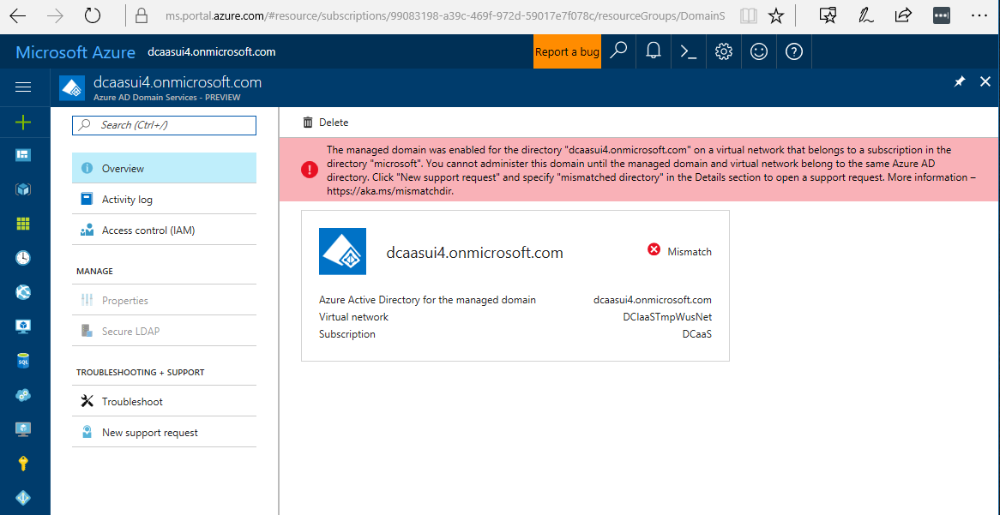
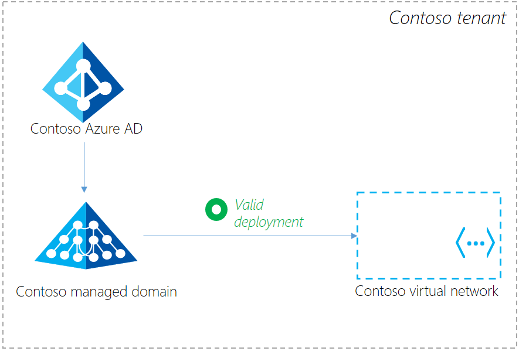
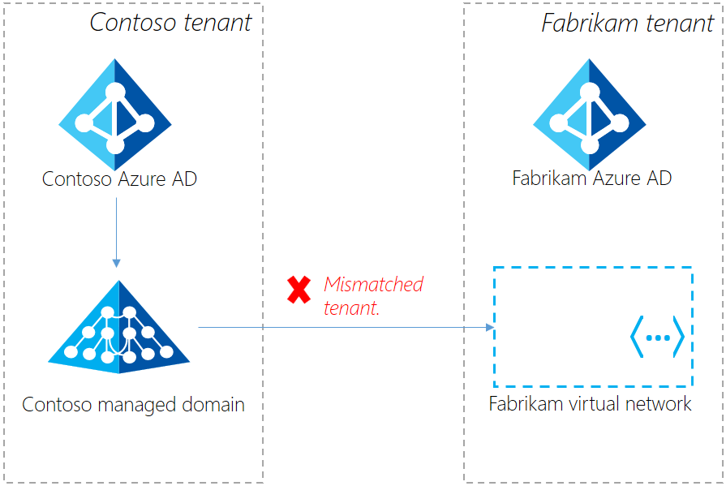

# Resolve mismatched directory errors for existing Azure AD Domain Services managed domains
You have an existing Azure AD Domain Services managed domain. When you navigate to the Azure portal and view the managed domain, you see the following error message:

You cannot administer this managed domain until the error is resolved.

## What's causing this error?
This error is caused when your managed domain and the virtual network it is enabled in belong to two different Azure AD tenants. For example, you have a managed domain called 'contoso.com' and it was enabled for Contoso's Azure AD tenant. However, the Azure virtual network in which the managed domain was enabled belongs to Fabrikam - a different Azure AD tenant.

The new Azure portal (and specifically the Azure AD Domain Services extension) is built on Azure Resource Manager. In the modern Azure Resource Manager environment, certain restrictions are enforced to deliver greater security and for roles-based access control (RBAC) to resources. Enabling Azure AD Domain Services for an Azure AD tenant is a sensitive operation since it causes credential hashes to be synchronized to the managed domain. This operation requires you to be a tenant admin for the directory. Additionally, you must have administrative privileges over the virtual network in which you enable the managed domain. For the RBAC checks to work consistently, the managed domain and the virtual network should belong to the same Azure AD tenant.

In short, you cannot enable a managed domain for an Azure AD tenant 'contoso.com' in a virtual network belonging to an Azure subscription owned by another Azure AD tenant 'fabrikam.com'. 

**Valid configuration**: In this deployment scenario, the Contoso managed domain is enabled for the Contoso Azure AD tenant. The managed domain is exposed in a virtual network belonging to an Azure subscription owned by the Contoso Azure AD tenant. Therefore, both the managed domain as well as the virtual network belong to the same Azure AD tenant. This configuration is valid and fully supported.

**Mismatched tenant configuration**: In this deployment scenario, the Contoso managed domain is enabled for the Contoso Azure AD tenant. However, the managed domain is exposed in a virtual network that belongs to an Azure subscription owned by the Fabrikam Azure AD tenant. Therefore, the managed domain and the virtual network belong to two different Azure AD tenants. This configuration is the mismatched tenant configuration and is not supported. The virtual network must be moved to the same Azure AD tenant (that is, Contoso) as the managed domain. See the [Resolution](#resolution) section for details.

Therefore, when the managed domain and the virtual network it is enabled in belong to two different Azure AD tenants you see this error.

The following rules apply in the Resource Manager environment:
- An Azure AD directory may have multiple Azure subscriptions.
- An Azure subscription may have multiple resources such as virtual networks.
- A single Azure AD Domain Services managed domain is enabled for an Azure AD directory.
- An Azure AD Domain Services managed domain can be enabled on a virtual network belonging to any of the Azure subscriptions within the same Azure AD tenant.

## Resolution
You have two options to resolve the mismatched directory error. You may:

- Click the **Delete** button to delete the existing managed domain. Re-create using the [Azure portal](https://portal.azure.com), so that the managed domain and virtual network it is available in belong to the Azure AD directory. Join all machines previously joined to the deleted domain to the newly created managed domain.

- Move the Azure subscription containing the virtual network to the Azure AD directory, to which your managed domain belongs. Follow the steps in the [transfer ownership of an Azure subscription to another account](../billing/billing-subscription-transfer.md) article.

## Related content
* [Azure AD Domain Services - Getting Started guide](create-instance.md)
* [Troubleshooting guide - Azure AD Domain Services](troubleshoot.md)
