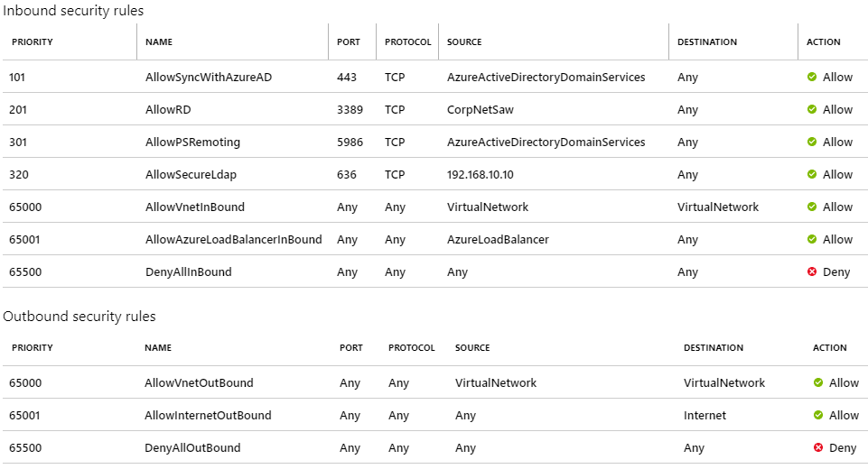
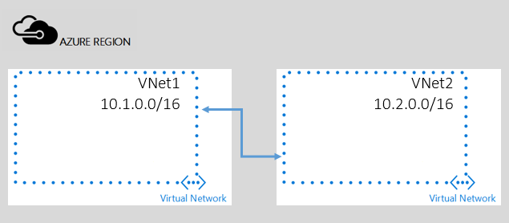

# Plan your network for Azure AD Domain Services 
Properly planning your subnet and virtual network ensures you can use Azure AD Domain Services a shared service for your legacy applications.

The ideal design is to host Azure AD Domain Services in its own virtual network. However, you may include a workload subnet in the same virtual network to host your management virtual machine or light application workloads. Consider using a separate virtual network for larger or complex application workloads that need legacy authentication and peer those virtual networks with the Azure AD Domain Services virtual network. Read [Connect to the Azure AD Domain Services virtual network for more information](#connect-to-the-azure-ad-domain-services-virtual-network).

> [!NOTE]
> You may only create Azure AD Domain services using Azure Resource Manager virtual networks. New instances on classic virtual networks is no longer supported.
>

## The virtual network
Design the virtual network hosting Azure AD Domain Services with the following considerations:
* Azure AD Domain Services is deployed in the same Azure region as the selected virtual network. Ensure you select a virtual network that is in an Azure region that supports [Azure AD Domain Services](https://azure.microsoft.com/global-infrastructure/services/?products=active-directory-ds&regions=all).
* Consider the proximity of the Azure regions and the virtual networks that host your application workloads when choosing a virtual network.
* The virtual network cannot rely on DNS services other than the services provided by Azure AD Domain Services. This configuration includes custom DNS server settings to other DNS servers, including virtual machines. Name resolution for additional namespaces can be accomplished using conditional forwarders.

> [!IMPORTANT]
> You cannot move Domain Services to a different virtual network after you have enabled the service.
>
>

## The subnet

Design the subnet hosting Azure AD Domain Services with the following considerations: 
* Deploy Azure AD Domain Services in its own subnet (required).
* Use the default Network Security Group (NSG) provided during the creation of your Azure AD Domain Service instance to ensure you have the proper network configuration.
* Provide an adequate number of available IP addresses to the subnet (between five and seven IP addresses). Restricting the available IP addresses can prevent Azure AD Domain Services from maintaining two domain controllers.
* **Do not create Azure AD Domain Services in a gateway subnet.**

## Additional network components
An Azure AD Domain Services instance also creates the following additional networking components, which are needed for successful operation and management of the managed domain service.

| Component | Description |
|:---|:---|
| Network Interface| Azure AD Domain Services hosts the domain on two domain controllers. Each virtualized domain controller has a virtualized network interface connected to the selected virtual network. Two network interfaces are attached to the subnet where Azure AD Domain Services is created. |
| Dynamic Basic Public IP Address | Azure AD Domain Services communicates with the synchronization and management service using a public IP address. For more information about public IP addresses, read [IP address types and allocation methods in Azure](https://docs.microsoft.com/azure/virtual-network/virtual-network-ip-addresses-overview-arm#public-ip-addresses). |
| Azure Basic Public Load Balancer | Azure AD Domain Services uses the load balancer for network address translation and load balancing (when used with secure LDAP). For more information about Azure Load Balancers, read [What is Azure Load Balancer](https://docs.microsoft.com/azure/load-balancer/load-balancer-overview). |
| Network Address Translation Rules | Azure AD Domain Services uses three network addresses translation rules: one rule for secure HTTP traffic and two rules for secure PowerShell remoting. |
| Load Balancer Rules | Azure AD Domain Services creates load-balancing rules only when a managed domain is configured for secure LDAP (TCP port 636) |

> [!IMPORTANT]
> Do not delete any of the networking components created by Azure AD Domain Services. Deleting any of the networking components results in a service outage.
>
>

## User-defined routes
Avoid making any changes to the route table, especially the 0.0.0.0 route, which can disrupt Azure AD Domain Services. A properly configured [network security group](../virtual-network/security-overview.md) provides access control to inbound traffic.

If you are required to use route tables, you must route inbound traffic from the IP addresses included in the respective Azure service tags to the Azure AD Domain Services subnet. You can download the [Azure IP Ranges and Service Tags - Public Cloud](https://www.microsoft.com/en-us/download/details.aspx?id=56519) a list of service tags and their associated IP address from the Microsoft Download Center. IP addresses can change without notice. Ensure you have processes to validate you have the latest IP addresses.

> [!WARNING]
> When you associate a misconfigured NSG or a user defined route table with the subnet in which Azure AD Domain Services is created, you may disrupt Microsoft's ability to service and manage the domain. Additionally, synchronization between your Azure AD tenant and your managed domain is disrupted. **The SLA does not apply to deployments where an improperly configured NSGs and/or user defined route tables have been applied that blocks Azure AD Domain Services from updating and managing your domain.**
>
>

## Ports required for Azure AD Domain Services
The following ports are required for Azure AD Domain Services to service and maintain your managed domain. Ensure that these ports are not blocked for the subnet in which you have enabled your managed domain.

| Port number | Required | Purpose |
|:---:|:---:|:--- |
| 443 | Yes |Synchronization with your Azure AD tenant |
| 5986 | Yes | Management of your domain |
| 3389 | Yes | Management of your domain |
| 636 | No | Secure LDAP (LDAPS) access to your managed domain |

### Port 443 (Synchronization with Azure AD)
* It is used to synchronize your Azure AD directory with your managed domain.
* It is mandatory to allow access to this port in your NSG. Without access to this port, your managed domain is not in sync with your Azure AD directory. Users may not be able to sign in as changes to their passwords are not synchronized to your managed domain.
* You can restrict inbound access to this port to IP addresses using the **AzureActiveDirectoryDomainServices** service tag.
* **Do not restrict outbound access from this port.** 

### Port 5986 (PowerShell remoting)
* It is used to perform management tasks using PowerShell remoting on your managed domain.
* It is mandatory to allow access through this port in your NSG. Without access to this port, your managed domain cannot be updated, configured, backed-up, or monitored.
* For any new domains or domains with an Azure Resource Manager virtual network, you can restrict inbound access to this port to the **AzureActiveDirectoryDomainServices** service tag.
* For existing domains using a classic virtual network, you can restrict inbound access to this port to the following source IP addresses: 52.180.183.8, 23.101.0.70, 52.225.184.198, 52.179.126.223, 13.74.249.156, 52.187.117.83, 52.161.13.95, 104.40.156.18, 104.40.87.209

### Port 3389 (Remote desktop)
* It is used for remote desktop connections to domain controllers for your managed domain.
* You can restrict inbound access to the following source IP addresses: 207.68.190.32/27, 13.106.78.32/27, 13.106.174.32/27, 13.106.4.96/27. The default network security group uses the **CorpNetSaw** service tag, which includes these IP addresses.
* This port also remains largely turned off on your managed domain. This mechanism is not used on an ongoing basis since management and monitoring tasks are performed using PowerShell remoting. This port is used only in the rare event that Microsoft needs to connect remotely to your managed domain for advanced troubleshooting. The port is closed as soon as the troubleshooting operation is complete.

> [!NOTE]
> You cannot manually select the CorpNetSaw service tag from the portal. You must use PowerShell or CLI to manually create a rule using the CorpNetSaw service tag.
>
>

## Network security groups
A [Network Security Group (NSG)](https://docs.microsoft.com/azure/virtual-network/virtual-networks-nsg) contains a list of Access Control List (ACL) rules that allow or deny network traffic to your VM instances in a Virtual Network. NSGs can be associated with either subnets or individual VM instances within that subnet. When an NSG is associated with a subnet, the ACL rules apply to all the VM instances in that subnet. In addition, traffic to an individual VM can be restricted further by associating an NSG directly to that VM.

### Default network service group
The following table illustrates a sample NSG you can configure for a virtual network hosting Azure AD Domain Services. These rules allow inbound traffic over the required ports to ensure your managed domain stays patched, updated and can be monitored by Microsoft. The default 'DenyAll' rule applies to all other inbound traffic from the internet.

Additionally, the NSG illustrates how to lock down secure LDAP access over the internet, which you can skip if you have not enabled secure LDAP access to your managed domain over the internet. The NSG contains a rule (priority 320) that allows inbound LDAPS access over TCP port 636 only from a specified IP address, which has a higher priority than the DenyAll NSG rule. For more information, read [Create a Network Security Group for more information](https://docs.microsoft.com/azure/virtual-network/manage-network-security-group).

## Connect to the Azure AD Domain Services virtual network

You can only create an Azure AD Domain Services managed domain in a single virtual network in Azure and only one managed domain is possible for each Azure tenant. Based on this architecture, you may need to connect one or more virtual networks (hosting your application workloads) to your Azure AD Domain Services virtual network.

You can connect application workloads hosted in other Azure virtual networks using:
* Virtual Network Peering
* Virtual Private Networking (VPN)

### Virtual Network Peering

Virtual network peering is a mechanism that connects two virtual networks in the same region through the Azure backbone network. Once peered, the two virtual networks appear as one for all connectivity purposes. They are still managed as separate resources, but virtual machines in these virtual networks can communicate with each other directly by using private IP addresses. This peered connection enables you to use the managed domain with your workloads deployed in other virtual networks. For more information, read [Virtual network peering](https://docs.microsoft.com/azure/virtual-network/virtual-network-peering-overview).

### Virtual Private Networking 
Connecting a virtual network to another virtual network (VNet-to-VNet) is similar to connecting a virtual network to an on-premises site location. Both connectivity types use a VPN gateway to provide a secure tunnel using IPsec/IKE. For more information on using virtual private networking, read [Configure a VNet-to-VNet VPN gateway connection by using the Azure portal](https://docs.microsoft.com/azure/vpn-gateway/vpn-gateway-howto-vnet-vnet-resource-manager-portal).

## Name Resolution when connecting virtual networks
Virtual networks connected to the Azure AD Domain Services virtual network have their own DNS settings. It is important to know that connecting the virtual networks does not automatically configure name resolution for Azure AD Domain Services. Name resolution on individual virtual networks must be configured to enable workloads to locate Azure AD Domain Services. Enabling name resolution can be accomplished using conditional DNS forwarders or by using the same DNS IP addresses from the Azure AD Domain Service virtual network.

 

## Related Content
* [Azure virtual network peering](../virtual-network/virtual-network-peering-overview.md)
* [Configure a VNet-to-VNet connection for the classic deployment model](../vpn-gateway/virtual-networks-configure-vnet-to-vnet-connection.md)
* [Azure Network Security Groups](../virtual-network/security-overview.md)
* [Create a Network Security Group](../virtual-network/manage-network-security-group.md)
