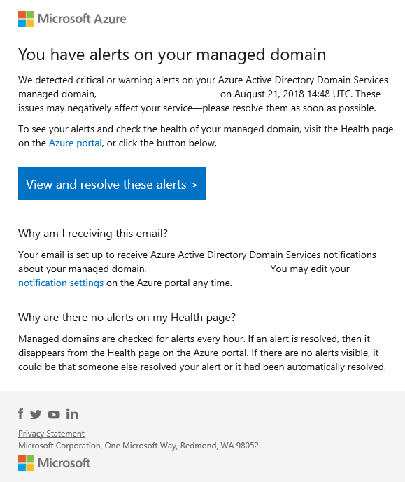

# Configure email notifications for issues in Microsoft Entra Domain Services

The health of a Microsoft Entra Domain Services managed domain is monitored by the Azure platform. The health status page in the Microsoft Entra admin center shows any alerts for the managed domain. To make sure issues are responded to in a timely manner, email notifications can be configured to report on health alerts as soon as they're detected in the Domain Services managed domain.

This article shows you how to configure email notification recipients for a managed domain.

## Email notification overview

To alert you of issues with a managed domain, you can configure email notifications. These email notifications specify the managed domain that the alert is present on, give the time of detection, and a link to the health page in the Microsoft Entra admin center. You can then follow the provided troubleshooting advice to resolve the issues.

The following example email notification indicates a critical warning or alert was generated on the managed domain:

> [!WARNING]
> Always make sure that the email comes from a verified Microsoft sender before you click the links in the message. The email notifications always come from the `azure-noreply@microsoft.com` address.

### Why would I receive email notifications?

Domain Services sends email notifications for important updates about the managed domain. These notifications are only for urgent issues that impact the service and should be addressed immediately. Each email notification is triggered by an alert on the managed domain. The alerts also appear in the Microsoft Entra admin center and can be viewed on the [Domain Services health page][check-health].

Domain Services doesn't send emails for advertisement, updates, or sales purposes.

### When do I receive email notifications?

A notification is sent immediately when a [new alert][troubleshoot-alerts] is found on a managed domain. If the alert isn't resolved, another email notification is sent as a reminder every four days.

### Who should receive the email notifications?

The list of email recipients for Domain Services should be composed of people who are able to administer and make changes to the managed domain. This email list should be thought of as your "first responders" to any alerts and issues.

You can add up to five more recipients for email notifications. If you want more than five recipients for email notifications, create a distribution list and add that to the notification list instead.

You can also choose to have all *Global Administrators* of the Microsoft Entra directory and every member of the *AAD DC Administrators* group receive email notifications. Domain Services only sends notification to up to 100 email addresses, including the list of global administrators and AAD DC Administrators.

## Configure email notifications

To review the existing email notification recipients, or add recipients, complete the following steps:

1. Sign in to the [Microsoft Entra admin center](https://entra.microsoft.com) as a [Global Administrator](/azure/active-directory/roles/permissions-reference#authentication-policy-administrator).
1. Search for and select **Microsoft Entra Domain Services**.
1. Select your managed domain, such as *aaddscontoso.com*.
1. On the left-hand side of the Domain Services resource window, select **Notification settings**. The existing recipients for email notifications are shown.
1. To add an email recipient, enter the email address in the additional recipients table.
1. When done, select **Save** on the top-hand navigation.

> [!WARNING]
> When you change the notification settings, the notification settings for the entire managed domain are updated, not just yourself.

## Frequently asked questions

### I received an email notification for an alert but when I logged on to the Microsoft Entra admin center there was no alert. What happened?

If an alert is resolved, the alert is cleared from the Microsoft Entra admin center. The most likely reason is that someone else who receives email notifications resolved the alert on the managed domain, or it was automatically resolved by Azure platform.

### Why can I not edit the notification settings?

If you're unable to access the notification settings page in the Microsoft Entra admin center, you don't have the permissions to edit the managed domain. Contact a global administrator to either get permissions to edit Domain Services resource or be removed from the recipient list.

### I don't seem to be receiving email notifications even though I provided my email address. Why?

Check your spam or junk folder in your email for the notification and make sure to allow the sender of `azure-noreply@microsoft.com`.

## Next steps

For more information on troubleshooting some of the issues that may be reported, see [Resolve alerts on a managed domain][troubleshoot-alerts].

<!-- INTERNAL LINKS -->
[check-health]: check-health.md
[troubleshoot-alerts]: troubleshoot-alerts.md
