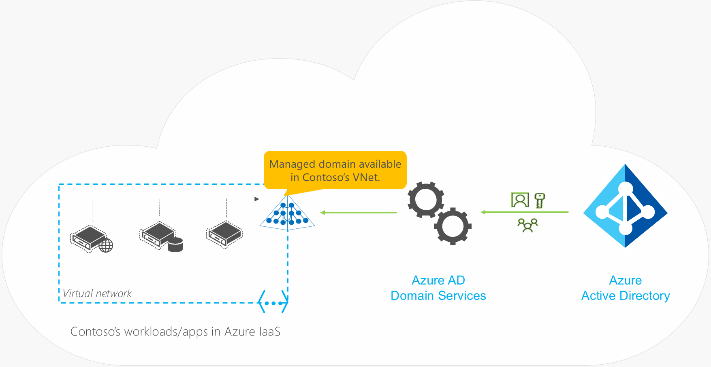

# Azure Active Directory (AD) Domain Services
## Overview
Azure Infrastructure Services enable you to deploy a wide range of computing solutions in an agile manner. With Azure Virtual Machines, you can deploy nearly instantaneously and you pay only by the minute. Using support for Windows, Linux, SQL Server, Oracle, IBM, SAP, and BizTalk, you can deploy any workload, any language, on nearly any operating system. These benefits enable you to migrate legacy applications deployed on-premises to Azure, to save on operational expenses.

A key aspect of migrating on-premises applications to Azure is handling the identity needs of these applications. Directory-aware applications may rely on LDAP for read or write access to the corporate directory or rely on Windows Integrated Authentication (Kerberos or NTLM authentication) to authenticate end users. Line-of-business (LOB) applications running on Windows Server are typically deployed on domain joined machines, so they can be managed securely using Group Policy. To 'lift-and-shift' on-premises applications to the cloud, these dependencies on the corporate identity infrastructure need to be resolved.

Administrators often turn to one of the following solutions to satisfy the identity needs of their applications deployed in Azure:

* Deploy a site-to-site VPN connection between workloads running in Azure Infrastructure Services and the corporate directory on-premises.
* Extend the corporate AD domain/forest infrastructure by setting up replica domain controllers using Azure virtual machines.
* Deploy a stand-alone domain in Azure using domain controllers deployed as Azure virtual machines.

All these approaches suffer from high cost and administrative overhead. Administrators are required to deploy domain controllers using virtual machines in Azure. Additionally, they need to manage, secure, patch, monitor, backup, and troubleshoot these virtual machines. The reliance on VPN connections to the on-premises directory causes workloads deployed in Azure to be vulnerable to transient network glitches or outages. These network outages in turn result in lower uptime and reduced reliability for these applications.

We designed Azure AD Domain Services to provide an easier alternative.

### Watch an introductory video

>[!VIDEO https://www.youtube.com/embed/T1Nd9APNceQ]

## Introducing Azure AD Domain Services

Azure AD Domain Services provides managed domain services such as domain join, group policy, LDAP, Kerberos/NTLM authentication that are fully compatible with Windows Server Active Directory. You can consume these domain services without the need for you to deploy, manage, and patch domain controllers in the cloud. Azure AD Domain Services integrates with your existing Azure AD tenant, thus making it possible for users to log in using their corporate credentials. Additionally, you can use existing groups and user accounts to secure access to resources, thus ensuring a smoother 'lift-and-shift' of on-premises resources to Azure Infrastructure Services.

Azure AD Domain Services functionality works seamlessly regardless of whether your Azure AD tenant is cloud-only or synced with your on-premises Active Directory.

### Azure AD Domain Services for cloud-only organizations

A cloud-only Azure AD tenant (often referred to as 'managed tenants') does not have any on-premises identity footprint. In other words, user accounts, their passwords, and group memberships are all native to the cloud - that is, created and managed in Azure AD. Consider for a moment that Contoso is a cloud-only Azure AD tenant. As shown in the following illustration, Contoso's administrator has configured a virtual network in Azure Infrastructure Services. Applications and server workloads are deployed in this virtual network in Azure virtual machines. Since Contoso is a cloud-only tenant, all user identities, their credentials, and group memberships are created and managed in Azure AD.

Contoso's IT administrator can enable Azure AD Domain Services for their Azure AD tenant and choose to make domain services available in this virtual network. Thereafter, Azure AD Domain Services provisions a managed domain and makes it available in the virtual network. All user accounts, group memberships, and user credentials available in Contoso's Azure AD tenant are also available in this newly created domain. This feature enables users in the organization to sign in to the domain using their corporate credentials - for example, when connecting remotely to domain-joined machines via Remote Desktop. Administrators can provision access to resources in the domain using existing group memberships. Applications deployed in virtual machines on the virtual network can use features like domain join, LDAP read, LDAP bind, NTLM and Kerberos authentication, and Group Policy.

A few salient aspects of the managed domain that is provisioned by Azure AD Domain Services are as follows:

* Contoso's IT administrator does not need to manage, patch, or monitor this domain or any domain controllers for this managed domain.
* There is no need to manage AD replication for this domain. User accounts, group memberships, and credentials from Contoso's Azure AD tenant are automatically available within this managed domain.
* Since the domain is managed by Azure AD Domain Services, Contoso's IT administrator does not have Domain Administrator or Enterprise Administrator privileges on this domain.

### Azure AD Domain Services for hybrid organizations
Organizations with a hybrid IT infrastructure consume a mix of cloud resources and on-premises resources. Such organizations synchronize identity information from their on-premises directory to their Azure AD tenant. As hybrid organizations look to migrate more of their on-premises applications to the cloud, especially legacy directory-aware applications, Azure AD Domain Services can be useful to them.

Litware Corporation has deployed [Azure AD Connect](../active-directory/hybrid/whatis-hybrid-identity.md), to synchronize identity information from their on-premises directory to their Azure AD tenant. The identity information that is synchronized includes user accounts, their credential hashes for authentication (password hash sync) and group memberships.

> [!NOTE]
> **Password hash synchronization is mandatory for hybrid organizations to use Azure AD Domain Services**. This requirement is because users' credentials are needed in the managed domain provided by Azure AD Domain Services, to authenticate these users via NTLM or Kerberos authentication methods.
>
>

The preceding illustration shows how organizations with a hybrid IT infrastructure, such as Litware Corporation, can use Azure AD Domain Services. Litware's applications and server workloads that require domain services are deployed in a virtual network in Azure Infrastructure Services. Litware's IT administrator can enable Azure AD Domain Services for their Azure AD tenant and choose to make a managed domain available in this virtual network. Since Litware is an organization with a hybrid IT infrastructure, user accounts, groups, and credentials are synchronized to their Azure AD tenant from their on-premises directory. This feature enables users to sign in to the domain using their corporate credentials - for example, when connecting remotely to machines joined to the domain via Remote Desktop. Administrators can provision access to resources in the domain using existing group memberships. Applications deployed in virtual machines on the virtual network can use features like domain join, LDAP read, LDAP bind, NTLM and Kerberos authentication, and Group Policy.

A few salient aspects of the managed domain that is provisioned by Azure AD Domain Services are as follows:

* The managed domain is a stand-alone domain. It is not an extension of Litware's on-premises domain.
* Litware's IT administrator does not need to manage, patch, or monitor domain controllers for this managed domain.
* There is no need to manage AD replication to this domain. User accounts, group memberships, and credentials from Litware's on-premises directory are synchronized to Azure AD via Azure AD Connect. These user accounts, group memberships, and credentials are automatically available within the managed domain.
* Since the domain is managed by Azure AD Domain Services, Litware's IT administrator does not have Domain Administrator or Enterprise Administrator privileges on this domain.

## Benefits
With Azure AD Domain Services, you can enjoy the following benefits:

* **Simple** – You can satisfy the identity needs of virtual machines deployed to Azure Infrastructure services with a few simple clicks. You do not need to deploy and manage identity infrastructure in Azure or setup connectivity back to your on-premises identity infrastructure.
* **Integrated** – Azure AD Domain Services is deeply integrated with your Azure AD tenant. You can now use Azure AD as an integrated cloud-based enterprise directory that caters to the needs of both your modern applications and traditional directory-aware applications.
* **Compatible** – Azure AD Domain Services is built on the proven enterprise grade infrastructure of Windows Server Active Directory. Therefore, your applications can rely on a greater degree of compatibility with Windows Server Active Directory features. Not all features available in Windows Server AD are currently available in Azure AD Domain Services. However, available features are compatible with the corresponding Windows Server AD features you rely on in your on-premises infrastructure. The LDAP, Kerberos, NTLM, Group Policy, and domain join capabilities constitute a mature offering that has been tested and refined over various Windows Server releases.
* **Cost-effective** – With Azure AD Domain Services, you can avoid the infrastructure and management burden that is associated with managing identity infrastructure to support traditional directory-aware applications. You can move these applications to Azure Infrastructure Services and benefit from greater savings on operational expenses.

## Next steps
### Learn more about Azure AD Domain Services
* [Features](active-directory-ds-features.md)
* [Deployment scenarios](scenarios.md)
* [Find out if Azure AD Domain Services suits your use-cases](comparison.md)
* [Understand how Azure AD Domain Services synchronizes with your Azure AD directory](synchronization.md)

### Get started with Azure AD Domain Services
* [Enable Azure AD Domain Services using the Azure portal](create-instance.md)
