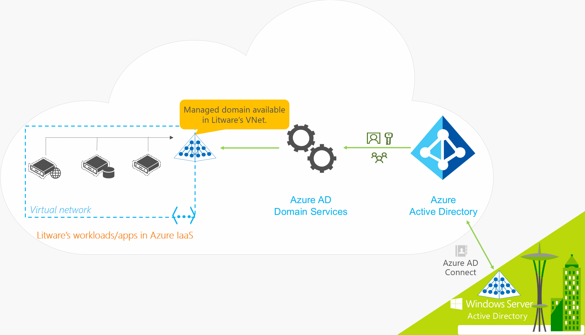

# What is Azure Active Directory Domain Services?

Azure Active Directory Domain Services (Azure AD DS) provides managed domain services such as domain join, group policy, lightweight directory access protocol (LDAP), and Kerberos / NTLM authentication that is fully compatible with Windows Server Active Directory. You use these domain services without the need to deploy, manage, and patch domain controllers in the cloud. Azure AD DS integrates with your existing Azure AD tenant, which makes it possible for users to sign in using their existing credentials. You can also use existing groups and user accounts to secure access to resources, which provides a smoother lift-and-shift of on-premises resources to Azure.

Azure AD DS replicates identity information from Azure AD, so works with Azure AD tenants that are cloud-only, or synchronized with an on-premises Active Directory Domain Services (AD DS) environment. The same set of Azure AD DS features exist for both environments.

* If you have an existing on-premises AD DS environment, you can synchronize user account information to provide a consistent identity for users.
* For cloud-only environments, you don't need a traditional on-premises AD DS environment to use the centralized identity services of Azure AD DS.

The following video provides an overview of how Azure AD DS integrates with your applications and workloads to provide identity services in the cloud:

 

>[!VIDEO https://www.youtube.com/embed/T1Nd9APNceQ]

## Common ways to provide identity solutions in the cloud

When you migrate existing workloads to the cloud, directory-aware applications may use LDAP for read or write access to an on-premises AD DS directory. Applications that run on Windows Server are typically deployed on domain-joined virtual machines (VMs) so they can be managed securely using Group Policy. To authenticate end users, the applications may also rely on Windows-integrated authentication, such as Kerberos or NTLM authentication.

IT administrators often use one of the following solutions to provide an identity service to applications that run in Azure:

* Configure a site-to-site VPN connection between workloads that run in Azure and an on-premises AD DS environment.
    * The on-premises domain controllers then provide authentication via the VPN connection.
* Create replica domain controllers using Azure virtual machines (VMs) to extend the AD DS domain / forest from on-premises.
    * The domain controllers that run on Azure VMs provide authentication, and replicate directory information between the on-premises AD DS environment.
* Deploy a standalone AD DS environment in Azure using domain controllers that run on Azure VMs.
    * The domain controllers that run on Azure VMs provide authentication, but there's no directory information replicated from an on-premises AD DS environment.

With these approaches, VPN connections to the on-premises directory make applications vulnerable to transient network glitches or outages. If you deploy domain controllers using VMs in Azure, the IT team must manage the VMs, then secure, patch, monitor, backup, and troubleshoot them.

Azure AD DS offers alternatives to the need to create VPN connections back to an on-premises AD DS environment or run and manage VMs in Azure to provide identity services. As a managed service, Azure AD DS reduces the complexity to create an integrated identity solution for both hybrid and cloud-only environments.

## Azure AD DS features and benefits

To provide identity services to applications and VMs in the cloud, Azure AD DS is fully compatible with a traditional AD DS environment for operations such as domain-join, secure LDAP (LDAPS), Group Policy and DNS management, and LDAP bind and read support. LDAP write support is available for objects created in the Azure AD DS managed domain, but not resources synchronized from Azure AD. The following features of Azure AD DS simplify deployment and management operations:

* **Simplified deployment experience:** Azure AD DS is enabled for your Azure AD tenant using a single wizard in the Azure portal.
* **Integrated with Azure AD:** User accounts, group memberships, and credentials are automatically available from your Azure AD tenant. New users, groups, or changes to attributes from your Azure AD tenant or your on-premises AD DS environment are automatically synchronized to Azure AD DS.
    * Accounts in external directories linked to your Azure AD aren't available in Azure AD DS. Credentials aren't available for those external directories, so can't be synchronized into an Azure AD DS managed domain.
* **Use your corporate credentials/passwords:** Passwords for users in Azure AD DS are the same as in your Azure AD tenant. Users can use their corporate credentials to domain-join machines, sign in interactively or over remote desktop, and authenticate against the Azure AD DS managed domain.
* **NTLM and Kerberos authentication:** With support for NTLM and Kerberos authentication, you can deploy applications that rely on Windows-integrated authentication.
* **High availability:** Azure AD DS includes multiple domain controllers, which provide high availability for your managed domain. This high availability guarantees service uptime and resilience to failures.
    * In regions that support [Azure Availability Zones][availability-zones], these domain controllers are also distributed across zones for additional resiliency.

Some key aspects of an Azure AD DS managed domain include the following:

* The Azure AD DS managed domain is a stand-alone domain. It isn't an extension of an on-premises domain.
    * If needed, you can create one-way outbound forest trusts from Azure AD DS to an on-premises AD DS environment. For more information, see [Resource forest concepts and features for Azure AD DS][ forest-trusts].
* Your IT team doesn't need to manage, patch, or monitor domain controllers for this Azure AD DS managed domain.

For hybrid environments that run AD DS on-premises, you don't need to manage AD replication to the Azure AD DS managed domain. User accounts, group memberships, and credentials from your on-premises directory are synchronized to Azure AD via [Azure AD Connect][azure-ad-connect]. These user accounts, group memberships, and credentials are automatically available within the Azure AD DS managed domain.

## How does Azure AD DS work?

To provide identity services, Azure creates an AD DS instance on a virtual network of your choice. Behind the scenes, a pair of Windows Server domain controllers is created that run on Azure VMs. You don't need to manage, configure, or update these domain controllers. The Azure platform manages the domain controllers as part of the Azure AD DS service.

The Azure AD DS managed domain is configured to perform a one-way synchronization from Azure AD to provide access to a central set of users, groups, and credentials. You can create resources directly in the Azure AD DS managed domain, but they aren't synchronized back to Azure AD. Applications, services, and VMs in Azure that connect to this virtual network can then use common AD DS features such as domain join, group policy, LDAP, and Kerberos / NTLM authentication.

In a hybrid environment with an on-premises AD DS environment, [Azure AD Connect][azure-ad-connect] synchronizes identity information with Azure AD, which is then synchronized to Azure AD DS.

To see Azure AD DS in action, let's look at a couple of examples:

* [Azure AD DS for hybrid organizations](#azure-ad-ds-for-hybrid-organizations)
* [Azure AD DS for cloud-only organizations](#azure-ad-ds-for-cloud-only-organizations)

### Azure AD DS for hybrid organizations

Many organizations run a hybrid infrastructure that includes both cloud and on-premises application workloads. Legacy applications migrated to Azure as part of a lift and shift strategy may use traditional LDAP connections to provide identity information. To support this hybrid infrastructure, identity information from an on-premises AD DS environment can be synchronized to an Azure AD tenant. Azure AD DS then provides these legacy applications in Azure with an identity source, without the need to configure and manage application connectivity back to on-premises directory services.

Let's look at an example for Litware Corporation, a hybrid organization that runs both on-premises and Azure resources:

* Applications and server workloads that require domain services are deployed in a virtual network in Azure.
    * This may include legacy applications migrated to Azure as part of a lift and shift strategy.
* To synchronize identity information from their on-premises directory to their Azure AD tenant, Litware Corporation deploys [Azure AD Connect][azure-ad-connect].
    * Identity information that is synchronized includes user accounts and group memberships.
* Litware's IT team enables Azure AD DS for their Azure AD tenant in this, or a peered, virtual network.
* Applications and VMs deployed in the Azure virtual network can then use Azure AD DS features like domain join, LDAP read, LDAP bind, NTLM and Kerberos authentication, and Group Policy.

> [!IMPORTANT]
> Azure AD Connect should only be installed and configured for synchronization with on-premises AD DS environments. It's not supported to install Azure AD Connect in an Azure AD DS managed domain to synchronize objects back to Azure AD.

### Azure AD DS for cloud-only organizations

A cloud-only Azure AD tenant doesn't have an on-premises identity source. User accounts and group memberships, for example, are created and managed directly in Azure AD.

Now let's look at an example for Contoso, a cloud-only organization that uses Azure AD for identity. All user identities, their credentials, and group memberships are created and managed in Azure AD. There is no additional configuration of Azure AD Connect to synchronize any identity information from an on-premises directory.

* Applications and server workloads that require domain services are deployed in a virtual network in Azure.
* Contoso's IT team enables Azure AD DS for their Azure AD tenant in this, or a peered, virtual network.
* Applications and VMs deployed in the Azure virtual network can then use Azure AD DS features like domain join, LDAP read, LDAP bind, NTLM and Kerberos authentication, and Group Policy.

## Next steps

To learn more about Azure AD DS compares with other identity solutions and how synchronization works, see the following articles:

* [Compare Azure AD DS with Azure AD, Active Directory Domain Services on Azure VMs, and Active Directory Domain Services on-premises][compare]
* [Learn how Azure AD Domain Services synchronizes with your Azure AD directory][synchronization]

To get started, [create an Azure AD DS managed domain using the Azure portal][tutorial-create].

<!-- INTERNAL LINKS -->
[compare]: compare-identity-solutions.md
[synchronization]: synchronization.md
[tutorial-create]: tutorial-create-instance.md
[azure-ad-connect]: ../active-directory/hybrid/whatis-azure-ad-connect.md
[password-hash-sync]: ../active-directory/hybrid/how-to-connect-password-hash-synchronization.md
[availability-zones]: ../availability-zones/az-overview.md
[forest-trusts]: concepts-resource-forest.md
